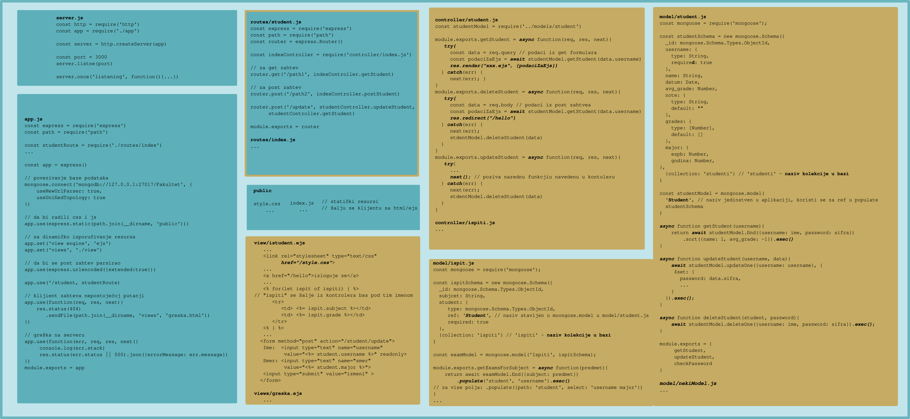
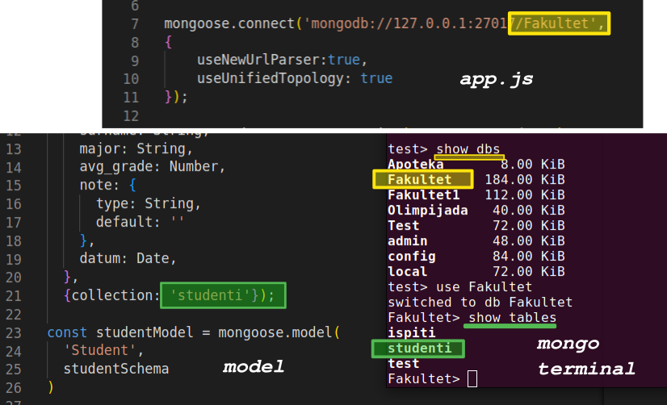
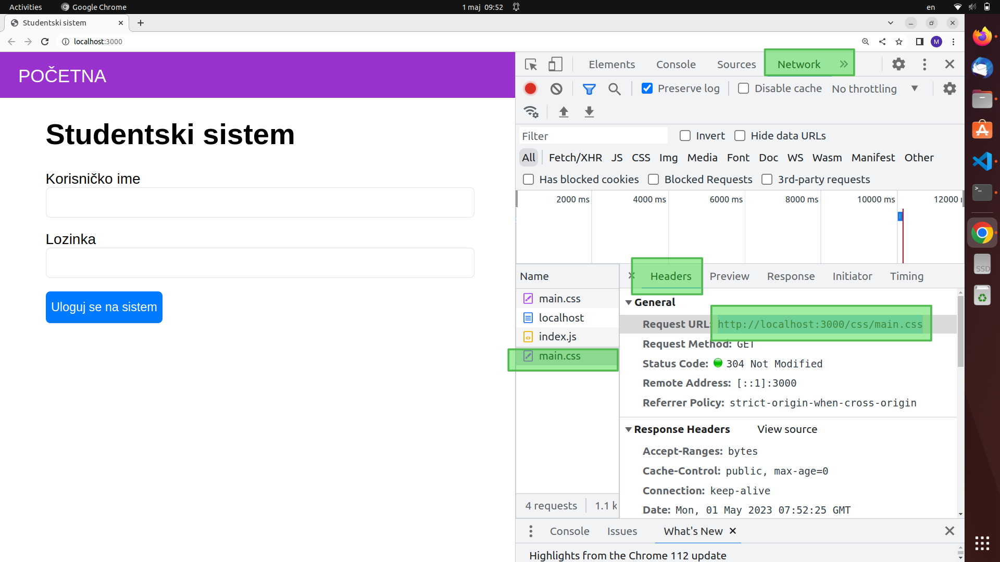

# УВИТ - Честе грешке

[УВИТ](../../README.md) [Писмени испити](../README.md)

-----
## Структура MVC апликације

<div style="max-width: 98%;">

</div>

#### Find у моделу враћа празну ниску.
Проверите да ли има аwаит у свим позивима функција.
Проверите да ли су име базе и колекције поклапају. Вредности које треба да су исте су приказане на слици испод.
<div style="max-width: 98%;">

</div>

#### Увожење базе.
Базу за претходни задатак би увезли командом
*mongoimport --db Fakultet --collection studenti --file nekiFajl.json --jsonArray*
Команда се извршава у обичном терминалу (НЕ МОНГО).
jsonArray је опционо и зависи од формата фајла са подацима, односно да ли су објекти раздвојени зарезом.

```
2023-05-16T19:35:57.676+0200	connected to: mongodb://localhost/
2023-05-16T19:35:57.697+0200	14 document(s) imported successfully. 0 document(s) failed to import
```

У овом случају је 14 успешно импортовано, у случају да је 0 могући проблем је да jsonArray или фали или је вишак.

#### Дохваћено поље фали (undefind је). На пример фали индекс студента иако се проналази преко терминала.

Назив поља у Shemi модела није исти као назив поља у бази (оно што се види кад одрадимо финд). Дакле, ако у монго терминалу финд врати ... **индекс1**: ... , онда у схеми назив поља мора бити **индекс1**.


#### Дебаговања CSS-а који не ради у апликацији. (Идентично важи за слике, клијентсе js фајлове (валидацију) и остале статичке ресурсе).

Network таб (у линији где је console). Доле видимо фајлове које је сервер послао (уколико нема refreshujte страницу). Када кликенете на фајл имате таб Headers (зелено уоквирено), ту испод видите линк на ком се тражи жељени фајл. Поред Headers је Preview таб, ту можете видети који фајл је сервер послао као css. Копирајте линк и отворите у новом табу да видите шта се добија. Линк ће у већини случајева бити localhost:3000/main.css или localhost:3000/css/main.css, у зависности од структуре фолдера. Ако неки од ова два линка пробате у новом табу требало би да добијете текст из css фајла који вам треба.

<div style="max-width: 98%;">

</div>

-----

[УВИТ](../../README.md) [Писмени испити](../README.md)


<a rel="license" href="http://creativecommons.org/licenses/by-nc/3.0/"></a><br />Овај садржај је заштићен лиценцом <a rel="license" href="http://creativecommons.org/licenses/by-nc/3.0/">Creative Commons Attribution-NonCommercial 3.0 Unported License</a>.

За програмски код који се односи на садржај овог курса се може сматрати да је заштићен [MIT лиценцом](/LICENSE).
