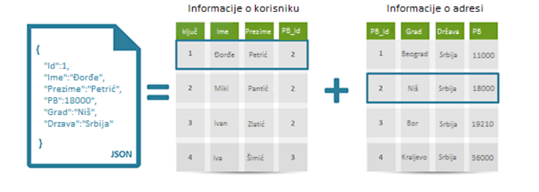

# УВИТ - ЈаваСкрипт програмирање MongoDB база података

[Владимир Филиповић](https://vladofilipovic.github.io/index-cy.html){:target="_blank"}

## Увод

Овде се описује NoSQL систем за рад са подацима MongoDB, и његово коришћење у језику ЈаваСкрипт.

## Карактеристике NoSQL база података

NoSQL не представља један производ или технологију, већ класу производа и колекцију различитих, понекад повезаних појмова који се односе начинима складиштења и манипулације подацима.

У последње време су се развили новији системи који обезбедују велику хоризонталну скалабилност за једноставне операције читања и писања над подацима дистрибуираним на више сервера изузетно великом брзином. Класични, релациони модели база података омогућавају веома ограничену хоризонталну скалабилност. Хоризонстална скалабилност значи да се лако може додати нови чвор обраде (сервер) када је то потребно, а да то не утиче на рад целокупног система.

За све моделе складишта података који су сврстани у NoSQL важе следеће кључне особине:

– Способност понављања и дистрибуције података на више сервера.

- Обезбеђена хоризонтална скалабилност и једноставне операције између више сервера.

– Једноставан спољашњи интерфејс или протокол - за разлику од SQL.

– Углавном подржавају слабији конкурентни модел од ACID (**A**tomicity, **C**onsistency, **I**solation, **D**urability) особина трансакција (које су обично заступљење у SQL-у). Коришћени модел транскације се често означава са BASE (**B**asically **A**vailable, **S**oft state, **E**ventually consistent.)

– Способност да динамицки додају нове атрибуте.

– Ефикасно коришћење дистрибуираних индекса.

У оквиру NoSQL база података се могу уочити тзв. Баѕе података ојентисане према документима.

Као што само име говори, централни елемент оваквих складишта тј. база података је документ. Документи о којима је реч представљају кодиране податке у JSON-у, XML-у, BSON-у или у неком другом формату. Сваки такав документ представља засебан објекат који апликација може независно да користи.У једном таквом документу могу да се чувају агрегирани подаци за које би у класичним релационим моделима било потребно спајање много табела.



Код база података орјентисних према документима,
структура докумената није ригидна, врло је прилагодљива и захвална за употребу. Пример који то илуструје се мозе видети на претходној слици.

## NoSQL база података MongoDB

MongoDB је најпопуларнија NoSQL база података. Она је написана је у језику C++ и отвореног је кода. MongoDB чува податке као JSON (прецизније речено, бинарно енкодиране JSON - тј. BSON) документе са динамичким шемама. MongoDB је прихваћен за чување података код бројних значајних веб-сајтова и сервиса, укључујући  Craigslist, eBay, Foursquare, SourceForge и New York Times.

MongoDB чини интеграцију података у многим апликацијама једноставнијом и брзом. MongoDB је створен и подржан од стране компаније 10gen.

Основне карактеристике MongoDB:

- Смештање усмерено на документа — JSON документа са динамичким шемама нуде једноставност и снагу

- Апсолутна подршка индексирању — Индексирање било ког атрибута

- Репликација и висока доступност

- Аутоматско скалирање — Хоризонтално скалирање без угрожавања функционалности.

- Упити — Моћни упити, базирани на документима

- Брза ажурирања

- Мапирање и редукција — флексибилна агрегација и обрада података

- Посебан систем за рад са датотекама GridFS — чува датотеке било које величине без компликација (уместо чувања датотеке у једном документу, GridFS је дели на делове, или блокове и чува сваки од тих блокова као посебан документ).-

- Ад хоц упити — MongoDB подржава претрагу по пољу, упите по опсегу и претраге по регуларним изразима. Упити могу да врате одредјена поља документа, као и да обухвате кориснички дефинисане ЈаваСцкрипт функције

- Извршавање ЈаваСкрипт кода на страни сервера — ЈаваСкрипт се може користити у упитима, агрегатним функцијама (као сто је MapReduce) и може да се упути директно бази података за извршавање

### Node.js и MongoDB

#### Инсталација

Прво је потребно инсталирати MongoDB систем за управљање базама података са адресе: https://www.mongodb.com.

Након тога је потребно инсталирати Node.js MongoDB драјвер помоћу npm алата:

```
>npm install mongodb
```

Након што су MongoDB и драјвер инсталирани, могуће је укључити MongoClient класу из модула mongodb у Node.js програм на следећи начин:

```
let {MongoClient} = require('mongodb');
```

#### Креирање базе података, колекције и документа

MongoDB систем за управљање базом података (надаље ћемо га звати MongoDB сервер) се подразумевано извршава на localhost-у и порту 27017. 
Да би се програматски креирала база података на MongoDB серверу може се искористити следећи код:

```
let {MongoClient} = require('mongodb');
var url = "mongodb://localhost:27017";
const klijent = new MongoClient(url);

async function pokreni() {
  try {
    await klijent.connect();
    const baza = klijent.db('mojabaza');
    const kolekcija = baza.collection('mojakolekcija');
    const rezultat = await kolekcija.insertOne({ ime: 'Petar', starost: 30 });
    console.log('Ubaceni dokument:', rezultat.insertedId);
  } finally {
    await klijent.close();
  }
}
pokreni();
});
```

Интересантно је да MongoDB не ради ништа по питању креирања структуре док се не формира нови садржај, тј. документ, дакле, понаша се "лењо". Наиме, да смо покренули претходни програм без наредбе за убацивање новог елемента, база и колекција не би биле креиране, већ би биле стављене на "чекање" док се не направи и нови документ. 

По сличном принципу је могуће убацити и више докумената истовремено, тако што ће се нови документи (објекти) проследити у виду низа. 

```
let {MongoClient} = require('mongodb');
var url = "mongodb://localhost:27017";
const klijent = new MongoClient(url);

async function pokreni() {
  try {
    await klijent.connect();
    const baza = klijent.db('mojabaza');
    const kolekcija = baza.collection('mojakolekcija');
    const niz = [{ime: 'Marko', starost: 22}, {ime: 'Marija', starost: 24}]
    const rezultat = await kolekcija.insertMany(niz);
    console.log('Ubaceni dokumenti:', rezultat.insertedIds);
  } finally {
    await klijent.close();
  }
}
pokreni();
```

#### Упити

Упити омогућавају претрагу и обликовање резултата претраге (у виду сортирања, пројекција, агрегирања итд.). 
Следи једноставан упит који враћа све документе такве да одговарају особама старости 22 године. 
Притом се резултати сортирају по имену растуће, приказују се само идентификатор и име, а исписује се максимално 3 резултата. 

```
let {MongoClient} = require('mongodb');
var url = "mongodb://localhost:27017";
const klijent = new MongoClient(url);

async function pokreni() {
  try {
    await klijent.connect();
    const baza = klijent.db('mojabaza');
    const kolekcija = baza.collection('mojakolekcija');
    const upit = { starost: 22 };
    const opcijePrikaza = {
        sort: { ime: 1 },
        projection: { _id: 1, ime: 1 },
      };
    const rez = await kolekcija.find(upit, opcijePrikaza).toArray();
    console.log(rez);
  } finally {
    await klijent.close();
  }
}
pokreni();
```

#### Брисање докумената

Брисање једног или више докумената се постиже позивом функције deleteOne односно deleteMany, а начин употребе је сличан као и код претраге докумената.

```
let {MongoClient} = require('mongodb');
var url = "mongodb://localhost:27017";
const klijent = new MongoClient(url);

async function pokreni() {
  try {
    await klijent.connect();
    const baza = klijent.db('mojabaza');
    const kolekcija = baza.collection('mojakolekcija');
    const upit = { starost: 22 };
    const rez = await kolekcija.deleteOne(upit);
    console.log("Obrisano dokumenata: "+rez.deletedCount);
  } finally {
    await klijent.close();
  }
}
pokreni();
```

#### Ажурирање докумената

Ажурирање докумената комбинује технику задавања упита претраге и додатног оператора $set који прецизира шта се у пронађеном документу (документима) мења у зависности од тога да ли се користи updateOne или updateMany. 

```
let {MongoClient} = require('mongodb');
var url = "mongodb://localhost:27017";
const klijent = new MongoClient(url);

async function pokreni() {
  try {
    await klijent.connect();
    const baza = klijent.db('mojabaza');
    const kolekcija = baza.collection('mojakolekcija');
    const upit = { starost: 22 };
    const izmena = {$set: {starost: 23, izmenjen: true}};
    const rez = await kolekcija.updateOne(upit, izmena);
    console.log("Izmenjeno dokumenata: "+rez.modifiedCount);
  } finally {
    await klijent.close();
  }
}
pokreni();
```

#### Остале операције

Могућ је рад са још разним операцијама, попут брисања колекција, спајања докумената, подешавања индекса претраге итд. 


## Литература

1. Haverbeke M.: [Eloquent JavaScript](https://eloquentjavascript.net/){:target="_blank"}

2. Костић М.: [Развој веб апликација помоћу MEAN стека](http://www.racunarstvo.matf.bg.ac.rs/MasterRadovi/2017_06_18_Mirjana_Kostic/rad.pdf){:target="_blank"}, Мастер рад, Универзитет у Београду, Математички факултет.

3. [JavaScript](https://developer.mozilla.org/en-US/docs/Web/JavaScript){:target="_blank"} - Mozzila Developer Network (MDN)

4. Живановић, Д.: [Веб програмирање - ЈаваСкрипт](https://www.webprogramiranje.org/dogadjaji-u-javascript-u/){:target="_blank"}

5. Copes F.: [Complete JavaScript Handbook](https://medium.freecodecamp.org/the-complete-javascript-handbook-f26b2c71719c){:target="_blank"}
