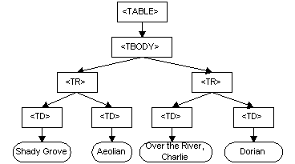

# УВИТ - ЈаваСкрипт програмирање на клијентској страни

[Владимир Филиповић](https://vladofilipovic.github.io/index-cy.html){:target="_blank"}

## Увод

Овде се разматра коришћење језика ЈаваСкрипт за веб програмирање на клијентској страни. Наиме, приликом довлачења веб странице, довлачи се и смешта у прегледач ЈаваСкрипт код који се извршава. Приликом приказа веб странице се извршава у прегледачу претходно довучени ЈаваСкрипт код, који приликом извршавања интерагује са елементима на веб страни и динамички их мења.

## ЈаваСкрипт и веб стране

Из клијентског ЈаваСкрипт-а се може програмски приступити елементима на веб страни, читати их, мењати њихове атрибуте, додавати их или брисати, по потреби.

### Објекти ЈаваСкрипт окружења код веб прегледача

Свака веб страна омогућује да се из ЈаваСкрипт кода приступа следећим објектима:

- `window`: објекат највишег нивоа; садржи својства примењива на целокупан прозор

- `location`: садржи својства текуће URL локације

- `history`: садржи својства претходно посећених

- `document`: садржи својства садржаја текућег документа, као што су наслов (`title`), боја позадине (`bgcolor`), форме итд.

**Пример.** Илустрација постављања својстава за објекте веб стране:

```js
document.title = 'Probni dokument'; //naziv dokumenta (title)
document.bgColor = '#070707';
document.fgColor = '#00FFFF';

history.length = 7;

location.href = 'http://uvit.math.rs';
```

&#9608;

Дијаграм који следи описује хијеархијску структуру објеката ЈаваСкрипт окружења код веб прегледача:

{: width="500px" style="float:center; padding:16px"}

Допуштен је приступ елементима на веб страни из ЈаваСкрипт-а. Један начин за програмски приступ елементима на веб страни је реферисање преко вредности атрибута `name`.

**Пример.** У програмском коду који следи, елементима на веб страни се може приступити на основу имена, додeљеног као одговарајући атрибут веб стране:

```js
let forma = document.mojaForma;
let txt = forma.textIme;
console.log(txt.outerHTML);
let btn = forma.buttonOk;
console.log(btn.outerHTML);
```

&#9608;

ЈаваСкрипт објекти који су дотупни преко ваб прегледача могу имати своје атрибуте.

**Пример.** У програмском коду који следи, постављамо атрибуте ЈаваСкрипт објекте који се односе на елементе са веб стране, а чије су вредности одређене у претходном примеру.

```js
document.mojaforma.action = "http://uvit.matf.bg.ac.rs/primeri/obrada.php";
document.mojaforma.method = get;
document.mojaforma.length = 5;
document.mojaforma.button1.value = "Klikni ovde";
document.mojaforma.button1.name = taster1;
document.mojaforma.text1.value = "sadržaj tekst polja";
document.mojaforma.text1.name = TekstPolje1;
document.mojaforma.check1.defaultChecked = true;
document.mojaforma.check1.value = on;
document.mojaforma.check1.name = CheckPolje1;
```

&#9608;

### Објектни модел документа (DOM)

Објектни модел документа (eng. Document Object Model - DOM) је програмски интерфејс (АПИ) којим се ЈаваСкрипт програмима омогућава да комуницирају са HTML документима и њиховим елементима.

Основни DOM објекат је HTML документ чијa je структурa верно пресликана у (објектно-оријентисан) АПИ.

DOM објекат за дати елемент на веб страни има структуру дрвета.

**Пример.** За следећи исечак HTML документа, који предстаља табелу:

```html
<table>
  <tbody>
    <tr>
      <td>Shady Grove</td>
      <td>Aeolian</td>
    </tr>
    <tr>
      <td>Over the River, Charlie</td>
      <td>Dorian</td>
    </tr>
  </tbody>
</table>
```

одговарајући DOM објекат има следећу структуру:

{: width="500px" style="float:center; padding:16px"}

&#9608;

DOM објекат за дату веб страну такоше има структуру дрвета, где се сарджавање једног елемента у другом представља односм родитељ-потомак.

**Пример.** За следећи HTML документ:

```html
<html>
  <head>
    <title>Moja stranica</title>
  </head>
  <body>
    <p id="p1">Prvi paragraf</p>
    <p class="c1">Drugi paragraf</p>
  </body>
</html>
```

добијају се следећи DOM објекти:

- објекат `document` који садржи:
  - објекат `head` који садржи:
    - `title`
  - објекат `body` који садржи:
    - објекат `p` са атрибутом `id`
    - објекат `p` са атрибутом `class`

То се прегледно може илустровати следећом сликом:

{: width="300px" style="float:center; padding:16px"} &#9608;

#### Операције са DOM објекатима

Са DOM-ом, ЈаваСкрипт има могућност да креира динамичке HTML стране:

- Да мења елементе на HTML страни.
- Да мења атрибуте на HTML страни.
- Да мења све CSS стилове на HTML страни.
- Да брише постојеће елементе и атрибуте на HTML страни.
- Да додаје нове HTML елементе и атрибуте на страни.
- Да реагује на све постојеће HTML догађаје на страни.
- Да креира нове HTML догађаје на страни.

Објектима који су део документа може се приступити на неколико начина, а најчешће коришћени су:

1. Преко идентификатора (`id` атрибута) - добија се један елемент.
   **Пример.** Приступ првом пасусу са претходне веб стране: `document.getElementById("p1")`  &#9608;
2. Преко назива елемента (назива етикете) - добија се коликција елемената.
   **Пример.** Приступ свим пасусима са претходне веб стране: `document.getElementsByTagName("p")`  &#9608;
3. Преко класе којој елементи припадају - добија се колекција елемената.
   **Пример.** Приступ другом пасусу са претходне веб стране: `document.getElementsByClassName("c1")`  &#9608;
4. Преко позиције у дрвету, коришћењем метода `parentNode`, `nextSibling`, `prevSibling`, `firstChild`, `lastChild`, као што је приказано на следећој слици:
{: width="500px" style="float:center; padding:16px"}
5. Преко css селектора, коришћењем метода `querySelecor` i `querySelectorAll` - што подржавају сви модерни веб прегледачи:
**Пример.** Претходно описани приступи елементима са претходне веб стране могу да се реализују и на следeћи начин:

```js
document.querySelector("#p1");   // pristup prvom paragrafu iz gornjeg primera
document.querySelector(".c1");   // pristup prvom elementu klase c1
document.querySelectorAll("p");  // pristup svim paragrafima gornjeg primera
```

&#9608;

### Догађаји код DOM објеката

Догађаји код DOM објеката омогућавају ЈаваСкрипт-у да региструје појаву неке промене у документу. За сваку такву промену ЈаваСкрипт може да дефинише функцију која ће је опслужити. Функције које опслужују догађаје називају се руковаци (енг. handler).

DOM догађаји могу се сврстати у неколико категорија:

- Догађаји повезани са мишем: `onclick`, `ondblclick`, `onmouseover`, итд...
- Догађаји повезани са тастатуром: `onkeydown`, `onkeypress`, `onkeyup`
- Догађаји повезани са објектима: `onload`, `onunload`, `onresize`, итд...
- Догађаји повезани са формама: `onchange`, `onsubmit`, итд...
- Догађаји повезани са превлачењем (енг. drag) елемената: `ondrag`, `ondrop`, `ondragstart`, итд...
- Догађаји повезани са клипбордом; `oncut`, `onpaste`, `oncopy`
- Догађаји повезани са штампањем: `onafterprint`, `onbeforeprint`
- Догађаји повезани са медијима: `onplay`, `onpause`, `onended`, итд...
- Догађаји повезани са анимацијом: `animationstart`, `animationend`, `animationiteration`
- Догађаји повезани са транзицијом: `transitionend`
- Догађаје које шаље сервер: `onerror`, `onmessage`, `onopen`
- Догађаји повезани са додирима на екрану: `ontouchstart`, `ontouchmove`, `ontouchend`, `ontouchcancel`
- Остали догађаји: `ononline`, `onoffline`, `onwheel`, итд...

Стандардан начин за регистровање и опслуживање DOM догађаја је додавање ослушкивача догађаја (енг. event listener).

**Пример.** Веб страна са дугметом, где се приликом клика миша на дугме регистује којим је дугметом (лево средње десно) извршен клик, а потом се на конзоли приказује врста дугмета миша и координате показивача миша (на у контексту стране, а не дугмета) у тренутку клика:

```html
<!doctype html>
<html>

<head>
    <title>Osluskivac misa</title>
</head>

<body>
  <button>Pritisni me kako god mislis da je najpametnije</button>
<script>
  let button = document.querySelector("button");
  button.addEventListener("mousedown", function(event) {
    if (event.which == 1)
      console.log("Left button");
    else if (event.which == 2)
      console.log("Middle button");
    else if (event.which == 3)
      console.log("Right button");
    console.log(`(x,y):(${event.pageX},${event.pageY})`);
  });
</script>
</body>
</html>
```

&#9608;

### Функције за приказ ниске као HTML

Следеће методе враћају ниску обавијену са HTML тагом (евентуално неким HTML атрибутом):

| Назив методе          | Опис                                                |
|-----------------------|-----------------------------------------------------|
| `anchor()`            | враће елеменат сидро |
| `big()`               | враће елеменат који садржи ниску са повећаним словима |
| `blink()`             | враће елеменат који садржи трепћућу ниску  |
| `bold()`              | враће елеменат који садржи ниску са подебљанимм словима |
| `fixed()`             | враће елеменат који садржи ниску са словима фикне величине |
| `fontcolor()`         | враће елеменат који садржи ниску са словима у датој боји |
| `fontsize()`          | враће елеменат који садржи ниску са словима дате величине |
| `italics()`           | враће елеменат који садржи ниску са искошеним словима |
| `link()`              | враће елеменат хипервезу који садржи дату ниску |
| `small()`             | враће елеменат који садржи ниску са умањеним словима  |
| `strike()`            | враће елеменат који садржи ниску са прекрижаним словима  |
| `sub()`               | враће елеменат који садржи ниску са словима у индексу |
| `sup()`               |враће елеменат који садржи ниску са словима у експоненту |

## AJAX

AJAX (енг. Asynchronous Javascript And XML) представља скуп техника преко којих је могуће успоставити асинхрону комуникацију између клијента и сервера, или једноставније, у питању је механизам који омогућава аутоматско ажурирање садржаја делова странице без потребе за поновним учитавањем.

Другим речима, коришћењам AJAX-а, веб апликације могу да шаљу и примају податке са сервера асинхроно (у позадини) без мењања тренутног приказа и понашања странице. Подаци могу бити преузети помоћу објекта `XMLHttpRequest`. Без обзира на име, коришћење XМЛ-а није обавезно, већ се се често користи JSON уместо XML, а захтеви не морају бити асинхрони.

AJAX није једна, већ група технологија. HTML и CSS се могу користити за обележавање и стилизовање информација, ЈаваСкрипт приступ преко DOM-а обезбеђује динамички приказ и омогућује интеракције корисника са информацијом, а ЈаваСкрипт и објекат `XMLHttpRequest` омогућују метод за асинхрону размену података између веб прегледача и сервера да би се избегло поновно учитавање целе странице.

### Синхрони модел комуникације

Синхрони модел комуникације између клијента и сервера подразумева следеће кораке:

- клијент шаље захтев серверу
- сервер прима и обрађује захтев и потом шаље клијенту захтевани HTML садржај
- веб прегледач на страни клијента приказује примљени HTML садржај
- уколико је потребно освежити садржај странице, шаље се нови захтев

Горе описани сценарио функционише ако је захтев уредно послат, примљен и обрађен. У случају грешака у обради захтева сервер ће (уместо HTML-а и других тражених садржаја) послати клијенту одговарајући статусни код. Поред HTML-а, сервер ће (на захтев клијента) послати и сав припадајући садржај: CSS, ЈаваСкрипт, као и друге датотеке (најчешће слике).

Јасно је да у овом сценарију нема аутоматског учитавања, што доводи до следећих последица:

- за учитавање (нових) примљених података, биће потребно да се поново учитава (освежи) цела страница
- за слање порука, биће потребно да се користи HTML форма која (после клика на дугме за слање поруке) покреће скрипту за слање поруке, при чему веб прегледач пребацује корисника на другу страницу.

Другим речима, наступа "сецкање", ресетовање и потреба за ручним учитавањем порука - што никако није добро.

### АЈАX захтеви - слање и обрада

Специјализовани `XMLHttpRequest` објекти размењују податке са сервером на следећи начин:

- преко поља `onreadystatechange ` дефинише се функција повратног позива која ће се извршавати када се стање захтева промени

- преко поља `responseText`, скрипта добија одговор од сервера (у облику обичног текста, као XML, или као JSON)

- поље `readyState` садржи информацију о акруелном стању захтева, која може бити:
  - 0 - захтев још увек није послат
  - 1 - захтев је послат, али није примљен
  - 2 - захтев је примељен, али није узет у обраду
  - 3 - захтев је узет у обраду, али обрада није завршена
  - 4 - обрада захтева је завршена

**Пример.** Целокупан пример (серверски и клијентски део) где клијент користи `XMLHttpRequest` објекат за слање АЈАX позива и обраду одговора сервера.

Серверски део је рализован у датотеци `veb-server.js` коришћењем `node.js`. Он за дати захтев као одговор враће текстулану датотеку која је специфицирана у оквиру упита.

```js
let http = require('http');
let url = require('url');
let querystring = require('querystring');
let fs = require('fs');

http.createServer(function (request, response) {
    pathName = url.parse(request.url).pathname;
    fs.readFile(__dirname + pathName, function (err, data) {
        if (err) {
            response.writeHead(404, { 'Content-type': 'text/plan' });
            response.write(`Page Was Not Found 
            ${JSON.stringify(err)}`);
            response.end();
        } else {
            response.writeHead(200);
            response.write(data);
            response.end();
        }
    });
}).listen(7000);
```

Веб страна која користи AJAX има следећи облик:

```html
<!doctype html>
<html>

<head>
    <title>AJAX demo</title>
    <script type="text/javascript">
        function loadXMLDoc() {
            let fileName = document.getElementById("fileName").value;
            let xmlhttp = new XMLHttpRequest();
            xmlhttp.onreadystatechange = function() {
                if (xmlhttp.readyState == 4 &&
                    xmlhttp.status == 200) {
                    document.getElementById("myDiv").innerHTML = xmlhttp.responseText;
                    console.log("Spoljašnji sadržaj je uspešno učitan!");
                } else
                if (xmlhttp.status != 200 && xmlhttp.status != 0)
                    console.log("Greška: " + xmlhttp.status + ": " + xmlhttp.statusText);
            }
            xmlhttp.open("GET", fileName, true);
            xmlhttp.send();
        }
    </script>
</head>
<body>
    <h2>Odgovor dobijen putem AJAX-a</h2>
    <div id="myDiv"></div>
    <input id="fileName" type="text" value="ajax.txt">
    <button type="button" onclick="loadXMLDoc()"> Pošalji AJAX zahtev</button>
</body>
</html>
```

&#9608;

## HTML компоненте

### Дефинисање HTML компоненте

### HTML компоненте и Shadow DOM

### Шаблони код HTML компоненти

### Шаблони код HTML компоненти

### Исцртавање код HTML компоненти

## Литература

1. Haverbeke M.: [Eloquent JavaScript](https://eloquentjavascript.net/){:target="_blank"}

1. [JavaScript](https://developer.mozilla.org/en-US/docs/Web/JavaScript){:target="_blank"} - Mozzila Developer Network (MDN)

1. Живановић, Д.: [Веб програмирање - ЈаваСкрипт](https://www.webprogramiranje.org/dogadjaji-u-javascript-u/){:target="_blank"}

1. Copes F.: [Complete JavaScript Handbook](https://medium.freecodecamp.org/the-complete-javascript-handbook-f26b2c71719c){:target="_blank"}
