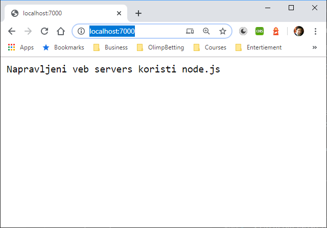
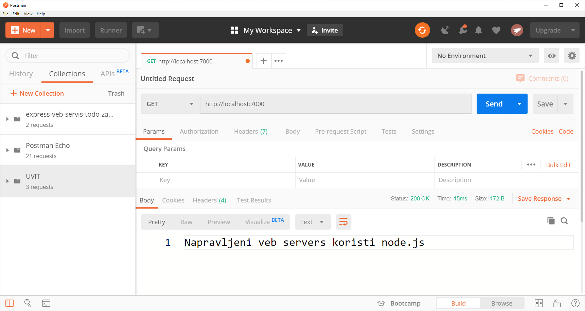
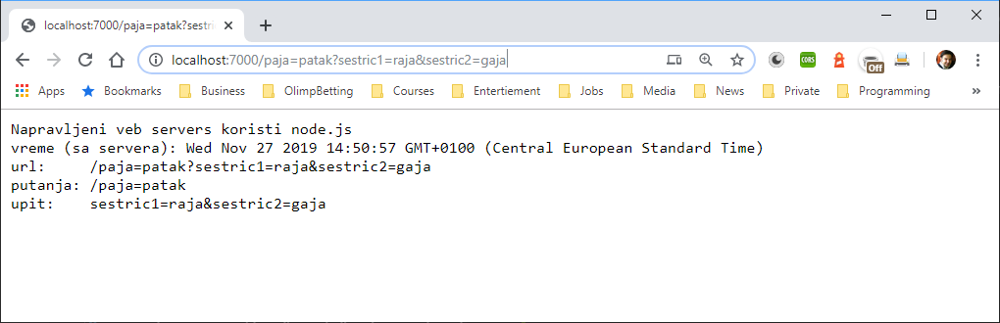

# УВИТ - Програмски језик ЈаваСкрипт

[Владимир Филиповић](https://vladofilipovic.github.io/index-cy.html){:target="_blank"}

## ЈаваСкрипт серверско програмирање коришћењем окружења node

### Мрежне апликације

#### TCP апликације

**Пример.** Илустрије једноставно мрежно програмирање преко TCP протокола коришћењем модула `net`.

У овом примеру је направљен једноставан сервер који сваки пут када клијент са њим успостави везу шаље поздравну поруку.

Програмски код сервера са налази у датотеци `server.js`:

```js
let net = require('net');

let server = net.createServer(
    (soket) => {
        soket.write(`Pozdrav od servera\n`);
        soket.pipe(soket);
    });

adresa = '127.0.0.1';
port = 1337;
server.listen(port, adresa);
console.log(`Server slusa na adresi ${adresa}, port ${port} `);

```

Приликом покретања сервера, на конзоли се довија порука следећег облика:

```bash
Server slusa na adresi 127.0.0.1, port 1337
```

Са покренутим сервером се корисник може повезати на два начина:

- коришћењем Unix наредбе `netcat` из командне линије:

```bash
\$ netcat 127.0.0.1 1337
```

Тада би одговор би требао да буде:

```bash
> Pozdrav od servera
```

- покретањем клијента дефинисаног у датотеци `client.js`:

```js
let net = require('net');

let klijent = new net.Socket();

adresa = '127.0.0.1';
port = 1337;

klijent.connect(port, adresa,
    () => {
        console.log('Povezan sa serverom');
        klijent.write('Pozdrav za server! Pozdrav salje klijent.');
    });

klijent.on('data',
    (data) => {
        console.log('Primljeno: ' + data);
        klijent.destroy(); // posle odgovora servera, klijent se unistava
    });

klijent.on('close',
    () => console.log('Veza je zatvorena'));
```

Може се уочити да клијент по повезивању на конзоли прикаже статус и серверу пошаље поздравну поруку, а да сваки пут када прима податке од сервера, прикаже те податке на конзоли.

Покретањем клијента, током времена када сервер ради, добија се следећи излаз на конзоли:

```bash
Povezan sa serverom
Primljeno: Pozdrav od servera

Veza je zatvorena
```

 &#9608;

**Пример.** Илустрије мрежно програмирање преко TCP протокола коришћењем модула `net`.

Сервер направљен у овом примеру је фундаментално исти као сервер из претходног примера. Програмски код тог сервера са налази у датотеци `server.js`:

```js
const net = require('net');

let server = net.createServer();

server.on('close',
    function () {
        console.log('Server closed !');
    });

server.on('connection',
    function (socket) {
        console.log('Buffer size : ' + socket.bufferSize);

        console.log('---------server details -----------------');

        let address = server.address();
        let port = address.port;
        let family = address.family;
        let ipaddr = address.address;
        console.log('Server is listening at port ' + port);
        console.log('Server ip :' + ipaddr);
        console.log('Server is IP4/IP6 : ' + family);

        let lport = socket.localPort;
        let laddr = socket.localAddress;
        console.log('Server is listening at LOCAL port ' + lport);
        console.log('Server LOCAL ip :' + laddr);

        console.log('------------remote client info --------------');

        let rport = socket.remotePort;
        let raddr = socket.remoteAddress;
        let rfamily = socket.remoteFamily;

        console.log('REMOTE Socket is listening at port ' + rport);
        console.log('REMOTE Socket ip :' + raddr);
        console.log('REMOTE Socket is IP4/IP6 : ' + rfamily);

        console.log('--------------------------------------------')
        server.getConnections(
            function (error, count) {
                console.log('Number of concurrent connections to the server : ' + count);
            });

        socket.setEncoding('utf8');

        socket.setTimeout(800000,
            function () {
                console.log('Socket timed out');
            });

        socket.on('data',
            function (data) {
                let bread = socket.bytesRead;
                let bwrite = socket.bytesWritten;
                console.log('Bytes read : ' + bread);
                console.log('Bytes written : ' + bwrite);
                console.log('Data sent to server : ' + data);

                //echo data
                let is_kernel_buffer_full = socket.write('Data ::' + data);
                if (is_kernel_buffer_full) {
                    console.log('Data was flushed successfully from kernel buffer i.e written successfully!');
                } else {
                    socket.pause();
                }
            });

        socket.on('drain',
            function () {
                console.log('write buffer is empty now .. u can resume the writable stream');
                socket.resume();
            });

        socket.on('error',
            function (error) {
                console.log('Error : ' + error);
            });

        socket.on('timeout',
            function () {
                console.log('Socket timed out !');
                socket.end('Timed out!');
                socket.destroy();
            });

        socket.on('end',
            function (data) {
                console.log('Socket ended from other end!');
                console.log('End data : ' + data);
            });

        socket.on('close',
            function (error) {
                let bread = socket.bytesRead;
                let bwrite = socket.bytesWritten;
                console.log('Bytes read : ' + bread);
                console.log('Bytes written : ' + bwrite);
                console.log('Socket closed!');
                if (error) {
                    console.log('Socket was closed coz of transmission error');
                }
            });

        setTimeout(
            function () {
                let isdestroyed = socket.destroyed;
                console.log('Socket destroyed:' + isdestroyed);
                socket.destroy();
            }, 1200000);

    });

server.on('error',
    function (error) {
        console.log('Error: ' + error);
    });

server.on('listening', function () {
    console.log('Server is listening!');
});

server.maxConnections = 10;

//static port allocation
server.listen(55351);


// for dyanmic port allocation
// server.listen(
//     function () {
//         let address = server.address();
//         let port = address.port;
//         let family = address.family;
//         let ipaddr = address.address;
//         console.log('Server is listening at port' + port);
//         console.log('Server ip :' + ipaddr);
//         console.log('Server is IP4/IP6 : ' + family);
//     });

let islistening = server.listening;
if (islistening) {
    console.log('Server is listening');
} else {
    console.log('Server is not listening');
}

setTimeout(
    function () {
        server.close();
    }, 5000000);
```

Овде су направљена два клијента, који шаљу различите поруке серверу. Први клијент је дефинисан у датотеци `client.js`:

```js
const net = require('net');

const listeningPort = 55351;

// creating a custom socket client and connecting it....
let client = new net.Socket();
client.connect(
    {
        port: listeningPort
    });

client.on('connect',
    function () {
        console.log('Client: connection established with server');

        console.log('---------client details -----------------');
        let address = client.address();
        let port = address.port;
        let family = address.family;
        let ipaddr = address.address;
        console.log('Client is listening at port' + port);
        console.log('Client ip :' + ipaddr);
        console.log('Client is IP4/IP6 : ' + family);
        // writing data to server
        client.write('hello\r\nfrom client\r\n');
    });

client.setEncoding('utf8');

client.on('data',
    function (data) {
        console.log('Data from server:' + data);
    });

setTimeout(
    function () {
        client.end('Bye bye server');
    }, 5000);

    //NOTE:--> all the events of the socket are applicable here..in client...
```

 Други клијент је дефинисан у датотеци `client2.js`:

```js
const net = require('net');

let listeningPort = 55351;

// server creation using net.connect --->
let clients = net.connect({ port: listeningPort },
    () => {
        // 'connect' listener
        console.log('connected to server!');
        clients.write('world!\r\n from client\r\n');
    });
clients.on('data',
    (data) => {
        console.log(data.toString());
        clients.end();
    });
clients.on('end',
    () => {
        console.log('disconnected from server');
    });
```

Ако се покрене прво сервер, па потом (у периоду док сервер ради) један па други клијент, на конзоли сервера добиће се следеће поруке:

```bash
Server is listening
Server is listening!
Buffer size : 0
---------server details -----------------
Server is listening at port 55351
Server ip :::
Server is IP4/IP6 : IPv6
Server is listening at LOCAL port 55351
Server LOCAL ip :::ffff:127.0.0.1
------------remote client info --------------
REMOTE Socket is listening at port 55444
REMOTE Socket ip :::ffff:127.0.0.1
REMOTE Socket is IP4/IP6 : IPv6
--------------------------------------------
Number of concurrent connections to the server : 1
Bytes read : 20
Bytes written : 0
Data sent to server : hello
from client

Data was flushed successfully from kernel buffer i.e written successfully!
Bytes read : 34
Bytes written : 27
Data sent to server : Bye bye server
Data was flushed successfully from kernel buffer i.e written successfully!
Socket ended from other end!
End data : undefined
Bytes read : 34
Bytes written : 48
Socket closed!

Buffer size : 0
---------server details -----------------
Server is listening at port 55351
Server ip :::
Server is IP4/IP6 : IPv6
Server is listening at LOCAL port 55351
Server LOCAL ip :::ffff:127.0.0.1
------------remote client info --------------
REMOTE Socket is listening at port 55445
REMOTE Socket ip :::ffff:127.0.0.1
REMOTE Socket is IP4/IP6 : IPv6
--------------------------------------------
Number of concurrent connections to the server : 1
Bytes read : 22
Bytes written : 0
Data sent to server : world!
 from client

Data was flushed successfully from kernel buffer i.e written successfully!
Socket ended from other end!
End data : undefined
Bytes read : 22
Bytes written : 29
Socket closed!
```

Приликом извршења првог клијента на конзоли ће бити приказано:

```bash
Client: connection established with server
---------client details -----------------
Client is listening at port55444
Client ip :127.0.0.1
Client is IP4/IP6 : IPv4
Data from server:Data ::hello
from client

Data from server:Data ::Bye bye server
```

Приликом извршења другог клијента на конзоли ће бити приказано:

```bash
connected to server!
Data ::world!
 from client
```

 &#9608;

#### UDP апликације

**Пример.** Илустрије једноставно мрежно програмирање преко UDP протокола коришћењем модула `dgram`.

Програмски код сервера са налази у датотеци `server.js`:

```js
const PORT = 33333;
const HOST = '127.0.0.1';

const dgram = require('dgram');
let server = dgram.createSocket('udp4');

server.on('listening',
  function () {
    let address = server.address();
    console.log('UDP Server listening on ' + address.address + ':' + address.port);
  });

server.on('message',
  function (message, remote) {
    console.log(remote.address + ':' + remote.port + ' - ' + message);
  });

server.bind(PORT, HOST);
```

Важно је напоменути да:

- Код извршења функције  `bind` над сервером, параметар `HOST` је опционалан - његова подразумевана вредност је `0.0.0.0`.

- Догађај `message` се испаљује када UDP пакет стигне на одредиште за овај сервер.

- Догађај `listening` се испаљује када сервер буде иницијализован и потпуно спреман да прима UDP пакете. Метод `createSocket` модула `dgram` може да прихвати једну од две вредности: ниску 'udp4' или ниску 'udp6'. Прва означава да ће бити коришћен IPv4, а друга да ће бити коришћен IPv6.

Kлијент je дефинисан у датотеци `client.js`:

```js
const PORT = 33333;
const HOST = '127.0.0.1';

const dgram = require('dgram');
let message = new Buffer('My KungFu is Good!');

let client = dgram.createSocket('udp4');
client.send(message, 0, message.length, PORT, HOST,
  function (err, bytes) {
    if (err)
      throw err;
    console.log('UDP message sent to ' + HOST + ':' + PORT);
    client.close();
  });
```

Важно је напоменути да:

- Функција `send` захтева постојање правог node.js објекта типа`Buffer`, а не ниску или број. Другим речима, објекат типа`Buffer` је први параметар функције `send` за слање датаграма преко сокета.

- Други параметар функције `send` представља позицију у баферу од које почиње UDP пакет који се шаље. У горњем коду вредност одговарајућег аргумента је `0`, што значи да се порука из бафера преноси од почетка.

- Трећи параметар је број бајтова бафера, почев од дате позиције, који ће се садржати у UDP пакету за слање. у претходном случају, вредност тог аргумента је `message.length` (тј. `16`) - с обзиром да је бафер мали, овде цео бафер може бити послат у оквиру једног UDP пакета. У неким другим случајевима, када је бафер велики, биће потребно да се итерира кроз бафер и да се садржај шаље у већем броју мањих UDP пакета.

- Протокол UDP је направљен тако да ако порука пређе допуштену величину пакета, тада се пакет неће пренети али неће бити пријављена никаква грешка.

- Објекат `err` у функцији повратног позива функције `send` ће се односити на упит над DNS сервером.

- Да би осигурали да ће пакети стићи на одредиште, неопходно је да хост и/или IP адреса буду у сагласностиса верзијом IP која се користи. Ако то није случај, комункација неће постојати. &#9608;

### Веб апликације

У овој секцији ће веб апликације бити развијене искључиво помоћу окружења node.js.

#### Процесирање захтева и генерисање одговора

**Пример.** Илустрије једноставни веб сервер коришћењем модула `http`.

Програмски код сервера са налази у датотеци `veb-server.js`:

```js
let http = require('http');

const port = 7000;
http.createServer(
    function (zahtev, odgovor) {
        odgovor.writeHead(200, { 'Content-type': 'text/plan' });
        odgovor.write('Napravljeni veb servers koristi node.js');
        odgovor.end();
    }).listen(port);
console.log(`Veb server osluskuje zahteve na portu ${port}...\n`);
```

Какав год захтев стигао овом серверу, он ће увек прослеђиати исти одговор. Покретање овог сервера се реализује на исти начин као и код претходних примера:

```bash
node veb-server.js
```

С обзиром да се ради о веб серверу, сада нема потребе да се прави посебни клијент, већ као клијент може да послужи:

- веб прегледач, при чему у адресну линију треба унети адресу `http://localhost:7000/`. у том случају, приказује се следећа веб страна:



- алат `curl`, при чему у терминал треба унети наредбу `curl http://localhost:7000`. Као резултат се добија:

```bash
StatusCode        : 200
StatusDescription : OK
Content           : Napravljeni veb servers koristi node.js
RawContent        : HTTP/1.1 200 OK
                    Connection: keep-alive
                    Transfer-Encoding: chunked
                    Content-Type: text/plan
                    Date: Thu, 21 Nov 2019 21:55:33 GMT

                    Napravljeni veb servers koristi node.js
Forms             : {}
Headers           : {[Connection, keep-alive], [Transfer-Encoding, chunked], [Content-Type, text/plan], [Date, Thu, 21 Nov 2019 21:55:33 GMT]}
Images            : {}
InputFields       : {}
Links             : {}
ParsedHtml        : mshtml.HTMLDocumentClass
RawContentLength  : 39
```

- алат `Postman`, где треба оформити get захтев и послати тај захтев, као на слици:



У свим овим случајевима је добијен исти одговор од сервера, само се начини приказа тог добијеног одговора разликују зато што су коришћене различити типови клијената. &#9608;

**Пример.** Jедноставни веб сервер који приликом обраде захтева и генерисања одговора, захтев приказује на серверској конзоли.

Програмски код сервера са налази у датотеци `veb-server.js`:

```js
const http = require('http');

const port = 7000;
http.createServer(function (zahtev, odgovor) {
    odgovor.writeHead(200, { 'Content-type': 'text/plan' });
    odgovor.write(`Napravljeni veb servers koristi node.js \n`);
    odgovor.write(`i zahteve upisuje u konzolu servera.`);
    odgovor.end();

    let tekuceVreme = new Date();
    console.log("---" + tekuceVreme + "---");
    console.log(zahtev);
}).listen(port);
console.log(`Veb server osluskuje zahteve na portu ${port}...\n`);
```

И овај веб сервер ослушкује на порту `7000`. По покретању овог сервера и слању захтева према њему, добиће се одговарајући одговор, а на конзоли сервера ће бити приказано време обраде захтева и објекат који представља приспели захтев (у JSON формату) - следи део садржаја који се приказује на конзоли servera:

```bash
Veb server osluskuje zahteve na portu 7000...

---Wed Nov 27 2019 14:02:35 GMT+0100 (Central European Standard Time)---
IncomingMessage {
  _readableState:
   ReadableState {
     objectMode: false,
     highWaterMark: 16384,
     buffer: BufferList { head: null, tail: null, length: 0 },
     length: 0,
     pipes: null,
     pipesCount: 0,
     flowing: null,
     ended: false,
     endEmitted: false,
     reading: false,
     sync: true,
     needReadable: false,
     emittedReadable: false,
     readableListening: false,
     resumeScheduled: false,
     paused: true,
     emitClose: true,
     autoDestroy: false,
     destroyed: false,
     defaultEncoding: 'utf8',
     awaitDrain: 0,
     readingMore: true,
     decoder: null,
     encoding: null },
  readable: true,
  _events:
   [Object: null prototype] { end: [Function: resetHeadersTimeoutOnReqEnd] },
  _eventsCount: 1,
  _maxListeners: undefined,
  socket:
   Socket {
     connecting: false,
     _hadError: false,
     _handle:
      TCP {
        reading: true,
        onread: [Function: onStreamRead],
        onconnection: null,
        _consumed: true,
        [Symbol(owner)]: [Circular] },
     _parent: null,
     _host: null,
     _readableState:
      ReadableState {
        objectMode: false,
        highWaterMark: 16384,
        buffer: BufferList { head: null, tail: null, length: 0 },
        length: 0,
        pipes: null,
        pipesCount: 0,
        flowing: true,
        ended: false,
        endEmitted: false,
        reading: true,
        sync: false,
        needReadable: true,
        emittedReadable: false,
        readableListening: false,
        resumeScheduled: false,
        paused: false,
        emitClose: false,
        autoDestroy: false,
        destroyed: false,
        defaultEncoding: 'utf8',
        awaitDrain: 0,
        readingMore: false,
        decoder: null,
        encoding: null },
     readable: true,
     _writableState:
      WritableState {
        objectMode: false,
        highWaterMark: 16384,
        finalCalled: false,
        needDrain: false,
        ending: false,
        ended: false,
        finished: false,
        destroyed: false,
        decodeStrings: false,
        defaultEncoding: 'utf8',
        length: 227,
        writing: false,
        corked: 1,
        sync: true,
        bufferProcessing: false,
        onwrite: [Function: bound onwrite],
        writecb: null,
        writelen: 0,
        bufferedRequest: [Object],
        lastBufferedRequest: [Object],
        pendingcb: 9,
        prefinished: false,
        errorEmitted: false,
        emitClose: false,
        autoDestroy: false,
        bufferedRequestCount: 9,
        corkedRequestsFree: [Object] },
     writable: true,
     allowHalfOpen: true,
     _sockname: null,
     _pendingData: null,
     _pendingEncoding: '',
     server:
      Server {
        _events: [Object],
        _eventsCount: 2,
        _maxListeners: undefined,
        _connections: 2,
        _handle: [TCP],
        _usingWorkers: false,
        _workers: [],
        _unref: false,
        allowHalfOpen: true,
        pauseOnConnect: false,
        httpAllowHalfOpen: false,
        timeout: 120000,
        keepAliveTimeout: 5000,
        _pendingResponseData: 0,
        maxHeadersCount: null,
        headersTimeout: 40000,
        _connectionKey: '6::::7000',
        [Symbol(IncomingMessage)]: [Function: IncomingMessage],
        [Symbol(ServerResponse)]: [Function: ServerResponse],
        [Symbol(asyncId)]: 2 },
    ...
    parser:
      HTTPParser {
        '0': [Function: parserOnHeaders],
        '1': [Function: parserOnHeadersComplete],
        '2': [Function: parserOnBody],
        '3': [Function: parserOnMessageComplete],
        '4': [Function: bound onParserExecute],
        _headers: [],
        _url: '',
        socket: [Circular],
        incoming: [Circular],
        outgoing: null,
        maxHeaderPairs: 2000,
        _consumed: true,
        onIncoming: [Function: bound parserOnIncoming],
        parsingHeadersStart: 0,
        [Symbol(isReused)]: false },
     on: [Function: socketOnWrap],
     _paused: false,
     _httpMessage:
      ServerResponse {
        _events: [Object],
        _eventsCount: 1,
        _maxListeners: undefined,
        outputData: [],
        outputSize: 0,
        writable: true,
        _last: false,
        chunkedEncoding: true,
        shouldKeepAlive: true,
        useChunkedEncodingByDefault: true,
        sendDate: true,
        _removedConnection: false,
        _removedContLen: false,
        _removedTE: false,
        _contentLength: null,
        _hasBody: true,
        _trailer: '',
        finished: true,
        _headerSent: true,
        socket: [Circular],
        connection: [Circular],
        _header:
         'HTTP/1.1 200 OK\r\nContent-type: text/plan\r\nDate: Wed, 27 Nov 2019 13:02:35 GMT\r\nConnection: keep-alive\r\nTransfer-Encoding: chunked\r\n\r\n',
        _onPendingData: [Function: bound updateOutgoingData],
        _sent100: false,
        _expect_continue: false,
        statusMessage: 'OK',
        statusCode: 200,
        [Symbol(isCorked)]: true,
        [Symbol(outHeadersKey)]: null },
     [Symbol(asyncId)]: 6,
     [Symbol(lastWriteQueueSize)]: 0,
     [Symbol(timeout)]:
      Timeout {
        _idleTimeout: 120000,
        _idlePrev: [Timeout],
        _idleNext: [TimersList],
        _idleStart: 5653,
        _onTimeout: [Function: bound ],
        _timerArgs: undefined,
        _repeat: null,
        _destroyed: false,
        [Symbol(refed)]: false,
        [Symbol(asyncId)]: 7,
        [Symbol(triggerId)]: 6 },
     [Symbol(kBytesRead)]: 0,
     [Symbol(kBytesWritten)]: 0 },
  ...
```

&#9608;

#### Одређивање путање и упита

Приликом описа протокола HTTP описани су URL, путања (енгл. path) и упит (енгл. querystring), као и њихова функција приликом обраде захтева и генерисања одговора. Приликом процесирања на страни веб сервера, од целог URL који је дао косриник, програмера интересује само онај сео који описује где се захтевани ресурс налази у оквиру веб сервера.

Јасно је да програмерима веб сервара треба једноставан и елегантан начин да издвоје ове елементе из захтева.

**Пример.** Jедноставни веб сервер који приликом обраде захтева, на конзоли сервера приказује URL и путању.

Програмски код сервера са налази у датотеци `veb-server.js`:

```js
let http = require('http');
let url = require('url');

const port = 7000;
http.createServer(function (zahtev, odgovor) {
    odgovor.writeHead(200, { 'Content-type': 'text/plan' });
    odgovor.write(`Napravljeni veb servers koristi node.js \n`);
    odgovor.write(`i upisuje URL i putanju u konzolu servera.`);
    odgovor.end();

    let tekuceVreme = new Date();
    console.log("---" + tekuceVreme + "---");
    console.log('url:     ' + zahtev.url);
    let putanja = url.parse(zahtev.url).pathname;
    console.log('putanja: ' + putanja);
} ).listen(port);
console.log(`Veb server osluskuje zahteve na portu ${port}...\n`);
```

Ако, по покретању овог сервера, корисник у адресу веб прегледача унесе нпр. `http://localhost:7000/paja=patak?sestric=raja`, добиће се овакве поруке на конзоли:

```bash
---Wed Nov 27 2019 14:37:00 GMT+0100 (Central European Standard Time)---
url:     /paja=patak?sestric=raja
putanja: /paja=patak
```

Наравно, порука неће бити потпуно иста - разликоваће се  приказано време приступа серверу, тј. време обраде захтева. &#9608;

**Пример.** Jедноставни веб сервер који приликом обраде захтева, на конзоли сервера приказује URL, путању и упит.

Као и у претходним примерима, програмски код сервера са налази у датотеци `veb-server.js`:

```js
const http = require('http');
const url = require('url');

const port = 7000;
http.createServer(function (zahtev, odgovor) {
    odgovor.writeHead(200, { 'Content-type': 'text/plan' });
    odgovor.write('Napravljeni veb servers koristi node.js \n');
    let tekuceVreme = new Date();
    odgovor.write('vreme (sa servera): ' + tekuceVreme + "\n");
    console.log("---" + tekuceVreme + "---");
    odgovor.write('url:     ' + zahtev.url + "\n");
    console.log('url:     ' + zahtev.url);
    let putanja = url.parse(zahtev.url).pathname;
    odgovor.write('putanja: ' + putanja + "\n");
    console.log('putanja: ' + putanja);
    let upit = url.parse(zahtev.url).query;
    odgovor.write('upit:    ' + upit + "\n");
    console.log('upit:    ' + upit);
    odgovor.end();
}).listen(port);

console.log(`Veb server osluskuje zahteve na portu ${port}...\n`);
```

Приликом обраде захтева, на конзоли ће бити приказани путања и упит. Ако се, по покретању сервера, пошаље захтев облика `http://localhost:7000/paja=patak?sestric1=raja`, на конзоли ће се приказати:

```bash
---Wed Nov 27 2019 14:47:15 GMT+0100 (Central European Standard Time)---
url:     /paja=patak?sestric1=raja
putanja: /paja=patak
upit:    sestric1=raja
```

Ако би се, по покретању сервера, пoслао захтев облика `http://localhost:7000/paja=patak?sestric1=raja&sestric2=gaja` на конзоли сервера би се приказало:

```bash
---Wed Nov 27 2019 14:50:57 GMT+0100 (Central European Standard Time)---
url:     /paja=patak?sestric1=raja&sestric2=gaja
putanja: /paja=patak
upit:    sestric1=raja&sestric2=gaja
```

{: style="float:center"}

Као што показује горња слика, веб сервер ће, приlиком генерисања одговора, у тај одговор укључити и време обраде приспелог захтева. У одговор ће такође бити укључене и информације које се појављују на конзоли сервера: URL, путања и упит. &#9608;

#### Слање датотека као одговора

**Пример.** Jедноставни веб сервер који приликом обраде захтева консултује систем датотека на серверу у покушају да нађе захтевани ресурс.

Као и у претходним примерима, програмски код сервера са налази у датотеци `veb-server.js`:

```js
t http = require('http');
let url = require('url');
let fs = require('fs');

const port = 7000;
http.createServer(function (zahtev, odgovro) {
    pathName = url.parse(zahtev.url).pathname;
    fs.readFile(__dirname + pathName, function (err, data) {
        if (err) {
            odgovro.writeHead(404, { 'Content-type': 'text/plan' });
            odgovro.write(`Page Was Not Found 
            ${JSON.stringify(err)}`);
            odgovro.end();
        } else {
            odgovro.writeHead(200);
            odgovro.write(data);
            odgovro.end();
        }
    });
} ).listen(port);
console.log(`Veb server osluskuje zahteve na portu ${port}...\n`);
```

Било који ресурс (HTML датотека, слика, PDF документ и сл.) који се налази у директоријуму у ком се `veb-server.js` или  неком његовом поддиректоријуму ће бити приступачан из веб прегледача - само треба навести путању до тог ресурса у адресној линији. &#9608;

#### Мапа садржаја

Мапа садржаја (енгл. content map) код веб сервера је мапа која пресликава путање тј. руте (енгл. route) приспелих захтева у податке на основу којих ће се реализовати генерисање одговора.

Ова конструкција је добила име мапа садржаја зато што се обично реализује као мапа (речник) - садржи парове кључ-вредност смештену у стуктуру која је оптимизована за брз приступ вредности преко кључа (хеш табела). Код мапе садржаја кључеви су путање, а вредности су подаци који говоре како генерисати одговор ако је у захтеву била путања која се поклапа са кључем.

**Пример.** Jедноставни веб сервер који приликом обраде захтева и генерисања одговора консултује мапу садржаја.

Целокупан програмски код сервера са налази у датотеци `veb-server.js`.  У овом примеру променљива `contentMap` реферише на мапу садржаја:

```js
let http = require('http')
let url = require('url');

http.createServer(onRequest).listen(8888);
console.log('Server has started');

function onRequest(request, response) {
  let pathName = url.parse(request.url).pathname;
  console.log(pathName);
  prikazStrane(response, pathName);
}

let contentMap = {
  '/': '<h1> Dobrodosli na sajt </h1>',
  '/kontakt': '<h1> Kontaktne informacije </h1>',
  '/opis': '<h1> Opis sajta </h1>',
  '/korisnici': '<h1> Spisak korisnika veb sajta </h1>',
  '/privatno': '<h1> Privatni podaci </h1>'
}

function prikazStrane(response, pathName) {
  if (contentMap[pathName]) {
    response.writeHead(200, { 'Content-Type': 'text/html' });
    response.write(contentMap[pathName]);
    response.end();
  } else {
    response.writeHead(404, { 'Content-Type': 'text/html' })
    response.write('404 Page not found');
    response.end();
  }
}

```

Јасно је да ће одговор зависити од путање захтева  - један ће се одговор слати ако је путања `/`, други акоје путања `/kontakt`, а сасвим трећи за путању `/korisnici`... &#9608;

Да би се олакшао развој и одржавање програмаског кода веб сервиса, обично се примењује модуларна организација, како је и описано у ранијем поглављу. Та модуларна организација се може применити и када веб сервис користи мапу садржаја и тада мапа буде издвојена у посебној даотеци.

**Пример.** Сложенији, модуларно организован, веб сервер који приликом обраде захтева и генерисања одговора консултује мапу садржаја.

у овом случају није програмски код сервера сав у једној датотеци, већ је распоређен у више модула. Модули се учитавају помоћу раније описаног CommonJS механизма.  

Полазна тачка за покретање сервера се налази у датотеци `veb-server.js`:

```js
let http = require('http');
let url = require('url');

let prikaz = require('./prikaz-strane');

const port = 7000;
http.createServer(onRequest).listen(port);
console.log(`Veb server osluskuje zahteve na portu ${port}...\n`);

function onRequest(request, response) {
  let pathName = url.parse(request.url).pathname;
  console.log(pathName);
  prikaz.prikazStrane(response, pathName);
}
```

Уочава се да се користи функција `prikazStrane()`, која енкапсулира генерисање одговора. Ова функција је издвојена у посебни модул тј. датотеку `/prikaz-strane.js`,па је потребно, коришћењем `require`, извршити учитавање тог модула (што ће довести до учитавања свих модула од којих он зависи - транизитивно).  

Датотека `/prikaz-strane.js` садржи следећи ЈаваСкрипт програмски код:

```js
let s = require('./sadrzaj');

function prikazStrane(response, pathName) {
    if (s.sadrzaj[pathName]) {
      response.writeHead(200, { 'Content-Type': 'text/html' });
      response.write(s.sadrzaj[pathName]);
      response.end();
    } else {
      response.writeHead(404, { 'Content-Type': 'text/html' })
      response.write('404 Page not found');
      response.end();
    }
  }
  
  exports.prikazStrane = prikazStrane;
```

Приликом извршавања функције, консултује се мапа садржаја дефинисана у модулу `sadrzaj`, па је потребно на почетку извршити увоз тог модула. Датотека `sadrzaj.js` има следећи облик:

```js
let contentMap = {
    '/': '<h1> Dobrodosli na sajt </h1>',
    '/kontakt': '<h1> Kontaktne informacije </h1>',
    '/opis': '<h1> Opis sajta </h1>',
    '/korisnici': '<h1> Spisak korisnika veb sajta </h1>',
    '/privatno': '<h1> Privatni podaci </h1>'
  }

  exports.sadrzaj = contentMap;
```

Уочава се да је променљива `contentMap` извезена под називом `sadrzaj`, тако да ће приступ тој променљивој из спољашњости ићи преко `sadrzaj`, а не преко `contentMap`. &#9608;

### Обрада веб формулара

Протокол HTTP допушта да се, поред различитих путања, веб серверу од стране корисника прослеђују и додатни подаци који могу утицати на ток и исход обраде захтева. Елементи HTML страна који омогућавају да се такве додатне информације проследе серверу се обично налазе у оквиру елемента `<form>`. Веб страна која кориснику омогућава да унесе нека податке и проследи их према веб серверу се назива веб формулар (енгл. web form).

**Пример.** Илустрација веб формулара.

Веб формулар из примера који према серверу прослеђује два текстовна податка који представљају име и адресу електронске поште.

```html
<html>

<body>

  <form action="/pozdrav" method="get">
        Ime:
        <input type="text" name="ime">
        <br> E-mail:
        <input type="text" name="email">
        <br>
        <input type="submit" value="Dobro dosli!">
    </form>

</body>

</html>
```

Уочавамо да се оквиру елемента `<form>` налазе елементи `<input>`, који у зависности од њихове функционалнссти могу имати различите вредности атрибута `type`. АКо је вредност овог атрибута `text`, онда се ради о текстуалном пољу, а ако је вредност `submit` онда се ради о дугмету чијим притиском корисник иницира слање унесених података према серверу. &#9608;

#### Метод GET

#### Метод POST

### Литература

1. Haverbeke M.: [Eloquent JavaScript](https://eloquentjavascript.net/){:target="_blank"}

1. [JavaScript](https://developer.mozilla.org/en-US/docs/Web/JavaScript){:target="_blank"} - Mozzila Developer Network (MDN)

1. Живановић, Д.: [Веб програмирање - ЈаваСкрипт](https://www.webprogramiranje.org/dogadjaji-u-javascript-u/){:target="_blank"}

1. Copes F.: [Complete JavaScript Handbook](https://medium.freecodecamp.org/the-complete-javascript-handbook-f26b2c71719c){:target="_blank"}
