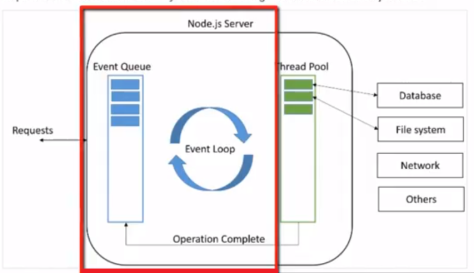
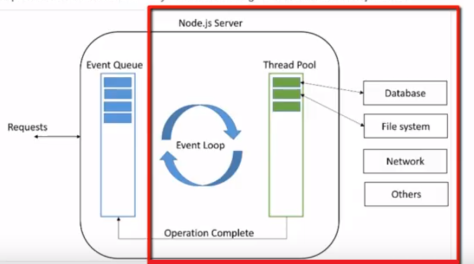
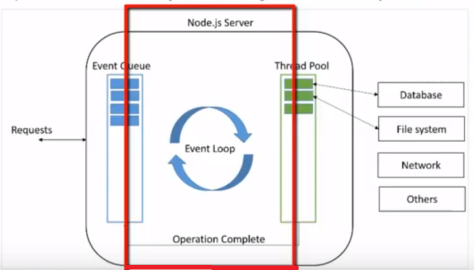

# УВИТ - Програмски језик ЈаваСкрипт

[Владимир Филиповић](https://vladofilipovic.github.io/index-cy.html){:target="_blank"}

## ЈаваСкрипт програмирање коришћењем окружења node

Овде ће бити размотрено како се програмира у ЈаваСкрипту коришћењем окружења за извршавање **node.js** (понегде се, краће, на ово окружење реферише само са **node**).

### Окружењe node

node.js је вишеплатформско радно окружење (енгл. runtime) које се базира на Google Chrome V8 машини - ЈаваСкрипт извршном окружењу високих перформанси, написаном у C++ (првобитно за потребе веб прегледача Google Chrome).

#### Карактеристике окружења node

Програмер Рајан Дал је развио node.js развио је 2009. године, на машини В8 као серверско радно окружење.

Велика предност node.js је то што је он у **потпуности ЈаваСкрипт**. Раније је ЈаваСкрипт био коришћен искључиво за развој на клијентској страни или тзв. предњем крају (енгл. frontend) - било као "чисти" ЈаваСкрипт (енгл. Vanila JS) било као JQuery, или нека друга ЈаваСкрипт библиотека. Од појаве окружења node.js, ЈаваСкрипт језик се широко користи и за програмирање на серверској страни, односно на задњем крају (енгл. backend). Пошто се ради о истом језику, ако се изабере овај приступ, разлика у самој синтакси између клијентских и серверских програма је врло мала или чак не постоји.

Друга велика предност node.js је **модуларност** - концепт проширења функционалности самог node.js и поједностављивање задатака инсталирањем одређених пакета, који представљају модуле.

Инсталација модула врши се помоћу алата који се зове **npm** – управљач пакетима окружења node (енгл. node package manager).

Основу node.js чини парадигма асинхроног програмирања, односно програмирање управљано **догађајима**. Догађаји у ЈаваСкрипту могу бити клик мишем, притисак на тастер, захтев за неким ресурсом на мрежи, итд. Окружење node.js чини моћним управо употреба програмског модела базираног на догађајима, такозвани неблокирајући модел, чији је принцип рада описан на дијаграму који следи.

Принцип рада неблокирајућег модела одвија се помоћу једне нити у node.js:

1. Када node.js прими захтев од стране клијента, тај захтев се смешта у ред догађаја, као што је приказано на слици испод.



1. Уколико захтев не садржи неку блокирајућу операцију (нпр. операција са датотеком, операција са ресурсом са мреже, рад са базом података и сл.), окружење node.js ће једноставно обрадити захтев и резултат вратити клијенту.

1. Уколико захтев садржи блокирајућу операцију, окружење node.js ће тај захтев додати скупу нити (енгл. threading pool), како би била реализована блокирајућа операција, као што је приказано на слици која следи. Често је блокирајућа операција повезана са функцијом повратног позива, којом се специфицира шта треба урадити по завршетку блокирајуће операције.



1. Када је блокирајућа операција завршена, радна нит (енгл. worker thread) припрема одговор и шаље га петљи за догађаје, која тај одговор шаље клијенту,што је приказано на дољњој слици. Ако је постојао повратни позив придружен блокирајућој операцији, сада насутпа време када је омогућно његово извршење.



На овај начин извршавање главног програма није блокирано од стране блокирајућих операција. као што је малопре описано, окружење node.js користи петљу за догађаје у једној нити (енгл. Single Thread Event Loop) за наш програмски код, док се све остало извршава паралелно. Зато ово окружење одликују високе перформансе, нарочито код модерних веб апликација где се захтева велика брзинуаи приликом постојања великог броја симултаних захтева од стране корисника.

#### Менаџер пакета npm

Као што је већ истакнуто модуларност је велика окружења node.js. Модуларност подразумева надоградњу  node.js, инкорпорацију одређених функционалности у виду програмског кода који проширују могућности node.js.

Као што је описано у делу који се односио на модуле, они се могу посматрати као неку врсту ЈаваСкрипт библиотека, а заправо представљају скуп развијенох функција које програмер жели укључити у апликацју.

Постоје уграђени модули, а такође постоје и модули - пакети, које програмер инсталира по потреби.

Модули се инсталирају помоћу алата управљач пакетима окружења node тј. npm. Aлат, тј. апликација npm је написана у ЈаваСкрипту и она на основу задатих параметара претражује базу модула, тј. регистар модула. АКо модула нема у локалном регуистру, алат ће довући модул са регистра на Интернету и инсталирати га у node.js окружење. Почев од верзије 5+, алат npm аутоматски додаје модуле у листу зависности која се налази у датотеци package.json.

Окружење node.js у овом тренутку подразуменвано користи [CommonJS](JavaScript-Programski-Jezik-Moduli.md#commonjs-модули){:target="_blank"} синтаксу за увоз и извоз модула, па се унутар програмског кода модули увозе помоћу функције `require()`.

Овде су укратко побројани неки од најважних node.js модула:

- assert - обезбеђује скуп тестова.

- buffer - врши операције над бинарним подацима. Омогућава интеракцију са TCP током података.

- child_process - омогућава рад са процесом-дететом.

- cluster – омогућава дељење једног node.js процеса у више мањих процеса, чиме се омогућава употреба система са више језгара.

- command line – наредбе node.js се могу користити из терминала.

- C/C++ module – омогућава да се  C/C++ користи као и сваки други модул.

- crypto – управља OpenSSL  криптографским функцијама.

- **dgram** – омогућава имплементацију UDP датаграм сокета.

- debugger – омогућава дебагирање у node.js датотеци.

- dns – омогућава везе са DNS серверима.

- errors - модул омогућава обраду грешака.

- **events** - модул омогућава обраду догађаја.

- **fs** – управља фајл системом.

- **http** – функционалности http сервера.

- https - омогућава http помоћу TLS/SSL протокола.

- modules - омогућава систем за учитавање модула за node.js.

- **net** – омогућава креирање сервера и клијента.

- os – омогућава информације и приступ оперативном систему.

- path – врши операције над путањама датотека.

- **querystring** – омогућава форматирање URL адресе.

- readline - омогућава интерфејс за читање информација из тока података.

- repl – омогућава креирање командне линије.

- stream – омогућава управљање подацима тока.

- string_decoder – декодира бафер објекте у ниску.

- **timers** – омогућује извршавање функције после задате вредности у милисекундама.

- tls – имплементира TLS и SSL протоколе.

- tty – омогућава класе коришћене од стране терминала текста.

- **url** – рашчлањује URL ниске.

- util - приступ корисним функцијама, омогућава подршку за различите апликације и модуле.

- V8 – Приступ информацијама о V8 машини за извршавање ЈаваСкрипта.

- vm – омогућава компајлирање ЈаваСкрипт кода на виртуалној машини V8.

- zlib - компресија и декомпресија датотека, помоћу модула Gzip.

У горњој листи су истакнути (подебљавањем) они модули са којима ћемо додатно радити у наставку курса.

### Догађаји код окружења node

У претходноје секцији је истакнуто да је node.js апликација која се извршава у једној нити, акоја подржава конкурентну обраду кроз концепт догађаја и повратних позива. Сваки од API-ја у оквиру node.js је асинхорни, а како се извршава у апликацији са једном нити, то се користе `async` функције у циљу обезбеђења конкурентности. Окружњењ node користи обрзазац дизајна посматрач (енгл. observer pattern). Дакле, једна нит nodeапликације се врти у оквиру петље за догађаје све док се задатак не заврши, а потом испаљује одговарајући догађај којим се сигнализира да треба да буде извршена функција која ослушкује тај догађај.

#### Програмирање управљано догађајима

Окружење node.js интензивно користи догађаје и то је један од разлога солидне брзине овог окружења у односу на сличне технологије. Наиме, при покретанњу сервера који користи node.js, одмах чим се иницијализују променљиве и декларишу се функције, програмски код сервера само чека да се догоде догађаји на чије је ослушкивање претплаћен - када се догоди догађај датог типа покреће се функција која рукује са таквим догађајем.

Код апликација управљаних догађајем, у општем случају, постоји једна главна петља у којој се ослушкују догађаји и потом покрећу функције повратних позива када се детектују догађаји одговарајућег типа.


Иако догађаји изгледају слично као повратни позиви, разлика је у томе што се повратни позиви дешавају када асинхрона функција врати резултат, а руковаоци догађајима се покрећу у складу са начином рада обрасца дизајна посматрач. Прецизније речено, код догађаје се функције која ослушкују догађаје се понашају као посматрачи: кад догађај буде испаљен, почиње са извршавањем ослушкивач догађаја.

Окружење node.js обезбеђује подршку за рад са догађајима кроз модул `events` и кроз класу `EventEmitter`. Код апликација које раде у node.js окружењу, свака асинхрона функција има као последњи параметар функцију повратног позива, која ће бити извршена по окончању ове асинхроне функције.  

#### Класа EventEmitter

Класа `EventEmitter` се налази у модулу `events`.

Ова класа обезбеђује да објекти типа `EventEmitter` садрже особине као што су `on` и `emit`. Особина `on` се користи ради везивања функције за дати догађај, а особина `emit` служи за испаљивање догађаја.

Најважнији методи за овјекте типа `EventEmitter` су:

- `addListener(dogadjaj, osluskivac)` - додаје функцију `osluskivac()` на крај низа ослушкивача датог догађаја `dogadjaj`. Приликом додавања се не врши провера да ли је тај `osluskivac` раније већ био додат у низ ослушкивача датог догађаја. Функција враћа емитер, тако да може користити у уланчаним позивима.

- `on(dogadjaj, osluskivac)`- додаје функцију `osluskivac()` на крај низа ослушкивача датог догађаја `dogadjaj`. Приликом додавања се не врши провера да ли је тај `osluskivac` раније већ био додат у низ ослушкивача датог догађаја. Функција враћа емитер, тако да може користити у уланчаним позивима.

- `once(dogadjaj, osluskivac)` - једнократно додаје функцију `osluskivac()` на крај низа ослушкивача датог догађаја `dogadjaj`. Овај ослушкивач ће се извршити једном по испаљивању догађаја, после чега ће бити уклоњен из низа ослушкивача. Функција враћа емитер, тако да може користити у уланчаним позивима.

- `removeListener(dogadjaj, osluskivac)` - уклања `osluskivac` из низа ослушкивача за дати догађај `dogadjaj`. Ова функција ће уклонити не више од једне појаве датог ослушкивача из низа, па ако је претходно ослушкивач био додат више пута, онда ова функција неће уклонити све његове појаве. Функција враћа емитер, тако да може користити у уланчаним позивима.

- `removeAllListeners([dogadjaj])` - уклања све ослушкиваче ако је испуштен аргумент који представља догађај. АКо је приликом позива функције прослеђен догађај, онда ће бити уклоњени све ослушкивачи за дати догађај.  Функција враћа емитер, тако да може користити у уланчаним позивима.

- `setMaxListeners(n)` - подразумевано понашање је да објекат типа `EventEmitters` шаље упозорење ако је број његових ослушкивача постао већи од `10`. Ова функција мења то понашање, тако што на `n` поставња граничну вредност за упозоравање на превише ослушкивача. Ако се коришћењем ове функције максимални број ослушкивача посатви на `0`, упозорење се неће појављивати.

- `listeners(dogadjaj)` - враће низ ослушкивача за дати догађај, прослеђен као аргумент функције.

- `emit(dogadjaj, [arg1], [arg2], [...])` - емитује догађај са датим аргументима, што ће довести до извршавања свих ослушкивача тог догађаја, при чему у том извршавању ће аргументи позива бити прослеђени руковаоцима догађаја. Функција враће `true` ако догађај `dogadjaj` има ослушкиваче, иначе враће `false`.

**Пример.** Илустрије емитовање и хватање догађаја.

```js
const Dogadjaj = require('events')

class EmiterDogadjaja extends Dogadjaj {}

const emiter = new EmiterDogadjaja()

emiter.on('dogadjaj', () => {
  console.log('Odgovaram na emitovani dogadjaj!')
})

emiter.emit('dogadjaj')
```

&#9608;

**Пример.** Илустрије како више ослушкивача ослушкују исти догађај.
Уочава се да руковалац догађајем може бити функција, а може бити и ламбда-израз.
У овом примеру се више пута емитује исти догађај, али му се свакипут приликом емитовања прослеђују различити аргументи.

```js
const Dogadjaj = require('events');

class EmiterDogadjaja extends Dogadjaj {}

const emiter = new EmiterDogadjaja();

emiter.on('dogadjaj', function(a, b) {
  console.log(`--- rukovalac dogadjajem je funkcija ---`);
  console.log(a, b, this, this === emiter);
});

emiter.on('dogadjaj', (a, b) =>{
  console.log(`--- rukovalac dogadjajem je lambda-izraz ---`);
  console.log(a, b, this, this === emiter);
});

emiter.emit('dogadjaj', 'a', 6);
emiter.emit('dogadjaj', 'mika');
emiter.emit('dogadjaj');
```

&#9608;

**Пример.** Илустрије емитовање и једноструко хватање догађаја.

```js
const KlasaZaEmitovanjeDogadjaja = require('events');

class EmitorDogadjaja extends KlasaZaEmitovanjeDogadjaja {}

const emitor = new EmitorDogadjaja();

let m = 0;

emitor.on('dogadjaj1', () =>{
  console.log(++m);
});

emitor.emit('dogadjaj1');
emitor.emit('dogadjaj1');
emitor.emit('dogadjaj1');

console.log('---');

let n = 0;

emitor.once('dogadjaj2', () =>{
  console.log(++n);
});

emitor.emit('dogadjaj2');
emitor.emit('dogadjaj2');
emitor.emit('dogadjaj2');
emitor.emit('dogadjaj2');
```

&#9608;

**Пример.** Илустрије руковање грешкама код догађаја.

```js
const EventEmitter = require('events');

class EmitorDogadjaja extends EventEmitter {}

const emitor = new EmitorDogadjaja();

emitor.on('dogadjaj', () =>{
  console.log('A');
});

emitor.on('error', (err) => {
  console.error(`Paznja! doslo je do greske. Greska: ${err}`);
});

emitor.emit('dogadjaj');
emitor.emit('error');
emitor.emit('dogadjaj');
emitor.emit('dogadjaj');
```

&#9608;

И над догађаима се могу правити догађаји - прецизније, два типа догађаја:

- `newListener` - емитује се сваки пут када се дода ослушкивач за неки догађај.

- `removeListener` - емитује се сваки пут када ослушкивач буде уклоњен.

**Пример.** Илустрије рад са догађајем `newListener`.

```js
const EventEmitter = require('events');

class EmitorDogadjaja extends EventEmitter {}

const emitor = new EmitorDogadjaja();

emitor.once('newListener', (event, listener) => {
  if (event === 'dogadjaj') {
    // Ubaci novi dogadjaj na pocetak
    emitor.on('dogadjaj', () => {
      console.log('B');
    });
  }
});

emitor.on('dogadjaj', () =>{
  console.log('A');
});

emitor.emit('dogadjaj');
emitor.emit('dogadjaj');
```

&#9608;

### Рад са датотекама

У овом делу се описује како се пишу програми који раде са датоткама у окружењу node.js.

### Директан рад са датотекама

**Пример.** Илустрије читање садржаја датотеке и њен приказ на конзолу.

Датотека `test.txt` треба да се нађе у истом директоријуму у ком се налази ова скрита.

```js
let fs = require('fs')

fs.readFile('test.txt',
    (err, data) => {
        if (err) {
            console.log(err);
        }
        console.log(data);
    });
```

Приликом извршења скрипте, на конзоли се појавио следећи садржај:

```console
<Buffer 54 72 6c 61 0d 0a 20 20 62 61 62 61 20 0d 0a 20 20 20 20 6c 61 6e 0d 0a 0d 0a 44 61 20 6a 6f 6a 20 70 72 6f c4 91 65 20 64 61 6e 21>
```

У овом случају, подаци који су послати да се прикажу на конзоли су секвеннца бајтова, која представља кодоаве слова. &#9608;

**Пример.** Илустрије читање садржаја текстуалне датотеке и њен приказ на конзолу.

Датотека `test.txt` треба да се нађе у истом директоријуму у ком се налази ова скрита.

```js
let fs = require('fs')

fs.readFile('test.txt', 'utf-8',
    (err, data) => {
        if (err) {
            console.log(err);
        }
        console.log(data);
    });
```

Разлика у односу на претходни пример је у томе што је приликом читања датотеке специфициран и кодни распоред. Сада се приликом извршења скрипте, на конзоли се појавио следећи садржај:

```console
Trla
  baba
    lan

Da joj prođe dan!
```

То је исти садржај текстуалне датотеке `test.txt` који је могао да се види помоћу било ког едитора. &#9608;

**Пример.** Илустрије упис текста у текстуалну датотеку.

```js
let fs = require('fs');

fs.writeFile('text3.txt', 'Ovo je neka mala proba', 'utf8',
    (err) => {
        if (err) {
            console.log(err);
        }
    });
```

&#9608;

**Пример.** Илустрије синхроно тј. блокирајуће читање садржаја текстуалне датотеке, као и синхрони упис у датотеку.

```js
let fs = require('fs');

let mojCitac = fs.readFileSync('test.txt', 'utf8');
console.log(mojCitac);

let mojPisac = fs.writeFileSync('test2.txt',
`Ovo je proba!

I treba pokušavati!
`
, 'utf8');
```

&#9608;

### Рад са датотекама преко токова

**Пример.** Илустрије читање садржаја велике текстуалне датотеке, коришћењем токова.

```js
let fs = require('fs');

console.log('\n');

let tokZaCitanje = fs.createReadStream('lorem.txt');
tokZaCitanje.setEncoding('utf8');
tokZaCitanje.on('data',
    (prispeliPodaci) => console.log(prispeliPodaci));
```

&#9608;

**Пример.** Илустрије читање само почетног дела садржаја велике текстуалне датотеке, коришћењем токова.

```js
let fs = require('fs');

console.log('\n');

let tokZaCitanje = fs.createReadStream('lorem.txt');
tokZaCitanje.setEncoding('utf8');
tokZaCitanje.once('data',
    (datacoming) => console.log(datacoming));
```

&#9608;

**Пример.** Илустрије пребројавање колико је било читања при очитавању садржаја велике текстуалне датотеке, коришћењем токова.

```js
let fs = require('fs');

console.log('\n');

let tokZaCitanje = fs.createReadStream('lorem.txt');
tokZaCitanje.setEncoding('utf8');
let brojac = 0;
tokZaCitanje.on('data',
    () => {
        brojac++;
        console.log(brojac);
    });
tokZaCitanje.on('end',
    () => console.log("---\n" + brojac));
```

&#9608;

**Пример.** Илустрије упис у текстуалну датотеку, коришћењем токова.

```js
let fs = require('fs');

let tokZaUpis = fs.createWriteStream('copyl.txt');
tokZaUpis.write('Поздрав за слушапоце курса УВИТ!');
```

&#9608;

**Пример.** Илустрије надовезивање токова.

```js
let fs = require('fs');

let tokZaCitanje = fs.createReadStream('lorem.txt');
tokZaCitanje.setEncoding('utf8');
let brojac = 0;
tokZaCitanje.on('data',
    () => brojac++);
tokZaCitanje.on('end',
    () => console.log(brojac));

let tokZaUpis = fs.createWriteStream('copy1.txt');
tokZaCitanje.pipe(tokZaUpis);
```

По извршењу овог кода, садржај датотеке `copy1.txt` ће бити текст који је прочитан из датотеке `lorem.txt`. &#9608;

**Пример.** Илустрије паузирање тока за читање, као и надовезивање токова.

```js
let fs = require('fs');

let tokZaCitanje = fs.createReadStream('lorem.txt');
tokZaCitanje.setEncoding('utf8');
let brojac = 0;
tokZaCitanje.once('data',
    (prispeliPodaci) => {
        brojac++;
        if (brojac == 3)
            tokZaCitanje.pause();
    });
tokZaCitanje.on('end',
    () => console.log(brojac));

let writeStream = fs.createWriteStream('copy2.txt');
tokZaCitanje.pipe(writeStream);
```

&#9608;

#### Догађаји и токови података

**Пример.** Илустрије постављање више ослушкивача на један догађај тока за читање.

```js
let fs = require('fs');

let tokZaCitanje = fs.createReadStream('lorem.txt');
tokZaCitanje.setEncoding('utf8');

let brojac = 0;
tokZaCitanje.addListener('data', brojiCitanja);
tokZaCitanje.addListener('data', prikazujeCitanja);

function brojiCitanja(prispeliPodaci) {
    brojac = brojac + 1;
    console.log("Citanje broj: " + brojac);
}

function prikazujeCitanja(prispeliPodaci) {
    console.log('Duzina prispelih podataka: ' + prispeliPodaci.length);
}

tokZaCitanje.addListener('end',
    function () {
        console.log("---\nUkupno citanja: " + brojac);
    });
```

Резултат извршавања ове скрипте је:

```console
Citanje broj: 1
Duzina prispelih podataka: 65536
Citanje broj: 2
Duzina prispelih podataka: 65536
Citanje broj: 3
Duzina prispelih podataka: 65536
Citanje broj: 4
Duzina prispelih podataka: 65536
Citanje broj: 5
Duzina prispelih podataka: 65536
Citanje broj: 6
Duzina prispelih podataka: 65536
Citanje broj: 7
Duzina prispelih podataka: 65536
Citanje broj: 8
Duzina prispelih podataka: 65536
Citanje broj: 9
Duzina prispelih podataka: 65536
Citanje broj: 10
Duzina prispelih podataka: 65536
Citanje broj: 11
Duzina prispelih podataka: 65536
Citanje broj: 12
Duzina prispelih podataka: 65536
Citanje broj: 13
Duzina prispelih podataka: 65536
Citanje broj: 14
Duzina prispelih podataka: 65536
Citanje broj: 15
Duzina prispelih podataka: 65536
Citanje broj: 16
Duzina prispelih podataka: 65536
Citanje broj: 17
Duzina prispelih podataka: 65536
Citanje broj: 18
Duzina prispelih podataka: 65536
Citanje broj: 19
Duzina prispelih podataka: 65536
Citanje broj: 20
Duzina prispelih podataka: 65536
Citanje broj: 21
Duzina prispelih podataka: 49786
---
Ukupno citanja: 21
```

Промена редоследа у додавању ослушкивача на догашај `data` би довела до проемене излаза тј. садржаја који се приказује на конзоли. &#9608;

**Пример.** Илустрије постављање више ослушкивача на један догађај тока за читање преко ламбда-израза.

```js
let fs = require('fs');

let tokZaCitanje = fs.createReadStream('lorem.txt');
tokZaCitanje.setEncoding('utf8');

let brojac = 0;
tokZaCitanje.addListener('data',
    (prispeliPodaci) => brojac = brojac + 1);
tokZaCitanje.addListener('data',
    (prispeliPodaci) => console.log('duzina prispelih podataka: ' + prispeliPodaci.length));
tokZaCitanje.addListener('end',
    () => console.log(brojac));
```

&#9608;

**Пример.** Илустрије динамичко уклањање једног ослушкивача током процеса читања података из датотеке преко токова.

```js
let fs = require('fs');

let tokZaCitanje = fs.createReadStream('lorem.txt');
tokZaCitanje.setEncoding('utf8');

let brojObracanja = 0;
let brojacObracanja = (prispeliPodaci) => {
    brojObracanja = brojObracanja + 1;
    if (brojObracanja == 3)
        tokZaCitanje.removeListener('data', brojacObracanja);
};
tokZaCitanje.addListener('data',
    brojacObracanja);
tokZaCitanje.addListener('data',
    (prispeliPodaci) => console.log('дужина приспелих података: ' + prispeliPodaci.length));
tokZaCitanje.addListener('end',
    () => console.log(brojObracanja));
```

Излаз је следећег облика:

```console
дужина приспелих података: 65536
дужина приспелих података: 65536
дужина приспелих података: 65536
дужина приспелих података: 65536
дужина приспелих података: 65536
дужина приспелих података: 65536
дужина приспелих података: 65536
дужина приспелих података: 65536
дужина приспелих података: 65536
дужина приспелих података: 65536
дужина приспелих података: 65536
дужина приспелих података: 65536
дужина приспелих података: 65536
дужина приспелих података: 65536
дужина приспелих података: 65536
дужина приспелих података: 65536
дужина приспелих података: 65536
дужина приспелих података: 65536
дужина приспелих података: 65536
дужина приспелих података: 65536
дужина приспелих података: 49786
3
```

На крају је приказан број `3`, јер је у тренутку када је `brojObracanja` достигао ту вредност извршено уклањање ослушкивача који врши увећавање бројача. Други ослушкивач, који извештава о дужини приспелих података је наставио да реагује на сваки испаљени `data` догађај. &#9608;

**Пример.** Илустрије динамичко уклањање свих ослушкивача за догађај `data` током процеса читања података из датотеке преко токова.

```js
let fs = require('fs');

let tokZaCitanje = fs.createReadStream('lorem.txt');
tokZaCitanje.setEncoding('utf8');

let brojCitanja = 0;
let brojacCitanja = (prispeliPodaci) => {
    brojCitanja = brojCitanja + 1;
    if (brojCitanja == 3)
        tokZaCitanje.removeAllListeners('data');
};
tokZaCitanje.addListener('data',
    brojacCitanja);
tokZaCitanje.addListener('data',
    (prispeliPodaci) => console.log('дужина приспелих података: ' + prispeliPodaci.length));
tokZaCitanje.addListener('end',
    () => console.log(brojCitanja));
```

Приликом извршавања би се добио излаз је следећег облика:

```console
дужина приспелих података: 65536
дужина приспелих података: 65536
дужина приспелих података: 65536
3
```

У тренутку када је `brojObracanja` достигао вредност `3`,  извршено је уклањање свих ослушкивача који ослушкују `data` догађај. &#9608;

### Литература

1. Haverbeke M.: [Eloquent JavaScript](https://eloquentjavascript.net/){:target="_blank"}

1. Костић М.: [Развој веб апликација помоћу MEAN стека](http://www.racunarstvo.matf.bg.ac.rs/MasterRadovi/2017_06_18_Mirjana_Kostic/rad.pdf){:target="_blank"}, Мастер рад, Универзитет у Београду, Математички факултет.

1. [JavaScript](https://developer.mozilla.org/en-US/docs/Web/JavaScript){:target="_blank"} - Mozzila Developer Network (MDN)

1. Живановић, Д.: [Веб програмирање - ЈаваСкрипт](https://www.webprogramiranje.org/dogadjaji-u-javascript-u/){:target="_blank"}

1. Copes F.: [Complete JavaScript Handbook](https://medium.freecodecamp.org/the-complete-javascript-handbook-f26b2c71719c){:target="_blank"}
