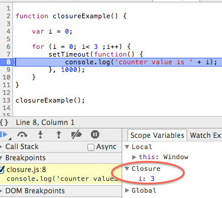

# УВИТ - Програмски језик ЈаваСкрипт

[Владимир Филиповић](https://vladofilipovic.github.io/index-cy.html){:target="_blank"}

## Функције и затворења

Слично као кŏд других виших програмских језика, функције служе за бољу организацију програмског кŏда - секевнце наредби које представљају логичку целину се организују у функције.

У језику ЈаваСкрипт, поред горе побројаног, функције карактерише чињеница да представљају тзв. “грађане првог реда” (енгл. first class citizen).  Ако програмски ентитети јесте "грађанин првог реда", то онда значи да такав ентитет подржава све операције доступне другим типовима и може да се понаша потпуно исто као било која друга врста ентитета која је грађанин првог реда. Конкретно код ЈаваСкрипта, пошто су функције грађани првог реда, код њих не постоји рестрикција како се креирају или користе и они имају особине свих примитива као и све особине објекта.

Дакле, функција има све особине других примитива, па се може проследити као аргумент, може се вратити као резултат неке друге функције или се можем доделити некој промењивој. Надаље, поред набројаних особина, функције имају и све особине објеката. На крају, поред свих особина објекта и примитива, функције садрже и додату семантику за позивање.

Као што смо видели у претходним поглављима, ЈаваСкрипт се испоручује са скупом "уграђених" тј. предефинисаних функција, које су одмах на располагању програмеру. Наравно, језик допушта ЈаваСкрипт програмеру и да креира сопствене функције.

Постоје два начина за дефинисање функција: помоћу декларације и помоћу функцијског израза.

### Декларација и позив функције

Један вид рада са функцијама у језику ЈаваСкрипт је да се функција креира декларисањем. Синтакса декларисања и позива тако направљене функције веома подсећа на декларисање и прозив функције у другим "мејнстрим" програмским језицима, као што су Јава и C.

декларација функције често садржи параметре. Параметри функције су начин да функција преузме податке из спољашњости. Параметри и променљиве декларисани унутар функције су локални за ту функцију, они се поново креирају при сваком позиву функције и они
нису видљиви из спољашњости.

Позив фунције се реализује слично као у језицима Јава и C, навођењем назива функције иза кога, у заградама, следи листа аргумената међусобно раздвојених зарезом. Извршење позива доводи до тога да извршавање наставља од прве наредбе функције, при чему су параметри функције замењени прослеђеним аргументима. По завршетку извршавања позване функције, извршавање програма се наставља од наредебе које следи иза наредбе позива.

Исто као у језику C, фунција враће вредност-резултат коришћењем наредбе `return`. Извршењем ове наредбе се завршава рад функције и извршавање враће у позивајућу функцију, на наредбу која следи иза наредбе позива. Извршавање функције се такође завршава завршетком извршења последње наредбе функције.

**Пример.** Декларација и позиви функције за квадрирање броја:

```js
function kvadrat(x) {
    return x * x;
};

console.log(`Kвадрат броја 12 је ${kvadrat(12)}`);
let y = kvadrat(13);
console.log(`Kвадрат броја 13 је ${y}`);
y = 14;
console.log(`Kвадрат броја ${y} је ${kvadrat(y)}`);
```

&#9608;

### Функцијски израз и позив функције

Један вид рада са функцијама у језику ЈаваСкрипт је да се функција одреди функцијским изразом. У том виду рада са функцијом, функција заиста постаје "грађанин првог реда". Стога ћемо, у примерима који следе, обично користити функцијске изразе.

И код фунцијских израза се позив фунције реализује навођењем називе функције иза кога, у заградама, следи листа аргумената међусобно раздвојених зарезом.

**Пример.** Фунцијски израз за квадрирање броја и позиви тако направљене функције:

```js
let kvadrat = function(x) {
  return x * x;
};

console.log(kvadrat(12));
console.log(`Kвадрат броја 12 је ${kvadrat(12)}`);
let y = kvadrat(13);
console.log(`Kвадрат броја 13 је ${y}`);
y = 14;
console.log(`Kвадрат броја ${y} је ${kvadrat(y)}`);
```

У претходном примеру, дакле, `kvadrat` је променљива која реферише на функцију - грубо речено, садржи адресу "нечега" што за прослеђени аргумент враће произвид тог аргумента са самим собом. &#9608;

Приликом позива функције, врши се замена тј. супституција параметара функције аргументима позива. У језику ЈаваСкрипт, врши се тзв супституција по вредности, израчунавају се вредности аргумената приликом позива и израчунате вредности редом замењују параметре функције.

### Параметри и аргументи функција

За разлику од највећег броја популарних програмских језика (као што су Јава и C), где приликом позива параметри функције и аргументи позива морају бити сагласни по броју и типу, то код ЈаваСкрипта уопште није случај. Наравно, јасно је да се због слабе типизираности језика ЈаваСкрипт не може проверавати сагласност типова параметара и аргумената, али такође није обавезно ни да се поклопи број аргумената у позиву функције са бројем параметара функције.

Ако је број аргумената позива већи од броја параметара функције, тада се изврши супституција онолико парамеатара колико их има у дефиницији функције, преостали тј. вишак једноставно буде игнорисан.

**Пример.** Позив функције, где је број аргумената у позиву већи од броја параметара функције:

```js
let buka = function() {
    console.log(" Tras !");
};

buka();
buka();
// broj argumenata moze biti veci
// od broja parametara funkcije
buka("Petar");
```

&#9608;

У случају позива функције када је број аргумената у позиву мањи од броја параметара функције, параметри функције ће добити вредност `undefined`. У претходним поглављима је описано како се евалуира израз који има `undefined` операнде.  

**Пример.** Позив функције, где се број аргумената у позиву мањи од броја параметара функције:

```js
const stepen = function(osnova, izlozilac) {
    let ret = 1;
    for (let i = 0; i < izlozilac; i++)
        ret *= osnova;
    return ret;
};

console.log(stepen(3, 4));
console.log(stepen(4, 3));
console.log(stepen(4));
console.log(stepen());
```

&#9608;

Ако је потребно, може се одлучити да се у самом телу функције проверава да ли је извршена супституција параметра са аргументом или не.

**Пример.** Провера у телу функције да ли је правилно извршена супституција параметара аргументима:

```js
let stepen = function (osnova, izlozilac) {
    if (osnova == undefined)
        osnova = 10;
    if (izlozilac == undefined)
        izlozilac = 2;
    let ret = 1;
    for (let i = 0; i < izlozilac; i++)
        ret *= osnova;
    return ret;
};

console.log(stepen(3, 4));
console.log(stepen(4, 3));
console.log(stepen(4));
console.log(stepen());
```

&#9608;

#### Опциони параметри функција

Елегантнији начни за проверу да се да ли је извршена супституција параметра са аргументом је коришћење такозваних опционих параметара функције. Параметар постаје опциони ако се у дефиницији функције, приликом навођењна параметра специфицира његова подразумевана вредност. У том случају, ако приликом позива функције за опциони параметар не буде дат аргумент, параметар ће добити подразумевану вредност која му је дата у дефиницији функције.

**Пример.** Опциони параметри функције:

```js
const stepen = function (osnova = 10, izlozilac = 2) {
    let ret = 1;
    for (let i = 0; i < izlozilac; i++)
        ret *= osnova;
    return ret;
};

console.log(stepen(3, 4));
console.log(stepen(4, 3));
console.log(stepen(4));
console.log(stepen());
```

&#9608;

**Пример.** Илуструје шта се дешава кад аје у позиву функције више аргимената, као и када је мање аргумената, те како се понашање разликује у зависности од тога да ли су у дефинициј функције дати подразумевани параметри:

```js
function bezArgumenata() {
}

// Ovo je OK
bezArgumenata(1, 2, 3);

function triArgumenta(a, b, c) {
    console.log("---\n" + a)
    console.log(b)
    console.log(c)

}

// I ovo je OK
triArgumenta(1, 2, "tri");
triArgumenta(1, 2);
triArgumenta(1);
triArgumenta();

function triArgumentaPodrazumenvano(a = 'a', b = 'b', c = null) {
    console.log("---\n" + a)
    console.log(b)
    console.log(c)
}

triArgumentaPodrazumenvano(1, 2, "tri");
triArgumentaPodrazumenvano(1, 2);
triArgumentaPodrazumenvano(1);
triArgumentaPodrazumenvano();
```

&#9608;

На крају, треба истаћи да приликом сваког позива функције, постоји могућност да се приступи аргументима позива (било да их је више, мање или тачно колико треба) коришћењем [`arguments`](https://developer.mozilla.org/en-US/docs/Web/JavaScript/Reference/Functions/arguments){:target="_blank"}, о чему ће бити речи у каснијим поглављима.

### Опсези важења за променљиве и функције

Као што је истакнуто у претходном [поглављу](JavaScript-Programski-Jezik-Struktura-Programa#опсези-важења-променљивих-у-циклусима){:target="_blank"}, ако је променљива декларисана коришћењем `let` или `const` опсег важења променљиве је блоковски. Ако је променљива декларисана коришћењем `var` опсег важења променљиве је функцијски, што значи да ће се моћи приступити променљивој у опсегу функције у којој је та промељива дефинисана.

Наравно, у телу функције се може приступити свим параметрима функције и свим променљивима које су глобалне за ту функцију, тј. дефинисане у опсезима  који садрже дефиницију дате функције.

**Пример.** Илуструје како се модификује променљива која је глобална за дату функцију:

```js
let test = "globalna vrednost";
function testirajOpsegDefinisanosti() {
  test = "lokalna vrednost";
  console.log(test);
}
console.log(test);
testirajOpsegDefinisanosti();
console.log(test);
```

```console
globalna vrednost
lokalna vrednost
lokalna vrednost
```

&#9608;

Важно је истаћи да функције декларисане унутар опсега неке друге функције могу приступати
локалном опсегу функције унутар које су декларисане.

#### Стек позива за функције

Функција у свом телу може садржати један или више позива других функција, или чак може да позива саму себе. Позив функције и повратак из функције се, исто као и у другим популарним језицима данашњице, постиже коришењем структуре података стек. ЈаваСкрипт извршно окружење  приликом сваког позива функције на стек смешта тзв. [стек-оквир](https://v8docs.nodesource.com/node-0.8/d4/da0/v8_8h_source.html#l00806){:target="_blank"} (енгл. stack frame) за функцију, који садржи адресу повратка, тј. описује од које ће се локације у скрипту наставити извршавање. Приликом завршетка рада функције, са стека се скида претходно постављени стек-оквир и ЈаваСкрипт извршно окружење наставља извршавање од локације која је чувана у том стек-оквиру.

Дакле, можемо сматрати да у ЈаваСкрипту позиви функција током извршења програмског кода образују стек, који се назива стек позива за функције.

**Пример.** Илустрација како неправилним коришћењем може бити препуњен стека позива за функције - програм треба да одреди да ли је старија кокошка или јаје :) :

```js
function kokoska() {
    return jaje();
};

function jaje() {
    return kokoska();
}

console.log("Starija je ", kokoska());
```

&#9608;

#### Рекурзивне функције

Рекурзија означава поступак или функцију који у својој дефиницији користе сами себе. Другим речима, рекурзивни поступак за решавање проблема захтева поделу оригиналног проблема на делове (мање димензије али исте природе), који бивају независно подвргнути истом том поступку, све док димензија проблема не постабе толико мала да је решење проблема тривијално.

**Пример.** Илустрација рекурзије - резурзивна функција за израчунавање степена основе позитивним целобројним изложиоцем.

```js
function stepen(osnova, izlozilac) {
    if (izlozilac == 0)
        return 1;
    return osnova * stepen(osnova, izlozilac - 1);
}

console.log(stepen(3,4))
```

&#9608;

**Пример.** Илустрација рекурзије - проверава се да је дати број паран или непаран.

Скрипта се ослања на чиченицу да дати бро има исту парност као тај број умањен за `2`:

```js
function paran(broj) {
    if (broj == 0)
        return true;
    if (broj == 1)
        return false;
    return paran(broj - 2);
}

function neparan(broj) {
    return !paran(broj);
}

console.log(paran(50));
console.log(neparan(50));
console.log(paran(75));
console.log(neparan(75));
```

&#9608;

**Пример.** Илустрација узајамне рекурзије - проверава се да је дати број паран или непаран.

У овом примеру функција која проверава да ји је број паран, позива функцију која преоврава да ли је непаран декремент (тј. тај број умањен за један), она опет позива функцију која проверава да ли је паран декремент декремента итд, све док се број који се проверава не сведе на тривијалан случај - `1` или `0`. Онда се иде уназад кроз стек позива док се не дође до резулата:

```js
function paran(broj) {
    if (broj == 0)
        return true;
    if(broj == 1)
        return false;
    return neparan(broj - 1);
}

function neparan(broj) {
    if (broj == 0)
        return false;
    if (broj == 1)
        return true;
    return paran(broj-1);
}

console.log(paran(6));
console.log(neparan(50));
console.log(paran(75));
console.log(neparan(75));
```

&#9608;

**Пример.** Рекурзивна функција за проверу да ли се дати број циљни број може направити од броја `1`, узастопним понављањем множења са `3` и/или додавања `5` у било ком редоследу.

Кроз програмски код овог примера се дефинисање функцијског израза уннутар функцијског израза, приступ променљивој глобалној за функцију, као и рекурзија.

```js
const izgradiIzraz = function (cilj) {
    const izgradi = function (start, istorija) {
        if (start == cilj)
            return istorija;
        if (start > cilj)
            return null;
        return izgradi(start + 5, "(" + istorija + " + 5) ") ||
            izgradi(start * 3, "(" + istorija + " * 3) ");
    }
    return izgradi(1, "1");
}

for (let i = 80; i <= 100; i++)
    console.log(i + " = " + izgradiIzraz(i));
```

Резултат извршења горње скрипте је:

```console
80 = null
81 = ((((((((((((((((1 + 5)  + 5)  + 5)  + 5)  + 5)  + 5)  + 5)  + 5)  + 5)  + 5)  + 5)  + 5)  + 5)  + 5)  + 5)  + 5)
82 = ((((((1 * 3)  + 5)  * 3)  * 3)  + 5)  + 5)
83 = (((((((1 + 5)  + 5)  + 5)  + 5)  + 5)  * 3)  + 5)
84 = (((((1 + 5)  * 3)  + 5)  + 5)  * 3)
85 = null
86 = (((((((((((((((((1 + 5)  + 5)  + 5)  + 5)  + 5)  + 5)  + 5)  + 5)  + 5)  + 5)  + 5)  + 5)  + 5)  + 5)  + 5)  + 5)  + 5)
87 = (((((1 * 3)  + 5)  * 3)  + 5)  * 3)
88 = ((((((((1 + 5)  + 5)  + 5)  + 5)  + 5)  * 3)  + 5)  + 5)
89 = ((((((1 + 5)  * 3)  + 5)  + 5)  * 3)  + 5)
90 = null
91 = ((((((((((((((((((1 + 5)  + 5)  + 5)  + 5)  + 5)  + 5)  + 5)  + 5)  + 5)  + 5)  + 5)  + 5)  + 5)  + 5)  + 5)  + 5)  + 5)  + 5)
92 = ((((((1 * 3)  + 5)  * 3)  + 5)  * 3)  + 5)
93 = (((((((1 + 5)  + 5)  + 5)  + 5)  + 5)  + 5)  * 3)
94 = (((((((1 + 5)  * 3)  + 5)  + 5)  * 3)  + 5)  + 5)
95 = null
96 = (((((((((((((((((((1 + 5)  + 5)  + 5)  + 5)  + 5)  + 5)  + 5)  + 5)  + 5)  + 5)  + 5)  + 5)  + 5)  + 5)  + 5)  + 5)  + 5)  + 5)  + 5)
97 = (((((((1 * 3)  + 5)  * 3)  + 5)  * 3)  + 5)  + 5)
98 = ((((((((1 + 5)  + 5)  + 5)  + 5)  + 5)  + 5)  * 3)  + 5)
99 = ((((1 + 5)  + 5)  * 3)  * 3)
100 = null
```

&#9608;

Кроз програмски код који следи се комбинују рекурзивни приступ, коришћење функције за генерисање и коришћење глобалне променљиве за функцију:

### Ламбда изрази и функције

У новије време јако је популаран начин дефинисања функција помоћу ламбда израза. Ту се, уместо резервисане речи `function` користи секвенца знакова једнако и веће (тзв. "дебела стрелица" - `=>`, коју не треба мешати са реалционим оператором веће или једнако `>=`). Дебела стрелица `=>` се пише после листе параметара,
 а пре тела функције. Идеја је да се на тај начин изрази значење "улаз са датим параметрима производи излаз на начин описан телом функције".

Ако функција тј. ламбда израз садржи тачно један параметар, онда нема потребе да се тај један параметар обухвата заградама. Ако тело функције садржи тачно једну `return` наредбу, онда нема потребе да се користе витичасте заграде за означавањење тела функције, нити да се користи резервисана реч `return` - довољно је само написати израз који враће та функција.  

**Пример.** Дефинисање функције функцијским изразом и помоћу ламбда израза:

```js
let kvadrat1 = function (x) {
    return x * x
};
console.log(kvadrat1(12));

let kvadrat2 = (x) => {
    return x * x
};
console.log(kvadrat2(12));

let kvadrat3 = x => {
    return x * x
};
console.log(kvadrat3(12));

let kvadrat = x => x * x;
console.log(kvadrat(12));
```

Ако ламбда израз нема параметара, тада се морају навести отворена и затворена заграда. Ако тело функције садржи једну наредбу, витичасте заграде нису обавезне. &#9608;

**Пример.** Дефинисање функција за приказ помоћу ламбда израза.

Прва функција приказује фиксин текст, а друга садржај који буде прослеђен као аргумент:

```js
console.log('---');
const sreca = () => console.log('Sto sam srecan!');

for (let i = 0; i < 3; i++)
    sreca();

console.log('---');
const poruka = x => console.log(`Poruka: '${x}'`);

for (let i = 0; i < 3; i++)
    poruka('vazna poruka broj ' + i);
```

Резултат рада горње скрипте је:

```console
---
Sto sam srecan!
Sto sam srecan!
Sto sam srecan!
---
Poruka: 'vazna poruka broj 0'
Poruka: 'vazna poruka broj 1'
Poruka: 'vazna poruka broj 2'
```

&#9608;

**Пример.** Декларација и позив функције за степеновање дефинисане помоћу ламбда-израза:

```js
let stepen = (osnova = 5, izlozilac = 2) => {
    let ret = 1;
    for (let i = 0; i < izlozilac; i++)
        ret *= osnova;
    return ret;
};

console.log(stepen(3, 4));
console.log(stepen(4));
console.log(stepen());
```

&#9608;

Дефинисање функције помоћу ламбда израза је уведено у ЈаваСкрипт 2015. године, како би се омогућило да се лакше и брже записују мали функцијски изрази.

### Затворења за функције

Чињеница да се у ЈаваСкрипту код фунцијских израза функције могу третирати као вредности (функције су "грађани првог реда") у комбинација са чињеницом да се локалне везе поново креирају при сваком позиву функције доводи до интересантног питања: шта се догађа са локалном везом када функција која је креирала ту везу више није активна, тј. кад је завршила са радом?

**Пример.** Функција којим се омотава дата вредност:

```js
function omotajVrednost(n) {
    let lokalnaPromenljiva = n;
    return () => lokalnaPromenljiva;
}

let omotacZa1 = omotajVrednost(1);
let omotacZa2 = omotajVrednost(2);

console.log(omotacZa1());
console.log(omotacZa2());
```

Горњи пример ради према очекивањима - у стању смо да приступимо обема вредностима које су омотане у функцију. Оваква ситуација је и добра демонстрација чињенице да се локалне везе креирају приликом сваког позива, и да различити позиви могу приступати само својим везама и да не утичу на локалне везе настале услед других позива. Познато је да се након коришћења наредбе `return` прекида извршење функције и постојање њених промењивих у привременој меморији. Ме]јутим,овде се памте промењиве из спољне функције `omotajVrednost()` чак иако је вратила неку вредност са `return`. &#9608;

Ова карактеристика - могућност да се реферише на конкретно локално везивање у окружујућем опсегу се назива **затворење** (енгл. closure). Функција која реферише на везе из обухватајућих локалних оквира се назива функција затворења, или краће затворење. Другим речима, затворења су функције које имају приступ промењивима које се налазе у опсегу дефинисаности друге функције - што се најчешће постиже уграђивањем функције унутар друге функције, након чега затворење добија способност да запамти референцу на промењиве из опсега дефинисаност функције која је обухвата.

Већ је истакнуто да се промењиве дефинисане у обухватајућој функцији не бришу по извршавању саме функције, већ се чувају у меморији да би биле доступне функцији затворења. Тек након извршења функције затворења, затвара се и спољна функција. Док год се не изврше функције затворења, ЈаваСкрипт ће чувати и потребне промењиве из домена обухватајућих функција, стога фунције затворења заузимају више меморије него обичне функције. Стога, претерано коришћење затворења може да доведе до повећења потрошње меморије.

**Пример.** У склопу дибагера уграђеног у прегледач, може да се види затворење и која је вредност пормењиве “запамћена”. &#9608;

{: style="float:центер"}

Овакво понашање не само што ослобађа програмера потребе да превише брине о животном циклусу веза, већ и допушта да се фунцијеки изрази користе на креативан начин.

Када се каже да фунција затворења има приступ променљивој, под тим се мисли да има приступ одређеном месту у меморији на коју указује та промењива тј. њеној референци у тренутку позивања фунције затворења. Уколико се на том месту у меморији тј. референци мења вредност, затворење ће увек реферисати на најновију тренутну вредност.

**Пример.** Илуструје како унутрaшња функција “памти” референцу и користи тренутну вредност у меморији, при чему је функција затворења у првом случају декларисана, а у другом случају дата ламбда изразом:

```js
function uvecajBrojac() {
    let brojac = 0;
    return function () {
        return brojac++;
    };
}

const izbroj = uvecajBrojac();

console.log(izbroj());
console.log(izbroj());
console.log(izbroj());

let uvecaj = () => {
    let brojac = 0;
    return () => brojac++;
}

const izbroj2 = uvecaj();

console.log(izbroj2());
console.log(izbroj2());
console.log(izbroj2());
```

```console
0
1
2
0
1
2
```

&#9608;

Ако се након дефинисања затворења, променљивој коју користи затворење додели нека друга референца, затворење ће да користи референцу која је била актуелна у тренутку дефинисања затворења.

**Пример.** Илустрација односа затворења и промене променљиве:

```js
let mojeIme = 'Dragoljub';
const pozdrav = (ime) =>
    () => console.log('Zdravo, ' + ime + '!');

let pozdravSaImenom = pozdrav(mojeIme);
mojeIme = 'Marko';
pozdravSaImenom();
```

```console
Zdravo, Dragoljub!
```

У горњем примеру, ламбда израз `pozdrav` у тренутку дефинисања “памти” референцу на (за њу) глобалну промењиву `mojeIme` (која у том тренутку има вредност `“Dragoljub”`). Иако променљива `mojeIme` мења вредност која сада садржи ниску `“Marko”`, затворење и даље користи вредност `“Dragoljub”`.  &#9608;

### Функције као генератори функција

**Пример.** Функције помоћу које се, позивима, креирају функције нижег реда (за поређење):

```js
function veciOd(n) {
    return function(m) {
        return m > n; };
}
var veciOd10 = veciOd(10);

// Prikazuje true
console.log(veciOd10(11));

// Prikazuje false
console.log(veciOd10(9.5));
```

&#9608;

**Пример.** Функција помоћу које се генеришу друге функције (за множење датим бројем):

```js
// primer zatvorenja
function umnozilac(faktor) {
    return function(broj) { return broj * faktor; };
}

var dupliraj = umnozilac(2);
console.log(dupliraj(4.5));
console.log(dupliraj(5.5));
var utrostruci = umnozilac(3);
console.log(utrostruci(4.5));
console.log(utrostruci(5.5));
var pomnoziSa2_25 = umnozilac(2.25);
console.log(pomnoziSa2_25(4.5));
console.log(pomnoziSa2_25(5.5));
```

&#9608;

**Пример.** Генерисање функција за квадрирање, дизање на куб и дизање на десети степен, коришћењем затворења, на класичан начин и помоћу ламбда-израза:

```js
const stepenovanje = function (izlozilac = 2) {
    return function (osnova) {
        let ret = 1;
        for (let i = 0; i < izlozilac; i++)
            ret *= osnova;
        return ret;
    };
}
const kvadriranje = stepenovanje(2);
console.log(kvadriranje(4.5));
console.log(kvadriranje(10));
const naKub = stepenovanje(3);
console.log(naKub(4));
const naDeseti = stepenovanje(10);
console.log(naDeseti(2));

const stepenovanje2 = (izlozilac = 2) =>
    osnova => {
        let ret = 1;
        for (let i = 0; i < izlozilac; i++)
            ret *= osnova;
        return ret;

    }
const kvadriranje2 = stepenovanje2(2);
console.log(kvadriranje2(4.5));
console.log(kvadriranje2(10));
const naKub2 = stepenovanje2(3);
console.log(naKub2(4));
const naDeseti2 = stepenovanje2(10);
console.log(naDeseti2(2));
```

У претходном примеру, позива се функција за степеновање и она креира окружење. Даљим позивима, се изложилац ове фунције поставља на `2`, `3` и `10` и функцијски изрази који се добијају као резултат су запамтили креирано окружење. Када се потом позову тако направљени функцијски изрази, извршаваће се квадрирање, дизање на куб и дизање на десети степен, респективно. &#9608;

Разматрање програма на овај начин захтева додатну праксу. Када се тако посматра, има смисла посматрати функцијске изразе као нешто што садржи и тело функције и окружење у тренутку креирања тог израза. Приликом позива фунцијских израза, тело функције као да види окружење у коме је креирано, а не окружење из кога је позвано.

**Пример.** Нетривијално коришћење рекурзије и затворења - функција за проверу да ли се дати број може направити од броја `1`, узастопним понављањем множења са `3` и/или додавања `5` у било ком редоследу:

```js
function pronadjiResenje(cilj) {
    function pronadji(start, istorija) {
        if (start == cilj)
            return istorija;
        else if (start > cilj)
            return null;
        else
            return pronadji(start + 5, "(" + istorija + " + 5) ") ||
                pronadji(start * 3, "(" + istorija + " * 3) ");
    }
    return pronadji(1, "1");
}

for(let i=1; i<71; i++)
    console.log(i + " = "+ pronadjiResenje(i));
```

&#9608;

### Дизање променљивих и функција

Принцип дизања променљивих и функција  (енгл. hoisting) се односи на ситуацију да декларисање променљиве и функције било где у кŏду има исти ефекат као да је та променљива декларисана на почетку програмског кŏда.

#### Дизање променљивих

За променљиве са блоковским опсегом дефинисаности, тј. променљивима дефинсаним помоћу `let` и `const`, не важи концепт дизања променљивих.

**Пример.** Илуструје немогућност дизања променљиве са блоковским опсегом дефинисаности.

```js
console.log(x);
let x = 5;
```

&#9608;


Код променљивих које су декларисане помоћу резервисане речи `var`, ситуација је другачија. Ту се декларација промењиве дешава пре извршавања било ког дела кŏда,па декларисање променљиве било где у кŏду има исти ефекат као да је та променљива декларисана на почетку кода. Према томе, у случају када се  реферише на неку такву променњиву у делу кŏда који претходи њеној декларацији, тада неће бити избачена грешка али вредност те промењиве неће бити дефинисана.

**Пример.** Илуструје дизање променљиве декларисане помоћу `var`.

```js
console.log(x);
var x = 5;
```

 Иако је променљива `x` дефинисана тек послe позива функције за њен приказ, декларација променљиве `x` је "дигнута", тако да у тренутку позива функције променљива постоји. Међутим, додела вредности променљиве се реализује на месту где је написана у програмском коду, после позива функције за приказ, тако да овде, приликом позива функције за приказ дигнута променљива још увек нема вредност и биће приказано `undefined` на конзоли. &#9608;

Уколико се уопште не декларише променљива у коду, промењива ће бити декларисана "у лету" у глобалном опсегу дефинисаности и биће доступна из целог програмског кŏда. Међутим, ова радња се изводи тек у време извршавања кŏда, што наступа након тренутка када се извршава “дизање” промењивих на врх кода. Стога, будући да је прошао тренутак када се врши дизање, таква промењива неће бити дигнута на почетак кода. Стога, уколико се реферише на такву промењива пре њенe појаве у коду,биће избачена грешка!

**Пример.** Илуструје како глобалне променљиве неће бити дигнуте.

```js
console.log(x);
x = 5;
```

&#9608;

#### Дизање функција

Декларација функције се такође одвија пре извршења кода, стога се, исто као код промењивих, може сматрати да су функције писане на почетку кода. Поступак дизања декларисаних функција (цела функција са телом) на почетак програмског кода назива се дизање функције.

**Пример.** Дизање функције:

```js
console.log("buducnost vraće:", buducnost());

function buducnost() {
    return "Još uvek ne postoje leteći automobili";
};
```

Као што видимо у претходном примеру, функцију можемо да декларишемо на крају кода и да је позивамо са почетка, а да не дође до грешке. &#9608;

Треба нагласити да се дизање функција одвија пре дизања промењивих.

`**Пример.** Ефекат извршења следеће скрипте:

```js
var test = function (){
  console.log("prikaz iz funkcijskog izraza");
}

function test(){
  console.log("prikaz iz deklarisane funkcije");
}

test();  
```

се боље види ако експлицитно се прикаже како изгледа ЈаваСкрипт код када се изврши дизање променљивих и функција:

```js
// prvo se diže cela funkcija
function test(){
  console.log("iz deklarisane funkcije");
}  
 // zatim se diže deklaracija promenjive
// promenljiva je "pregazila" deklarisanu funkciju
var test;
// dodela funkcijskog izraza promenljivoj
// je ostala na istom mestu u kodu
var test = function (){
  console.log("iz function expression");
}
// poziv funkcije je osto na istom mestu
test();
```

&#9608;

### Функције и бочни ефекти

Грубо говорећи, функције се могу поделити у две класе: оне које се позивају због својих бочних ефеката и оне које се позивају због својих повратних вредности (мада је, наравно, могуће направити функцију која враће вредности и садржи бочни ефекат).

**Пример.** Функције за приказ на конзолу су добар пример функција које се користе због бочних ефеката, а функције за степеновање добар пример фунција које се користе због повратних вредности. &#9608;

функције које креирају вредности се лакше комбинују од функција које имају бочне ефекте.

Функција која враће вредност, таква да не само што она нема бочног ефекта, већ се приликом свог рада не ослања на бочене ефекте других функција које позива, назива се **чиста** функција. Чисте фунције имају веома добру особину да кад год буду позване са истим аргументима, увек продукују ити резултат. Позив текве функције се, дакле, може заменити са вредношћу коју она враће а да истовремено прогрмаски код у ком она учествује неће променити значење. Чисте функције се много лакше тестирају - ако таква функција добро ради у једном контексту, она ће добро радити у свим контекстима.  

Ипак, нема (бар у ЈаваСкрипту) потребе да се по сваку цену користе само чисте функције - постоје ситуације и проблеми када је то немогуће и/или недовољно ефикасно, па ту коришћење бочних ефеката има свој смисао.

### Литература

1. Haverbeke M.: [Eloquent JavaScript](https://eloquentjavascript.net/){:target="_blank"}

1. [JavaScript](https://developer.mozilla.org/en-US/docs/Web/JavaScript){:target="_blank"} - Mozzila Developer Network (MDN)

1. Живановић, Д.: [Веб програмирање - ЈаваСкрипт](https://www.webprogramiranje.org/dogadjaji-u-javascript-u/){:target="_blank"}

1. Copes F.: [Complete JavaScript Handbook](https://medium.freecodecamp.org/the-complete-javascript-handbook-f26b2c71719c){:target="_blank"}
