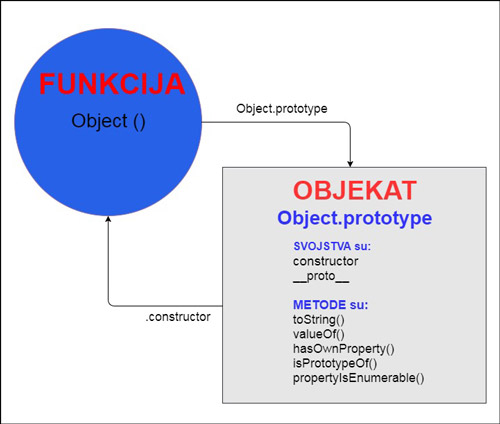

# УВИТ - Програмски језик ЈаваСкрипт

[Владимир Филиповић](https://vladofilipovic.github.io/index-cy.html){:target="_blank"}

## Напредни објекти

У овом поглављу ће бити описано напредније коришћење објеката, како се креирају, наслеђују и како се манипулише са њима.

**Пример.** Илуструје како и "празан" обекат, тј. објекат који не садржи ниједно поље нити метод, ипак није потпуно "празан":

```js
let prazanObjekat = {};

console.log(prazanObjekat.toString());
// >>> [object Object]

console.log(prazanObjekat.toString);
// >>> function toString(){…}
```

Уочава се да објекат на који реферише `prazanObjekat`, а који је направљен као празан, ипак садржи метод `toString`. &#9608;

Наиме сви ЈаваСкрипт објекти већ при свом креирању бивају снадбевени са неким методима и/или својствима. То се реализује кроз концепт прототипа.

### Прототип

Прототипско наслеђивање је врста наслеђивања где објекат наследђје својства директно од другог објекта (не од некого шаблона тј. класе).

Сваки нови објекат има свој прототипски објекат који је у први мах празан, али је повезан преко ланца наслеђивања са родитељским објектом, његовим родитељским објектом и тако све до објекта `Object.prototype`. Другим речима, ланац наслеђивања је скуп повезаних прототyпских објеката који се завршава са `Object.prototype`.

Да би неки објекат могао да проследи свом наследнику методу, потребно је да дефинише ту методу у свом прототипском објекту и тако је учини доступном осталим објектима који ће да настану на основу тог прототипа.

Када ЈаваСцрипт окружење за извршавање тражи неку методу, прво проверава да ли је она дефинисана у оквиру тог објекта, а потом да ли је дефинисана  дефинисали у оквиру свог прототипског објеката. Уколико метод није нађен ту, онда га тражи у родитељском прототипском објекту. Уколико ни тамо не нађе тај метод, тражиће даље дуж ланца медјусобно повезаних прототyпској објеката, све док не додје до последњег у ланцу `Object.prototype`. Ако га не нађе ни у овом прототипу ЈаваСцрипт окружење за извршавање избацује грешку.

#### Креирање објекта и прототипови



**Пример.** Илуструје приступ прототипу датог објекта:

```js
console.log(Object.getPrototypeOf({}) == Object.prototype);
// >>> true

console.log(Object.getPrototypeOf(Object.prototype));
// >>> null
```

Из горњег кода се уочава да не постоји прототип за прототип објекта. &#9608;

Јасно је да су низови једна "специјализована" врста објеката, па стога и низови имају прототипове. Фуницје у ЈаваСкрипту су грађани првог реда, па и за њих постоје прототипови.  

**Пример.** Илуструје прототипове за низове и функције:

```js
console.log(Object.getPrototypeOf(isNaN) ==
    Function.prototype);
// >>> true

console.log(Object.getPrototypeOf([]) ==
    Array.prototype);
// >>> true
```

&#9608;

У оквиру прототипа фигурише `this` која реферише на објекат који се креира помоћу датог прототипа.

**Пример.** Илуструје креирање објеката зечева на основу протипова:

```js
let prototipZeca = {
    tip: "непознат",

    govori: function (tekst) {
        console.log("Овај зец " + this.tip + " каже '" +
            tekst + "'");
    }
};

let zec = Object.create(prototipZeca);
zec.govori("Ко сам ја?");
// >>> Овај зец непознат каже 'Ко сам ја?'

let zecUbica = Object.create(prototipZeca);
zecUbica.tip = "убица";
zecUbica.govori("Готов си!");
// >>> Овај зец убица каже 'Готов си!

let zecDebeljuca = Object.create(prototipZeca);
zecDebeljuca.tip = "дебељуца";
zecDebeljuca.govori("Баш сам гладан!");
// >>> Овај зец дебељуца каже 'Баш сам гладан!'
```

Уочавамо да се објекат креира на основу прототипа позивом (статичког) метода `Object.create`.  Како код првог направљеног објекта није постављена особина `tip`, то ће њена вредност бити преузета из прототипа и биће `непознат`. Постављање особине на жељену вредност се потом реализовало одвојено за сваки од објеката. &#9608;

Ѕа сваки објекат у језику ЈаваСкрипт, могуће је приступити и његовом прототипу. Ако се модификује прототип неког објекта, модификација ће утицати како на тај објекат, тако и на све друге објекте који су креирани помоћу тог прототипа. Другим речима, сваки објекат (што укључује и функција као грђане првог реда) сдржи везу прма свом прототипу.

**Пример.** Илуструје креирање објеката који представљају тачке на основу протипова, као и модификовање прототипова:

```js
let prototipTacke = {
    x: 0,
    y: 0,

    prikazi: function () { console.log(`(${this.x},${this.y})`); },

    translacija: function (xV, yV) {
        this.x += xV;
        this.y += yV;
    }
};

let tackaA = Object.create(prototipTacke);
tackaA.prikazi();
tackaA.x = 7;
tackaA.prikazi();
tackaA.y = 9;
tackaA.prikazi();
tackaA.translacija(-3, -4);
tackaA.prikazi();

Object.getPrototypeOf(tackaA).centralnaSimetrija = function (xC, yC) {
    this.translacija(2 * (xC - this.x), 2 * (yC - this.y));
}

console.log("===")
let tackaB = Object.create(prototipTacke);
tackaB.prikazi();
tackaB.centralnaSimetrija(tackaA.x, tackaA.y);
tackaB.prikazi();
```

Раније смо могли уочити да, ако се модификује објекат, онда се модификација односи само на њега, не на остале објекте. Међутим, у овом примеру се јасно види да, ако се могификује прототип неког објекта, онда се та модификација односи на све објекте направљене помоћу тог прототипа.  &#9608;

#### Конструктори и прототипови

Ако се функција позове са коришћењем резервисане речи `new`, тада се тај позив креира као позив конструктора, тј. тако позвана функција представља функцију-конструктор.

Исто као и код прототипова, у оквиру конструктора фигурише променљива `this` повезана са објектом који се креира, па ће тај нови објекат бити повратна вредност конструктора - осим у сучају (што не треба радити) када ова функција експлицитно враће нешто друго.

Ако се објекат креира коришћењем `new`, тада се каже да је тај објекат примерак свог конструктора.

Да би се конструктори лако разликовали од других функција уобичајено је да називи конструктора почињу великим словом, а да називи оних функција које нису конструктори почињу малим словом.

**Пример.** Илуструје креирање објеката који представљају зечеве помоћу конструктора:

```js
function Zec(tip = "непознат") {
    this.tip = tip;

    this.govori = function (tekst) {
        console.log("Овај зец " + this.tip + " каже '" +
            tekst + "'");
    }
}

let zec = new Zec();
zec.govori("Ко сам ја?");
// >>> Овај зец непознат каже 'Ко сам ја?'

let zecUbica = new Zec("убица");
zecUbica.govori("Готов си!");
// >>> Овај зец убица каже 'Готов си!

let zecDebeljuca = new Zec("дебељуца");
zecDebeljuca.govori("Баш сам гладан!");
// >>> Овај зец дебељуца каже 'Баш сам гладан!'
```

&#9608;

Када се објекту додаје особина, она бива додата само том објекту - без обзира на то да ли је та особина присутна у прототипу објекта или не. Ако је назив додате особине исти као назив у прототипу, на тај објекат се надаље неће одностити особина из прототипа, већ ће бити "прегажена" новом доделом, а сам прототип неће бити промењен.  

Често је јако корисно да се превазиђу особине које постоје у прототиповима, чиме се добија могућност да се изразе особине које представљају изузетке у односу на општијекласе објеката, а да објекту који нису изузетни једноставно добију стандардне вредности од својих прототипова.

**Пример.** Илуструје креирање објеката помоћу конструктора и превазилажење особина на примеру објеката који представљају зечеве:

```js
function Zec(tip) {
    this.tip = tip;
}

let zecUbica = new Zec("ubica");
let crniZec = new Zec("crni");

Zec.prototype.zubi = "mali";

console.log(zecUbica.zubi);
// >>> mali

zecUbica.zubi = "dugi, ostri i krvavi";
console.log(zecUbica.zubi);
// >>> dugi, ostri i krvavi

console.log(crniZec.zubi);
// >>> mali

console.log(Zec.prototype.zubi);
// >>> mali
```

&#9608;

Конструктори (прецизније речено, све функције) аутоматски садрже и особину `prototype` која ће подразумевано садржати празан објекат изведен из `Object.prototype`. Стога, сваки примерак креиран са датим конструктором као свој прототип има баш тај овјекат.

**Пример.** Илуструје креирање објеката помоћу конструктора и коришћење особине `prototype` конструктора на примеру објеката који представљају зечеве:

```js
function Zec(tip = "непознат") {
    this.tip = tip;
}


Zec.prototype.govori = function (tekst) {
    console.log("Овај зец " + this.tip + " каже '" +
        tekst + "'");
};

let zec = new Zec();
zec.govori("Ко сам ја?");
// >>> Овај зец непознат каже 'Ко сам ја?'

let zecUbica = new Zec("убица");
zecUbica.govori("Готов си!");
// >>> Овај зец убица каже 'Готов си!

Zec.prototype.predstaviSe = function () {
    console.log("Зец: " + this.tip + ".");
}

let zecDebeljuca = new Zec("дебељуца");
zecDebeljuca.predstaviSe();
// >>> Зец: дебељуца
zecDebeljuca.govori("Баш сам гладан!");
// >>> Овај зец дебељуца каже 'Баш сам гладан!'

zec.predstaviSe = () => { console.log("------") };
zecUbica.predstaviSe();
// >>> Зец: убица
zec.predstaviSe();
// >>> ------
```

&#9608;

**Пример.** Илуструје креирање објеката помоћу конструктора и коришћење особине `prototype` конструктора на примеру објеката који представљају тачке:

```js
let Tacka = function (x = 0, y = 0) {
    this.x = x;
    this.y = y;

    this.prikazi = function () { console.log(`(${this.x},${this.y})`); };
}


let tackaA = new Tacka(7, 9);
tackaA.prikazi();

Tacka.prototype.translacija = function (xV, yV) {
    this.x += xV;
    this.y += yV;
};

let tackaB = new Tacka(1);
tackaB.prikazi();
tackaB.translacija(tackaA.x, tackaA.y);
tackaB.prikazi();

Tacka.prototype.centralnaSimetrija = function (xC, yC) {
    this.translacija(2 * (xC - this.x), 2 * (yC - this.y));
}

let tackaC = new Tacka(12, 12);
tackaC.prikazi();
tackaC.centralnaSimetrija(tackaB.x, tackaB.y);
tackaC.prikazi();
```

&#9608;

Функције и методи у ЈаваСкрипту се често дизајнирају тако да, уместо да модификују аргумент позива, производе резултат као нови објекат, а само извршавање функције не мења аргументе. Овако креиран порграмски код је читљивији и лакши за даље одржавање и надоградњу.

**Пример.** Илуструје, на примеру објеката који представљају тачке, како кроеирати функције/методе које као резултат враћу друге објекте:

```js
let Tacka = function (x = 0, y = 0) {
    this.x = x;
    this.y = y;

    this.prikazi = function () { console.log(`(${this.x},${this.y})`); };
}


let tackaA = new Tacka(7, 9);
tackaA.prikazi();

Tacka.prototype.translacija = function (xV, yV) {
    return new Tacka( this.x + xV, this.y + yV);
};

let tackaB = new Tacka(1);
tackaB.prikazi();
const tackaC = tackaB.translacija(tackaA.x, tackaA.y);
tackaC.prikazi();

Tacka.prototype.centralnaSimetrija = function (xC, yC) {
   return this.translacija(2 * (xC - this.x), 2 * (yC - this.y));
}

const tackaD = new Tacka(12, 12);
tackaD.prikazi();
const tackaE = tackaD.centralnaSimetrija(tackaC.x, tackaC.y);
tackaE.prikazi();
```

&#9608;

#### Прототипови за предефинисане типове

**Пример.** Илуструје, како се може мењати прототип предефинисаних класа и како се приликом итерирања кроз особине објекта коришћњењм `for`-`in` циклуса, излиставају и особине које су дефинисане у прототипу:

```js
let mapa = {};

const smesti = function(kljuc, vrednost) {
  mapa[kljuc] = vrednost;
}

smesti("olovka", 0.069);
smesti("sveska", -0.081);

Object.prototype.nesto = "bez veze!";

for (let kljuc in mapa)
  console.log(kljuc);
//>>> olovka
//>>> sveska
//>>> nesto

console.log("nesto" in mapa);
//>>> true

console.log("toString" in mapa);
//>>> true

delete Object.prototype.nesto;
```

Из претходног примера се јасно види, да се прототиповима може манипулисати на исти начин као што се манипулише са "нормалним" објектима, као то да сваки објекат може приступати исвим елементима који су дефинисани у оквиру његовог прототипа. &#9608;

Јасно је да постоји потреба за механизмом којим се може утврдити да ли нека особина припада објекту преко кога се реферише, или је дефинисана у одговарајућем прототипу. Стога је у оквиру типа `Object` дефинисана метода `hasOwnProperty`, која проверава да ли објекат садржи дату особину, али без консуловања прототипова.

**Пример.** Илуструје, како се приликом итерирања кроз особине објекта коришћњењм `for`-`in` циклуса, излиставају само оне особине које су дефинисане у објекту:

```js
let mapa = {};

const smesti = function (kljuc, vrednost) {
  mapa[kljuc] = vrednost;
}

Object.prototype.nesto = "bez veze!";

smesti("olovka", 0.069);
smesti("sveska", -0.081);

console.log("nesto" in mapa);
//>>> true
console.log(mapa.hasOwnProperty("nesto"));
//>>> false

console.log("toString" in mapa);
//>>> true
console.log(mapa.hasOwnProperty("toString"));
//>>> false

for (let kljuc in mapa)
  if (mapa.hasOwnProperty(kljuc))
    console.log(kljuc);
//>>> olovka
//>>> sveska

delete Object.prototype.nesto;
```

&#9608;

Као што се у претходним примерима маогло видети, предефинисана функција `Object.create` омогућује креирање објеката са датим прототипом (прослеђеним као аргуменат функције). Могуће је, приликом креирања објекта на овај начин, проследити и вредност  `null` за прототип и на тај начин креирати нови објеакт без прототипа.

**Пример.** Илуструје како се објекат који нема прототип може користити за чување парова кључ-вредност:

```js
let mapa = Object.create(null);

const smesti = function (kljuc, vrednost) {
  mapa[kljuc] = vrednost;
}

smesti("olovka", 0.069);
smesti("sveska", -0.081);

Object.prototype.nesto = "bez veze!";

console.log("nesto" in mapa);
//>>> false

console.log("toString" in mapa);
//>>> false

console.log("sveska" in mapa);
//>>> true

for (let kljuc in mapa)
  console.log(kljuc);
//>>> olovka
//>>> sveska

delete Object.prototype.nesto;
```

 У горњем коду нема више потребе да се користи метод `hasOwnProperty`, јер су све оособине особине баш тог објекта, па се може користити `for`-`in` циклус, без обзира на то шта се у међувремену радило са `Object.prototype`.  &#9608;

#### Прототипско наслеђивање

**Пример.** Илуструје прототписко наслеђивање, на примеру објеката који представљају зечеве:

```js
let zecPrototip = {
    tip: "непознат",

    boja: "непознатa",

    predstaviSe: function () {
        console.log("Зец: " + this.tip + " боја: " + this.boja + "." + "'\n");
    },

    govori: function (tekst) {
        console.log("Овај зец " + this.tip + " боје " + this.boja
            + " каже '" + tekst + "'" + "\n");
    }
};

let zec = Object.create(zecPrototip);
zec.predstaviSe();
// >>> Зец: непознат боја: непознатa.
zec.govori("Ко сам ја?");
// >>> Овај зец непознат боје непознатa каже 'Ко сам ја?'

let zecIzFikcijePrototip = Object.create(zecPrototip);

zecIzFikcijePrototip.tip = "непознат";
zecIzFikcijePrototip.boja = "непозната";

zecIzFikcijePrototip.predstaviSe = function () {
    console.log("Зец: " + this.tip + ", боја: " + this.boja + ", име: " + this.ime + "\n"
        + "креатор: " + this.kreator.ime + " " + this.kreator.prezime + "\n"
        + "дело: " + this.delo + "\n"
        + "узречица: '" + this.uzrecica + "'\n");
}

let duskoDugousko = Object.create(zecIzFikcijePrototip);
duskoDugousko.tip = "паметан";
duskoDugousko.boja = "сива";
duskoDugousko.ime = "Душко Дугоушко";
duskoDugousko.kreator = { "ime": "Tex", "prezime": "Avery" };
duskoDugousko.delo = "A Wild Hare";
duskoDugousko.uzrecica = "Шефе, који ти је враг?";
duskoDugousko.predstaviSe();
// >>> Зец: паметан, боја: сива, име: Душко Дугоушко
// >>> креатор: Tex Avery
// >>> дело: A Wild Hare
// >>> узречица: 'Шефе, који ти је враг?'
let plaviZec = Object.create(zecIzFikcijePrototip);
plaviZec.tip = "веома паметан";
plaviZec.boja = "плава";
plaviZec.ime =  "Плави ѕец";
plaviZec.kreator = { "ime": "Душко", "prezime": "Радовић" };
plaviZec.delo = "Плави зец";
plaviZec.uzrecica = "Плави, зец, чудни зец, једини на свету.";
plaviZec.predstaviSe();
// >>> Зец: веома паметан, боја: плава, име: Плави ѕец
// >>> креатор: Душко Радовић
// >>> дело: Плави зец
// >>> узречица: 'Плави, зец, чудни зец, једини на свету.'
```

&#9608;

**Пример.** Илуструје прототписко наслеђивање са конструкторима, на примеру објеката који представљају зечеве:

```js
function Zec(tip = "непознат", boja = "непознатa") {

    this.tip = tip;
    this.boja = boja;
}

Zec.prototype.predstaviSe = function () {
    console.log("Зец: " + this.tip + " боја: " + this.boja + "." + "'\n");
};

Zec.prototype.govori = function (tekst) {
    console.log("Овај зец " + this.tip + " боје " + this.boja
        + " каже '" + tekst + "'" + "\n");
};

let zec = new Zec();
zec.predstaviSe();
// >>> Зец: непознат боја: непознатa.
zec.govori("Ко сам ја?");
// >>> Овај зец непознат боје непознатa каже 'Ко сам ја?'

function ZecIzFikcije(tip, boja, ime,
    imeKreatora, prezimeKreatora, delo,
    uzrecica) {
    Zec.call(this, tip, boja);
    this.ime = ime;
    this.kreator = { "ime": imeKreatora, "prezime": prezimeKreatora };
    this.delo = delo;
    this.uzrecica = uzrecica;
}

ZecIzFikcije.prototype = Object.create(Zec.prototype);

ZecIzFikcije.prototype.predstaviSe = function () {
    console.log("Зец: " + this.tip + ", боја: " + this.boja + ", име: "
        + this.ime + "\n"
        + "креатор: " + this.kreator.ime + " " + this.kreator.prezime + "\n"
        + "дело: " + this.delo + "\n"
        + "узречица: '" + this.uzrecica + "'\n");
};

ZecIzFikcije.prototype.skoci = function () {
    console.log("Скок, скок, скок \n");
};

let duskoDugousko = new ZecIzFikcije("паметан", "сива", "Душко Дугоушко",
    "Tex", "Avery", "A Wild Hare", "Шефе, који ти је враг?");
duskoDugousko.predstaviSe();
// >>> Зец: паметан, боја: сива, име: Душко Дугоушко
// >>> креатор: Tex Avery
// >>> дело: A Wild Hare
// >>> узречица: 'Шефе, који ти је враг?'
duskoDugousko.govori(duskoDugousko.uzrecica);
// >>> Овај зец паметан боје сива каже 'Шефе, који ти је враг?''
duskoDugousko.skoci();
// >>> Скок, скок, скок

let plaviZec = new ZecIzFikcije("веома паметан", "плава", "Плави ѕец",
    "Душко", "Радовић", "Плави зец", "Плави, зец, чудни зец, једини на свету.");
plaviZec.predstaviSe();
// >>> Зец: веома паметан, боја: плава, име: Плави ѕец
// >>> креатор: Душко Радовић
// >>> дело: Плави зец
// >>> узречица: 'Плави, зец, чудни зец, једини на свету.'
plaviZec.govori(plaviZec.uzrecica);
// >>> Овај зец веома паметан боје плава каже 'Плави, зец, чудни зец, једини на свету.'
```

&#9608;

#### Прототипско наслеђивање за предефинисане типове

**Пример.** Илуструје да је прототписко наслеђивање примењено у предефинисаним типивима, чиме је потсигнуто да стандардна уграђена функција `toString` има другачије понашање када се примени на објекат, у односу на њено понашање када се примени на низ:

```js
console.log(Array.prototype.toString ==
    Object.prototype.toString);
//>>> false

console.log([1, 2].toString());
//>>> 1,2

console.log(Object.prototype.toString.call([1, 2]));
//>>> [object Array]
```

&#9608;

### Класе

У великој мери се може сматрати да класе у ЈаваСкрипту представљају само додатну синтаксну олакшицу на претходно описано наслеђивање преко прототипа. На тај начин, програмери који су навикли да раде су језицима који подржавју класно наслеђивање имају лакши прелаз, односно мањи нагиб на кривој учења - ЈаваСКрипт код је наизглед сличнији коду сам који су они радили у другим програмским језицима.  

**Пример.** Илуструје рад са класама, на примеру објеката који представљају зечеве:

```js
class Zec {

    constructor(tip = "непознат", boja = "непознатa") {

        this.tip = tip;
        this.boja = boja;
    }

    govori(tekst) {
        console.log("Овај зец " + this.tip + " боје " + this.boja
            + " каже '" + tekst + "'" + "\n");
    }

    predstaviSe() {
        console.log("Зец: " + this.tip + " боја: " + this.boja + "." + "'\n");
    }
}

let zec = new Zec();
zec.predstaviSe();
zec.govori("Ko сам ја?");

let duskoDugousko = new Zec("паметан", "сив");
duskoDugousko.predstaviSe();
duskoDugousko.govori("Који ти је враг, шефе?");
```

&#9608;

**Пример.** Илуструје наслеђивање класа, на примеру објеката који представљају зечеве:

```js
class Zec {
    constructor(tip = "непознат", boja = "непознатa") {
        this.tip = tip;
        this.boja = boja;
    }

    govori(tekst) {
        console.log("Овај зец " + this.tip + " боје " + this.boja
            + " каже '" + tekst + "'" + "\n");
    }

    predstaviSe() {
        console.log("Зец: " + this.tip + " боја: " + this.boja + "." + "'\n");
    }
}

let zec = new Zec();
zec.predstaviSe();
zec.govori("Ko сам ја?");
class ZecIzFikcije extends Zec {
    constructor(tip, boja, ime,
        imeKreatora, prezimeKreatora, delo,
        uzrecica) {
        super(tip, boja);
        this.ime = ime;
        this.kreator = { "ime": imeKreatora, "prezime": prezimeKreatora };
        this.delo = delo;
        this.uzrecica = uzrecica;
    }

    predstaviSe() {
        console.log("Зец: " + this.tip + ", боја: " + this.boja + ", име: "
            + this.ime + "\n"
            + "креатор: " + this.kreator.ime + " " + this.kreator.prezime + "\n"
            + "дело: " + this.delo + "\n"
            + "узречица: '" + this.uzrecica + "'\n");
    }

    skoci() {
        console.log("Скок, скок, скок \n");
    }
}

let duskoDugousko = new ZecIzFikcije("паметан", "сива", "Душко Дугоушко",
    "Tex", "Avery", "A Wild Hare", "Шефе, који ти је враг?");
duskoDugousko.predstaviSe();
// >>> Зец: паметан, боја: сива, име: Душко Дугоушко
// >>> креатор: Tex Avery
// >>> дело: A Wild Hare
// >>> узречица: 'Шефе, који ти је враг?'
duskoDugousko.govori(duskoDugousko.uzrecica);
// >>> Овај зец паметан боје сива каже 'Шефе, који ти је враг?'
duskoDugousko.skoci();
// >>> Скок, скок, скок

let plaviZec = new ZecIzFikcije("веома паметан", "плава", "Плави ѕец",
    "Душко", "Радовић", "Плави зец", "Плави, зец, чудни зец, једини на свету.");
plaviZec.predstaviSe();
// >>> Зец: веома паметан, боја: плава, име: Плави ѕец
// >>> креатор: Душко Радовић
// >>> дело: Плави зец
// >>> узречица: 'Плави, зец, чудни зец, једини на свету.'
plaviZec.govori(plaviZec.uzrecica);
// >>> Овај зец веома паметан боје плава каже 'Плави, зец, чудни зец, једини на свету.'
```

&#9608;

### Mетоди за постављање и читање особина

 У језику ЈаваСкрипт се могу подесити елемнети, тако да, када се на објекат реферише из спољашњости, изгледа као да се ради са "нормланим" особинама, а да истовремено буду примењени методи објект који су придружени датој особини.

**Пример.** Илуструје рад са методама за постављање и читање особина:

```js
const gomila = {
  elementi: ["ljuska jajeta", "kora pomorandze", "crv", "stara novina"],
  
  get visina() {
    return this.elementi.length;
  },
  
  set visina(vrednost) {
    console.log(`Pokusaj da visina gomile bude ${vrednost} je ignorisan.`);
  }
};

console.log(gomila.visina);
//>>> 4

gomila.visina = 100;
//>>> Pokusaj da visina gomile bude 100 je ignorisan.
```

&#9608;

### Литература

1. Haverbeke M.: [Eloquent JavaScript](https://eloquentjavascript.net/){:target="_blank"}

1. [JavaScript](https://developer.mozilla.org/en-US/docs/Web/JavaScript){:target="_blank"} - Mozzila Developer Network (MDN)

1. Живановић, Д.: [Веб програмирање - ЈаваСкрипт](https://www.webprogramiranje.org/dogadjaji-u-javascript-u/){:target="_blank"}

1. Copes F.: [Complete JavaScript Handbook](https://medium.freecodecamp.org/the-complete-javascript-handbook-f26b2c71719c){:target="_blank"}
