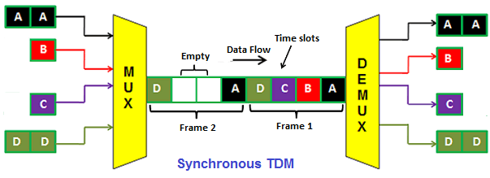
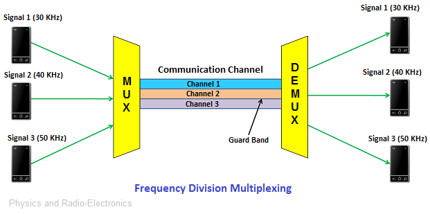
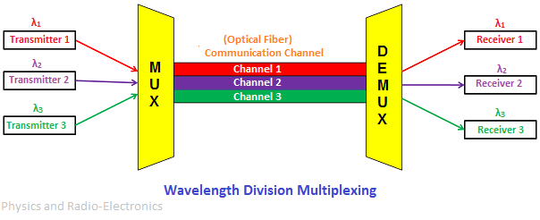
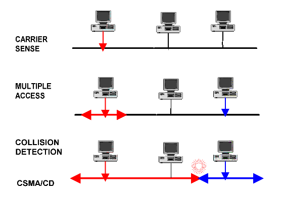
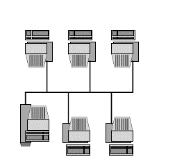
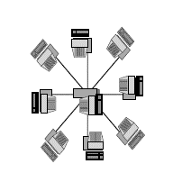
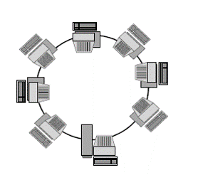
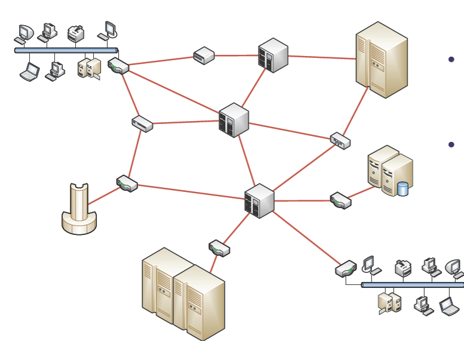
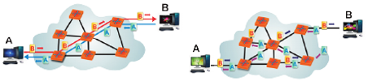

# Распон и топологија рачунарских мрежа

## Распон рачунарских мрежа

- Један од критеријума за класификовање мрежа је и њихова физичка
величина, тј. географски простор који мрежа покрива.

- Мреже покривају различите географске распоне: од мреже два
рачунара до Интернета.

- **Хијерархијско умрежавање**: мреже великог распона повезују
мање мреже

{: width="500px"  style="float:center; padding:16px"}

Различите технологије се користе за различите распоне мрежа

Према распону, мреже се класификују на следећи начин:

1. **Лична мрежа** (Personal area network - PAN) - мреже које су намењене за једног
    човека.
    - На пример, бежична мрежа којом су спојени рачунар, миш и штампач
    је PAN.
    - Овакве мреже обично покривају распон од неколико метара и користе
    било жичану било бежичну комуникацију.

2. **Локална мрежа** (Local area network - LAN) - мрежа која повезује уређаје на
    релативно малим удаљеностима, најчешће неколико канцеларија у
    оквиру једне пословне зграде.
    - Овакве мреже се традиционално везују на жичану комуникацију кроз
    мрежне каблове, иако нове технологије дају могућност коришћења
    постојећих кућних инсталација (коаксијалних каблова, телефонских линија и
    електричних линија) за комуникацију, као и могућност коришћења
    бежичне комуникације.

3. **Мрежа кампуса** (Campus area network - CAN) - ове мреже повезују више локалних
    мрежа у оквиру ограниченог географског простора (нпр. у оквиру
    једног универзитета, компаније, војне базе, итд.).
    - На пример, више мрежа засебних факултета у оквиру једне локације
    универзитета (кампуса) се повезује у јединствену целину.
    - Технологија за повезивање је обично иста као и код ЛАН
    Сада се одвојене зграде ЦАН- обично повезују бежичним путем.

4. **Мрежа метрополе** (Metropolitan area network - MAN) - ове мреже повезују веће
    географске просторе (најчешће нивоа града или јако великог
    кампуса)
    - MAN обично повезује више локалних мрежа коришћењем
    веома брзе кичме комуникације (backbone), која је најчешће
    изградена од оптичких веза.

5. **Мрежа велике области** (Wide area network - WAN) - оне повезују изразито велике географске
    просторе, често шире од граница једног града, области, а често и
    државе.
    - У данашње време, WАН мреже су обично у саставу Интернета.
    - WAN инфраструктуру обично одржавају комерцијалне компаније
    (најчешће телефонске и телекомуникационе) и оне изнајмљују услуге
    коришћења.
    - За повезивање у оквиру кичме се користе брзе везе, најчешће
    оптичке и сателитске.

## Топологија рачунарских мрежа

Топологија мреже представља начин на који су повезане меду
собом различите компоненте мреже, као и начин на који интерагују

Два нивоа топологије мреже:

1. физичка топологија - одређена распоредом каблова и бежичних
веза

2. логичка топологија - одређена током података

{: style="float:right; padding:16px"}

Ради једноставности разматрања, даље неће бити прављена разлика
измеду физичке и логичке топологије.

Различите топологије разликују се према **цени постављања** (колико се
улаже у баш тај облик повезивања), **цени комуникације** (колико је
време потребно за пренос поруке) и **поузданости** (могућности
преноса података у случају отказа неког чвора или везе).

Најопштије посматрано, постоје два кључна начина повезивања:

1. заједнички комуникациони канал (broadcast)

2. директна веза од чвора до чвора (point-to-point)

### Заједнички комуникациони канал

Ове мреже се састоје од заједничког комуникационог канала
преко којг комуницирају сви рачуари повезани у мрежу.

Рачунари шаљу кратке поруке (пакете) на мрежу постављајући их на
комуникациони канал, при чему свака порука садржи и идентификацију
жељеног примаоца.

Поруку сви примају, при чему је онај коме је намењена једини
прихвата, док је остали одбацују.

Овај начин повезивања се обично користи за комуникацију у оквиру
мањих, локалних мрежа.

Исти физички медијум се може користити за симултану комуникацију
више чворова без медусобног ометања.

[Пример мреже са заједничким комуникационим каналом](assets/images/csmа-cd.gif "Пример мреже са заједничким комуникационим каналом"){: width="500px" style="float:center; padding:16px"}

Да би се обезбедила  симултана комуникација, неопходно је дефинисати правило тј.
**протокол приступа заједничком каналу** за уређаје који су повезани на њега.

Приступ уређаја каналу се може одређивати **статички**, када сваки
уредај има унапред одређена правила како и у ком делу канала
сме да врши комуникацију или **динамички** када се приступ уређаја
каналу одређује на основу тренутног стања и доступности канала.

Неки од основних начина дељења заједничког канала, су:

- **Дељење времена** (time division multiplexing - TDM) - један од
начина статичке алокације канала је тзв. дељење комуникационог
канала коришћењем дељења времена.
  - У том случају сваки уредај комуницира у тачно одређеном
временском тренутку, при чему се уређаји наизменично смењују.

{: width="500px"  style="float:center; padding:16px"}

- **Дељење фреквенције** (frequency division multiplexing - FDM) - други
начин статичке алокације канала
  - Сваки уредај комуницира у оквиру одређеног фреквенцијског опсега.

{: width="500px"  style="float:center; padding:16px"}

- **Дељење таласне дужине** (wavelength division multiplexing - WDM)
  - Специјални назив за дељење фреквенције у случају када се радио о
оптичкој комуникацији, па се дели опсег таласних дужина.

{: width="500px" style="float:center; padding:16px"}

- **Дељење кодирањем** (code division multiple access - CDMA)
  - Ово је један од новијих начина статичког дељења канала, у оквиру ког се
користи теорија кодирања како би се из примљеног пакета информација
издвојиле информације релевантне за одређени чвор.

- **CSMA/CD** (carrier sense multiple access with collision detection) - најкоришћенија техника
динамичког дељења канала.
  - Ова техника се користи у оквиру Етернет локалних мрежа.
  - У овом случају се поштује протокол да сваки уредај посматра (тј.
ослушкује) да ли каналом већ тече нека комуникација пре него што почне
да шаље податке
  - Уколико се примети да неко други истовремено покушава да пошаље
податак, уређај прекида своје слање, чека одређено време и покушава
поново.

{: width="500px" style="float:center; padding:16px"}

Разликују се четири главна типа топологије мреже:

1. **Магистрала** – мрежа повезује своје компоненте једним истим
каблом и информација се истовремено разноси свим примаоцима.
  
  - За овај тип мреже типично је коришћење коаксијалног кабла.
  
  - Саобраћај се одвија у оба смера, па при већем оптерећењу може да
доде до „сударања“ послатих пакета или загушења канала.
  - {: height="200px" style="float:right; padding:16px"}

2. **Звезда** - у звездастој мрежи, сви учесници су повезани на једну исту
централну тачку (чвор-рачунар или други уређај) а информација путује
од пошиљаоца према примаоцу искључиво преко те централне тачке.

  - Цена успостављања мреже је ниска, такође и цена комуникације, али је
загушење у централном чвору често.

  - Зато се обично на нивоу централног чвора поставља комутатор тј. свич.

  - {: height="200px" style="float:right; padding:16px"}

3. **Прстен** - мрежа са топологијом прстена има све своје компоненте
    на истом каблу, али тај кабл нема крајеве тј. почетак је повезан са крајем.
    - Ту се информација креће само у једном, строго одређеном правцу.
    - Уколико неки од чворова мреже са топологијом прстена откаже, то неће утицати на
    функционисање остатка мреже.
    - Међутим, отказ на комуникационом каналу резултује потпуним
    прекидом мрежног саобраћаја

{: height="200px" style="float:right; padding:16px"}

4. **Потпуна повезаност** - у мрежи са топологијом потпуне повезаности
    сваки чвор поседује посебну везу са сваким од преосталих чворова.
    - Користи се само код сасвим малих мрежа и то из разлога поузданости, јер
    редунданса смањује осетљивост на падове у мрежи.
    -Варијанте топологије потпуне повезаности су топологије делимичне
    повезаности, у којима неке од од веза између чворова изостају.

### Директне чвор-чвор везе

- Код ове врсте повезивања, мреже се састоје од великог броја
директних веза измеду индивидуалних парова рачунара.

- Како би информација стигла од једног до другог чвора, обично је
потребно да проде кроз низ посредних чворова.

- Овај начин комуникације се обично користи у оквиру великих мрежа.

- Код оваквих мрежа је често је могуће да информације путују различитим
путањама, тако да је избор погодне путање обично веома
значајан за ефикасност комуникације.

{: width="500px" style="float:center; padding:16px"}

- **Комутирање** (switching) - одређживање путање пре или током саме
комуникације

{: width="500px" style="float:center; padding:16px"}

У зависности од начина одређивања путање и начина слања
информације разликују се следећи типови комуникације:

1. **Комутирање канала** (circuit switching) - пре започињања
комуникације остварује се трајна фиксирана путања (канал) између
чворова и сва информација се проследује кроз успостављену путању.

   - На овај начин функционишу мреже фиксне телефоније.

   - Канал (вод) је резервисан све док се експлицитно не раскине, те је овај
начин комуникације прилично скуп.

   - Кроз брзе директне везе измеду унутрашњих чворова обично се симултано
одвија пренос података везаних за комуникацију између различитих парова
периферних чворова - та симултана комуникације се обично постиже коришћењем
дељења фрекфенције или дељења времена.

2. **Комутирање порука** (message switching) означава да свака порука која се
шаље путује засебном путањом.

3. **Комутирање пакета** (packet switching) - поруке се пре слања деле
на засебне мање пакете, и сваки пакет путује својом засебном
путањом, да би се на одредишту пакети поново склопили у јединствену
поруку.
   - Предност овог начина слања је у томе што делови поруке (пакети)
практично паралелно путују кроз мрежу и тиме могу брже да стигну до
одредишта.
   - Комутирање је лакше и са мање проблема, ако је дужина садржаја који се
преноси мања.

### Топологија великих мрежа

Претходна подела се односи
на мале мреже. Велика мрежа се обично
састоји се од великог броја
међусобно повезаних
малих мрежа, од којих свака
има сопствену топологију.

Велика мрежа ће имати различите
компоненте са различитим
топологијама, али ће такође
имати и једну општу (генералну)
топологију која ће бити или звезда,
или магистрала, или прстен.

## Захвалница

Делови материјала ове презентације су преузети из:

- Скрипте из предмета Увод у веб и интернет технологије, на
Математичком факултету Унивезитета у Београду, аутор проф. др
Филип Марић

- Презентација из предмета Увод у веб и интернет технологије, на
Математичком факултету Унивезитета у Београду, аутор др
Весна Маринковић

- Скрипте из предмета Информатика на Универзитету Милано Бикока,
аутор др Дарио Пешини
