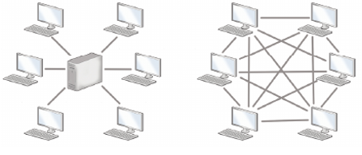
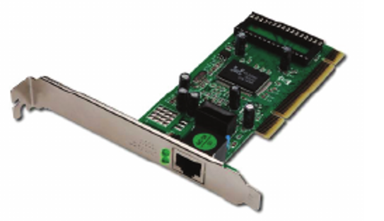
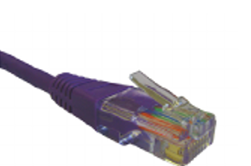
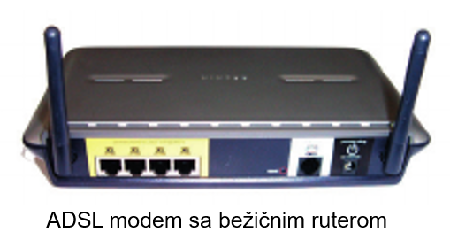
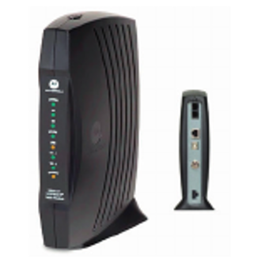
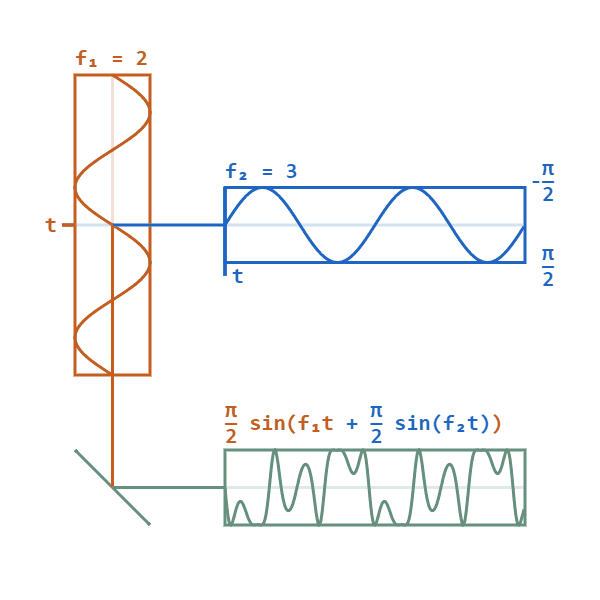

# УВИТ Увод у рачунарске мреже

## Улога и начин рада рачунарских мрежа

Коришћење рачунарских мрежа:

- У данашње време скоро незамисливо коришћење рачунара који нису повезани са другим рачунарима

- Рачунари су стављени у нове улоге, број корисника све већи

- У мреже се повезују и паметни телефони, таблети, али и телевизори, кућни уређжаји, сензори итд.

- Обједињавање телекомуникационих услуга: јединствена мрежна инфраструктура за пренос гласа, података, радио и ТВ сигнала

- Интернет ствари (internet-of-things, IoT) предвиђжа умрежавање свих свакодневних објеката који нас окружују

Улога рачунарских мрежа:

- Комуникација: електронска пошта, друштвене мреже, Скајп (Skype), Вибер (Viber),...

- Дељење информација и података: распоред часова, ред вожње итд.

- Дељење софтвера: куповина карте преко веба, одређивање руте путовања, реализација банкарске трансакције итд.

- Дељење хардверских ресурса: штампача, скенера итд.

{:text-align="center"}

Најчешћи начини извршавања послова у рачунарским мрежама су:

- Клијент-сервер окружење: коришћење веба, електронске поште

  - сервер пружа своје ресурсе (веб сервери, сервери БП, прокси сервери...)

  - клијент иницира контакт ради коришћења тих ресурса

- Мрежа равноправних рачунара (peer-to-peer, P2P): BitTorrent

{:text-align="center"}

## Компоненте рачунарских мрежа

Рачунарска мрежа је систем који се састоји од скупа **хардверских уређаја** медусобно повезаних **комуникационом опремом** и
снабедевених одговарајућим **контролним софтвером**, којим се остварује контрола функционисања система тако да је омогућен пренос
података измеду повезаних уређаја.

Дакле, компоненте мреже су:

- Мрежни хардвер

- Комуникациони канали

- Мрежни софтвер

### Мрежни хардвер

Да би уређај могао бити умрежен неопходно је да садржи специјализован део хардвера намењен умрежавању, који се
сматра делом комуникационе опреме.

Обично је то мрежна картица (мрежни адаптер или ЛАН картица – network interface controller, NIC), која се уграђује у рачунар и
омогућава уређају физички приступ мрежи.

Карактеристике:

- Излаз из мрежне картице је најчешће RS45 прикључак на који се прикључује тзв. UTP кабл.

- Скоро сви десктоп рачунари имају уграђену NIC картицу, док преносни имају уграђжену картицу за бежично повезивање (WNIC)

- Сваку мрежну картицу карактерише јединствена физичка (MAC) адреса којом се уредај јединствено идентификује приликом
комуникације

- Осим мрежних картица, за умрежавање се користе **модеми** (телефонски, кабловски), као и други слични уредаји

Модем (модулатор-демодулатор) је урежђај који конвертује дигитални сигнал у аналогни који се преноси, а затим обрнуто конвертује пренети сигнал у дигитални; користи се за кабловски или АДСЛ приступ интернету.

Модем се обично закупљује од добављача интернета и прикључује на парице фиксне телефоније, коаксијалне каблове кабловске телевизије или бежичне мреже мобилних оператера.

 )

Хаб, мост, свич и рутер – мрежни хардвер који служи за прослеђивање
комуникације између рачунара у мрежи режа и повезивању мреже
са Интернетом.

  

Један уређај може обављати више задатака: нпр. уређај за
успостављање бежичне комуникације има и улогу приступне тачке (омогућава даљу везу са Интернетом),
свича и рутера.

### Комуникациони канали

Комуникациони канали су каблови или бежични медијуми који преносе
податке електромагнетним таласима (радио-таласима, оптичким
таласима, микроталасима и сл.)

1. Основна мера квалитета комуникационог канала јесте **брзина преноса** или **проток** (throughput, bandwidth) која се мери бројем битова који се могу пренети у једној секунди (bit/s). Узимајући у обзир актуелне технологије преноса на рачунарским мрежама, чешће се користи јединица Мегабит у секунди (Mbps) или Гигабит у секунди (Gbps).

2. Друга важна мера квалитета је **кашњење** (latency) - време
потребно да се компонента припреми за приступ подацима (мери
се у микросекундама у локалним мрежама и милисекундама у
оквиру већих мреза)

- Брзина преноса је физичка карактеристика комуникационог канала и
зависи од фреквенцијског опсега који се може пропустити кроз канал
без губитка сигнала

- С обзиром да је брзина преноса података сразмерна
фреквенцијском опсегу, дијаграм који следи указује због чега оптички
каблови дају најбоље перформансе

#### Ожичене комуникације

1. Укрштене парице - најкоришћенији начин комуникације

    - Уређаји се повезују коришћењем увијених упарених изолованих бакарних
жица, слично повезивању обичних телефона

    - Жице се упарују и увијају како би се смањиле сметње у комуникацији

    - УТП каблови (unshielded twisted pair) категорије 3 користе се у фиксној телефонији, а категорије 5 или 6 у локалним мрежама; проток око 100 Mbps (брзе мреже), па и 1 Gbps (гигабитне мреже)

{:height="250px"} {:height="250px"}

1. Коаксијални каблови - обично се користе за телевизијске кабловске
системе, а користе се и у LAN мрежама, итд.

    - Каблови се састоје од централне бакарне или алуминијумске жице обмотане
савитљивим изолаторским слојем, око којега је опет обмотан проводни слој
танких жица, све обмотано спољашњом изолацијом

    - Коаксијални каблови омогућују брзину преноса до 200 Mbps (чак и до
500 Mbps), уз мању осетљивост на електромагнетне сметње

{:align="right"} 

1. Оптички каблови - праве се од великог броја (стотина, хиљада) веома
танких стаклених влакана умотаних у заштитни слој

    - Подаци се преносе светлосним таласима које емитује мали ласерски уређај

    - На овакве каблове не утичу сметње проузроковане електромагнетним
зрачењима

    -Скупи су и компликовани за инсталацију, па се углавном користе за
осовински део мреже (мрежну кичму), на који се онда коаксијалним
кабловима или укрштеним парицама повезују појединачни уређаји
лНајчешће се користе за веома брзе мреже (брзина од 10 Gbps и навише)

#### Бежичне технологије

Код њих се не користе каблови за пренос података

- То је посебно практично у случају преносивих рачунара, мобилних уређаја или релативно удаљених локација за које би успостављање кабловске мреже било недопустиво скупо

- Уместо каблова користе се радио таласи, микро таласи, инфрацрвени зраци

- Подаци се преносе модулирањем амплитуде, фреквенције или фазе таласа

{:allign="left"} {:height="200px"}{:allign="right"}

Најчешће се користе следеће бежичне технологије:

1. Bluetooth – користи се за комуникацију на веома малим раздаљинама
(до десет или до сто метара у зависности од класе уредаја)

    - Брзине преноса иду до 3 Mbps.

    - Користи радио таласе, може да проде и кроз чврсте препреке.

    - Користи се углавном за комуникацију рачунара са периферијским уредајима као и у мобилној телефонији.

1. Бежични LAN (WLAN, WiFi) - технологија која користи радио таласе за
бежичну комуникацију више уређаја на ограниченом растојању (неколико
десетина или стотина метара)

    - У зависности од стандарда, брзина преноса иде од 10 Mbps до 50 Mbps (у
новије време и до 600 Mbps).

    - Најраширенији стандард за бежичну ЛАН комуникацију је IEEE 802.

    - Мрежи се приступа преко приступних тачака (access point).

    - Област простора у којој је мрежа доступна назива се врућа тачка (hot spot)

1. Бежичне градске мреже (WiMax) покривају шира подручја и дају проток до
40 Mbps

1. Ћелијски системи - начин преноса података веома сличан оном који се
користи у мобилној телефонији. За комуникацију се користе радио таласи и системи антена које покривају
одредену географску област, при чему се сигнал од одредишта до циља
преноси преко низа антена.

1. Земаљски микроталаси - користе антенску мрежу на Земљи

    - За комуникацију користе микроталаси ниске фреквенције који захтевају да
антене буду оптички видљиве, тако да се оне обично смештају на високе
тачке (врхове брда, торњеве, небодере)

    - Антене могу да буду удаљене и до педесетак километара

1. Комуникациони сателити – користе микроталасе за комуникацију тако што се
пренос између две тачке које немају оптичку видљивост остварује
попречном комуникацијом преко комуникационих сателита

    - Сателити се обично налазе у орбити на висини од 36 хиљада километара.

    - На овај начин се, поред рачунарске комуникације, обично преносе
телевизијски и телефонски сигнал.

    - Брзина комуникације је релативно мала (нпр. 100Мпс) у поредењу са
оптичким кабловима, али ипак има неколико сценарија у којима је коришћење
сателитске комуникације погодније.

### Мрежни софтвер

- Мрежни софтвер је неопходан је за функционисање рачунарских мрежа.

  - Да би се савладала комплексност рачунарских мрежа, мрежни софтвер се организује хијерархијски, по слојевима.

  - Мрежни софтвер обухвата разне слојеве: од системског софтвера
ниског нивоа до апликативног софтвера.

  - Слојевитост олакшава програмирање мрежног софтвера - аутори
апликативног софтвера не морају да брину о детаљима мрежне
комуникације

  - Програмер треба да се концентрише само на аспекте значајне за његову
конкретну апликацију и све ниже детаље мрежне комуникације он треба да препусти нижем слоју
мрежног софтвера (који је присутнан у оквиру оперативног система, или чак
самог мрежног хардвера).

    - Тако, на пример, веб програмер не треба да мисли о томе да ли
ће веб странице примати преко бежичне мреже или преко Етхернет мреже

- Најгрубље посматрано, мрежни софтвер може да се подели на два
нивоа:

  1. Мрежни софтвер који омогућује коришћење различитих мрежних уредаја,
    нпр. мрежних картица или модема, јесте **мрежни софтвер ниског нивоа**

      - Ова врста софтвера налази се обично у језгру оперативног система,
    углавном у облику управљача периферним уредајима, тзв. драјвера (драјвер управља рачунарским хардвером и комуникационом опремом).

      - Корисник никада не користи овај софтвер директно, у општем случају он
    није ни свестан да тај софтвер постоји.

  2. Мрежни софтвер који  пружа услуге мрежним апликацијама које корисници користе је **мрежни софтвер 
    високог нивоа**

      - Овакав софтвер пружа различите услуге корисницима на мрежи, као што
    је слање и пријем електронске поште, прегледање веба и сл.

Данас оперативни системи садрже све нивое мрежног софтвера,
осим апликативног.

## Захвалница

Делови материјала ове презентације су преузети из:

- Скрипте из предмета Увод у веб и интернет технологије, на
Математичком факултету Унивезитета у Београду, аутор проф. др
Филип Марић

- Презентација из предмета Увод у веб и интернет технологије, на
Математичком факултету Унивезитета у Београду, аутор др
Весна Маринковић

- Скрипте из предмета Информатика на Универзитету Милано Бикока,
аутор др Дарио Пешини
