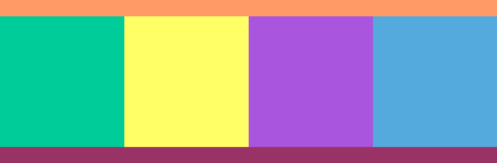
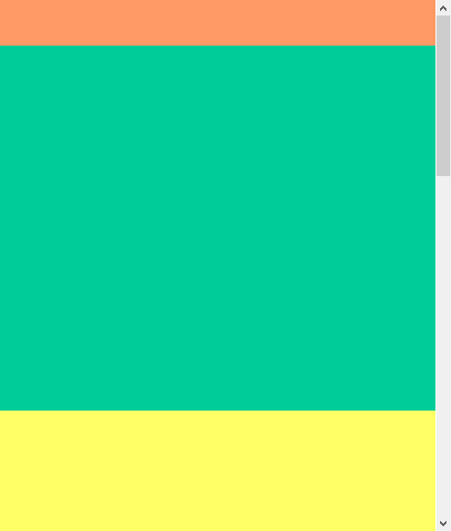
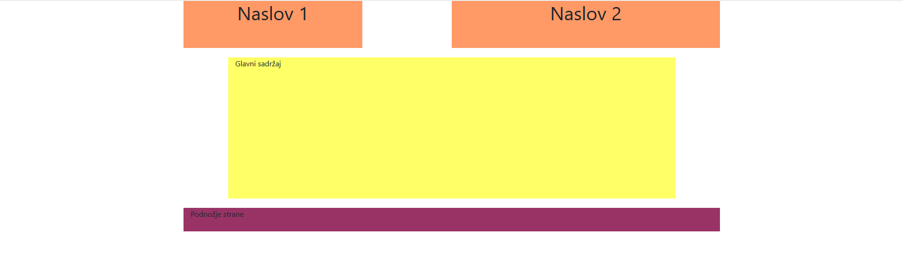
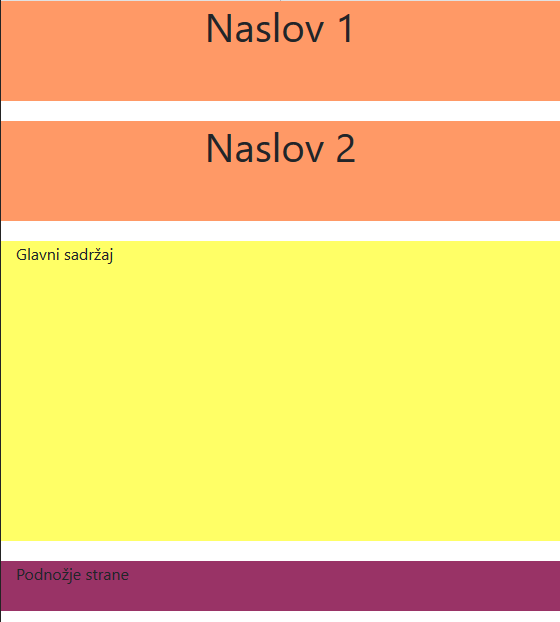
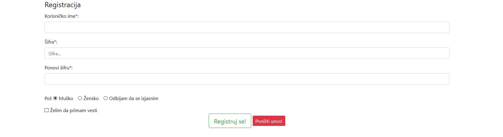

[Vežbe](../../../README.md)

[Knjiga](../../README.md)

-----

# 3. Biblioteka Bootstrap

## 3.1 Prilagodljiv dizajn veb prezentacija

Kada god pravimo prilagodljiv dizajn (engl. *responsive design*) moramo navesti informacije o prostoru u okviru kojeg pregledač prikazuje sadržaj - *pogled* (engl. *viewport*). Kroz `meta` element možemo navesti informacije o pogledu i tako kontrolisati način prikaza sadržaja. Obično podešavamo da:
- širina prikaza bude jednaka širini uređaja postavljanjem vrednosti `width` na `device-width`
	
- veličina prikaza nije skalirana (uvećana ili umanjena), što se često dešava na mobilnim telefonima i tabletima, postavljanjem vrednosti `initial-scale` na `1.0`
	
- korisnik može da skalira (uvećava ili umanjuje) prikaz do neke granice (na primer, ne manje od 0.7) postavljanjem vrednosti `user-scalable` na `yes` i vrednosti `minimum-scale` na `0.7`.


Pregledač širinu okvira u CSS pikselima računa tako što se fizička dimenzija uređaja podeli *odnosom fizičkih i CSS piksela* (engl. *device pixel ratio*, skr. DPR). Na primer, ako je fizička širina ekrana 800px, a DPR ima vrednost 2, pogled će biti širine 400px.

## 3.1.1 Prikazivanje slika

Možemo kontrolisati i prikaz slike u zavisnosti od veličine uređaja. Postavljanjem css svojstva `max-width` na 100% postižemo da se slika smanjuje ukoliko mora tako da cela bude prikazana na ekranu. Ukoliko je ekran dovoljno veliki da se cela slika prikaže na njemu, slika će biti originalne veličine.

U nastavku je dat primer koji ilustruje način upotrebe opisanih html atributa i css svojstava. Eksperimentisati sa različitim veličinama pregledača i posmatrati kako se menja prikaz stranice.

```html
<!DOCTYPE html>
<html>
    <head>
        <title> Primer 1 </title>
        <meta charset="UTF-8">
        <meta name="viewport" content="width=device-width, 
        initial-scale=1.0, user-scalable=yes, minimum-scale=0.7">
        <style type="text/css">
            #wrapper{
                color: rgb(255, 255, 255);
                background-color: #cf66ff;
             }

            header {
               text-align: center;
            }
            
            img {
                max-width: 100%;
                border: 1px solid lightblue;
            }

            h2 { 
                padding-top: 30px;
            }
            
            #content {
                margin: 30px;
            }
        </style>
    </head>
    
    <body>
        <div id="wrapper">
            <header>
                <h2> Cascading style sheets </h2>
                <br>
                 
            </header>
            <div id="content">
                <br>
                CSS sintaksa se sastoji od opisa izgleda elemenata 
                u dokumentu. 
                Opis može da definiše izgled više elemenata, i više 
                opisa može da definiše jedan element. 
                Na taj način se opisi slažu jedan preko drugog da 
                bi definisali konačni izgled određenog elementa 
                (otuda naziv Cascading (engl. cascade - crep) da bi 
                se dočaralo slaganje jednog stila preko drugog u 
                definisanju konačnog 
                izgleda elementa).
                <br>
                Svaki opis se sastoji od tri elementa:
                <ul>
                    <li> definicija ciljnih elemenata</li>
                    <li> svojstva</li>
                    <li> vrednosti</li>
                </ul>
                Nakon što definišemo ciljne elemente, tj. elemente 
                na koje će se trenutni opis odnositi, nizom parova 
                svojstvo-vrednost definišemo izgled svakog ciljnog 
                elementa. 
            </div>
        </div>
    </body>
</html>
```
Na velikim uređajima slika će biti na sredini i u prirodnoj veličini:

<div style="max-width: 98%;">

</div>

Na manjim uređajima slika se smanjuje u skladu sa veličinom ekrana uređaja tako da i dalje cela bude prikazana:
<div style="max-width: 98%;">

</div>

<a style="border: 2px solid gray; display: inline-block; padding: 15px; background-color: rgb(114, 211, 250); color: black;"
   href="./Primeri/1/index.html"
   target="_blank">Pogledaj primer uživo</a>


## 3.1.2 Pozicioniranje

Da bismo pozicioniranje elemenata stranice prilagodili veličini uređaja koristimo takozvane *medija upite* (engl. *media queries*). Za njih važi sledeća sintaksa:

```css
@media not|only tip_medija and (svojstvo_medija: vrednost) {
    /* nasa-css-pravila */
}
```

Umesto `tip_medija` možemo navesti neki od sledećih tipova: 
- `all` - odnosi se na sve tipove uređaja (podrazumevana vrednost)
- `screen` - odnosi se na ekrane računara, tableta, pametnih telefona, ...
- `print` - odnosi se na štampače
	
Kao `svojstvo_medija` možemo koristiti svojstva:
- `width` - širina pogleda
- `height` - visina pogleda
-  `max-width` - najveća širina prostora za prikaz
-  `max-height` - najveća visina prostora za prikaz
-  `min-width` - najmanja širina prostora za prikaz
-  `min-height`  - najmanja širina prostora za prikaz
-  `aspect-ratio` - odnos širine i visine pogleda
-  `orientation` - orijentacija pogleda (`landscape` ili `portrait`)
-  ...
 
U narednom primeru možemo videti kako možemo da izmenimo širinu elemenata u zavisnosti od veličine ekrana. Struktura stranice podrazumeva naslovni deo na vrhu, u sredini navigacioni deo i sadržaj, i podnožje stranice. Elemente u sredini raspoređujemo prema veličini ekrana na sledeći način:

-  Za ekrane širine najmanje 600px, ređamo elemente jedne do drugog tako da širina navigacije bude 10%, a tri kolone sa sadržajem po 30%. Da bismo to postigli biramo ključnu reč `only` i za tip medija biramo `screen`.
	
-  Za ekrane širine najviše 599px želimo da prilagodimo prikaz tako da se svi elementi lepo vide. Svakom od ovih elemenata postavićemo širinu na 100% tako da budu vidljivi na malom ekranu. 

```html
<!DOCTYPE html>
<html>
    <head>
        <title> Primer 2 </title>
        <meta charset="UTF-8">
        <meta name="viewport" content="width=device-width, 
        initial-scale=1.0">
        <style type="text/css">
            * {
                box-sizing: border-box;
            }
   
           #header{
                height: 50px;
                max-width: 100%;
                min-width: 100%;
                background-color: #ff9966;
            }
        
            #nav{
                display: inline-block;
                vertical-align: top;
                height: 400px;
                background-color: #00cc99;
            }

            #col1{
                display: inline-block;
                vertical-align: top;
                height: 400px;
                background-color: #ffff66;
            }
            
            #col2{
                display: inline-block;
                vertical-align: top;
                height: 400px;
                background-color: #aa55dd;
            }
            
            #col3{
                display: inline-block;
                vertical-align: top;
                height: 400px;
                background-color: #55aadd;
            }
            
            @media only screen and (max-width: 599px) {  
                #nav, #col1, #col2, #col3 {
                    width: 100%;
                }
            }

            @media only screen and (min-width: 600px) {  
                #nav {
                    width: 10%;
                }
                #col1, #col2, #col3 {
                    width: 30%;
                } 
            }
            
            #footer{
                height: 50px;
                background-color: #993366;
                width: 100%;
            }
        </style>
    </head>
    
    <body>
        <div id="header"> </div>
        <div id="nav"> </div><!--
        --><div id="col1"> </div><!--
        --><div id="col2"> </div><!--
        --><div id="col3"> </div>
        <div id="footer"> </div>
    </body>
</html>
```
Na velikim uređajima svi elementi staju u isti red:

<div style="max-width: 98%;">

</div>

Na manjim uređajima elementi se ređaju jedan ispod drugog:
<div style="max-width: 98%;">

</div>

<a style="border: 2px solid gray; display: inline-block; padding: 15px; background-color: rgb(114, 211, 250); color: black;"
   href="./Primeri/2/index.html"
   target="_blank">Pogledaj primer uživo</a>


Vrednosti za širinu ili visinu ne moraju isključivo biti ograničene samo odozdo ili odozgo već možemo navoditi intervale veličina za koje želimo odgovarajuća svojstva. Tako možemo istovremeno postaviti i najmanju i najveću širinu ili visinu tako što ćemo svako svojstvo koje uključimo nadovezati u zagradi nakon ključne reči `and`, kao u primeru:

```html
<!DOCTYPE html>
<html>
		<head> 
		<title> Primer 3 </title>
        
        <meta charset="utf-8">
        <meta name="viewport" content="width=device-width, 
        initial-scale=1">
        
        <link rel="stylesheet" type="text/css" media="screen and 
        (max-width: 499px)" href="small_devices.css"> 	
        
        <style type="text/css">
			div{
				width: 100px;
				height: 100px;
				border: 5px solid red; 
				box-sizing: border-box;
			}

			@media screen and (min-width: 500px) and 
            (max-width:999px){
				div{
					background-color: green; 
				}
			}

			@media screen and (min-width: 1000px){
				div{
					background-color: orange; 
				}
			}
		</style>
	</head>
	
	<body> 
		<div> </div>
	</body>

</html>
```

Gde je sadržaj datoteke small_devices.css:
```css
div{
    background-color: red; 
}
```

Na velikim uređajima element je narandžaste boje:

<div style="max-width: 98%;">

</div>

Na srednjim uređajima element je zelene boje:
<div style="max-width: 98%;">

</div>

Na manjim uređajima element je obojen u crveno zbog pravila iz small_devices.css:
<div style="max-width: 98%;">

</div>

<a style="border: 2px solid gray; display: inline-block; padding: 15px; background-color: rgb(114, 211, 250); color: black;"
   href="./Primeri/3/index.html"
   target="_blank">Pogledaj primer uživo</a>

Radi veće preglednosti, možemo izdvojiti podešavanja za različite tipove uređaja u različite `.css` datoteke u kojima ćemo pisati specifična svojstva za elemente u zavisnosti od veličine ili orijentacije i slično. To možemo postići dodavanjem vrednosti atributu `media` u okviru elementa `link`, kao u primeru iznad. Vrednost ovog atributa postavljamo u obliku `tip_medija and (svojstvo_medija: vrednost)`. 


## 3.2 Instaliranje biblioteke Bootstrap

Bootstrap je besplatno okruženje za brže i jednostavnije razvijanje veb sadržaja na klijentu. U ovoj sekciji prikazaćemo kako pomoću Bootstrap-a možemo dobiti responsive dizajn. Postoji više načina kako koristiti Bootstrap biblioteku. Moguće je:
- preuzeti biblioteku sa [ove adrese](https://getbootstrap.com/docs/4.3/getting-started/download/).
- umetnuti bootstrap sa *mreže za dostavljanje sadržaja* (engl. *Content Delivery Netvork*, skr. *CDN*), poput BootstrapCDN koji je besplatno dostupan na [ovoj adresi](https://stackpath.bootstrapcdn.com/bootstrap/4.3.1/css/bootstrap.min.css).

U oba slučaja potrebno je da uključimo odgovarajuću datoteku elementom `<link>`. Pored toga, neophodno je da definišemo metainformacije o pogledu, kao što je navedeno u prethodnoj sekciji. Više o ovome možete pročitati na [ovoj adresi](https://getbootstrap.com/docs/4.3/getting-started/introduction/).

## 3.3 Osnovne komponente za pozicioniranje elemenata

Pre svega, odredićemo jedan element koji će nam služiti kao omotač i u njega smeštamo sve ostale elemente. Ovom elementu dodajemo klasu `container` (ukoliko želimo omotač fiksirane širine) ili `container-fluid` (ukoliko želimo omotač 100% širine pogleda). 

Stranicu delimo na redove. Jedan red je element sa klasom `row`. Red se deli na najviše 12 kolona i treba voditi računa da ukupan broj kolona u jednom redu ne bude veći od 12. Ukoliko ne želimo da koristimo svih 12 kolona pojedinačno, možemo ih grupisati i time dobiti šire kolone. Ovaj sistem je prilagodiv veličini ekrana, tako da ako u jednom redu nema mesta da se smesti svih 12 kolona, one će biti preuređene jedna ispod druge.

Klase koje možemo koristiti za obeležavanje kolona su:

-  `col-*` - označava veoma male ekrane, veličine do 576px
-  `col-sm-*` - označava male ekrane, od 576px naviše
-  `col-md-*` - označava ekrane srednje veličine, od 768px naviše
-  `col-lg-*` - označava velike ekrane, od 992px naviše
-  `col-xl-*` - označava veoma velike ekrane, od 1200px naviše

Pomoću ovih klasa lako kontrolišemo prilagodivost stranice veličini ekrana. Za svaku veličinu ekrana možemo definisati koliko kolona treba da zauzima element tako što umesto zvezdica navodimo broj kolona. Još jednom da napomenemo - vodimo računa da u jednom redu, koji se označava klasom `row`, ne bude više od 12 kolona.

U narednom primeru možemo videti jedan način organizovanja stranice pomoću bootstrap okruženja:

```html
<!DOCTYPE html>
<html>
    <head>       
        <title> Primer 4 </title>
        <meta charset="UTF-8">
        <meta name="viewport" content="width=device-width, 
        initial-scale=1.0">
        <link rel="stylesheet" href="https://stackpath.bootstrapcdn.com/bootstrap/4.3.1/css/bootstrap.min.css">
        <style>
            #header{
                height: 50px;
                background-color: #ff9966;
            }
        
            #nav{
                height: 400px;
                background-color: #00cc99;
            }

            #col1{
                height: 400px;
                background-color: #ffff66;
            }
            
            #col2{
                height: 400px;
                background-color: #aa55dd;
            }
            
            #col3{
                height: 400px;
                background-color: #55aadd;
            }
            
            #footer{
                height: 50px;
                background-color: #993366;
            }
            
        </style>
    </head>
    
    <body>
        <div class="container-fluid">
            <div class="row">
               <div id="header" class="col-12 col-sm-12 col-md-12 
               col-lg-12">
               </div>
            </div>
            <div class="row">
                <div id="nav" class="col-sm-3 col-md-3 col-lg-3"> 
                </div>
                <div id="col1" class="col-sm-3 col-md-3 col-lg-3"> 
                </div>
                <div id="col2" class="col-sm-3">
                </div>
                <div id="col3" class="col-sm-3"> 
                </div>
            </div>
            <div class="row">
                <div id="footer" class="col-12">
                </div>
            </div>
        </div>
    </body>
</html>
```

Na uređajima srednje ili veće veličine elementi su poređani jedan do drugog:

<div style="max-width: 98%;">

</div>

Na manjim uređajuma elementi su pozicionirani jedan ispod drugog:

<div style="max-width: 98%;">

</div>
<a style="border: 2px solid gray; display: inline-block; padding: 15px; background-color: rgb(114, 211, 250); color: black;"
   href="./Primeri/4/index.html"
   target="_blank">Pogledaj primer uživo</a>

Takođe, napomenimo da ako neki element zauzima, na primer, 3 kolone na veličini `md`, onda će on podrazumevano zauzimati isto toliko kolona i na svakoj većoj veličini (dakle, `lg` i `xl`) ukoliko za te veličine nije određen drugačiji broj. Za manje veličine važi da podrazumevano zauzimaju 12 kolona, ukoliko nijedna nije definisana. Zbog toga se elementi sa identifikatorima `nav` i `col1` ponašaju identično elementima sa identifikatorima `col2` i `col3`. Slično važi i za elemente sa identifikatorima `header` i `footer`.

## 3.3.1 Margine

Postoje i posebne klase za kontrolu razmaka između elemenata, odnosno za kontrolu spoljašnjih margina. Ove klase ubrajaju se u kolone, a obeležavamo ih sa `offset-*-*`, gde se prva zvezdica zamenjuje veličinom uređaja, a druga brojem kolona. Kako se i ove klase ubrajaju u kolone, i njihov broj treba uključiti u ukupan broj kolona u jednom redu koji ne sme biti veći od 12. Slično kao za širinu elemenata, ako se navede veličina margine za jednu dimenziju uređaja ista dimenzija koristi se za veće koje nisu definisane, a za manje važi da su veličine 0.

```html
<!DOCTYPE html>
<html>
  <head>
    <title> Primer 5 </title>
    <meta charset="UTF-8">
    <meta name="viewport" content="width=device-width, 
    initial-scale=1">
    <link rel="stylesheet" type="text/css" href="https://stackpath.bootstrapcdn.com/bootstrap/4.3.1/css/bootstrap.min.css">
    <style type="text/css">     
      header{
      	height: 100px;
      	background-color: #ff9966;
      	margin-bottom: 20px;
      }
      
      main{
      	height: 300px;
      	background-color: #ffff66;
      	margin-bottom: 20px;
      }
            
      footer{
      	height: 50px;
      	background-color: #993366;
      }
    </style>
  </head>

  <body>
    
    <div class="container">
      <div class="row">
        <header class="col-sm-4 col-md-4 col-lg-4"> 
        	<h1 class="h1 text-center"> Naslov 1 </h1>
        </header>
        
        <header class="col-sm-6 col-md-6 col-lg-6 offset-sm-2 
        offset-md-2 offset-lg-2"> 
          <h1 class="h1 text-center"> Naslov 2 </h1>
        </header>
      </div>
      
      <div class="row" >
        <main class="col-sm-10 col-md-10 col-lg-10 offset-sm-1 
        offset-md-1 offset-lg-1" > 
          Glavni sadržaj 
        </main>
      </div>
      
      <div class="row">
        <footer class="col-sm-12">
          Podnožje strane 
        </footer>
      </div>
    </div>
  </body>
</html>
```

Na uređajima srednje ili veće veličine naslovi su razmaknuti, a glavni sadržaj je uvučen za jednu kolonu:

<div style="max-width: 98%;">

</div>

Na najmanjim uređajuma elementi su pozicionirani jedan ispod drugog:

<div style="max-width: 98%;">

</div>

Promenom veličine uređaja menja se širina kolone zbog čega su na manjim uređajima elementi bliži.

<a style="border: 2px solid gray; display: inline-block; padding: 15px; background-color: rgb(114, 211, 250); color: black;"
   href="./Primeri/5/index.html"
   target="_blank">Pogledaj primer uživo</a>


## 3.4 Stilizovanje sadržaja veb prezentacije

Bootstrap definiše nova svojstva za elemente `h1` do `h6` i sadrži klase sa istim nazivima u kojima dodatno kontroliše izgled ovih elemenata. Razlike između podrazumevanih vrednosti i Bootstrap vrednosti možete pogledati [ovde](https://www.w3schools.com/bootstrap/bootstrap_typography.asp).

Podržan je prikaz jednolinijskih i višelinijskih kodova. Više na tu temu pogledajte [ovde](https://getbootstrap.com/docs/4.3/content/code).

Slike prilagodljivog dizajna se lako mogu podesiti pomoću klasa bootstrap biblioteke. Pored prilagodljivog dizajna, definisane su još neke klase za stilizovanje okvira slika, njihovo horizontalno poravnanje, itd. Više o tome na [ovoj adresi](https://getbootstrap.com/docs/4.3/content/images/) Dodatna stilizovanja za `<figure>` možete naći [ovde](https://getbootstrap.com/docs/4.3/content/figures/). 

Bootstrap sadrži i bogatu podršku za [stilizovanje tabela](https://getbootstrap.com/docs/4.3/content/tables/). Tu su posebna podešavanja za ćelije zaglavlja, svetla i tamna tema, naizmenično obojeni redovi, kontrola okvira i prilagodljiv dizajn tabele. 

## 3.5 Stilizovanje formulara

Bootstrap definiše brojne klase za stilizovanje elemenata formulara.

### 3.5.1 Stilizovanje dugmića
Klasa `.btn` predviđena je za stilizovanje dugmića (element `<button>`), ali može da se koristi i na elementima `<a>` i `<input>`. Ova klasa povećava punjenje elementa, zaobljava ivice, centrira tekst. Uz ovu klasu često se koristi i klasa `btn-*` ili `btn-outline-*`, , gde se `*` menja nekom od *kontekstnih boja*. U prvom slučaju, kontekstna boja odnosi se na pozadinu, a u drugom na okvir i boju slova. Definisane su sledeće kontekstne boje:

- `primary` - plava
- `secondary` - tamno siva
- `success` - zelena
- `danger` - crvena
- `warning` - narandžasta
- `info` - svetlo plava
- `light` - svetlo siva
- `dark` - crna
- `link` - bela sa plavim tekstom

Pored boja, može se kontrolisati i veličina dugmeta, klasama `btn-lg` za veliko dugme, i `btn-sm`, za malo dugme. Dodatno se može podesiti širina dugmeta. Dodavanjem klase `btn-block` širina dugmeta zauzeće 100% širine roditeljskog elementa. Više o stilizovanju dugmića pomoću bootstrap biblioteke možete pogledati na [ovoj adresi](https://getbootstrap.com/docs/4.3/components/buttons/).


### 3.5.2 Stilizovanje elemenata forme

Ukoliko koristimo element `<fieldset>` ili  `<div>` za grupisanje elemenata, možemo im dodati klasu `form-group` koja povećava pojas elementa. Elementu `<filedset>` je izmenjen stil nezavisno od klase tako da nema okvir, a elementu `<legend>` je uvećana veličina fonta i prikazan je kao blokovski element.

Klasa `form-control` koristi se za elemente forme. Ona im menja prikaz u blokovski, uvećava font, zaobljava ivice. Dodatno je definisan stil za elemente sa postavljenim atributima `readonly` i `disabled`. 

Elementi za odabir vrednosti - `<input>` tipa `radio` ili `checkbox`, stilizuju se posebnim klasama. Elemenat `<input>` i odgovarajući element `<label>` smeštaju se u omotač sa klasom `form-check`. Dodatno, ako želimo da nam sve opcije budu u istoj liniji, dodajemo i klasu `form-check-inline`. Za `<input>` element koristi se `form-check-input`, a za `<label>` se koristi `form-check-label`. Ove klase utiču na punjenje i pojas elemenata. 

Više o stilizovanju formulara možete pogledati na [ovoj adresi](https://getbootstrap.com/docs/4.3/components/forms/).

Naredni primer ilustruje primenu bootstrap klasa na formular iz primera 23:

```html
<!DOCTYPE html>
<html lang="en">
<head>
    <meta charset="UTF-8">
    <meta name="viewport" content="width=device-width, 
    initial-scale=1.0">
    <link rel="stylesheet" type="text/css" href="https://stackpath.bootstrapcdn.com/bootstrap/4.3.1/css/bootstrap.min.css">
    <title> Primer 6 </title>
</head>
<body>
    <form style="width: 70%; margin: auto;">
        <fieldset class="form-group">
            <legend>Registracija</legend>

            <div class="form-group">
                <label for="username">Korisničko ime*:</label>
                <input id="username" class="form-control" type="text" 
                name="korisnicko_ime" maxlength="20" required>
            </div>
            
            <div class="form-group">
                <label for="sifra1">Šifra*:</label>
                <input id="sifra1" class="form-control" name="sifra1" 
                type="password" placeholder="Sifra..." required>
            </div>

            <div class="form-group">
                <label for="sifra2">Ponovi šifru*:</label>
                <input id="sifra2" class="form-control" name="sifra2" 
                type="password" required>
            </div>
        </fieldset> 


        <div class="form-group">
            Pol:
        
            <div class="form-check form-check-inline">
                <input type="radio" id="pol_m" 
                class="form-check-input" name="pol" value="musko" 
                checked> 
                <label for="pol_m" class="form-check-label"> 
                    Muško 
                </label>
            </div>
            <div class="form-check form-check-inline">
                <input type="radio" id="pol_z" 
                class="form-check-input" name="pol" value="zensko"> 
                <label for="pol_z" class="form-check-label"> 
                    Žensko 
                </label>
            </div>
            <div class="form-check form-check-inline">
                <input type="radio" id="pol_n" 
                class="form-check-input" name="pol" value="-"> 
                <label for="pol_n" class="form-check-label"> 
                    Odbijam da se izjasnim 
                </label>
            </div>
        </div>

        <div class="form-check form-check-inline">
            <input type="checkbox" id="vesti" 
            class="form-check-input"  name="vesti" value="vesti"> 
            <label for="vesti" class="form-check-label"> 
                Želim da primam vesti
            </label>
        </div>

        
        <div class="form-group text-center">
            <input type="submit" value="Registruj se!" class="btn 
            btn-outline-success btn-lg">
            <input type="reset" value="Poništi unos!" class="btn 
            btn-danger btn-sm">
        </div>
    </form>
</body>
</html>
```
<div style="max-width: 98%;">

</div>

<a style="border: 2px solid gray; display: inline-block; padding: 15px; background-color: rgb(114, 211, 250); color: black;"
   href="./Primeri/6/index.html"
   target="_blank">Pogledaj primer uživo</a>
   
-----

[Knjiga](../../README.md)

[Vežbe](../../../README.md)

<!--
<div style="max-width: 98%;">

</div>
-->

<!--
<a style="border: 2px solid gray; display: inline-block; padding: 15px; background-color: rgb(114, 211, 250); color: black;"
   href="./Primeri/X/index.html"
   target="_blank">Pogledaj primer uživo</a>
-->
