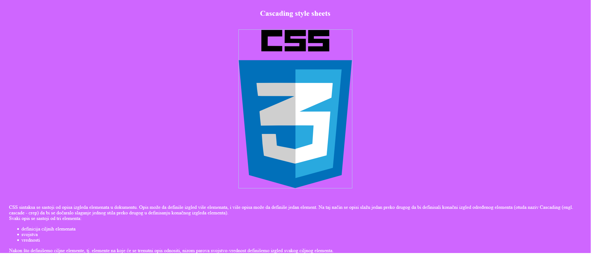
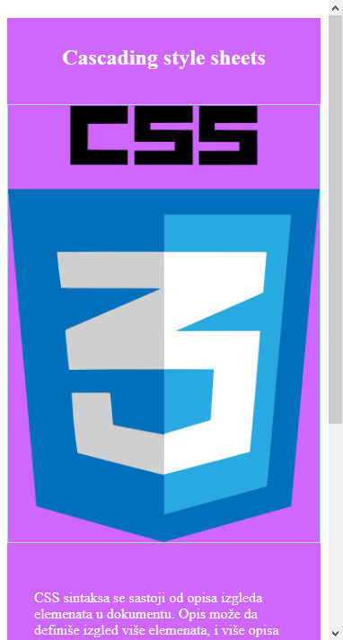
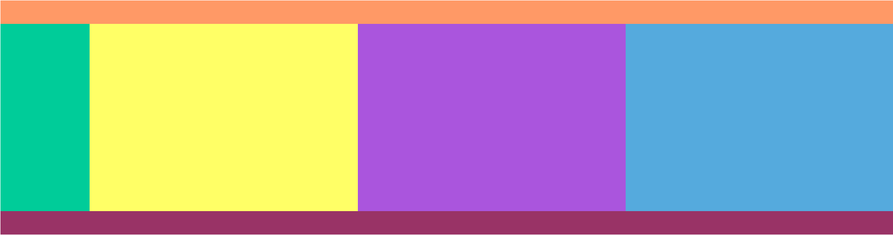
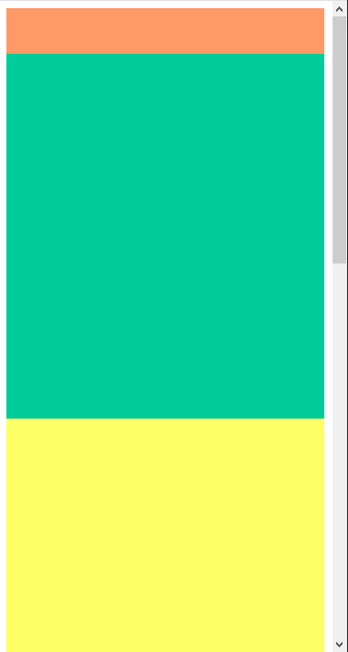
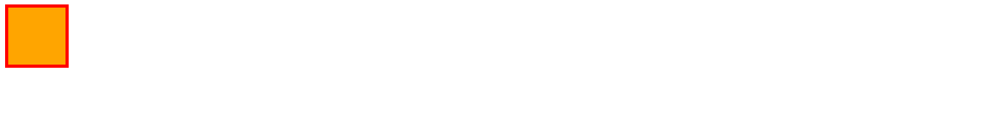
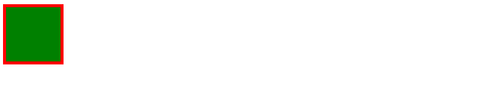
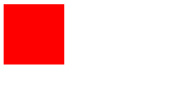

[Vežbe](../../../README.md)

[Knjiga](../../README.md)

-----

# 3. Biblioteka Bootstrap

## 3.1 Prilagodljiv dizajn veb prezentacija

Kada god pravimo prilagodljiv dizajn (engl. *responsive design*) moramo navesti informacije o prostoru u okviru kojeg pregledač prikazuje sadržaj - *pogled* (engl. *viewport*). Kroz `meta` element možemo navesti informacije o pogledu i tako kontrolisati način prikaza sadržaja. Obično podešavamo da:
- širina prikaza bude jednaka širini uređaja postavljanjem vrednosti `width` na `device-width`
	
- veličina prikaza nije skalirana (uvećana ili umanjena), što se često dešava na mobilnim telefonima i tabletima, postavljanjem vrednosti `initial-scale` na `1.0`
	
- korisnik može da skalira (uvećava ili umanjuje) prikaz do neke granice (na primer, ne manje od 0.7) postavljanjem vrednosti `user-scalable` na `yes` i vrednosti `minimum-scale` na `0.7`.


Pregledač širinu okvira u CSS pikselima računa tako što se fizička dimenzija uređaja podeli *odnosom fizičkih i CSS piksela* (engl. *device pixel ratio*, skr. DPR). Na primer, ako je fizička širina ekrana 800px, a DPR ima vrednost 2, pogled će biti širine 400px.

## 3.1.1 Prikazivanje slika

Možemo kontrolisati i prikaz slike u zavisnosti od veličine uređaja. Postavljanjem css svojstva `max-width` na 100% postižemo da se slika smanjuje ukoliko mora tako da cela bude prikazana na ekranu. Ukoliko je ekran dovoljno veliki da se cela slika prikaže na njemu, slika će biti originalne veličine.

U nastavku je dat primer koji ilustruje način upotrebe opisanih html atributa i css svojstava. Eksperimentisati sa različitim veličinama pregledača i posmatrati kako se menja prikaz stranice.

```html
<!DOCTYPE html>
<html>
    <head>
        <title> Primer 1 </title>
        <meta charset="UTF-8">
        <meta name="viewport" content="width=device-width, 
        initial-scale=1.0, user-scalable=yes, minimum-scale=0.7">
        <style type="text/css">
            #wrapper{
                color: rgb(255, 255, 255);
                background-color: #cf66ff;
             }

            header {
               text-align: center;
            }
            
            img {
                max-width: 100%;
                border: 1px solid lightblue;
            }

            h2 { 
                padding-top: 30px;
            }
            
            #content {
                margin: 30px;
            }
        </style>
    </head>
    
    <body>
        <div id="wrapper">
            <header>
                <h2> Cascading style sheets </h2>
                <br>
                 
            </header>
            <div id="content">
                <br>
                CSS sintaksa se sastoji od opisa izgleda elemenata 
                u dokumentu. 
                Opis može da definiše izgled više elemenata, i više 
                opisa može da definiše jedan element. 
                Na taj način se opisi slažu jedan preko drugog da 
                bi definisali konačni izgled određenog elementa 
                (otuda naziv Cascading (engl. cascade - crep) da bi 
                se dočaralo slaganje jednog stila preko drugog u 
                definisanju konačnog 
                izgleda elementa).
                <br>
                Svaki opis se sastoji od tri elementa:
                <ul>
                    <li> definicija ciljnih elemenata</li>
                    <li> svojstva</li>
                    <li> vrednosti</li>
                </ul>
                Nakon što definišemo ciljne elemente, tj. elemente 
                na koje će se trenutni opis odnositi, nizom parova 
                svojstvo-vrednost definišemo izgled svakog ciljnog 
                elementa. 
            </div>
        </div>
    </body>
</html>
```
Na velikim uređajima slika će biti na sredini i u prirodnoj veličini:

<div style="max-width: 98%;">

</div>

Na manjim uređajima slika se smanjuje u skladu sa veličinom ekrana uređaja tako da i dalje cela bude prikazana:
<div style="max-width: 98%;">

</div>

<a style="border: 2px solid gray; display: inline-block; padding: 15px; background-color: rgb(114, 211, 250); color: black;"
   href="./Primeri/1/index.html"
   target="_blank">Pogledaj primer uživo</a>


## 3.1.2 Pozicioniranje

Da bismo pozicioniranje elemenata stranice prilagodili veličini uređaja koristimo takozvane *medija upite* (engl. *media queries*). Za njih važi sledeća sintaksa:

```css
@media not|only tip_medija and (svojstvo_medija: vrednost) {
    /* nasa-css-pravila */
}
```

Umesto `tip_medija` možemo navesti neki od sledećih tipova: 
- `all` - odnosi se na sve tipove uređaja (podrazumevana vrednost)
- `screen` - odnosi se na ekrane računara, tableta, pametnih telefona, ...
- `print` - odnosi se na štampače
	
Kao `svojstvo_medija` možemo koristiti svojstva:
- `width` - širina pogleda
- `height` - visina pogleda
-  `max-width` - najveća širina prostora za prikaz
-  `max-height` - najveća visina prostora za prikaz
-  `min-width` - najmanja širina prostora za prikaz
-  `min-height`  - najmanja širina prostora za prikaz
-  `aspect-ratio` - odnos širine i visine pogleda
-  `orientation` - orijentacija pogleda (`landscape` ili `portrait`)
-  ...
 
U narednom primeru možemo videti kako možemo da izmenimo širinu elemenata u zavisnosti od veličine ekrana. Struktura stranice podrazumeva naslovni deo na vrhu, u sredini navigacioni deo i sadržaj, i podnožje stranice. Elemente u sredini raspoređujemo prema veličini ekrana na sledeći način:

-  Za ekrane širine najmanje 600px, ređamo elemente jedne do drugog tako da širina navigacije bude 10%, a tri kolone sa sadržajem po 30%. Da bismo to postigli biramo ključnu reč `only` i za tip medija biramo `screen`.
	
-  Za ekrane širine najviše 599px želimo da prilagodimo prikaz tako da se svi elementi lepo vide. Svakom od ovih elemenata postavićemo širinu na 100% tako da budu vidljivi na malom ekranu. 

```html
<!DOCTYPE html>
<html>
    <head>
        <title> Primer 2 </title>
        <meta charset="UTF-8">
        <meta name="viewport" content="width=device-width, 
        initial-scale=1.0">
        <style type="text/css">
            * {
                box-sizing: border-box;
            }
   
           #header{
                height: 50px;
                max-width: 100%;
                min-width: 100%;
                background-color: #ff9966;
            }
        
            #nav{
                display: inline-block;
                vertical-align: top;
                height: 400px;
                background-color: #00cc99;
            }

            #col1{
                display: inline-block;
                vertical-align: top;
                height: 400px;
                background-color: #ffff66;
            }
            
            #col2{
                display: inline-block;
                vertical-align: top;
                height: 400px;
                background-color: #aa55dd;
            }
            
            #col3{
                display: inline-block;
                vertical-align: top;
                height: 400px;
                background-color: #55aadd;
            }
            
            @media only screen and (max-width: 599px) {  
                #nav, #col1, #col2, #col3 {
                    width: 100%;
                }
            }

            @media only screen and (min-width: 600px) {  
                #nav {
                    width: 10%;
                }
                #col1, #col2, #col3 {
                    width: 30%;
                } 
            }
            
            #footer{
                height: 50px;
                background-color: #993366;
                width: 100%;
            }
        </style>
    </head>
    
    <body>
        <div id="header"> </div>
        <div id="nav"> </div><!--
        --><div id="col1"> </div><!--
        --><div id="col2"> </div><!--
        --><div id="col3"> </div>
        <div id="footer"> </div>
    </body>
</html>
```
Na velikim uređajima svi elementi staju u isti red:

<div style="max-width: 98%;">

</div>

Na manjim uređajima elementi se ređaju jedan ispod drugog:
<div style="max-width: 98%;">

</div>

<a style="border: 2px solid gray; display: inline-block; padding: 15px; background-color: rgb(114, 211, 250); color: black;"
   href="./Primeri/2/index.html"
   target="_blank">Pogledaj primer uživo</a>


Vrednosti za širinu ili visinu ne moraju isključivo biti ograničene samo odozdo ili odozgo već možemo navoditi intervale veličina za koje želimo odgovarajuća svojstva. Tako možemo istovremeno postaviti i najmanju i najveću širinu ili visinu tako što ćemo svako svojstvo koje uključimo nadovezati u zagradi nakon ključne reči `and`, kao u primeru:

```html
<!DOCTYPE html>
<html>
		<head> 
		<title> Primer 3 </title>
		<meta charset="utf-8">
		<meta name="viewport" content="width=device-width, initial-scale=1">
		<link rel="stylesheet" type="text/css" media="screen and (max-width: 499px)" href="small_devices.css"> 	
		<style type="text/css">
			div{
				width: 100px;
				height: 100px;
				border: 5px solid red; 
				box-sizing: border-box;
			}

			@media screen and (min-width: 500px) and (max-width:999px){
				div{
					background-color: green; 
				}
			}

			@media screen and (min-width: 1000px){
				div{
					background-color: orange; 
				}
			}
		</style>
	</head>
	
	<body> 
		<div> </div>
	</body>

</html>
```

Gde je sadržaj datoteke small_devices.css:
```css
div{
    background-color: red; 
}
```

Na velikim uređajima element je narandžaste boje:

<div style="max-width: 98%;">

</div>

Na srednjim uređajima element je zelene boje:
<div style="max-width: 98%;">

</div>

Na manjim uređajima element je obojen u crveno zbog pravila iz small_devices.css:
<div style="max-width: 98%;">

</div>

<a style="border: 2px solid gray; display: inline-block; padding: 15px; background-color: rgb(114, 211, 250); color: black;"
   href="./Primeri/3/index.html"
   target="_blank">Pogledaj primer uživo</a>

Radi veće preglednosti, možemo izdvojiti podešavanja za različite tipove uređaja u različite `.css` datoteke u kojima ćemo pisati specifična svojstva za elemente u zavisnosti od veličine ili orijentacije i slično. To možemo postići dodavanjem vrednosti atributu `media` u okviru elementa `link`, kao u primeru iznad. Vrednost ovog atributa postavljamo u obliku `tip_medija and (svojstvo_medija: vrednost)`. 


-----

[Knjiga](../../README.md)

[Vežbe](../../../README.md)

<!--
<div style="max-width: 98%;">

</div>
-->

<!--
<a style="border: 2px solid gray; display: inline-block; padding: 15px; background-color: rgb(114, 211, 250); color: black;"
   href="./Primeri/X/index.html"
   target="_blank">Pogledaj primer uživo</a>
-->
