[Vežbe](../README.md)

[Knjiga](../../README.md)

---

# 2. Stilizovanje Veb dokumenata kroz CSS

*Cascading Style Sheets* (skr. *CSS*) predstavlja jezik koji služi za stilizovanje HTML elemenata. Za razliku od jezika HTML, koji opisuje logičku strukturu veb dokumenta, jezikom CSS se služimo da bismo opisali na koji način se elementi te logičke strukture prikazuju. Na primer, korišćenjem jezika CSS možemo podesiti poziciju elemenata, boju teksta, okvire, pozadinu i dr.

## 2.1 Osnovni elementi jezika CSS

CSS jezik se sastoji od niza *pravila* (engl. *rule*). Svako pravilo je oblika:

```
selektor {
    svojstvo-1: vrednost-1; /∗ deklaracija 1 ∗/
    ...
    svojstvo-N: vrednost-N; /∗ deklaracija N ∗/
}
```

Objasnimo sada svaku od predstavljenih stavki:

- *Selektor* (engl. *selector*) predstavlja način za definisanje nad kojim HTML elementima će dato pravilo biti primenjeno. Postoji veliki broj selektora, a neki od njih su predstavljeni u tabeli ispod, zajedno sa primerima upotrebe.

- *Deklaracija* (engl. *declaration*) opisuje način na koji se vrši stilizovanje elemenata koji su selektovani datim selektorom. Jednom deklaracijom se definiše tačno jedna stavka u stilu, na primer, boja teksta, boja pozadine, širina elementa, udaljenost od gornje ivice roditeljskog elementa, itd. Deklaracije se međusobno razdvajaju karakterom `;` (tačka-zapeta).

- Svaka deklaracija sadrži par *svojstvo* (engl. *property*) i *vrednost* (engl. *value*) koji definišu jednu stavku stila u datom pravilu. Svaki element ima definisan skup svojstava koja je moguće primeniti nad tim elementom. Takođe, svako svojstvo ima definisan domen vrednosti koje može uzimati. Na primer, svojstvo koje određuje boju teksta može uzimati za vrednost boje u različitim formatima (`blue`, `yellow`, `rgb(125, 68, 41)`, itd.), dok širina elementa može uzimati za vrednost neku od dužina (`2em`, `300px`, `12cm`), procenat (`50%`), itd. U nastavku poglavlja ćemo se upoznati za raznim svojstvima i odgovarajućim vrednostima.

| Selektor | Primer | Objašnjenje |
| -------- | ------ | ----------- |
| Ime elementa | `p` | Primeniće stil nad svim paragrafima. |
| Identifikator | `#moj-id` | Primeniće stil nad svim elementima koji imaju postavljen generiški atribut `id` na vrednost `"moj-id"`. |
| Klasa | `.moja-klasa` | Primeniće stil nad svim elementima koji imaju postavljen generiški atribut `class` na vrednost `"moja-klasa"`. |
| Ugnežđavanje | `h1 p` | Primeniće stil nad svim paragrafima koji se nalaze kao potomci svih naslova `h1`. |
| Kompozicija | `div h1.naslov span` | Primeniće stil nad svim linijskim tekstovima koji se nalaze kao potomci svih naslova `h1` sa atributom `class="naslov"` koji se nalaze kao potomci svih elemenata `div`. |
| Grupisanje | `div, p` | Primeniće stil nad svim elementima `div` kao i na svim paragrafima. |

Komentari se u jeziku CSS navode između /∗ i ∗/. Slično kao i u jeziku HTML i većini programskih jezika, komentari služe za pojašnjenje koda ili njegovu dokumentaciju i neće biti procesirani od strane veb pregledača prilikom parsiranja CSS koda.

Možemo testirati da li naš CSS dokument predstavlja validno napisan dokument pomoću CSS validatora. Jedan primer validatora je moguće pronaći na adresi [http://jigsaw.w3.org/css-validator/](http://jigsaw.w3.org/css-validator/).

## 2.2 Načini za zadavanje pravila za stilizovanje

Postoje tri načina na koja možemo specifikovati pravila za stilizovanje:

1. Spoljni kaskadni listovi

2. Element `style`

3. Atribut `style`

### 2.2.1 Spoljni kaskadni listovi

Verovatno najkorišćeniji i najpraktičniji metod jeste izdvajanje CSS pravila u posebnu datoteku sa ekstenzijom `css`. Da bismo pravila iz ovakvih datoteka, čiji je MIME tip `text/css`, primenili na neki HTML dokument, potrebno je da se u okviru zaglavlja tog HTML dokumenta (tj. u okviru `head` elementa) navede samozatvarajući element `link` koji ima tri atributa koja treba navesti:

1. Atribut `rel` opisuje kakav je odnos datoteke koja se navodi sa tekućim HTML dokumentom u kojem se uključuje. Za spoljne kaskadne listove, odnos koji se navodi je `stylesheet`.

2. Atribut `type` opisuje MIME tip datoteke koja se navodi. Kao što smo već rekli, MIME tip za spoljne kaskadne listove je `text/css`.

3. Atribut `href` opisuje lokaciju datoteke koja se navodi. Lokacija može biti navedena kao:
   - Relativna lokacija u odnosu na lokaciju HTML dokumenta.
   - Apsolutna lokacija od korenog direktorijuma servera na kojem se nalazi HTML dokument.
   - URL.

Jedan primer navođenja elementa `link` može biti sledeći:

```html
<link rel="stylesheet" type="text/css" href="dokument.css">
```

Prednost korišćenja ovog načina je u tome što možemo istu datoteku koristiti za više dokumenata, umesto da uvišestručujemo pravila za svaku HTML datoteku. Ovim pristupom se postiže modularnost i smanjenje redundantnosti.

### 2.2.2 Element `style`

Drugi način za zadavanje stilova jeste putem HTML elementa `style`. Ovaj element se takođe navodi isključivo u sadržaju elementa `head`. Elementu `style` se dodaje atribut `type="text/css"` kako bi se specifikovalo da su pravila tipa CSS. Sama pravila se zadaju kao sadržaj ovog elementa. Navedeni stilovi se primenjuju za ceo dokument u čijem zaglavlju se element `style` nalazi, ali ta pravila nisu vidljiva drugim HTML dokumentima.

### 2.2.3 Atribut `style`

Poslednji način za zadavanje stilova jeste korišćenjem atributa `style` nad pojedinačnim elementima. Stilovi definisani na ovakav način su vidljivi i važe isključivo nad pojedinačnim elementom nad kojim su definisani. Svi ostali elementi ne potpadaju pod uticaj stilova koji su definisani u okviru atributa `style`.

### 2.2.4 Preklapanje stilova

Postojanje više načina za primenjivanje stilova brzo nas dovodi do narednog pitanja:

> Ukoliko su za isti selektor definisana dva pravila sa različitim stilovima, pri čemu se ta dva pravila specifikovana na dva različita načina, koji od ta dva pravila će biti primenjen na elemente sa tim selektorom?

Instanca ovog problema je, na primer, ako se u spoljnom kaskadnom listu definiše da je boja teksta paragrafa plava, dok se u elementu style definiše da je boja teksta paragrafa crvena. U tu svrhu, definisana su pravila kojim se određuje koje svojstvo dolazi do izražaja u slučaju *preklapanja usled primenjivanja istog pravila iz različitih izvora*.

Najveću težinu imaju stilovi definisani korišćenjem atributa `style`, zatim atributi definisani u zaglavlju HTML dokumenta (korišćenjem elementa `style` i ugnežđavanjem eksternih CSS dokumenata), i na kraju, najmanju težinu imaju podrazumevane vrednosti veb pregledača.

Naredni kod prikazuje HTML datoteku `index.html` i CSS datoteku `index.css` koja definišu pravila za tri paragrafa koja se prikazuju u HTML datoteci. Na narednoj slici dat je prikaz koda u veb pregledaču. Primetimo da je pravilo koje boji treći paragraf u plavo korišćenjem atributa `style` "pobedilo" pravila koja su definisana za isti paragraf i u elementu `style` (u kojem je navedeno da se taj paragraf boji zelenom bojom) i u spoljnim kaskadnim listovima `index.css` (u kojima je navedeno da se taj paragraf boji narandžastom bojom).

```html
<!DOCTYPE html>
<html>

<head>
    <meta charset="UTF-8">
    <title>Primer</title>
    <link rel="stylesheet" type="text/css" href="index.css">
    <style>
        p#id2,
        p#id3 {
            color: green;
            /* Postavlja boju teksta na zelenu */
        }
    </style>
</head>

<body>
    <p id="id1">
        Ovo je 1. paragraf.
    </p>
    <p id="id2">
        Ovo je 2. paragraf.
    </p>
    <p id="id3" style="color: blue; /* Postavlja boju teksta na plavu */">
        Ovo je 3. paragraf.
    </p>
</body>

</html>
```

```css
p#id1, 
p#id2, 
p#id3 {
    /* Postavlja boju teksta na narandzastu. */
    color: orange;
}
```

<table><tr><td>

</td></tr></table>

Međutim, da bi ovo pravilo bilo ispunjeno, potrebno je obratiti pažnju na redosled elemenata `style` i `link` u zaglavlju HTML dokumenta. Na primer, pretpostavimo da eksterna CSS datoteka `plavi_naslov.css` definiše da naslov `h1` treba biti obojen u plavu boju. Takođe, neka je dat element `style` u zaglavlju sa pravilom koji definiše da naslov `h1` treba biti obojen u narandžastu boju. Na narednoj slici dati su rezultati kada se element `style` navede nakon elementa `link` (slika A) i kada se element `link` navede nakon elementa `style` (slika B).

<table><tr><td>

</td></tr></table>

(A) Primer kada je prethodno definisan element `style` naveden nakon elementa `link`. Pravilo iz elementa `style` je "pobedilo".

<table><tr><td>

</td></tr></table>

(B) Primer kada je prethodno definisan element `link` naveden nakon elementa `style`. Pravilo iz elementa `link` (tj. iz spoljnih kaskadnih listova) je "pobedilo".

Da bismo razumeli kako ovo pravilo funkcioniše, moramo da precizno razumemo kako veb pregledač upravlja CSS pravilima iz različitih izvora. Prilikom navođenja CSS pravila, ta pravila se "kaskadno slažu jedna na druge". U slučaju da prvo navedemo element `style`, a zatim element `link`, prvo će biti "složena" pravila iz elementa, a zatim će "preko njih biti složena" pravila iz spoljnog kaskadnog lista. Ukoliko postoji pravilo iz spoljnog kaskadnog lista koje je isto kao ono iz elementa `style`, samo sa različitom vrednošću, onda će to drugo pravilo "pregaziti" pravilo iz elementa `style`. Slično važi u slučaju da se navodi prvo element `link`, a zatim element `style` - u ovom slučaju, pravila iz elementa `style` imaju veću prednost. Takođe, isti princip važi i za pravila koja se uvode atributom `style` u odnosu na pravila iz elementa `style` i spoljnih kaskadnih listova. Dakle, veću težinu ima ono pravilo koje je poslednje pronađeno, tj. ono koje je kaskadno poslednje složeno.

Slično pitanje se može postaviti posmatranjem nešto drugačijeg problema. Pre nego što opišemo problem, uvedimo nekoliko novih termina. Kažemo da je selektor `A` *širi* od selektora `B` ukoliko on obuhvata sve elemente koje obuhvata i selektor `B`, ali obuhvata i neke dodatne elemente uz hijerarhiju DOM stabla. U ovoj situaciji, takođe kažemo da je selektor `B` *specifičniji* od selektora `A`. Sada možemo uvesti naredni problem:

> Neka postoje dva pravila sa selektorima `A` i `B` koja definišu istu deklaraciju, ali sa različitom vrednošću. Takođe, neka je selektor `A` širi od selektora `B` (`B` je specifičniji selektor od selektora `B`). Pitanje koje se može postaviti jeste koji će od data dva stila biti primenjen nad elementima koji su selektovani selektorom `B`?

Instanca ovog problema bi bila ako se, na primer, nad celim telom dokumenta definiše da svi paragrafi budu obojeni crvenom bojom, a zatim se posebno definiše za jedan paragraf da je obojen plavom bojom. Da li će taj paragraf biti obojen crvenom ili plavom bojom?

Opisana situacija se može rešiti pravilima koja važe u slučaju *preklapanja usled primenjivanja istog pravila na različitim nivoima hijerarhije DOM stabla*. Što je selektor iz pravila specifičniji, to pravilo ima veću prednost. U prethodnom primeru, paragraf će biti obojen plavom bojom, jer je ono bilo definisano specifičnije u odnosu na pravilo koje ceo tekst boji u crvenu boju. Naredni kod prikazuje ovu situaciju, a na narednoj slici dat je prikaz koda u veb pregledaču. S obzirom da je prvo pravilo specifičnije od drugog, ono će biti primenjeno na treći element, iako se nalazi pre drugog pravila u kaskadnom slaganju.

```html
<!DOCTYPE html>
<html>

<head>
    <meta charset="UTF-8">
    <title>Primer</title>
    <style>
        /* Prvo pravilo je specificnije u DOM stablu od drugog, 
        te se zato ono primenjuje na treci paragraf,
        bez obzira na to sto drugo pravilo obuhvata isti element. */

        /* Prvo pravilo */
        p#paragraf {
            color: blue;
        }

        /* Drugo pravilo */
        body p {
            color: red;
        }
    </style>
</head>

<body>
    <p>
        Ovo je 1. paragraf.
    </p>
    <p>
        Ovo je 2. paragraf.
    </p>
    <p id="paragraf">
        Ovo je 3. paragraf.
    </p>
</body>

</html>
```

<table><tr><td>

</td></tr></table>

Ipak, postoji način da se forsira određeni stil bez obzira na ova pravila, a to je navođenjem ključne reči `!important` u okviru CSS deklaracije, pre karaktera za kraj deklaracije (`;`). Korišćenjem ove ključne reči, navedena deklaracija će uvek imati prednost nad svim ostalima. Naredni kod predstavlja izmenjeni prethodni primer, u kojem je drugom pravilu dodeljena ključna reč `!important`, čime se prethodni efekat poništava i treći paragraf ipak biva obojen crvenom bojom, kao što je vidljivo na narednoj slici.

```html
<!DOCTYPE html>
<html>

<head>
    <meta charset="UTF-8">
    <title>Primer</title>
    <style>
        /* Prvo pravilo */
        p#paragraf {
            color: blue;
        }

        /* Drugo pravilo */
        body p {
            color: red !important;
        }
    </style>
</head>

<body>
    <p>
        Ovo je 1. paragraf.
    </p>
    <p>
        Ovo je 2. paragraf.
    </p>
    <p id="paragraf">
        Ovo je 3. paragraf.
    </p>
</body>

</html>
```

<table><tr><td>

</td></tr></table>

## 2.3 Rad sa bojama

U CSS jeziku, za dodeljivanje boje elementu možemo koristiti sledeća dva svojstva:

- Svojstvo `color` zadaje boju teksta koji se nalazi u sadržaju elementa.

- Svojstvo `background-color` zadaje boju pozadine elementa.

Vrednosti za boje se mogu specifikovati na više načina, a mi navodimo sledeće:

- Pomoću imena boje, na primer, `Red`, `Orange`, `DodgerBlue`, `Violet`, `MediumSeaGreen`, itd.

- Pomoću RGB i RGBA modela. Ovim modelima je potrebno zadati vrednosti iz opsega [0, 255] za crvenu (R), zelenu (G) i plavu (B) boju čijim se "mešanjem" dobija oko 16,7 miliona boja. Varijanta RGBA dodatno omogućava da se podesi prozirnost boje (alfa kanal, A) u opsegu [0.0, 1.0]. Na primer, `rgb(125, 50, 10)` ili `rgba(255, 0, 0, 0.75)`.

- Pomoću HEX modela. Ovim modelom se za svaku od crvene, zelene i plave, redom, navodi dvocifreni heksadekadni broj iz intervala [00, FF]. Na primer, `#123456`.

Naredni kod ilustruje upotrebu različitih modela boja, a na narednoj slici prikazan je odgovarajući dokument u veb pregledaču.

```html
<!DOCTYPE html>
<html>

<head>
    <meta charset="UTF-8">
    <title>Primer</title>
    <style>
        p#p1 {
            /* Zadavanje boje preko imena */
            color: slateblue;
            /* Zadavanje boje preko HEX modela */
            background-color: #c2ceda;
        }

        p#p2 {
            /* Zadavanje boje preko RGB modela */
            color: rgb(205, 165, 90);
            /* Zadavanje boje preko RGBA modela */
            background-color: rgba(16, 124, 92, 0.3);
        }
    </style>
</head>

<body>
    <p id="p1">
        Ovo je 1. paragraf.
    </p>
    <p id="p2">
        Ovo je 2. paragraf.
    </p>
</body>

</html>
```

<table><tr><td>

</td></tr></table>

### Više informacija

Za više informacijama o temama koje su obrađene u ovoj sekciji, možete posetiti naredne korisne veb prezentacije:

- CSS imena boja: 
[https://www.w3schools.com/colors/colors_names.asp](https://www.w3schools.com/colors/colors_names.asp).

- CSS modeli boja: 
[https://www.w3schools.com/cssref/css_colors_legal.asp](https://www.w3schools.com/cssref/css_colors_legal.asp).

## 2.4 Stilizovanje teksta

Pre nego što se upoznamo sa CSS svojstvima kojima se stilizuje tekstualni sadržaj, potrebno je da razumemo koncept merenja dužine u jeziku CSS. Dužina se može meriti na različite načine u jeziku CSS i razna svojstva mogu uzimati ove mere za svoje vrednosti, kao što su širina elementa, veličina pojasa, veličina slova, itd. *Dužina* (engl. *length*) predstavlja vrednost broja praćena odgovarajućom jedinicom mere. Vrste dužina u jeziku CSS su:

- *Apsolutne dužine* su mere koje zauzimaju istu dužinu u veb pregledaču, bez obzira na veličinu ekrana, veličinu drugih elemenata itd. Neke od mera koje predstavljaju apsolutne dužine su:
   - Centimetri `cm`
   - Milimetri `mm`
   - Inči `in` (važi 1in = 96px = 2.54cm)
   - Pikseli uređaja na kojem se dokument prikazuje `px` (važi 1px = 1/96in)
   - Tačke `pt` (važi 1pt = 1/72in)

- Relativne dužine su mere koje zauzimaju dužinu relativnu u odnosu na druge mere. Relativne dužine bolje skaliraju od apsolutnih dužina između različitih uređaja na kojima se dokument prikazuje. Neke od mera koje predstavljaju relativne dužine su:
   - Jedinica `em` je relativna u odnosu na veličinu fonta elementa. Na primer, mera `2em` predstavlja dvostruko veću dužinu u odnosu na trenutnu dužinu fonta elementa nad kojim se primenjuje.
   - Procenti `%` su relativni u odnosu na veličinu roditeljskog elementa. Na primer, ako za neki element podesimo da je njegova visina jednaka `50%`, to znači da će taj element zauzimati polovinu visine roditeljskog elementa u DOM stablu.

Sada ćemo se upoznati sa nekim svojstvima kojima je moguće uticati na prikaz teksta:

- Svojstvo `font-size` podešava veličinu slova. Vrednosti ovog svojstva su dužine.

- Svojstvo `font-style` kontroliše iskošenost slova. Vrednosti su: `normal` (uspravna slova), `italic` (iskošena slova) i `oblique` (nakošena slova, slično kao `italic`, ali manje pdržano od veb pregledača).

- Svojstvo `font-weight` kontroliše podebljavanje slova. Vrednosti su: `normal` (podrazumevana debljina), `bold` (podebljano), `bolder` (više podebljano), `lighter` (tanja slova) ili brojevi u rasponu od `100` do `900` (sa korakom 100), pri čemu broj `400` odgovara vrednosti `normal`, a `700` odgovara vrednosti `bold`.

- Svojstvo `text-align` kontroliše horizontalno poravnanje teksta. Vrednosti su: `left` (levo poravnato), `right` (desno poravnato), `center` (centrirano) i `justify` (poravnato sa obe strane).

- Svojstvo `letter-spacing` podešava rastojanje između slova. Vrednosti su: `normal` (podrazumevano rastojanje) ili dužine.

- Svojstvo `word-spacing` podešava rastojanje između reči. Vrednosti su: `normal` (podrazumevano rastojanje) ili dužine.

- Svojstvo `text-indent` kontroliše nazubljivanje prve linije teksta. Vrednosti su dužine. 

- Svojstvo `text-shadow` dodaje senku tekstu elementa kome postavljamo svojstvo. Možemo mu zadati dve ili četiri vrednosti. Prva vrednost predstavlja pomeraj senke po horizontalnoj, a druga vrednost predstavlja pomeraj po vertikalnoj osi u odnosu na tekst. Treća vrednost omogućava zamućenje senke i može se izostaviti. Četvrta vrednost predstavlja boju senke i ona se takođe može izostaviti.

Naredni kod demonstrira upotrebu opisanih svojstava i dužina. Na narednoj slici je dat prikaz koda u veb pregledaču.

```html
<!DOCTYPE html>
<html>

<head>
    <meta charset="UTF-8">
    <title>Primer</title>
    <style>
        p#p2 {
            font-size: 2em;
        }

        p#p3 {
            font-style: italic;
        }

        p#p4 {
            font-weight: bold;
        }

        p#p5 {
            text-align: center;
        }

        p#p6 {
            letter-spacing: 5mm;
        }

        p#p7 {
            word-spacing: 1cm;
        }

        p#p8 {
            text-indent: 20%;
        }

        p#p9 {
            text-shadow: 10px 20px 2px salmon;
        }
    </style>
</head>

<body>
    <p id="p1">
        Ovo je velicina fonta veb pregledaca.
    </p>
    <hr>
    <p id="p2">
        Ovo je duplo veca velicina fonta veb pregledaca 
        (font-size: 2em).
    </p>
    <hr>
    <p id="p3">
        Ova slova su iskosena (font-style: italic).
    </p>
    <hr>
    <p id="p4">
        Ova slova su podebljana (font-weight: bold).
    </p>
    <hr>
    <p id="p5">
        Ovaj tekst je poravnat po sredini (text-align: center).
    </p>
    <hr>
    <p id="p6">
        Ovaj tekst ima veci razmak izmedju slova (letter-spacing: 5mm).
    </p>
    <hr>
    <p id="p7">
        Ovaj tekst ima veci razmak izmedju reci (word-spacing: 1cm).
    </p>
    <hr>
    <p id="p8">
        Ovaj tekst ima uvucenu prvu liniju, ali ostatak teksta ce biti
        normalno uvucen kada bude doslo do preloma u narednu liniju.
        Efekat moze izgledati kao novi paragraf u knjigama.
        (text-indent: 20%).
    </p>
    <hr>
    <p id="p9">
        Ovaj tekst ima postavljenu senku koja je malo zamucena 
        (text-shadow: 10px 20px 2px salmon).
    </p>
</body>

</html>
```

<table><tr><td>

</td></tr></table>

### 2.4.1 Rad sa fontovima

Pored stilizovanja izgleda teksta raznim svojstvima koje smo prethodno demonstrirali, moguće je postavljanje familije fonta teksta. *Familija fontova* (engl. *font family*) definiše generalni izgled svakog karaktera. Ugrubo, sve familije fontova se mogu podeliti u narednih pet grupa:

- *Kukičave familije fontova* (engl. *serif*) karakteriše postojanje *kukica* (engl. *serif*) koji na neki način ukrašavaju ivice karaktera. Primeri kukičavih familija fontova su: Times New Roman, Georgia, itd.

- *Beskukičave familije fontova* (engl. *sans-serif*) karakteriše odsustvo kukica, odnosno, karakteri u ovim fontovima imaju čist izgled. Na računarskim ekranima se preporučuje korišćenje bezkukičavih familija fontova za lakše čitanje. Primeri beskukičavih familija fontova su: Arial, Helvetica, itd.

- *Familije fontova karaktera jednakih širina* (engl. *monospace*) karakterišu, kao što im i samo ime kaže, karakteri koji svi zauzimaju jednaku širinu. Obično se ove familije fontova smatraju najboljim za prikazivanje izvornog koda programa. Primeri beskukičavih familija fontova su: Courier New, Lucida Console, itd.

- *Pisane familije fontova* (engl. *cursive*) karakterišu karakteri koji deluju kao da su pisani rukom. Primeri pisanih familija fontova su: Comic Sans, Snell Roundhand, itd.

- *Dekorativne familije fontova* (engl. *fantasy*) karakterišu nestandardni karakteri koji se obično koriste za naslove ili za posebno isticanje nekih karaktera. Primeri dekorativnih familija fontova su: Impact, Luminary, itd.

S obzirom da su prve dve grupe familija fontova najviše korišćene, na narednoj slici dat je prikaz razlike između jedne beskukičave i jedne kukičave familije fontova.

<table><tr><td>

</td></tr></table>

#### Korišćenje postojećih fontova

Ukoliko želimo da specifikujemo familiju fontova za neki tekstualni sadržaj, na raspolaganju nam je CSS svojstvo `font-family`. Familija fonta se može zadati po imenu, na primer, `Arial` ili `'DejaVu Serif'`. Ukoliko naziv familije fontova ima znak razmaka, oko naziva je potrebno staviti navodnike. Alternativno, možemo zadati naziv generičke familije fontova, na primer, `serif` ili `sans-serif`, čime se prepušta veb pregledaču da odabere konkretnu familiju fontova iz te grupe koja mu je dostupna.

Takođe, moguće je staviti više fontova odvojenih karakterom `,` da bi veb pregledač, u slučaju da mu nije dostupan neki font, prikazao odgovarajuću zamenu. Štaviše, preporučuje se zadavanje više familija fontova na ovaj način. Tipično se prvo navode željeni fontovi, a na kraju se zadaje generička familija fontova.

Naredni kod ilustruje upotrebu različitih familija fontova i njegov prikaz u veb pregledaču je dat na narednoj slici.

```html
<!DOCTYPE html>
<html>

<head>
    <meta charset="UTF-8">
    <title>Primer</title>
    <style>
        p#p1 {
            font-size: 1.5em;

            /* Nije preporuceno */
            font-family: 'Gill Sans';
        }

        p#p2 {
            /* Preporuceno */
            font-family: 'Gill Sans', Helvetica, sans-serif;
        }
    </style>
</head>

<body>
    <p id="p1">
        Ovaj tekst bi trebalo da bude prikazan u 
        beskukicavoj familiji fontova Gill Sans.
    </p>
    <hr>
    <p id="p2">
        Ovaj tekst bi trebalo da bude prikazan u 
        beskukicavoj familiji fontova Gill Sans.
        <br><br>
        Ako ona nije dostupna veb pregledacu, <br>
        onda ce biti koriscena beskukicava familija Helvetica.
        Ako ni ona nije dostupna veb pregledacu, <br>
        onda ce on odabrati neku od beskukicavih familija fontova <br>
        koje su mu na raspolaganju.
    </p>
</body>

</html>
```

<table><tr><td>

</td></tr></table>

#### Dodavanje korisničkih fontova

Nekada želimo da tekst bude prikazan u familiji fontova koja nije dostupna veb pregledaču. Jedan način jeste da instaliramo željenu familiju fontova na operativnim sistemima svih uređaja na kojima će dokument biti prikazan. Očigledno, ovaj proces je zamoran i gotovo uvek nemoguć.

Umesto toga, dovoljno je unapred pripremiti datoteku koja sadrži informacije o željenom fontu (koji se često naziva *korisnički font* (engl. *user font*)), kao što su datoteke sa ekstenzijom `otf` (OpenType Font) ili `ttf` (TrueType Font). Zatim je potrebno među CSS pravilima upotrebiti naredbu `@font-face` kojom se definiše nova familija fontova koja će biti dostupna veb pregledaču. Sintaksa ove naredbe je:

```
@font-face {
    font-family: 'Naziv fonta';
    src: url('./lokacija/do/mog/fonta/Naziv Fonta.ttf');
}
```

Objasnimo kako funkcioniše ova naredba. Svojstvom `font-family` dodeljujemo naziv korisničkom fontu. Svojstvom `src` zadajemo putanju ka datoteci koja sadrži informacije o fontu. Ona se može nalaziti u lokalnom računaru ili na nekoj veb lokaciji, ali se u oba slučaja navodi korišćenjem vrednosti CSS funkcije `url` čiji je argument niska koja sadrži putanju do datoteke.

Nakon navođenja ovog pravila, novouvedenu familiju fontova možemo koristiti kao i svaku drugu, navođenjem njenog dodeljenog imena kao vrednost svojstva `font-family`. Naredni kod ilustruje upotrebu ovog pravila, a rezultat prikaza koda u veb pregledaču je dat na narednoj slici.

```html
<!DOCTYPE html>
<html>

<head>
    <meta charset="UTF-8">
    <title>Primer</title>
    <style>
        @font-face {
            font-family: 'Ants Valley';
            /* Pretpostavka je da je ova datoteka dostupna */
            src: url('Ants Valley.otf');
        }

        div {
            font-family: 'Ants Valley', fantasy;
            font-size: 3em;
        }
    </style>
</head>

<body>
    <div>
        Korisnicka familija fontova
    </div>
</body>

</html>
```

<table><tr><td>

</td></tr></table>

### Više informacija

Za više informacijama o temama koje su obrađene u ovoj sekciji, možete posetiti naredne korisne veb prezentacije:

- CSS dužine: 
[https://www.w3schools.com/cssref/css_units.asp](https://www.w3schools.com/cssref/css_units.asp).

- CSS svojstva za stilizovanje teksta: 
[https://www.w3schools.com/css/css_text.asp](https://www.w3schools.com/css/css_text.asp).

- CSS svojstvo za postavljanje familije fontova: 
[https://www.w3schools.com/css/css_font.asp](https://www.w3schools.com/css/css_font.asp).

- CSS svojstvo za uvođenje korisničkih fontova: 
[https://www.w3schools.com/cssref/css3_pr_font-face_rule.asp](https://www.w3schools.com/cssref/css3_pr_font-face_rule.asp).

- Familije fontova: 
[https://www.w3.org/Style/Examples/007/fonts.en.html](https://www.w3.org/Style/Examples/007/fonts.en.html).

## 2.5 Model kutije

U prethodnom poglavlju smo diskutovali o tome kako je HTML elemente moguće razmatrati kao pravougaonike koji se slažu jedni ispod drugih, odnosno, jedni do drugih, u zavisnosti od različitih faktora, kao što je, na primer, činjenica da je neki element blokovski ili linijski. Ovaj koncept ćemo sada detaljnije analizirati kroz pojam modela kutije.

*Model kutije* (engl. *box model*) podrazumeva da se svaki HTML element prostire odgovarajućom dvodimenzionalnom površinom na veb prezentaciji. Veličina ove površine zavisi od četiri veličine, koje ujedno čine i model kutije:

- *Sadržaj* (engl. *content*) predstavlja površinu u kojoj se prikazuje tekst, slika ili drugi sadržaj HTML elementa.

- *Punjenje* (engl. *padding*) predstavlja površinu oko sadržaja, ali koji se još uvek smatra "unutrašnošću" elementa. Punjenje je podrazumevano prozirno.

- *Ivica* (engl. *border*) predstavlja površinu koja deli unutrašnjost elementa od spoljašnjosti, odnosno, od drugih elemenata. Ivica podrazumevano nije postavljena.

- *Pojas* (engl. *margin*) predstavlja površinu oko ivice elementa, koji pre svega služi da stvori bezbedni pojas oko elementa i odvoji ga od okolnih elemenata (otuda i njegov prevod). Pojas je uvek proziran.

Kao što je prikazano na narednoj slici, svaki od kasnije navedenih površina obuhvata sve prethodne površine. Sada ćemo se upoznati detaljnije sa svakom od navedenih koncepata i videti na koje načine možemo upravljati njima.

<table><tr><td>
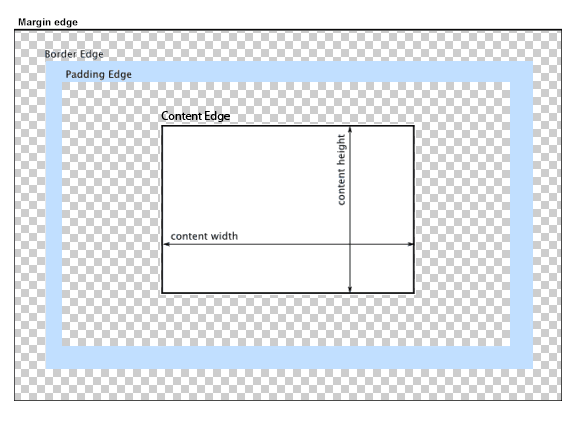
</td></tr></table>

### 2.5.1 Sadržaj elementa

Veličina površine koja predstavlja sadržaj elementa zavisi od dve stvari:

1. Da li je u pitanju blokovski ili linijski element?
2. Koje su vrednosti CSS svojstava `width` i `height`?

Blokovski elementi se podrazumevano prostiru celom širinom roditeljskog elementa u čijem se sadržaju nalaze, dok njihovu visinu izračunava veb pregledač na osnovu sadržaja u tim elementima. Ovaj, pdorazumevani efekat, potiče od činjenice da su svakom elementu podrazumevano postavljena svojstva `width` i `height` na vrednost `auto`. Međutim, za blokovske elemente, moguće je podešavati ova svojstva tako da veličina sadržaja bude drugačija. Vrednosti koje ova dva svojstva uzimaju su dužine.

Naredni kod ilustruje upotrebu ovih svojstava u promeni veličine sadržaja za blokovski element `div`. Naredna slika ilustruje prikaz ovog koda u veb pregledaču.

```html
<!DOCTYPE html>
<html>
<head>
    <title>Primer</title>
    <meta charset="UTF-8">
    
    <style type="text/css">
        div {
            height: 200px;
            width: 50%;
            background-color: powderblue;
        }
    </style>
</head>
<body>
    <div>
        Ovaj div element ima visinu od 200px i sirinu od 50%.
    </div>
</body>
</html>
```

<table><tr><td>
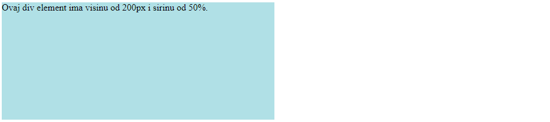
</td></tr></table>

Kada su linijski elementi u pitanju, površina njihovog sadržaja zavisi isključivo od površine samog sadržaja koji se prikazuje u okviru njih. Na linijske elemente nije moguće uticati svojstvima `width` i `height`. Naredni kod ilustruje ovo ponašanje, a na narednoj slici je dat njegov prikaz u veb pregledaču.

```html
<!DOCTYPE html>
<html>
<head>
    <title>Primer</title>
    <meta charset="UTF-8">
    
    <style type="text/css">
        #s1 {
            /* Svojstva height i width nemaju nikakvog efekta */
            height: 100px;
            width: 1000px;
            background-color: rgb(193, 22, 193);
        }
    </style>
</head>
<body>
    <span id="s1">TEST SADRZAJ</span>
    <span id="s2">TEST SADRZAJ</span>
</body>
</html>
```

<table><tr><td>
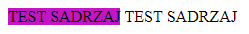
</td></tr></table>

### 2.5.2 Punjenje elementa

Punjenje elementa možemo zadati u jeziku CSS pomoću svojstva `padding` koje istovremeno podešava gornje, desno, donje i levo punjenje, tim redosledom. Međutim, ukoliko želimo da specifikujemo zasebnu veličinu punjenja na nekoj strani, možemo iskoristiti neko od svojstava `padding-top`, `padding-right`, `padding-bottom` ili `padding-left`. Vrednosti za sva opisana svojstva su dužine. Podrazumevana vrednost je `0`.

Naredni HTML kod i prateća slika ilustruju postavljanje punjenja za svaku stranu ponaosob. Primetimo da elementu `div` nije promenjena veličina sadržaja, tj. sadržaj će zauzimati onoliko mesta koliko mu je potrebno. Međutim, zbog postojanja punjenja, sadržaj neće zauzimati celu širinu veb pregledača. Takođe, ono što je interesantno primetiti jeste da će svojstvo `background-color` takođe obojiti površinu punjenja zajedno sa površinom sadržaja.

```html
<!DOCTYPE html>
<html>
<head>
    <title>Primer</title>
    <meta charset="UTF-8">
    
    <style type="text/css">
        div {
            background-color: lightblue;
            padding-top: 50px;
            padding-right: 30px;
            padding-bottom: 100px;
            padding-left: 280px;
        }
    </style>
</head>
<body>
    <div>
        Ovaj div element ima gornje punjenje od 50px, desno punjenje od 30px, donje punjenje od 100px i levo punjenje od 280px.
    </div>
</body>
</html>
```

<table><tr><td>
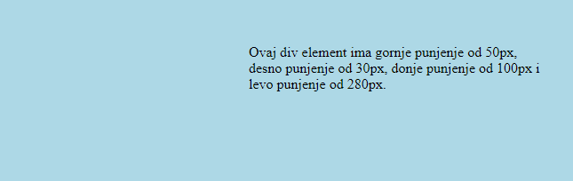
</td></tr></table>

Punjenje proizvodi isti efekat i za linijske i za blokovske elemente.

### 2.5.3 Ivica elementa

U CSS jeziku, svojstvom `border` je moguće postaviti stil, širinu i boju površine koja odvaja unutrašnjost elementa od njegovog pojasa (odnosno, od okoline ukoliko pojas ne postoji). Ova površina, kao što smo rekli, naziva se ivica elementa. 

Međutim, pre nego što razumemo kako ovo svojstvo funkcioniše, prvo ćemo se upoznati sa svojstvima koja služe da postavljaju navedena tri elementa ivice odvojeno.

#### Stil ivice

Stilom ivice upravljamo koristeći svojstvo `border-style`. Moguće vrednosti za ovo svojstvo su: `dotted` (tačkasti stil), `dashed` (isprekidani stil), `solid` (stil pune linije), `double` (stil duple pune linije), `groove` (duplo tisnuti stil), `ridge` (reljefni stil), `inset` (utisnuti stil), `outset` (otisnuti stil), `none` (bez ivice) ili `hidden` (ivica je sakrivena). Naredna slika ilustruje svaki od ovih stilova.

Takođe, ukoliko želimo da definišemo različite stilove za svaku ivicu ponaosob, umesto navođenja jedne vrednosti (čime podešavamo isti stil za sve četiri ivice), možemo navesti četiri vrednosti koje će postaviti stilove za gornju, desnu, donju i levu ivicu, tim redosledom.

Naredni HTML kod i prateća slika ilustruju podešavanje stila ivica. Podešena je i širina ivice na `10px` kako bi stilovi bili bolje prikazani.

```html
<!DOCTYPE html>
<html>

<head>
    <title>Primer</title>
    <meta charset="UTF-8">

    <style type="text/css">
        p {
            border-width: 10px;
        }

        p.dotted {
            border-style: dotted;
        }

        p.dashed {
            border-style: dashed;
        }

        p.solid {
            border-style: solid;
        }

        p.double {
            border-style: double;
        }

        p.groove {
            border-style: groove;
        }

        p.ridge {
            border-style: ridge;
        }

        p.inset {
            border-style: inset;
        }

        p.outset {
            border-style: outset;
        }

        p.none {
            border-style: none;
        }

        p.hidden {
            border-style: hidden;
        }

        p.mix {
            border-style: dotted dashed solid double;
        }
    </style>
</head>

<body>
    <p class="dotted">A dotted border.</p>
    <p class="dashed">A dashed border.</p>
    <p class="solid">A solid border.</p>
    <p class="double">A double border.</p>
    <p class="groove">A groove border.</p>
    <p class="ridge">A ridge border.</p>
    <p class="inset">An inset border.</p>
    <p class="outset">An outset border.</p>
    <p class="none">No border.</p>
    <p class="hidden">A hidden border.</p>

    <p class="mix">A mixed border.</p>
</body>

</html>
```

<table><tr><td>
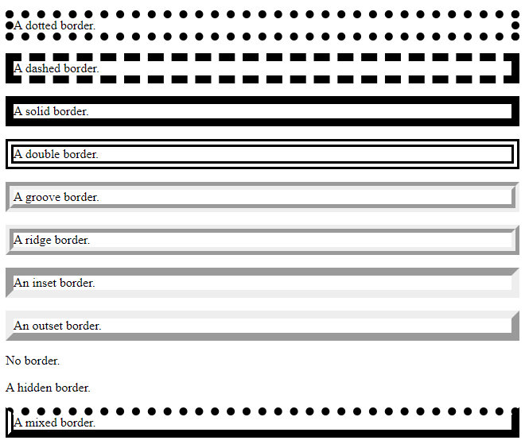
</td></tr></table>

Ono što je veoma važno napomenuti jeste da nijedna od preostalih svojstava koja se tiču ivice - širina i boja - neće proizvesti efekat ukoliko svojstvo za stil nije takođe postavljeno.

#### Širina ivice 

Širinu ivice definišemo pomoću svojstva `border-width`. Moguće vrednosti za ovo svojstvo su: dužine, `thin` (tanka ivica), `medium` (ivica srenje širine) ili `thick` (deblja ivica). Poput svojstva za stil ivice, i ovo svojstvo može imati jednu ili četiri vrednosti. Semantika ovih varijanti je identična kao za prethodno svojstvo. Podrazumevana vrednost za širinu ivice je `1px`.

#### Boja ivice 

Boju ivice definišemo pomoću svojstva `border-color`. Moguće vrednosti za ovo svojstvo su: boja zadata u nekom modelu boja ili `transparent` (providna ivica). Kao i prethodna dva svojstva, i ovo svojstvo može imati jednu ili četiri vrednosti, uz identičnu semantiku. Podrazumevana vrednost za boju ivice je `black`.

#### Navođenje konkretne ivice 

Svako od prethodna tri svojstva ima i varijantu kojom se navodi na kojoj strani ivice to svojstvo treba da se primeni. Tako, na primer, pored svojstva `border-style`, postoje i svojstva `border-top-style`, `border-right-style`, `border-down-style` i `border-left-style`. Čitaocu bi trebalo da bude jasan način upotrebe ovih svojstava na osnovu njihovih naziva. Analogno važi i za svojstva `border-width` i `border-color`.

#### Svojstvo `border`

Dakle, ukoliko želimo za ivicu da detaljno specifikujemo izgled, moramo da navedemo tri deklaracije, po jednu za stil (`border-style`), širinu (`border-width`) i boju (`border-color`). Ipak, navedene tri deklaracije se mogu skratiti u jednu tako što se koristi svojstvo `border`. Vrednost ovog svojstva čine tri vrednosti, odvojene karakterom razmaka: 

1. Vrednost za stil ivice (ovo je obavezno navesti)
2. Vrednost za širinu ivice 
3. Vrednost za boju ivice

Ukoliko se ne navede neka od (2) ili (3), koristiće se njihove podrazumevane vrednosti. Takođe, moguće je podesiti stil za samo jednu stranu ivice korišćenjem odgovarajućeg svojstva `border-top`, `border-right`, `border-bottom`, `border-left`, koji uzimaju iste vrednosti kao i svojstvo `border`.

Naredni HTML kod i prateća slika ilustruju podešavanje ivica svojstvom `border`.

```html
<!DOCTYPE html>
<html>

<head>
    <title>Primer</title>
    <meta charset="UTF-8">

    <style type="text/css">
        p.full-border {
            border: 5px solid red;
        }

        p.left-border-only {
            border-left: solid 20px;
        }
    </style>
</head>

<body>
    <p class="full-border">Some text.</p>
    <p class="left-border-only">Some text.</p>
</body>

</html>
```

<table><tr><td>
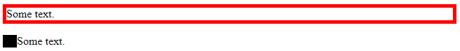
</td></tr></table>

### 2.5.4 Svojstvo `border-radius`

Još jedno korisno svojstvo za upravljanje površinom unutrašnjosti elementa jeste svojstvo `border-radius`. Ovo svojstvo služi za kontrolu zakrivljenosti ćoškova pravougaonika kojim je element predstavljen. Moguće vrednosti su neke od dužina. 

Ukoliko navedemo jednu vrednost, svi ćoškovi će biti zakrivljeni tom vrednošću. Alternativno, možemo navesti četiri vrednosti koje će zakriviti gornji-levi, gornji-desni, donji-desni i donji-levi ćošak, tim redosledom. 

Naredni kod i prateća slika ilustruju upotrebu ovog svojstva.

```html
<!DOCTYPE html>
<html>

<head>
    <title>Primer</title>
    <meta charset="UTF-8">

    <style type="text/css">
        #example1 {
            border: 2px solid red;
            padding: 10px;
            border-radius: 25px;
        }

        #example2 {
            border: 2px solid red;
            padding: 10px;
            border-radius: 50px 20px 50px 50px;
        }
    </style>
</head>

<body>
    <h2>border-radius: 25px:</h2>

    <div id="example1">
        <p>Svojstvo border-radius definise zakrivljenje coskova elementa.</p>
    </div>

    <h2>border-radius: 50px 20px 50px 50px:</h2>

    <div id="example2">
        <p>
            Mozemo staviti jednu vrednost za sve coskove, 
            ili cetiri vrednosti, za svaki cosak 
            od gornjeg-levog do donjeg-levog po jednu.</p>
    </div>
</body>

</html>
```

<table><tr><td>
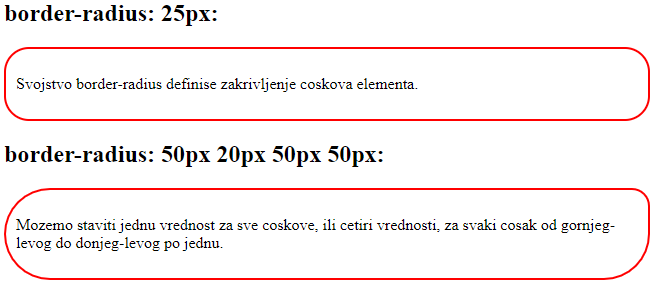
</td></tr></table>

### 2.5.5 Pojas elementa

Do sada opisani elementi čine unutrašnjost HTML elemenata. CSS svojstvo `margin` se koristi za podešavanje površine prostora oko elementa, tj. oko njegove ivice. Pojas elementa se obično koristi ukoliko želimo da osiguramo da HTML elementi budu odvojeni jedni od drugih. 

Slično kao i za punjenje elementa, ovo svojstvo može uzimati jednu ili četiri vrednosti, u zavisnosti od toga da li želimo da postavimo jednu vrednost za sva četiri pojasa ili svaku vrednost pojedinačno (u drugom slučaju navodimo vrednosti za gornji, desni, donji i levi pojas, redom). Takođe, moguće je podesiti vrednosti za četiri pojasa pojedinačno korišćenjem svojstava `margin-top`, `margin-right`, `margin-bottom` i `margin-left`. Vrednosti ovih svojstava mogu biti ili `auto`, čime se prepušta pregledaču da izračuna margine, ili neka od dužina.

Naredni primer ilustruje upotrebu margina nad paragrafom koji je smešten kao sadržaj elementa `div`. Naredna slika daje prikaz koda u veb pregledaču.

```html
<!DOCTYPE html>
<html>

<head>
    <title>Primer</title>
    <meta charset="UTF-8">

    <style>
        div {
            border: black solid 1px;
        }

        p {
            border: 1px solid black;
            margin-top: 100px;
            margin-bottom: 100px;
            margin-right: 20%;
            margin-left: 20%;
            background-color: lightblue;
        }
    </style>
</head>

<body>

    <div>
        <p>
            Ovaj element ima gornju marginu od 100px,
            desnu marginu od 20%, donju marginu od 100px
            i levu marginu od 20%.
        </p>
    </div>

</body>

</html>
```

<table><tr><td>
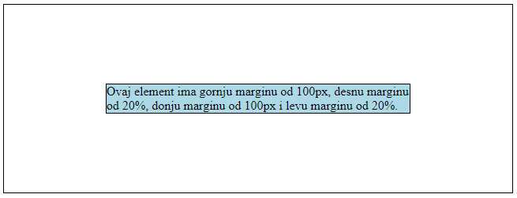
</td></tr></table>

#### Horizontalno poravnanje elemenata pomoću svojstva `margin`

Jedan zanimljiv efekat koji se može postići pomoću svojstva `margin` jeste da se element horizontalno poravna, u odnosu na širinu roditeljskog elementa koji ga sadrži. Postavljanjem deklaracije `margin: auto;`, element će prvo zauzeti odgovarajući prostor svojom širinom, a zatim će se preostali horizontalni prostor podeliti na dva jednaka dela i te dve površine će biti postavljene za levi i desni pojas elementa.

Naredni primer i prateća slika ilustruju opisano ponašanje.

```html
<!DOCTYPE html>
<html>

<head>
    <title>Primer</title>
    <meta charset="UTF-8">

    <style>
        body {
            border: 1px solid black;
        }

        div {
            width: 300px;
            border: 1px solid red;

            /* Horizontalno poravnanje */
            margin: auto;
        }
    </style>
</head>

<body>
    <h2>Koriscenje margin:auto</h2>
    <div>
        Ovaj element div ce biti horizontalno poravnat
        jer ima postavljenu deklaraciju margin: auto;
    </div>
</body>

</html>
```

<table><tr><td>
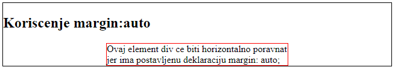
</td></tr></table>

#### Linijski elementi i svojstvo `margin` 

Za razliku od blokovskih elemenata, linijski elementi imaju specifično ponašanje kada se na njih primeni svojstvo `margin`. Naime, na njih nemaju uticaja vrednosti koje su postavljene za gornji i donji pojas, ali vrednosti postavljene za levi i desni pojas se očekivano primenjuju.

Naredni primer i prateća slika ilustruju opisano ponašanje.

```html
<!DOCTYPE html>
<html>

<head>
    <title>Primer</title>
    <meta charset="UTF-8">

    <style>
        body {
            border: 1px solid black;
        }

        span {
            margin: 100px 50px 100px 50px;
            border: 1px solid red;
        }
    </style>
</head>

<body>
    <h2>Linijski elementi i svojstvo margin</h2>

    <span>
        Linijski element
    </span>
    <span>
        Linijski element
    </span>

    <br>

    <span>
        Linijski element
    </span><span>
        Linijski element
    </span>

    <br>
</body>

</html>
```

<table><tr><td>
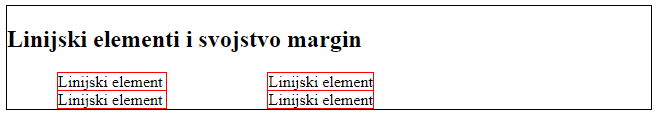
</td></tr></table>

### Više informacija

Za više informacijama o temama koje su obrađene u ovoj sekciji, možete posetiti naredne korisne veb prezentacije:

- Mi smo predstavili osnovni model kutije, međutim, postoji mnogo više modela kutija - i u  HTML5 i u CSS3 jeziku. Detaljniji opis svih modela kutija možete pronaći na ovoj adresi:
[https://developer.mozilla.org/en-US/docs/Learn/CSS/Building_blocks/The_box_model](https://developer.mozilla.org/en-US/docs/Learn/CSS/Building_blocks/The_box_model)

## 2.6 Koordinatni sistem veb pregledača

Naredna tema o kojoj želimo da diskutujemo jeste pozicioniranje elemenata. Međutim, da bismo razumeli način na koji se koriste mere pri raspoređivanju elemenata na veb prezentaciji, moramo da razumemo kako funkcioniše koordinatni sistem veb pregledača.

Veb pregledači raspolažu dvama koordinatnim sistemima koji se razlikuju po njihovom centru, dok su im ostale karakteristike identične. Oni su:

1. Koordinatni sistem relativan u odnosu na pogled veb pregledača (nadalje ga zovemo koordinatni sistem veb pregledača). U ovom koordinatnom sistemu, za centar se smatra gornji levi ugao pogleda veb pregledača. *Pogled* (engl. *viewport*) predstavlja prozor veb pregledača u kojem se prikazuje veb prezentacija. Koordinate elementa u ovom sistemu ćemo obeležavati `clientX` i `clientY`.

2. Koordinatni sistem relativan u odnosu na veb stranicu (nadalje ga zovemo koordinatni sistem veb stranice). U ovom koordinatnom sistemu, za centar se smatra gornji levi ugao veb stranice. Koordinate elementa u ovom sistemu ćemo obeležavati `pageX` i `pageY`.

Naredna slika ilustruje razliku između pozicija elementa u jednom i drugom koordinatnom sistemu. Kao što vidimo, prilikom skrolovanja stranice na sam početak, oba koordinatna sistema imaju isti centar, te su i koordinate elementa jednake. Međutim, prilikom skrolovanja stranice naniže, koordinate koje su relativne u odnosu na pogled veb pregledača se menjaju jer se i elementi pomeraju u odnosu na njega. Za razliku od toga, koordinate koje su relativne u odnosu na stranicu ostaju iste, jer je sada i sam centar koordinatnog sistema veb stranice pomeren zajedno sa stranicom (ovaj centar je pomeren izvan pogleda veb pregledača, što je prikazano delimičnom prozirnošću na slici).

<table><tr><td>
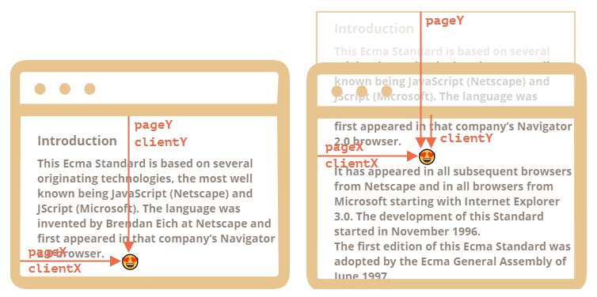
</td></tr></table>

Pojam pozicioniranja nije jedinstveno određen, već su definisana različita ponašanja za različite tipove pozicioniranja, sa kojima ćemo se upoznati u narednoj sekciji. Neki od njih pozicioniraju elemente u odnosu na koordinatni sistem veb pregledača, a neki od njih pozicioniraju elemente u odnosu na koordinatni sistem dokumenta.

Ipak, ova dva koordinatna sistema imaju i dosta zajedničkih karakteristika. Neke od njih su:

- Vrednosti na *x*-osi rastu sleva na desno, a opadaju zdesna na levo. 
- Vrednosti na *y*-osi rastu odozgo na dole, a opadaju odozdo na gore.
- Vrednosti na obema osama mogu biti pozitivne i negativne. 
- Vrednosti na obema osama mogu biti bilo koja od dužina. Od jedinice mere za dužinu zavisi koliko će element biti pomeren.

Iako je ekran veb pregledača dvodimenzionalan i svi elementi koji se prikazuju su dvodimenzionalni, postoji mogućnost da se više elemenata preklapaju jedni sa drugima. Zbog toga, uvedena je i treća koordinatna osa, *z*-osa, koja definiše dubinu na kojoj se dvodimenzionalni elementi smeštaju. Više o ovome biće reći u narednoj sekciji, ali radi kompletnosti ove sekcije, napomenimo da vrednosti na *z*-osi rastu u smeru od veb pregledača ka korisniku, dok te vrednosti opadaju u smeru od korisnika ka veb pregledaču. Naredna slika daje prikaz punog koordinatnog sistema, u odnosu na prozor veb pregledača.

<table><tr><td>
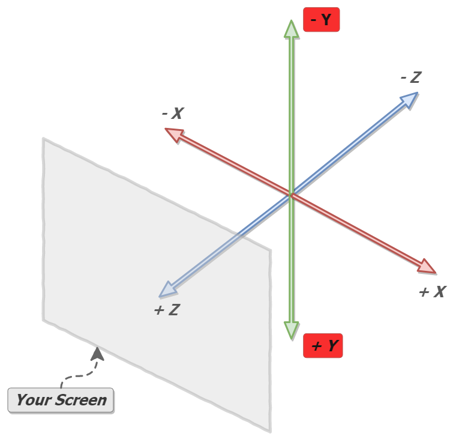
</td></tr></table>

## 2.7 Pozicioniranje elemenata

Jednostavno "slaganje" elemenata u HTML kodu može nam poslužiti tek toliko. Za konstrukciju kompleksnijih veb prezentacija, neophodno je da razumemo kako je moguće iskoristiti CSS za precizno pozicioniranje elemenata na veb stranici. Pozicioniranje elemenata može biti veoma naporna stvar pri dizajnu veb prezentacije ukoliko se u potpunosti ne razumeju svi detalji i bočni efekti koji nastaju prilikom pozicioniranja elemenata.

Da bismo uspešno pozicionirali HTML element na željenu poziciju na veb prezentaciji, potrebno je da uradimo naredna dve koraka:

1. Odrediti tip pozicioniranja.
2. Iskoristiti neka od svojstava za pozicioniranje elementa, imajući u vidu karakteristike odabranog tipa pozicioniranja.

Za određivanje tipa pozicioniranja koristi se svojstvo `position`. Moguće vrednosti ovog svojstva su: `static`, `relative`, `absolute` i `fixed`. U nastavku teksta ćemo detaljno diskutovati o svakoj od navedenih vrednosti.

Sa druge strane, za definisanje precizne pozicije elementa koriste se neki od svojstava `top`, `right`, `bottom` i `left`. Njihovo opšte značenje jeste da udaljava element na koji se primenjuju za datu dužinu od gornje, desne, donje i leve ivice nekog elementa, redom. Od ivice kojeg elementa se dati element udaljava zavisi od odabranog tipa pozicioniranja. Podrazumevana vrednost za svako svojstvo jeste `0`.

Udaljavanje elementa se vrši u skladu sa pravilima koje definiše koordinatni sistem. Na primer, ako je vrednost svojstva `top` pozitivna dužina, element će biti pomeren "na dole" (u pravcu rasta *y*-ose koordinatnog sistema), a ako je vrednost tog svojstva negativna dužina, element će biti pomeren "na gore" (u pravcu opadanja *y*-ose koordinatnog sistema).

Ukoliko se u nekom pravilu iskoristi neko od ovih svojstava, a u tom pravilu nije iskorišćeno svojstvo `position` (tj. nije određen tip pozicioniranja), onda ta svojstva neće imati nikakav uticaj na poziciju elementa.

### 2.7.1 Statičko pozicioniranje

Ovo je podrazumevan način pozicioniranja elemenata. Postavljanje vrednosti za neko od svojstava `top`, `right`, `bottom` ili `left` nema uticaja na poziciju elementa sa statičkim pozicioniranjem.

Elementi se ređaju na stranici jedan nakon drugog, u skladu sa njihovim dimenzijama i drugim karakteristikama. Na primer, linijski elementi ređaju se jedan pored drugog dok se blokovski elementi ređaju jedan ispod drugog. Ovaj tok ređanja elemenata se naziva *normalni tok* (engl. *normal flow*). 

Naredni kod i prateća slika ilustruju upotrebu statičkog pozicioniranja. Veb prezentacija se sastoji od tri `div` elementa, pri čemu je drugom elementu postavljeno pozicioniranje na statičko[^1] i podešeno je da bude pozicioniran `30px` od gornje ivice i `80px` od leve ivice. Kao što je prikazano na slici, elementi se ređaju jedan ispod drugog, što je i očekivano.

[^1]: Zapravo, i preostalim `div` elementima je postavljeno pozicioniranje na statičko, zbog toga što je to podrazumevano ponašanje, iako ga nismo eksplicitno napisali u CSS delu koda.

```html
<!DOCTYPE html>
<html>

<head>
    <title>Primer</title>
    <meta charset="UTF-8">

    <style>
        #prvi {
            height: 100px;
            width: 300px;
            background-color: rgb(231, 43, 103);
        }

        #drugi {
            height: 100px;
            width: 300px;
            background-color: rgb(24, 243, 232);
            position: static;
            top: 30px;
            left: 80px;
        }

        #treci {
            height: 100px;
            width: 300px;
            background-color: rgb(180, 55, 252);
        }
    </style>
</head>

<body>
    <div id="prvi"></div>
    <div id="drugi"></div>
    <div id="treci"></div>
</body>

</html>
```

<table><tr><td>
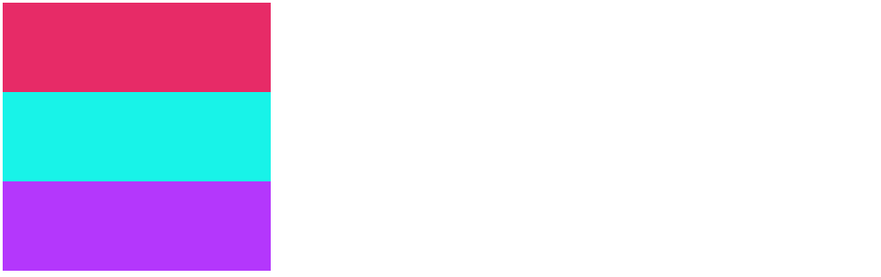
</td></tr></table>

### 2.7.2 Relativno pozicioniranje

Pomenuli smo ranije da svaki tip pozicioniranja definiše šta za taj tip znači "ivica" u odnosu na koju se element pomera. Pri relativnom pozicioniranju "ivica" od koje se element pomera je ivica tog elementa pri statičkom pozicioniranju. Jednostavnije rečeno, postavljanje vrednosti za svojstva `top`, `right`, `bottom` i `left` pomeriće element u odnosu na njegovu statičku poziciju. 

Važno je zapamtiti da izmene u poziciji elementa koji je relativno pozicioniran nemaju uticaja na preostali sadržaj stranice - svi ostali elementi ostaju na svojim pozicijama. Posledica ovog efekta jeste pojavljivanje "prazne" površine na mestu gde se relativno-pozicionirani pomereni element nalazio pre pomeranja.

Naredni kod predstavlja izmenu prethodnog koda u kojem je promenjen samo tip pozicioniranja drugog `div` elementa sa statičkog na relativno. Kao što se vidi na pratećoj slici, drugi `div` element je pomeren za `30px` "na dole" i `80px` "na desno" u odnosu na njegovu poziciju koja mu je bila dodeljena pri statičkom pozicioniranju. Preostala dva `div` elementa su ostala na svojim pozicijama, što dovodi do efekta "prazne" površine između njih - na mestu gde je drugi `div` element bio pozicioniran pri statičkom pozicioniranju.

```html
<!DOCTYPE html>
<html>

<head>
    <title>Primer</title>
    <meta charset="UTF-8">

    <style>
        #prvi {
            height: 100px;
            width: 300px;
            background-color: rgb(231, 43, 103);
        }

        #drugi {
            height: 100px;
            width: 300px;
            background-color: rgb(24, 243, 232);
            position: relative;
            top: 30px;
            left: 80px;
        }

        #treci {
            height: 100px;
            width: 300px;
            background-color: rgb(180, 55, 252);
        }
    </style>
</head>

<body>
    <div id="prvi"></div>
    <div id="drugi"></div>
    <div id="treci"></div>
</body>

</html>
```

<table><tr><td>

</td></tr></table>

### 2.7.3 Apsolutno pozicioniranje

Apsolutno pozicioniranje je najzahtevnije za razumevanje od svih tipova pozicioniranja. Pri apsolutnom pozicioniranju "ivica" od koje se element pomera je ivica prvog pretka tog elementa u DOM stablu koji nije statički pozicioniran. Ukoliko ne postoji predak koji zadovoljava taj uslov, onda se za "ivicu" smatra ivica elementa `body`.

U skladu sa ovom složenom definicijom postoje dva slučaja koja možemo razmatrati. Prvi slučaj je kada su svi preci elementa koji je apsolutno pozicioniran statički pozicionirani. U tom slučaju, element se pomera od ivice elementa `body`. Takav slučaj je predstavljen narednim kodom i pratećom slikom. Jedini predak (do elementa `body`) drugog `div` elementa je element `div` koji ima postavljen identifikator na vrednost `omotac` (nazovimo ovaj element "omotač"). Bez obzira što se drugi `div` element nalazi kao potomak omotača, s obzirom da je omotač statički pozicioniran, onda će drugi `div` element biti pozicioniran u odnosu na ivicu `body` elementa.

```html
<!DOCTYPE html>
<html>

<head>
    <title>Primer</title>
    <meta charset="UTF-8">

    <style>
        #omotac {
            margin-top: 100px;
            height: 400px;
            width: 400px;
            background-color: rgba(218, 165, 32, 0.5);
        }
    
        #prvi {
            height: 100px;
            width: 300px;
            background-color: rgb(231, 43, 103);
        }

        #drugi {
            height: 100px;
            width: 300px;
            background-color: rgb(24, 243, 232);
            position: absolute;
            top: 30px;
            left: 80px;
        }

        #treci {
            height: 100px;
            width: 300px;
            background-color: rgb(180, 55, 252);
        }
    </style>
</head>

<body>
    <div id="omotac">
        <div id="prvi"></div>
        <div id="drugi"></div>
        <div id="treci"></div>
    </div>
</body>

</html>
```

<table><tr><td>
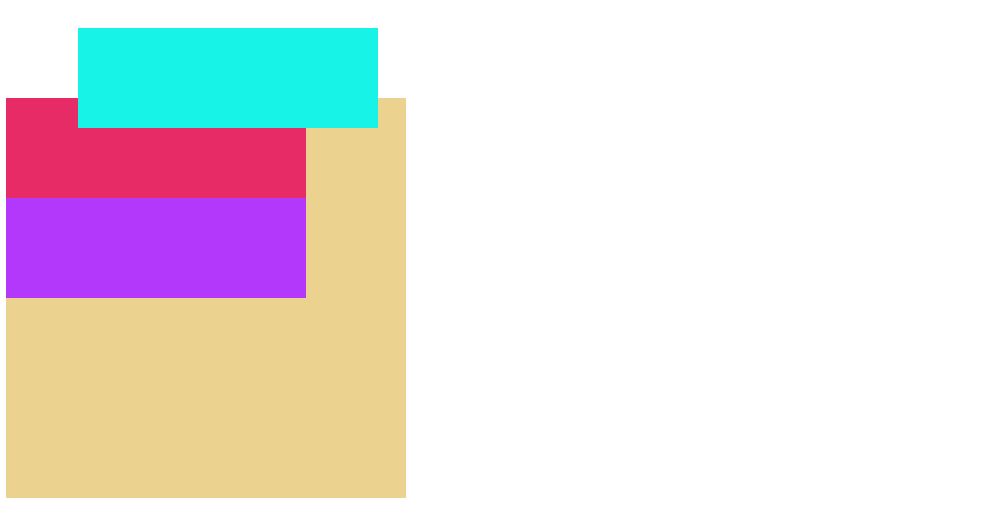
</td></tr></table>

Međutim, šta ukoliko bi omotač bio nestatički pozicioniran? Ukoliko postavimo da omotač bude, na primer, relativno pozicioniran kao u narednom kodu, onda ćemo dobiti situaciju kao na narednoj slici. Sada drugi `div` element nije više pozicioniran u odnosu na ivicu `body` elementa zato što postoji makar jedan predak koji nije statički pozicioniran (a to je omotač), te se drugi `div` element pozicionira u odnosu na njegovu ivicu.

```html
<!DOCTYPE html>
<html>

<head>
    <title>Primer</title>
    <meta charset="UTF-8">

    <style>
        #omotac {
            position: relative;
            margin-top: 100px;
            height: 400px;
            width: 400px;
            background-color: rgba(218, 165, 32, 0.5);
        }
    
        #prvi {
            height: 100px;
            width: 300px;
            background-color: rgb(231, 43, 103);
        }

        #drugi {
            height: 100px;
            width: 300px;
            background-color: rgb(24, 243, 232);
            position: absolute;
            top: 30px;
            left: 80px;
        }

        #treci {
            height: 100px;
            width: 300px;
            background-color: rgb(180, 55, 252);
        }
    </style>
</head>

<body>
    <div id="omotac">
        <div id="prvi"></div>
        <div id="drugi"></div>
        <div id="treci"></div>
    </div>
</body>

</html>
```

<table><tr><td>

</td></tr></table>

Primetimo još jednu veoma važnu stvar - u oba slučaja treći `div` element se pomerio na mesto gde bi drugi `div` element bio pozicioniran pri statičkom pozicioniranju! "Prazan" prostor koji je bio prisutan pri relativnom pozicioniranju je nestao. Razlog za ovo ponašanje jeste da se apsolutno-pozicionirani elementi izbacuju iz normalnog toka raspoređivanja elemenata. Drugim rečima, ostali elementi se raspoređuju u skladu sa normalnim tokom kao da apsolutno-pozicionirani elementi ne postoje.

### 2.7.4 Fiksno pozicioniranje

Pri fiksnom pozicioniranju "ivica" od koje se element pomera je ivica pogleda veb pregledača. Međutim, za fiksno pozicioniranje važi još jedno pravilo po čemu se on razlikuje od ostalih pozicioniranja. Element sa fiksnim pozicioniranjem se nalaze na istoj poziciji na ekranu, čak i kada se stranica skroluje. 

Slično kao u slučaju apsolutnog pozicioniranja, elementi sa fiksnim pozicioniranjem se izbacuju iz normalnog toka, tj. ne ostaju "prazne" površine tamo gde bi se element našao pri statičkom pozicioniranju.

Naredni kod pozicionira drugi `div` element `30px` od gornje ivice pogleda veb pregledača i `0` od desne ivice veb pregledača. Na narednoj slici su predstavljene situacije prilikom skrolovanja visoke veb prezentacije. U prvoj situaciji je prikazan početak veb prezentacije na kojoj su svi elementi vidljivi (slika A). Međutim, prilikom skrolovanja stranice, elementi koji nisu fiksno pozicionirani izlaze iz pogleda veb pregledača, dok fiksno pozicionirani element ostaje na svojoj poziciji (slika B).

```html
<!DOCTYPE html>
<html>

<head>
    <title>Primer</title>
    <meta charset="UTF-8">

    <style>
        body {
            height: 3000px;
        }

        #omotac {
            position: relative;
            margin-top: 100px;
            height: 400px;
            width: 400px;
            background-color: rgba(218, 165, 32, 0.5);
        }
    
        #prvi {
            height: 100px;
            width: 300px;
            background-color: rgb(231, 43, 103);
        }

        #drugi {
            height: 100px;
            width: 300px;
            background-color: rgb(24, 243, 232);
            position: fixed;
            top: 30px;
            right: 0;
        }

        #treci {
            height: 100px;
            width: 300px;
            background-color: rgb(180, 55, 252);
        }
    </style>
</head>

<body>
    <div id="omotac">
        <div id="prvi"></div>
        <div id="drugi"></div>
        <div id="treci"></div>
    </div>
</body>

</html>
```

<table><tr><td>
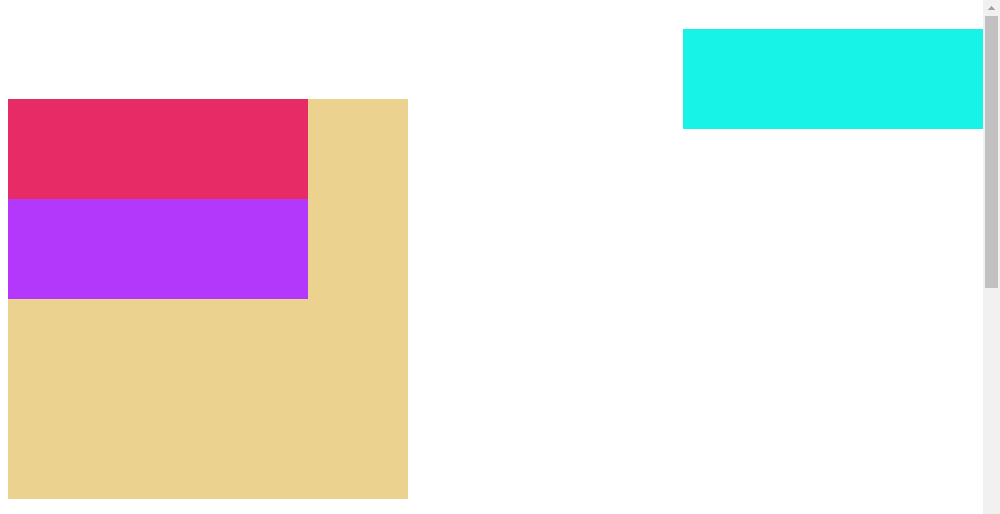
</td></tr></table>

(A) Primer fiksnog pozicioniranja. Veb stranica je tek učitana. Svi elementi su vidljivi.

<table><tr><td>
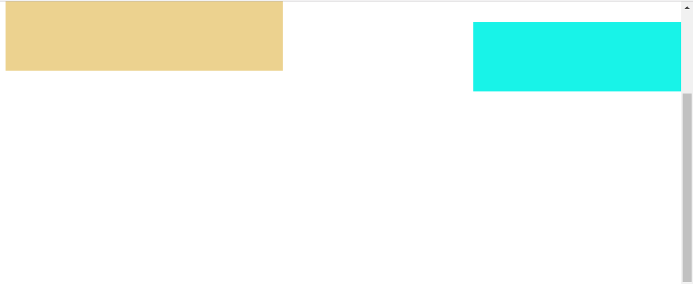
</td></tr></table>

(B) Primer fiksnog pozicioniranja. Veb stranica je skrolovana. Jedino je drugi `div` element na svojoj poziciji, dok je većina ostalih elemenata, koji nisu fiksno pozicionirani, izašla iz pogleda veb pregledača.

### 2.7.5 Z-pozicioniranje elemenata

Prilikom pozicioniranja elemenata, može se desiti da se neki od njih preklope. Postavlja se pitanje na koji način će ti elementi biti prikazani, tj. koji element će biti ispred kog elementa. 

U skladu sa koordinatnim sistemom, elementu može biti dodeljena pozitivna ili negativna vrednost za *z-dubinu* (engl. *z-depth*). Element koji ima veću vrednost z-dubine biće pozicioniran ispred elemenata sa manjom vrednošću za z-dubinu. Ukoliko se dva elementa sa jednakim vrednostima za z-dubinu preklope, onda onaj element koji je poslednji pozicioniran biti ispred ostalih elemenata sa kojima se preklapa.

Podrazumevano svi elementi imaju z-dubinu jednaku 0. U primeru sa relativnim pozicioniranjem, drugi i treći `div` elementi se preklapaju, pri čemu se drugi `div` element nalazi ispred trećeg. Međutim, validno je postaviti pitanje zašto je drugi `div` element poslednji pozicioniran, a ne treći kad se on u HTML kodu nalazi nakon drugog elementa. Da bismo razumeli ovo ponašanje, moramo da razumemo kako veb pregledač formira veb prezentaciju.

Bez ulaženja u detalje, veb pregledač prvo dohvata HTML kod i na osnovu njega vrši pozicioniranje elemenata. Tek kada su ti elementi raspoređeni, onda se vrši stilizovanje dokumenta na osnovu CSS koda. U primeru sa relativnim pozicioniranjem, veb pregledač nije pronašao nikakav kod za pozicioniranje prvog i trećeg `div` elementa, te nije menjao njihove pozicije. Međutim, pronašao je kod za pozicioniranje drugog `div` elementa, pa je onda izvršio njegovo pozicioniranje ponovo. Samim tim, dolazimo do zaključka da je drugi `div` element poslednji pozicioniran, te on ima najveću prednost prilikom prikazivanja.

Svojstvo `z-index` određuje kako se elementi slažu jedan preko drugog, tj. određuje vrednost z-dubine. Naredni kod predstavlja modifikaciju primera sa relativnim pozicioniranjem u kojem je z-dubina drugog `div` elementa postavljena na vrednost `-5`, što predstavlja manju vrednost od podrazumevane vrednosti za treći `div` element (a to je `0`). Sa ovom izmenom, drugi `div` element će biti prikazan iza trećeg `div` elementa, bez obzira što je poslednji pozicioniran, kao što je prikazano na narednoj slici.

```html
<!DOCTYPE html>
<html>

<head>
    <title>Primer</title>
    <meta charset="UTF-8">

    <style>
        #prvi {
            height: 100px;
            width: 300px;
            background-color: rgb(231, 43, 103);
        }

        #drugi {
            height: 100px;
            width: 300px;
            background-color: rgb(24, 243, 232);
            position: relative;
            top: 30px;
            left: 80px;
            z-index: -5;
        }

        #treci {
            height: 100px;
            width: 300px;
            background-color: rgb(180, 55, 252);
        }
    </style>
</head>

<body>
    <div id="prvi"></div>
    <div id="drugi"></div>
    <div id="treci"></div>
</body>

</html>
```

<table><tr><td>

</td></tr></table>

### 2.7.6 Svojstva `display` i `visibility`

Do sada smo videli na koje sve načine je moguće raspoređivati elemente na veb prezentaciji zajedno sa svim bočnim efektima koje se javljaju. Sada ćemo opisati još dva svojstva koja, iako se ne koriste direktno za pozicioniranje elemenata već za način njihovog prikazivanja, mogu na neki način uticati na raspored elemenata na stranici.

Pomoću svojstva `display` određujemo na koji način će element biti prikazan. Štaviše, možemo upravljati time da li će element uopšte biti prikazan na stranici! Svaki HTML element ima podrazumevanu vrednost za ovo svojstvo u zavisnosti od tipa elementa. Za većinu elemenata podrazumevana vrednost je definisana HTML5 standarom. Pogledajmo još neke vrednosti ovog svojstva i njihova značenja:

- Vrednost `initial` postavlja prikazivanje elementa na podrazumevano.

- Vrednost `block` definiše da se element prikazuje kao blokovski element. Element će dobiti sve karakteristike za prikazivanje blokovskih elemenata, bez obzira na njegovu originalnu kategoriju.

- Vrednost `inline` definiše da se element prikazuje kao linijski element. Element će dobiti sve karakteristike za prikazivanje linijskih elemenata, bez obzira na njegovu originalnu kategoriju.

- Vrednost `inline-block` definiše da se element prikazuje kao linijski element, sa time da je moguće menjati dimenzije sadržaja pomoću svojstva `width` i `height`[^2].

- Vrednost `none` jeste da se dati element i njegov sadržaj u potpunosti uklanjaju iz prikaza.

[^2]: Prisetimo se da linijskim elementima nije moguće promeniti dimenzije sadržaja korišćenjem svojstava `width` i `height`.

Važno je napomenuti da promena svojstva `display` ne povlači promenu kategorije elementa. Tako, na primer, linijski element koji ima postavljeno `display` svojstvo na vrednost `block` i dalje ne sme da sadrži blokovske elemente u svom sadržaju!

Naredni HTML kod ilustruje korišćenje svojstva `display` za "pozicioniranje" elemenata tako da budu prikazano kao na pratećoj slici. Crveni i žuti `div` elementi su automatski raspoređeni jedan pored drugog, iako su oba elementa predstavnici blokovskih elemenata, zbog činjenice da je njihov prikaz promenjen na `inline-block`.

```html
<html>

<head>
    <title>Primer</title>
    <meta charset="UTF-8">

    <style type="text/css">
        #omotac {
            border: 1px solid black;
            margin-left: auto;
            margin-right: auto;
            width: 400px;
            position: relative;
        }

        #zeleni {
            width: 400px;
            height: 50px;
            background-color: rgb(83, 255, 103);
        }

        #crveni {
            width: 100px;
            height: 200px;
            background-color: rgb(255, 53, 57);
            display: inline-block;
        }

        #zuti {
            width: 300px;
            height: 200px;
            background-color: rgb(255, 255, 65);
            display: inline-block;
        }

        #plavi {
            width: 400px;
            height: 50px;
            background-color: rgb(39, 230, 233);
        }
    </style>

</head>

<body>
    <div id="omotac">
        <div id="zeleni"></div>
        <div id="crveni"></div><div id="zuti"></div>
        <div id="plavi"></div>
    </div>
</body>

</html>
```

<table><tr><td>
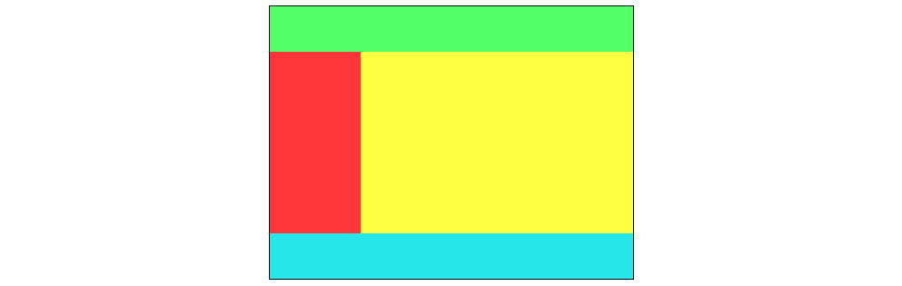
</td></tr></table>

Obratimo pažnju na jedan skriveni "hack" koji smo uradili u prethodnom kodu. Prikažimo ponovo HTML sadržaj tela dokumenta:

```html
<div id="omotac">
    <div id="zeleni"></div>
    <div id="crveni"></div><div id="zuti"></div>
    <div id="plavi"></div>
</div>
```

Ovaj deo koda je namerno formatiran na ovaj način. Ovo se pre svega odnosi na narednu liniju koda:

```html
<div id="crveni"></div><div id="zuti"></div>
```

Zašto nismo prelomili ova dva `div` elementa u zasebni red? Na narednoj slici je dat prikaz modifikacije prethodnog koda sa narednom izmenom u sadržaju tela HTML dokumenta:

```html
<div id="omotac">
    <div id="zeleni"></div>
    <div id="crveni"></div>
    <div id="zuti"></div>
    <div id="plavi"></div>
</div>
```

<table><tr><td>
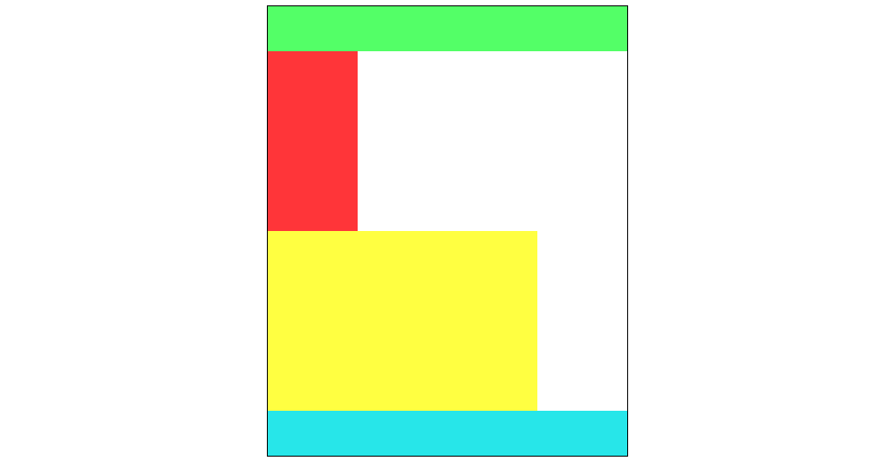
</td></tr></table>

Zašto je ova promena dovela do neispravnog prikaza? Jedina stvar koju smo uradili jeste razvojili crveni i žuti `div` element u zasebne linije u HTML kodu. Prethodno smo rekli da beline u HTML kodu ne utiču na prikaz elemenata. Zašto je onda žuti `div` element "prešao" u novu liniju u prikazu veb pregledača?

Da bismo razumeli ovu posledicu, moramo da razumemo šta je sve uticalo na prikaz ovih elemenata:

- Omotač zauzima `400px` širine.
- Zbir širina crvenog i žutog `div` elementa je tačno `400px`.
- Elementi sa `inline-block` prikazom se ređaju jedni pored drugih (poput linijskih elemenata) sve dok u istoj liniji ima mesta za sve njih. **Ukoliko za neki element sa `inline-block` prikazom nema mesta u liniji, on će preći u novi red**.

Ako uzmemo u obzir ove činjenice, jedino što može da dovede do toga da žuti `div` element pređe u novi red jeste rečenica koja je podebljana u tekstu - za žuti `div` element nije bilo mesta, te je on morao da pređe u novi red! Međutim, zbog čega nije bilo mesta kada je zbir širina crvenog i žutog `div` elementa jednak širini omotača? Odgovor je u tome da, zbog novog formata HTML koda, postoji jedan karakter razmaka između crvenog i žutog elementa. S obzirom da je širina karaktera razmaka uvek strogo pozitivna vrednost, zbir širina crvenog i žutog `div` elementa, kao i širine karaktera razmaka, premašuje širinu omotača, zbog čega za žuti `div` element nema više mesta u istoj liniji i on prelazi u novi red u prikazu.

Ostalo je još samo da razjasnimo odakle se pojavio karakter razmaka koji je napravio ovaj problem. U novom formatu HTML koda stoji

```html
<div id="omotac">
    <div id="zeleni"></div>
    <div id="crveni"></div>
    <div id="zuti"></div>
    <div id="plavi"></div>
</div>
```

Između fragmenata koda `<div id="crveni"></div>` i `<div id="zuti"></div>` postoji jedan karakter za novi red i potencijalno 4 karaktera razmaka (ili jedan karakter tabulatora). Veb pregledač, prilikom parsiranja ovog koda, pronalazi nabrojane beline i u prikazu ih zamenjuje jednim karakterom razmaka, kao što to i inače radi. Zbog toga smo u inicijalnoj verziji koda sprečili ovo tako što nismo ostavili nijedan karakter beline između datih fragmenata koda:

```html
<div id="omotac">
    <div id="zeleni"></div>
    <div id="crveni"></div><div id="zuti"></div>
    <div id="plavi"></div>
</div>
```

Postoji još jedan način kako je ovo moguće rešiti ako želimo da crveni i žuti `div` elementi budu u zasebnim linijama. S obzirom da je dovoljno sprečiti veb pregledač da naiđe na beline između ovih fragmenata koda, možemo postaviti HTML komentar, koji će biti odbačen u celosti prilikom parsiranja HTML koda, kao u narednom delu koda:

```html
<div id="omotac">
    <div id="zeleni"></div>
    <div id="crveni"></div><!--
 --><div id="zuti"></div>
    <div id="plavi"></div>
</div>
```

Iako je ova situacija nešto što se ređe pronalazi u praksi, primer predstavlja dobru ilustraciju činjenice da je neophodno da u potpunosti razumemo funkcionisanje HTML5 i CSS3 jezika pre nego što se upustimo u iole naprednije dizajniranje veb prezentacija.

Preostala je još jedna vrednost svojstva `display` koju je potrebno objasniti, a to je vrednost `none`. Pomenuli smo da se postavljanjem ovog svojstva na ovu vrednost, HTML element uklanja iz prikaza veb pregledača, zajedno sa svojim sadržajem. Takođe, svi ostali elementi se raspoređuju kao da se taj element nikada nije ni nalazio u veb prezentaciji.

Blisko ponašanje se može postići postavljanjem svojstva `visibility`, čija je podrazumevana vrednost `visible`, na vrednost `hidden`. Element će i u ovom slučaju biti sakriven iz prikaza. Međutim, razlika u odnosu na postavljanje svojstva `display` na vrednost `none` je u tome što će element i dalje zauzimati isti prostor kao i ranije, samo što će biti sakriven iz prikaza.

Naredni kod i prateća slika ilustruju razliku između ovih svojstava. U prvom omotaču, crvenom `div` elementu je postavljeno svojstvo `display` na vrednost `none`, te se on u potpunosti uklanja iz prikaza. Žuti i narandžasti `div` elementi se pozicioniraju kao da crveni element nije ni postojao. U drugom omotaču, plavom `div` elementu je postavljeno svojstvo `visibility` na vrednost `hidden`, te se on jednostavno sakriva iz prikaza. Zeleni i ljubičasti `div` elementi zadržavaju svoje pozicije, kao da plavi element nije ni bio sakriven.

```html
<html>

<head>
    <title>Primer</title>
    <meta charset="UTF-8">

    <style type="text/css">
        #omotac1, #omotac2 {
            border: 1px solid black;
            width: 400px;
        }

        #omotac2 {
            position: relative;
            top: 50px;
        }

        #zuti {
            width: 400px;
            height: 50px;
            background-color: rgb(252, 249, 111);
        }

        #crveni {
            width: 400px;
            height: 50px;
            background-color: rgb(255, 117, 83);
            display: none;
        }

        #narandzasti {
            width: 400px;
            height: 50px;
            background-color: rgb(255, 186, 83);
        }

        #zeleni {
            width: 400px;
            height: 50px;
            background-color: rgb(81, 224, 140);
        }

        #plavi {
            width: 400px;
            height: 50px;
            background-color: rgb(83, 109, 255);
            visibility: hidden;
        }

        #ljubicasti {
            width: 400px;
            height: 50px;
            background-color: rgb(192, 83, 255);
        }
    </style>

</head>

<body>
    <div id="omotac1">
        <div id="zuti"></div>
        <div id="crveni"></div>
        <div id="narandzasti"></div>
    </div>
    <div id="omotac2">
        <div id="zeleni"></div>
        <div id="plavi"></div>
        <div id="ljubicasti"></div>
    </div>
</body>

</html>
```

<table><tr><td>
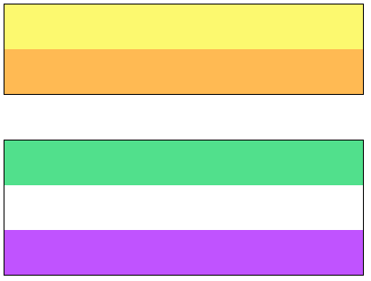
</td></tr></table>

### Više informacija

Za više informacijama o temama koje su obrađene u ovoj sekciji, možete posetiti naredne korisne veb prezentacije:

- Pozicioniranje elemenata:
[https://www.w3schools.com/css/css_positioning.asp](https://www.w3schools.com/css/css_positioning.asp)

- Svojstva `display` i `visibility` i njihove razlike: 
[https://www.w3schools.com/cssref/pr_class_display.asp](https://www.w3schools.com/cssref/pr_class_display.asp)
[https://www.w3schools.com/cssref/pr_class_visibility.asp](https://www.w3schools.com/cssref/pr_class_visibility.asp)
[https://www.w3schools.com/css/css_display_visibility.asp](https://www.w3schools.com/css/css_display_visibility.asp).

---

[Knjiga](../../README.md)

[Vežbe](../README.md)

<!--
<table><tr><td>

</td></tr></table>
-->
