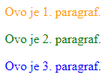
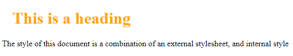
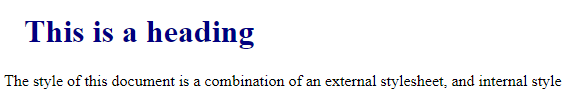
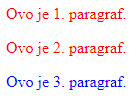
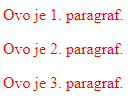
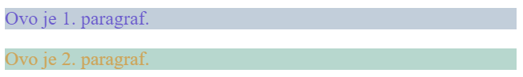
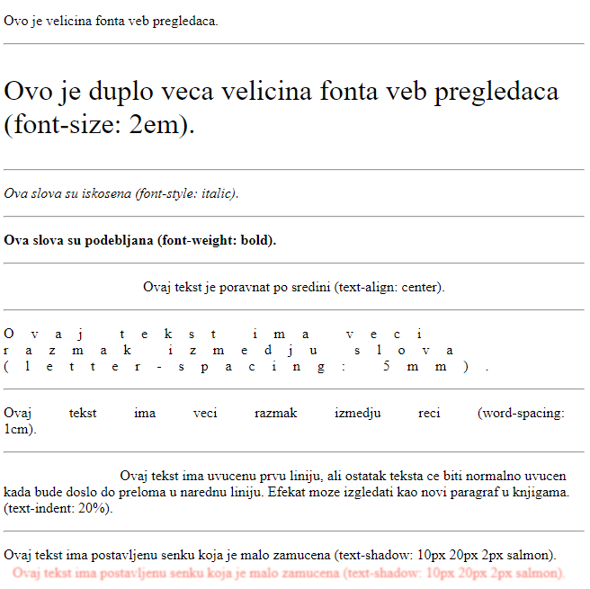
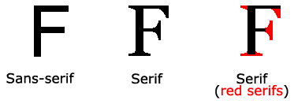
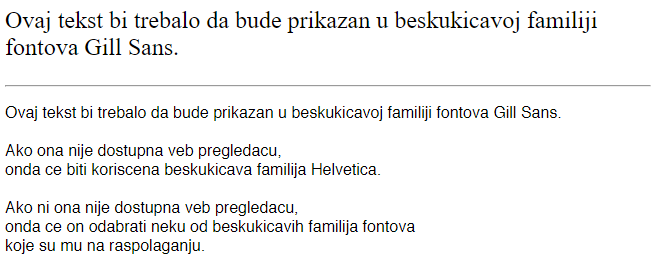
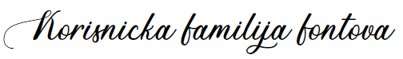

[Vežbe](../../../README.md)

[Knjiga](../../README.md)

---

# 2. Stilizovanje Veb dokumenata kroz CSS

*Cascading Style Sheets* (skr. *CSS*) predstavlja jezik koji služi za stilizovanje HTML elemenata. Za razliku od jezika HTML, koji opisuje logičku strukturu veb dokumenta, jezikom CSS se služimo da bismo opisali na koji način se elementi te logičke strukture prikazuju. Na primer, korišćenjem jezika CSS možemo podesiti poziciju elemenata, boju teksta, okvire, pozadinu i dr.

## 2.1 Osnovni elementi jezika CSS

CSS jezik se sastoji od niza *pravila* (engl. *rule*). Svako pravilo je oblika:

```
selektor {
    svojstvo-1: vrednost-1; /∗ deklaracija 1 ∗/
    ...
    svojstvo-N: vrednost-N; /∗ deklaracija N ∗/
}
```

Objasnimo sada svaku od predstavljenih stavki:

- *Selektor* (engl. *selector*) predstavlja način za definisanje nad kojim HTML elementima će dato pravilo biti primenjeno. Postoji veliki broj selektora, a neki od njih su predstavljeni u tabeli ispod, zajedno sa primerima upotrebe.

- *Deklaracija* (engl. *declaration*) opisuje način na koji se vrši stilizovanje elemenata koji su selektovani datim selektorom. Jednom deklaracijom se definiše tačno jedna stavka u stilu, na primer, boja teksta, boja pozadine, širina elementa, udaljenost od gornje ivice roditeljskog elementa, itd. Deklaracije se međusobno razdvajaju karakterom `;` (tačka-zapeta).

- Svaka deklaracija sadrži par *svojstvo* (engl. *property*) i *vrednost* (engl. *value*) koji definišu jednu stavku stila u datom pravilu. Svaki element ima definisan skup svojstava koja je moguće primeniti nad tim elementom. Takođe, svako svojstvo ima definisan domen vrednosti koje može uzimati. Na primer, svojstvo koje određuje boju teksta može uzimati za vrednost boje u različitim formatima (`blue`, `yellow`, `rgb(125, 68, 41)`, itd.), dok širina elementa može uzimati za vrednost neku od dužina (`2em`, `300px`, `12cm`), procenat (`50%`), itd. U nastavku poglavlja ćemo se upoznati za raznim svojstvima i odgovarajućim vrednostima.

| Selektor | Primer | Objašnjenje |
| -------- | ------ | ----------- |
| Ime elementa | `p` | Primeniće stil nad svim paragrafima. |
| Identifikator | `#moj-id` | Primeniće stil nad svim elementima koji imaju postavljen generiški atribut `id` na vrednost `"moj-id"`. |
| Klasa | `.moja-klasa` | Primeniće stil nad svim elementima koji imaju postavljen generiški atribut `class` na vrednost `"moja-klasa"`. |
| Ugnežđavanje | `h1 p` | Primeniće stil nad svim paragrafima koji se nalaze kao potomci svih naslova `h1`. |
| Kompozicija | `div h1.naslov span` | Primeniće stil nad svim linijskim tekstovima koji se nalaze kao potomci svih naslova `h1` sa atributom `class="naslov"` koji se nalaze kao potomci svih elemenata `div`. |
| Grupisanje | `div, p` | Primeniće stil nad svim elementima `div` kao i na svim paragrafima. |

Komentari se u jeziku CSS navode između /∗ i ∗/. Slično kao i u jeziku HTML i većini programskih jezika, komentari služe za pojašnjenje koda ili njegovu dokumentaciju i neće biti procesirani od strane veb pregledača prilikom parsiranja CSS koda.

Možemo testirati da li naš CSS dokument predstavlja validno napisan dokument pomoću CSS validatora. Jedan primer validatora je moguće pronaći na adresi [http://jigsaw.w3.org/css-validator/](http://jigsaw.w3.org/css-validator/).

## 2.2 Načini za zadavanje pravila za stilizovanje

Postoje tri načina na koja možemo specifikovati pravila za stilizovanje:

1. Spoljni kaskadni listovi

2. Element `style`

3. Atribut `style`

### 2.2.1 Spoljni kaskadni listovi

Verovatno najkorišćeniji i najpraktičniji metod jeste izdvajanje CSS pravila u posebnu datoteku sa ekstenzijom `css`. Da bismo pravila iz ovakvih datoteka, čiji je MIME tip `text/css`, primenili na neki HTML dokument, potrebno je da se u okviru zaglavlja tog HTML dokumenta (tj. u okviru `head` elementa) navede samozatvarajući element `link` koji ima tri atributa koja treba navesti:

1. Atribut `rel` opisuje kakav je odnos datoteke koja se navodi sa tekućim HTML dokumentom u kojem se uključuje. Za spoljne kaskadne listove, odnos koji se navodi je `stylesheet`.

2. Atribut `type` opisuje MIME tip datoteke koja se navodi. Kao što smo već rekli, MIME tip za spoljne kaskadne listove je `text/css`.

3. Atribut `href` opisuje lokaciju datoteke koja se navodi. Lokacija može biti navedena kao:
   - Relativna lokacija u odnosu na lokaciju HTML dokumenta.
   - Apsolutna lokacija od korenog direktorijuma servera na kojem se nalazi HTML dokument.
   - URL.

Jedan primer navođenja elementa `link` može biti sledeći:

```html
<link rel="stylesheet" type="text/css" href="dokument.css">
```

Prednost korišćenja ovog načina je u tome što možemo istu datoteku koristiti za više dokumenata, umesto da uvišestručujemo pravila za svaku HTML datoteku. Ovim pristupom se postiže modularnost i smanjenje redundantnosti.

### 2.2.2 Element `style`

Drugi način za zadavanje stilova jeste putem HTML elementa `style`. Ovaj element se takođe navodi isključivo u sadržaju elementa `head`. Elementu `style` se dodaje atribut `type="text/css"` kako bi se specifikovalo da su pravila tipa CSS. Sama pravila se zadaju kao sadržaj ovog elementa. Navedeni stilovi se primenjuju za ceo dokument u čijem zaglavlju se element `style` nalazi, ali ta pravila nisu vidljiva drugim HTML dokumentima.

### 2.2.3 Atribut `style`

Poslednji način za zadavanje stilova jeste korišćenjem atributa `style` nad pojedinačnim elementima. Stilovi definisani na ovakav način su vidljivi i važe isključivo nad pojedinačnim elementom nad kojim su definisani. Svi ostali elementi ne potpadaju pod uticaj stilova koji su definisani u okviru atributa `style`.

### 2.2.4 Preklapanje stilova

Postojanje više načina za primenjivanje stilova brzo nas dovodi do narednog pitanja:

> Ukoliko su za isti selektor definisana dva pravila sa različitim stilovima, pri čemu se ta dva pravila specifikovana na dva različita načina, koji od ta dva pravila će biti primenjen na elemente sa tim selektorom?

Instanca ovog problema je, na primer, ako se u spoljnom kaskadnom listu definiše da je boja teksta paragrafa plava, dok se u elementu style definiše da je boja teksta paragrafa crvena. U tu svrhu, definisana su pravila kojim se određuje koje svojstvo dolazi do izražaja u slučaju *preklapanja usled primenjivanja istog pravila iz različitih izvora*.

Najveću težinu imaju stilovi definisani korišćenjem atributa `style`, zatim atributi definisani u zaglavlju HTML dokumenta (korišćenjem elementa `style` i ugnežđavanjem eksternih CSS dokumenata), i na kraju, najmanju težinu imaju podrazumevane vrednosti veb pregledača.

Naredni kod prikazuje HTML datoteku `index.html` i CSS datoteku `index.css` koja definišu pravila za tri paragrafa koja se prikazuju u HTML datoteci. Na narednoj slici dat je prikaz koda u veb pregledaču. Primetimo da je pravilo koje boji treći paragraf u plavo korišćenjem atributa `style` "pobedilo" pravila koja su definisana za isti paragraf i u elementu `style` (u kojem je navedeno da se taj paragraf boji zelenom bojom) i u spoljnim kaskadnim listovima `index.css` (u kojima je navedeno da se taj paragraf boji narandžastom bojom).

```html
<!DOCTYPE html>
<html>

<head>
    <meta charset="UTF-8">
    <title>Primer 1</title>
    <link rel="stylesheet" type="text/css" href="index.css">
    <style>
        p#id2,
        p#id3 {
            color: green;
            /* Postavlja boju teksta na zelenu */
        }
    </style>
</head>

<body>
    <p id="id1">
        Ovo je 1. paragraf.
    </p>
    <p id="id2">
        Ovo je 2. paragraf.
    </p>
    <p id="id3" style="color: blue; /* Postavlja boju teksta na plavu */">
        Ovo je 3. paragraf.
    </p>
</body>

</html>
```

```css
p#id1, 
p#id2, 
p#id3 {
    /* Postavlja boju teksta na narandzastu. */
    color: orange;
}
```

<div style="max-width: 98%;">

</div>

<a style="border: 2px solid gray; display: inline-block; padding: 15px; background-color: rgb(114, 211, 250); color: black;"
   href="./Primeri/1/index.html"
   target="_blank">Pogledaj primer uživo</a>

Međutim, da bi ovo pravilo bilo ispunjeno, potrebno je obratiti pažnju na redosled elemenata `style` i `link` u zaglavlju HTML dokumenta. Na primer, pretpostavimo da eksterna CSS datoteka `plavi_naslov.css` definiše da naslov `h1` treba biti obojen u plavu boju. Takođe, neka je dat element `style` u zaglavlju sa pravilom koji definiše da naslov `h1` treba biti obojen u narandžastu boju. Na narednoj slici dati su rezultati kada se element `style` navede nakon elementa `link` (slika A) i kada se element `link` navede nakon elementa `style` (slika B).

<div style="max-width: 98%;">

</div>

(A) Primer kada je prethodno definisan element `style` naveden nakon elementa `link`. Pravilo iz elementa `style` je "pobedilo".

<div style="max-width: 98%;">

</div>

(B) Primer kada je prethodno definisan element `link` naveden nakon elementa `style`. Pravilo iz elementa `link` (tj. iz spoljnih kaskadnih listova) je "pobedilo".

Da bismo razumeli kako ovo pravilo funkcioniše, moramo da precizno razumemo kako veb pregledač upravlja CSS pravilima iz različitih izvora. Prilikom navođenja CSS pravila, ta pravila se "kaskadno slažu jedna na druge". U slučaju da prvo navedemo element `style`, a zatim element `link`, prvo će biti "složena" pravila iz elementa, a zatim će "preko njih biti složena" pravila iz spoljnog kaskadnog lista. Ukoliko postoji pravilo iz spoljnog kaskadnog lista koje je isto kao ono iz elementa `style`, samo sa različitom vrednošću, onda će to drugo pravilo "pregaziti" pravilo iz elementa `style`. Slično važi u slučaju da se navodi prvo element `link`, a zatim element `style` - u ovom slučaju, pravila iz elementa `style` imaju veću prednost. Takođe, isti princip važi i za pravila koja se uvode atributom `style` u odnosu na pravila iz elementa `style` i spoljnih kaskadnih listova. Dakle, veću težinu ima ono pravilo koje je poslednje pronađeno, tj. ono koje je kaskadno poslednje složeno.

Slično pitanje se može postaviti posmatranjem nešto drugačijeg problema. Pre nego što opišemo problem, uvedimo nekoliko novih termina. Kažemo da je selektor `A` *širi* od selektora `B` ukoliko on obuhvata sve elemente koje obuhvata i selektor `B`, ali obuhvata i neke dodatne elemente uz hijerarhiju DOM stabla. U ovoj situaciji, takođe kažemo da je selektor `B` *specifičniji* od selektora `A`. Sada možemo uvesti naredni problem:

> Neka postoje dva pravila sa selektorima `A` i `B` koja definišu istu deklaraciju, ali sa različitom vrednošću. Takođe, neka je selektor `A` širi od selektora `B` (`B` je specifičniji selektor od selektora `A`). Pitanje koje se može postaviti jeste koji će od data dva stila biti primenjen nad elementima koji su selektovani selektorom `B`?

Instanca ovog problema bi bila ako se, na primer, nad celim telom dokumenta definiše da svi paragrafi budu obojeni crvenom bojom, a zatim se posebno definiše za jedan paragraf da je obojen plavom bojom. Da li će taj paragraf biti obojen crvenom ili plavom bojom?

Opisana situacija se može rešiti pravilima koja važe u slučaju *preklapanja usled primenjivanja istog pravila na različitim nivoima hijerarhije DOM stabla*. Što je selektor iz pravila specifičniji, to pravilo ima veću prednost. U prethodnom primeru, paragraf će biti obojen plavom bojom, jer je ono bilo definisano specifičnije u odnosu na pravilo koje ceo tekst boji u crvenu boju. Naredni kod prikazuje ovu situaciju, a na narednoj slici dat je prikaz koda u veb pregledaču. S obzirom da je prvo pravilo specifičnije od drugog, ono će biti primenjeno na treći element, iako se nalazi pre drugog pravila u kaskadnom slaganju.

```html
<!DOCTYPE html>
<html>

<head>
    <meta charset="UTF-8">
    <title>Primer 2</title>
    <style>
        /* Prvo pravilo je specificnije u DOM stablu od drugog, 
        te se zato ono primenjuje na treci paragraf,
        bez obzira na to sto drugo pravilo obuhvata isti element. */

        /* Prvo pravilo */
        p#paragraf {
            color: blue;
        }

        /* Drugo pravilo */
        body p {
            color: red;
        }
    </style>
</head>

<body>
    <p>
        Ovo je 1. paragraf.
    </p>
    <p>
        Ovo je 2. paragraf.
    </p>
    <p id="paragraf">
        Ovo je 3. paragraf.
    </p>
</body>

</html>
```

<div style="max-width: 98%;">

</div>

<a style="border: 2px solid gray; display: inline-block; padding: 15px; background-color: rgb(114, 211, 250); color: black;"
   href="./Primeri/2/index.html"
   target="_blank">Pogledaj primer uživo</a>

Ipak, postoji način da se forsira određeni stil bez obzira na ova pravila, a to je navođenjem ključne reči `!important` u okviru CSS deklaracije, pre karaktera za kraj deklaracije (`;`). Korišćenjem ove ključne reči, navedena deklaracija će uvek imati prednost nad svim ostalima. Naredni kod predstavlja izmenjeni prethodni primer, u kojem je drugom pravilu dodeljena ključna reč `!important`, čime se prethodni efekat poništava i treći paragraf ipak biva obojen crvenom bojom, kao što je vidljivo na narednoj slici.

```html
<!DOCTYPE html>
<html>

<head>
    <meta charset="UTF-8">
    <title>Primer 3</title>
    <style>
        /* Prvo pravilo */
        p#paragraf {
            color: blue;
        }

        /* Drugo pravilo */
        body p {
            color: red !important;
        }
    </style>
</head>

<body>
    <p>
        Ovo je 1. paragraf.
    </p>
    <p>
        Ovo je 2. paragraf.
    </p>
    <p id="paragraf">
        Ovo je 3. paragraf.
    </p>
</body>

</html>
```

<div style="max-width: 98%;">

</div>

<a style="border: 2px solid gray; display: inline-block; padding: 15px; background-color: rgb(114, 211, 250); color: black;"
   href="./Primeri/3/index.html"
   target="_blank">Pogledaj primer uživo</a>

## 2.3 Rad sa bojama

U CSS jeziku, za dodeljivanje boje elementu možemo koristiti sledeća dva svojstva:

- Svojstvo `color` zadaje boju teksta koji se nalazi u sadržaju elementa.

- Svojstvo `background-color` zadaje boju pozadine elementa.

Vrednosti za boje se mogu specifikovati na više načina, a mi navodimo sledeće:

- Pomoću imena boje, na primer, `Red`, `Orange`, `DodgerBlue`, `Violet`, `MediumSeaGreen`, itd.

- Pomoću RGB i RGBA modela. Ovim modelima je potrebno zadati vrednosti iz opsega [0, 255] za crvenu (R), zelenu (G) i plavu (B) boju čijim se "mešanjem" dobija oko 16,7 miliona boja. Varijanta RGBA dodatno omogućava da se podesi prozirnost boje (alfa kanal, A) u opsegu [0.0, 1.0]. Na primer, `rgb(125, 50, 10)` ili `rgba(255, 0, 0, 0.75)`.

- Pomoću HEX modela. Ovim modelom se za svaku od crvene, zelene i plave, redom, navodi dvocifreni heksadekadni broj iz intervala [00, FF]. Na primer, `#123456`.

Naredni kod ilustruje upotrebu različitih modela boja, a na narednoj slici prikazan je odgovarajući dokument u veb pregledaču.

```html
<!DOCTYPE html>
<html>

<head>
    <meta charset="UTF-8">
    <title>Primer 4</title>
    <style>
        p#p1 {
            /* Zadavanje boje preko imena */
            color: slateblue;
            /* Zadavanje boje preko HEX modela */
            background-color: #c2ceda;
        }

        p#p2 {
            /* Zadavanje boje preko RGB modela */
            color: rgb(205, 165, 90);
            /* Zadavanje boje preko RGBA modela */
            background-color: rgba(16, 124, 92, 0.3);
        }
    </style>
</head>

<body>
    <p id="p1">
        Ovo je 1. paragraf.
    </p>
    <p id="p2">
        Ovo je 2. paragraf.
    </p>
</body>

</html>
```

<div style="max-width: 98%;">

</div>

<a style="border: 2px solid gray; display: inline-block; padding: 15px; background-color: rgb(114, 211, 250); color: black;"
   href="./Primeri/4/index.html"
   target="_blank">Pogledaj primer uživo</a>

### Više informacija

Za više informacijama o temama koje su obrađene u ovoj sekciji, možete posetiti naredne korisne veb prezentacije:

- Spisak imena boja: 
[https://www.w3schools.com/colors/colors_names.asp](https://www.w3schools.com/colors/colors_names.asp).

- Uopšteno o modelima boja: 
[https://www.w3schools.com/cssref/css_colors_legal.asp](https://www.w3schools.com/cssref/css_colors_legal.asp).

- Biranje boja u editoru VS Code:
[https://mspoweruser.com/visual-studio-code-now-really-useful-color-picker-built/](https://mspoweruser.com/visual-studio-code-now-really-useful-color-picker-built/)

## 2.4 Stilizovanje teksta

Pre nego što se upoznamo sa CSS svojstvima kojima se stilizuje tekstualni sadržaj, potrebno je da razumemo koncept merenja dužine u jeziku CSS. Dužina se može meriti na različite načine u jeziku CSS i razna svojstva mogu uzimati ove mere za svoje vrednosti, kao što su širina elementa, veličina pojasa, veličina slova, itd. *Dužina* (engl. *length*) predstavlja vrednost broja praćena odgovarajućom jedinicom mere. Vrste dužina u jeziku CSS su:

- *Apsolutne dužine* su mere koje zauzimaju istu dužinu u veb pregledaču, bez obzira na veličinu ekrana, veličinu drugih elemenata itd. Neke od mera koje predstavljaju apsolutne dužine su:
   - Centimetri `cm`
   - Milimetri `mm`
   - Inči `in` (važi 1in = 96px = 2.54cm)
   - Pikseli uređaja na kojem se dokument prikazuje `px` (važi 1px = 1/96in)
   - Tačke `pt` (važi 1pt = 1/72in)

- Relativne dužine su mere koje zauzimaju dužinu relativnu u odnosu na druge mere. Relativne dužine bolje skaliraju od apsolutnih dužina između različitih uređaja na kojima se dokument prikazuje. Neke od mera koje predstavljaju relativne dužine su:
   - Jedinica `em` je relativna u odnosu na veličinu fonta elementa. Na primer, mera `2em` predstavlja dvostruko veću dužinu u odnosu na trenutnu dužinu fonta elementa nad kojim se primenjuje.
   - Procenti `%` su relativni u odnosu na veličinu roditeljskog elementa. Na primer, ako za neki element podesimo da je njegova visina jednaka `50%`, to znači da će taj element zauzimati polovinu visine roditeljskog elementa u DOM stablu.

Sada ćemo se upoznati sa nekim svojstvima kojima je moguće uticati na prikaz teksta:

- Svojstvo `font-size` podešava veličinu slova. Vrednosti ovog svojstva su dužine.

- Svojstvo `font-style` kontroliše iskošenost slova. Vrednosti su: `normal` (uspravna slova), `italic` (iskošena slova) i `oblique` (nakošena slova, slično kao `italic`, ali manje pdržano od veb pregledača).

- Svojstvo `font-weight` kontroliše podebljavanje slova. Vrednosti su: `normal` (podrazumevana debljina), `bold` (podebljano), `bolder` (više podebljano), `lighter` (tanja slova) ili brojevi u rasponu od `100` do `900` (sa korakom 100), pri čemu broj `400` odgovara vrednosti `normal`, a `700` odgovara vrednosti `bold`.

- Svojstvo `text-align` kontroliše horizontalno poravnanje teksta. Vrednosti su: `left` (levo poravnato), `right` (desno poravnato), `center` (centrirano) i `justify` (poravnato sa obe strane).

- Svojstvo `letter-spacing` podešava rastojanje između slova. Vrednosti su: `normal` (podrazumevano rastojanje) ili dužine.

- Svojstvo `word-spacing` podešava rastojanje između reči. Vrednosti su: `normal` (podrazumevano rastojanje) ili dužine.

- Svojstvo `text-indent` kontroliše nazubljivanje prve linije teksta. Vrednosti su dužine. 

- Svojstvo `text-shadow` dodaje senku tekstu elementa kome postavljamo svojstvo. Možemo mu zadati dve ili četiri vrednosti. Prva vrednost predstavlja pomeraj senke po horizontalnoj, a druga vrednost predstavlja pomeraj po vertikalnoj osi u odnosu na tekst. Treća vrednost omogućava zamućenje senke i može se izostaviti. Četvrta vrednost predstavlja boju senke i ona se takođe može izostaviti.

Naredni kod demonstrira upotrebu opisanih svojstava i dužina. Na narednoj slici je dat prikaz koda u veb pregledaču.

```html
<!DOCTYPE html>
<html>

<head>
    <meta charset="UTF-8">
    <title>Primer 5</title>
    <style>
        p#p2 {
            font-size: 2em;
        }

        p#p3 {
            font-style: italic;
        }

        p#p4 {
            font-weight: bold;
        }

        p#p5 {
            text-align: center;
        }

        p#p6 {
            letter-spacing: 5mm;
        }

        p#p7 {
            word-spacing: 1cm;
        }

        p#p8 {
            text-indent: 20%;
        }

        p#p9 {
            text-shadow: 10px 20px 2px salmon;
        }
    </style>
</head>

<body>
    <p id="p1">
        Ovo je velicina fonta veb pregledaca.
    </p>
    <hr>
    <p id="p2">
        Ovo je duplo veca velicina fonta veb pregledaca 
        (font-size: 2em).
    </p>
    <hr>
    <p id="p3">
        Ova slova su iskosena (font-style: italic).
    </p>
    <hr>
    <p id="p4">
        Ova slova su podebljana (font-weight: bold).
    </p>
    <hr>
    <p id="p5">
        Ovaj tekst je poravnat po sredini (text-align: center).
    </p>
    <hr>
    <p id="p6">
        Ovaj tekst ima veci razmak izmedju slova (letter-spacing: 5mm).
    </p>
    <hr>
    <p id="p7">
        Ovaj tekst ima veci razmak izmedju reci (word-spacing: 1cm).
    </p>
    <hr>
    <p id="p8">
        Ovaj tekst ima uvucenu prvu liniju, ali ostatak teksta ce biti
        normalno uvucen kada bude doslo do preloma u narednu liniju.
        Efekat moze izgledati kao novi paragraf u knjigama.
        (text-indent: 20%).
    </p>
    <hr>
    <p id="p9">
        Ovaj tekst ima postavljenu senku koja je malo zamucena 
        (text-shadow: 10px 20px 2px salmon).
    </p>
</body>

</html>
```

<div style="max-width: 98%;">

</div>

<a style="border: 2px solid gray; display: inline-block; padding: 15px; background-color: rgb(114, 211, 250); color: black;"
   href="./Primeri/5/index.html"
   target="_blank">Pogledaj primer uživo</a>

### 2.4.1 Rad sa fontovima

Pored stilizovanja izgleda teksta raznim svojstvima koje smo prethodno demonstrirali, moguće je postavljanje familije fonta teksta. *Familija fontova* (engl. *font family*) definiše generalni izgled svakog karaktera. Ugrubo, sve familije fontova se mogu podeliti u narednih pet grupa:

- *Kukičave familije fontova* (engl. *serif*) karakteriše postojanje *kukica* (engl. *serif*) koji na neki način ukrašavaju ivice karaktera. Primeri kukičavih familija fontova su: Times New Roman, Georgia, itd.

- *Beskukičave familije fontova* (engl. *sans-serif*) karakteriše odsustvo kukica, odnosno, karakteri u ovim fontovima imaju čist izgled. Na računarskim ekranima se preporučuje korišćenje bezkukičavih familija fontova za lakše čitanje. Primeri beskukičavih familija fontova su: Arial, Helvetica, itd.

- *Familije fontova karaktera jednakih širina* (engl. *monospace*) karakterišu, kao što im i samo ime kaže, karakteri koji svi zauzimaju jednaku širinu. Obično se ove familije fontova smatraju najboljim za prikazivanje izvornog koda programa. Primeri beskukičavih familija fontova su: Courier New, Lucida Console, itd.

- *Pisane familije fontova* (engl. *cursive*) karakterišu karakteri koji deluju kao da su pisani rukom. Primeri pisanih familija fontova su: Comic Sans, Snell Roundhand, itd.

- *Dekorativne familije fontova* (engl. *fantasy*) karakterišu nestandardni karakteri koji se obično koriste za naslove ili za posebno isticanje nekih karaktera. Primeri dekorativnih familija fontova su: Impact, Luminary, itd.

S obzirom da su prve dve grupe familija fontova najviše korišćene, na narednoj slici dat je prikaz razlike između jedne beskukičave i jedne kukičave familije fontova.

<div style="max-width: 98%;">

</div>

#### Korišćenje postojećih fontova

Ukoliko želimo da specifikujemo familiju fontova za neki tekstualni sadržaj, na raspolaganju nam je CSS svojstvo `font-family`. Familija fonta se može zadati po imenu, na primer, `Arial` ili `'DejaVu Serif'`. Ukoliko naziv familije fontova ima znak razmaka, oko naziva je potrebno staviti navodnike. Alternativno, možemo zadati naziv generičke familije fontova, na primer, `serif` ili `sans-serif`, čime se prepušta veb pregledaču da odabere konkretnu familiju fontova iz te grupe koja mu je dostupna.

Takođe, moguće je staviti više fontova odvojenih karakterom `,` da bi veb pregledač, u slučaju da mu nije dostupan neki font, prikazao odgovarajuću zamenu. Štaviše, preporučuje se zadavanje više familija fontova na ovaj način. Tipično se prvo navode željeni fontovi, a na kraju se zadaje generička familija fontova.

Naredni kod ilustruje upotrebu različitih familija fontova i njegov prikaz u veb pregledaču je dat na narednoj slici.

```html
<!DOCTYPE html>
<html>

<head>
    <meta charset="UTF-8">
    <title>Primer 6</title>
    <style>
        p#p1 {
            font-size: 1.5em;

            /* Nije preporuceno */
            font-family: 'Gill Sans';
        }

        p#p2 {
            /* Preporuceno */
            font-family: 'Gill Sans', Helvetica, sans-serif;
        }
    </style>
</head>

<body>
    <p id="p1">
        Ovaj tekst bi trebalo da bude prikazan u 
        beskukicavoj familiji fontova Gill Sans.
    </p>
    <hr>
    <p id="p2">
        Ovaj tekst bi trebalo da bude prikazan u 
        beskukicavoj familiji fontova Gill Sans.
        <br><br>
        Ako ona nije dostupna veb pregledacu, <br>
        onda ce biti koriscena beskukicava familija Helvetica.
        Ako ni ona nije dostupna veb pregledacu, <br>
        onda ce on odabrati neku od beskukicavih familija fontova <br>
        koje su mu na raspolaganju.
    </p>
</body>

</html>
```

<div style="max-width: 98%;">

</div>

<a style="border: 2px solid gray; display: inline-block; padding: 15px; background-color: rgb(114, 211, 250); color: black;"
   href="./Primeri/6/index.html"
   target="_blank">Pogledaj primer uživo</a>

#### Dodavanje korisničkih fontova

Nekada želimo da tekst bude prikazan u familiji fontova koja nije dostupna veb pregledaču. Jedan način jeste da instaliramo željenu familiju fontova na operativnim sistemima svih uređaja na kojima će dokument biti prikazan. Očigledno, ovaj proces je zamoran i gotovo uvek nemoguć.

Umesto toga, dovoljno je unapred pripremiti datoteku koja sadrži informacije o željenom fontu (koji se često naziva *korisnički font* (engl. *user font*)), kao što su datoteke sa ekstenzijom `otf` (OpenType Font) ili `ttf` (TrueType Font). Zatim je potrebno među CSS pravilima upotrebiti naredbu `@font-face` kojom se definiše nova familija fontova koja će biti dostupna veb pregledaču. Sintaksa ove naredbe je:

```
@font-face {
    font-family: 'Naziv fonta';
    src: url('./lokacija/do/mog/fonta/Naziv Fonta.ttf');
}
```

Objasnimo kako funkcioniše ova naredba. Svojstvom `font-family` dodeljujemo naziv korisničkom fontu. Svojstvom `src` zadajemo putanju ka datoteci koja sadrži informacije o fontu. Ona se može nalaziti u lokalnom računaru ili na nekoj veb lokaciji, ali se u oba slučaja navodi korišćenjem vrednosti CSS funkcije `url` čiji je argument niska koja sadrži putanju do datoteke.

Nakon navođenja ovog pravila, novouvedenu familiju fontova možemo koristiti kao i svaku drugu, navođenjem njenog dodeljenog imena kao vrednost svojstva `font-family`. Naredni kod ilustruje upotrebu ovog pravila, a rezultat prikaza koda u veb pregledaču je dat na narednoj slici.

```html
<!DOCTYPE html>
<html>

<head>
    <meta charset="UTF-8">
    <title>Primer 7</title>
    <style>
        @font-face {
            font-family: 'Ants Valley';
            /* Pretpostavka je da je ova datoteka dostupna */
            src: url('Ants Valley.otf');
        }

        div {
            font-family: 'Ants Valley', fantasy;
            font-size: 3em;
        }
    </style>
</head>

<body>
    <div>
        Korisnicka familija fontova
    </div>
</body>

</html>
```

<div style="max-width: 98%;">

</div>

<a style="border: 2px solid gray; display: inline-block; padding: 15px; background-color: rgb(114, 211, 250); color: black;"
   href="./Primeri/7/index.html"
   target="_blank">Pogledaj primer uživo</a>

### Više informacija

Za više informacijama o temama koje su obrađene u ovoj sekciji, možete posetiti naredne korisne veb prezentacije:

- Uopšteno o CSS dužinama: 
[https://www.w3schools.com/cssref/css_units.asp](https://www.w3schools.com/cssref/css_units.asp).

- Uopšteno o CSS svojstvima za stilizovanje teksta: 
[https://www.w3schools.com/css/css_text.asp](https://www.w3schools.com/css/css_text.asp).

- Uopšteno o CSS svojstvu `font-family`: 
[https://www.w3schools.com/css/css_font.asp](https://www.w3schools.com/css/css_font.asp).

- Uopšteno o CSS pravilu `@font-face`: 
[https://www.w3schools.com/cssref/css3_pr_font-face_rule.asp](https://www.w3schools.com/cssref/css3_pr_font-face_rule.asp).

- Više o familijama fontova sa primerima: 
[https://www.w3.org/Style/Examples/007/fonts.en.html](https://www.w3.org/Style/Examples/007/fonts.en.html).

---

[Knjiga](../../README.md)

[Vežbe](../../../README.md)

<!--
<div style="max-width: 98%;">

</div>
-->

<!--
<a style="border: 2px solid gray; display: inline-block; padding: 15px; background-color: rgb(114, 211, 250); color: black;"
   href="./Primeri/X/index.html"
   target="_blank">Pogledaj primer uživo</a>
-->
