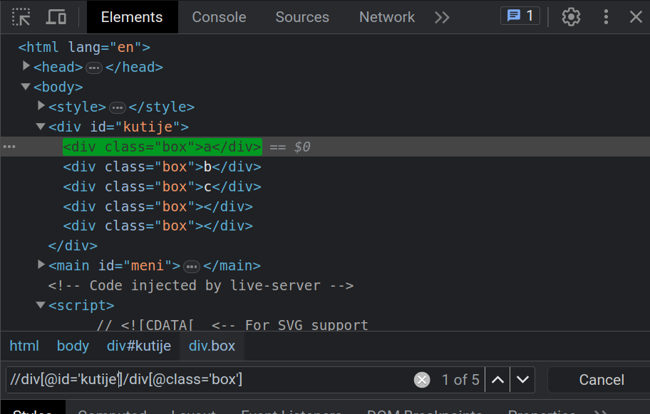

[Vežbe](../../../README.md)

[Knjiga](../../README.md)

-----


<style>
.domaci-zadatak {
    border: 5px solid gold;
    padding: 10px;
}

.domaci-zadatak .naslov {
    font-weight: bold;
    text-align: center;
    display: block;
}

.domaci-zadatak .tekst {
    border-top: 2px dashed black;
    border-bottom: 2px dashed black;
    padding-top: 10px;
    padding-bottom: 10px;
}
</style>

# 1. Strukturiranje Veb dokumenata kroz HTML

*HyperText Markup Language* (skr. *HTML*) predstavlja najosnovniji blok za izgradnju Veba. HTML jezik se koristi za opisivanje logičke strukture stranice, odnosno, na koji način je Veb dokument izgrađen. Na primer, u HTML jeziku možemo zadati koji deo stranice čini naslov ili paragraf, gde se nalazi slika, kako se podaci predstavljaju tabelom i slično.

## 1.1 Osnovni elementi HTML dokumenata

HTML dokument se izgrađuje od velikog broja HTML *elemenata* (engl. *element*). Neki od njih definišu *metainformacije* (engl. *metadata*), odnosno, informacije o samom dokumentu, a drugi definišu konkretan sadržaj, kao što su paragraf, slika i dr. Struktura jednog elementa se sastoji od dve *etikete* (engl. *tag*), otvarajuće i zatvarajuće, između kojih se nalazi *sadržaj* (engl. *content*) tog elementa. Sadržaj može biti tekstualnog tipa ili može biti niz nekih drugih HTML elemenata. Naredni kod ilustruje primer HTML elementa `p`.

```html
<p>                     <!-- Otvarajuca etiketa za element "p". -->
    Tekst ide ovde.     <!-- Sadrzaj elementa. -->
</p>                    <!-- Zatvarajuca etiketa za element "p". -->
```

Takođe, postoje elementi koji imaju samozatvarajuću etiketu. Naredni kod ilustruje primer samozatvarajućeg HTML elementa `img`.

```html
                   <!-- Samozatvarajuca etiketa za element "img". -->
```

U nastavku teksta ćemo, kada uvodimo novi element, podrazumevati da je reč o elementu koji ima otvarajuću i zatvarajuću etiketu. Posebno ćemo naglasiti ukoliko je reč o samozatvarajućem elementu.

U prethodnim primerima smo videli i primer HTML komentara. Svaki HTML komentar počinje oznakom `<!--` i završava se oznakom `-->`. Sve što je unutar ove dve oznake neće biti prikazano na stranici, slično kao što komentari u programskim jezicima, na primer C, ne utiču na kompiliranje i izvršavanje koda.

Elemente možemo dodatno okarakterisati *atributima* (engl. *attribute*). Svaki HTML element definiše skup atributa kojima se može okarakterisati. Svaki atribut definiše domen iz kojeg se mogu uzimati vrednosti tog atributa. Atributi su oblika `atribut="vrednost"` i navode se isključivo u okviru otvarajuće etikete. Naredni kod ilustruje element `body` koji je okarakterisan atributom `id` čija je vrednost `telo`.

```html
<body id="telo">
    ...
</body>
```

Postoje generički atributi koji se mogu primeniti na svim elementima, a postoje i specifični atributi za pojedine elemente. Na primer, svi elementi mogu imati atribut `id`, dok samo element `form` može imati atribut `onsubmit`. U ovom poglavlju knjige ćemo se posvetiti upoznavanju različitih HTML elemenata i atributima kojima oni mogu biti okarakterisani. Pre nego što pređemo na pojedinačne elemente, prikažimo i objasnimo neke od generičkih atributa:

- Atribut `class` se koristi za određivanje *klasa* (engl. *class*) kojima element pripada. Element može pripadati jednoj klasi ili više njih. Takođe, jedna klasa može biti dodeljena većem broju elemenata. Vrednost ovog atributa je niz naziva klasa koje se pridodaju elementu, odvojenih znakon razmaka. Na primer, u kodu `<div class="obavestenje"></div>` elementu `div` je dodeljena klasa čiji je naziv `obavestenje`, dok u kodu `<p class="crveni-tekst velika-slova"></p>` elementu `p` su dodeljene dve klase: `crveni-tekst` i `velika-slova`. Nazivi klasa se mogu sastojati od karaktera slova (`a`-`z`, `A`-`Z`), cifara (`0`-`9`), crtice (`-`) i podvlake (`_`) i moraju počinjati karakterom slova.

- Atribut `id` se koristi za određivanje *identifikatora* (engl. *identifier*) elementa. Za razliku od atributa klasa, svaki element može imati najviše jedan identifikator i najviše jedan element može imati neki identifikator. HTML dokument nije validan ukoliko je isti identifikator dodeljen većem broju elemenata. Na primer, u kodu `<nav id="navigacija"></nav>` elementu `nav` je dodeljen identifikator `navigacija`. Pravila imenovanja za identifikatore su identična pravilima za imenovanje klasa.

- Atribut `style` služi za postavljenje stilova nad jednim elementom korišćenjem jezika CSS. Više o ovom atributu će biti reči u narednom poglavlju.

- Atribut `title` služi za navođenje dodatnih informacija o elementu. Veb pregledači najčešće prikazuju ove informacije u vidu *informacione poruke* (engl. *tooltip*) prilikom postavljanja kursora miša na element.

- Atribut `lang` služi za navođenje jezika za sadržaj elementa. Vrednost ovog atributa je kod jezika koji želimo da postavimo. Kompletan spisak kodova jezika se može pronaći na adresi [https://www.w3schools.com/tags/ref_language_codes.asp](https://www.w3schools.com/tags/ref_language_codes.asp).

Sada kada smo upoznati sa osnovnim elementima jezika HTML, započnimo kreiranje naših prvih HTML dokumenata.

## 1.2 Kreiranje HTML dokumenata

HTML dokumenti se na Vebu prepoznaju po ekstenziji `html`. HTML dokumenti predstavljaju jedan od mnogobrojnih tipova Veb resursa. Svakom resursu je dodeljen tip koji se naziva *Multipurpose Internet Mail Extensions* (skr. *MIME*) tip. Tako HTML dokumentima odgovara MIME tip `text/html`.

Osnovna struktura svakog HTML dokumenta data je u narednom kodu.

```html
<!DOCTYPE html>
<html>

<head>
    <title>Naslov</title>
    <meta charset="UTF-8">
</head>

<body>
</body>

</html>
```

<a style="border: 2px solid gray; display: inline-block; padding: 15px; background-color: rgb(114, 211, 250); color: black;"
   href="./Primeri/1/index.html"
   target="_blank">Pogledaj primer uživo</a>

Deklaracija dokumenta `<!DOCTYPE html>` predstavlja posebnu vrstu elementa kojom se definiše verzija HTML dokumenta koja se koristi. Konkretno, ovom deklaracijom navodimo da ćemo koristiti verziju 5 HTML standarda.

Elementom `html` definišemo sadržaj HTML dokumenta. Svi HTML dokumenti se sastoje od dva dela:

- *Zaglavlje* (engl. *head* ili *header*) sadrži informacije o samom dokumentu, kao i linkove ka definicijama stilova (CSS) i programskih elemenata (JavaScript). Ove informacije služe da opišu dokument i one nisu vidljive na stranici. Primeri informacija su: naslov, opis, jezik, ključne reči, itd. Zaglavlje je definisano elementom `head`.

- *Telo* (engl. *body*) sadrži vizuelne elemente koji će biti prikazani korisniku. Sve što se nalazi u telu dokumenta je vidljivo u okviru veb pregledača. Takođe, sve što želimo da bude vidljivo, moramo da stavimo u telo dokumenta. Telo je definisano elementom `body`.

Objasnimo i preostale elemente. Element `title` služi za davanje semantičkog naslova dokumenta. Ovaj naslov će se prikazivati u većini veb pregledača kao ime kartice u kojoj je dokument otvoren, ali i u rezultatima pretrage. Element `meta` nudi različite mogućnosti za dodavanje metainformacija dokumentu, najčešće u vidu atributa ovog elementa. Na primer, atributom `charset="UTF-8"` postavlja se UTF-8 kao kodna shema za dokument. U nastavku ćemo videti još neke primere metainformacija.

U prethodnom primeru takođe vidimo obaveznu strukturu svakog HTML dokumenta, definisanu HTML specifikacijom. Možemo testirati da li naš HTML dokument predstavlja validno napisan dokument pomoću HTML validatora. Jedan primer validatora je moguće pronaći na adresi [https://html5.validator.nu/](https://html5.validator.nu/). Na primer, da smo izostavili element `title`, validator bi se pobunio i prikazao nam odgovarajuću poruku, što je prikazano na narednoj slici.

<div style="max-width: 98%;">

</div>

Kroz ovu jednostavnu strukturu vidimo da se svi HTML elementi (sa izuzetkom specijalnog elementa `<!DOCTYPE html>`) nalaze u okviru sadržaja nekih drugih elemenata. Jedini izuzetak od ovog pravila je element `html`. Zapravo, svi HTML elementi formiraju drvoliku strukturu u čijem se korenu nalazi element `html`. Ova drvolika struktura se naziva *Document Object Model* (skr. *DOM*) i svaki veb pregledač prilikom parsiranja HTML dokumenta u svojoj memoriji formira ovu strukturu, koja se često naziva *DOM stablo* (engl. *DOM tree*). Primer DOM stabla za osnovnu strukturu svakog HTML dokumenta data je na narednoj slici.

<div style="max-width: 98%;">

</div>

Kao što smo rekli, zaglavlje HTML dokumenta predstavljeno je elementom `head`. Takođe, upoznali smo se sa dva važna elementa zaglavlja: `title`, koji definiše naslov dokumenta i `meta` koji zadaje metainformacije o dokumentu. Najveći broj metainformacija se zadaje u obliku para atributa `name="..."` i `content="..."`. U sledećoj tabeli dat je spisak nekih metainformacija i primer njihovog korišćenja.

| Naziv | Primer upotrebe |
| ----- | --------------- |
|`language` | `<meta name="language" content="sr">` |
|`author` | `<meta name="author" content="Ajzenhamer N, Bukurov A.">` |
|`keywords` | `<meta name="keywords" lang="sr" content="html, uvit">` |
|`description` | `<meta name="description" content="Primer HTML datoteke">` |
|`generator` | `<meta name="generator" content="Visual Studio Code">` |

Telo HTML dokumenta je određeno elementom `body`. U okviru njegovog sadržaja, potrebno je da vršimo ugnežđavanje elemenata koje želimo da prikažemo korisniku. Dakle, u okviru tela elemenata ne želimo da smeštamo metainformacije, već strukturu samog HTML dokumenta. HTML standard definiše veliki broj strukturnih elemenata, i u nastavku poglavlja ćemo se upoznati sa velikim brojem ovih elemenata.

## 1.3 Blokovski i linijski elementi

HTML elemente možemo podeliti na različite načine. Jedna od najkorisnijih podela jeste na naredne dve kategorije elemenata[^1]:

[^1]: Ove kategorije HTML elemenata su definisane standardom pre HTML5, dok se u verziji HTML5 definišu nove kategorije. Ipak, ova podela je dosta lakša za razumevanje, te zato koristimo staru terminologiju umesto nove.

- Veb pregledači *blokovske elemente* (engl. *block element*) tipično prikazuju sa praznim redom pre i nakon elementa. Možemo ih vizualizovati kao kutije koje se slažu jedna ispod druge. Dodatno, blokovski elementi zauzimaju čitavu širinu elementa u kojem se nalaze.

- Za razliku od njih, *linijski elementi* (engl. *inline element*) mogu da počinju bilo gde u liniji (ne nužno na početku novog reda) i njihova veličina zavisi od veličine njihovog sadržaja.

Jedna važna karakteristika ovih kategorija jeste da blokovski elementi mogu da sadrže linijske elemente i druge blok elemente, dok linijski elementi mogu da sadrže samo linijske elemente.

Na primeru opisanih elemenata možemo demonstrirati ovo ponašanje. Na narednim slikama su dati primeri blokovskog (slika A) i linijskog (slika B) elementa, čiji je vizualni prikaz jasno istaknut.

<div style="max-width: 98%;">

<br>
(A) Primer blokovskog elementa
</div>

<a style="border: 2px solid gray; display: inline-block; padding: 15px; background-color: rgb(114, 211, 250); color: black;"
   href="./Primeri/2/index.html"
   target="_blank">Pogledaj primer uživo</a>

<div style="max-width: 98%;">

<br>
(B) Primer linijskog elementa
</div>

<a style="border: 2px solid gray; display: inline-block; padding: 15px; background-color: rgb(114, 211, 250); color: black;"
   href="./Primeri/3/index.html"
   target="_blank">Pogledaj primer uživo</a>

## 1.4 Elementi za grupisanje sadržaja

HTML5 standard je uveo nove elemente kojima je moguće pridružiti semantičko značenje delovima HTML dokumenata. Neki od tih elemenata su:

- Element `header` za naslovni sadržaj
- Element `nav` za navigacioni sadržaj
- Element `main` za glavni sadržaj
- Element `footer` za završni sadržaj
- Element `aside` za sadržaj sa strane, dodatni sadržaj, i sl.
- ...

Važno je razumeti da ovi elementi definišu isključivo semantičku organizaciju elemenata na stranici, odnosno, oni dodeljuju odgovarajuće značenje elementima koje sadrže i ne podrazumevaju nikakav poseban način prikazivanja tih  elemenata. Na narednoj slici prikazan je primer upotrebe ovih elemenata.

<div style="max-width: 98%;">

</div>

Elemente možemo grupisati bez nekog unapred određenog semantičkog značenja, najčešće radi izdvajanja logičkih celina, koje se potom veoma često i vizualno izdvajaju od ostalih celina. Primera radi, HTML5 standard ne definiše element koji bi mogao prikazivati obaveštenja na stranici, ali mi možemo grupisati više elemenata koji obrazuju obaveštenje, a zatim ga stilizovati na neki prepoznatljiv način. 

U tu svrhu, na raspolaganju nam je blokovski element `div`, koji poput HTML5 semantičkih elemenata ne podrazumeva poseban način prikazivanja, već pomoću njega možemo da izdvojimo i, najčešće, imenujemo celine koje ćemo stilizovati na neki način. 

## 1.5 Elementi za prikaz teksta

HTML definiše nekoliko grupa elemenata za prikaz teksta. Neki od njih su:

- Naslovi
- Paragraf
- Linijski tekst
- Citati

### 1.5.1 Naslovi

Tekst možemo istaknuti u vidu naslova koristeći blokovske elemente `<h1>` do `<h6>`. Oni takođe dodeljuju semantički značaj tekstu koji obeležavaju. Takođe, oni podrazumevaju i odgovarajući prikaz teksta, koji je dat na narednoj slici koja prati naredni kod.

```html
<!DOCTYPE html>
<html>

<head>
    <title>Primer 4</title>
    <meta charset="UTF-8">
</head>

<body>
    <h1>Heading 1</h1>
    <h2>Heading 2</h2>
    <h3>Heading 3</h3>
    <h4>Heading 4</h4>
    <h5>Heading 5</h5>
    <h6>Heading 6</h6>
</body>

</html>
```

<div style="max-width: 98%;">

</div>

<a style="border: 2px solid gray; display: inline-block; padding: 15px; background-color: rgb(114, 211, 250); color: black;"
   href="./Primeri/4/index.html"
   target="_blank">Pogledaj primer uživo</a>

### 1.5.2 Paragraf, novi red i separacija sadržaja

Pored naslova, tekst možemo obeležiti i blokovskim elementom `p` koji definiše jedan paragraf teksta. Podrazumevano, tekst obeležen ovim elementom se prostire celom širinom elementa u kojem se nalazi (kao i svaki drugi blokovski element). Tako, na primer, ukoliko se nalazi u elementu `body`, tekst će se prostirati celom širinom prozora veb pregledača.

Na narednoj slici dat je prikaz HTML koda u nastavku, koji definiše tri paragrafa teksta. Kao što se vidi sa slike, bez obzira na broj belina u okviru teksta koji predstavlja sadržaj elementa `p`, veb pregledači prikazuju najviše jedan znaka razmaka između reči. Ovo pravilo važi u opštem slučaju, ne samo za paragraf `p`.

```html
<!DOCTYPE html>
<html>

<head>
    <title>Primer 5</title>
    <meta charset="UTF-8">
</head>

<body>
    <p>Lorem ipsum dolor sit amet, consectetur adipiscing elit. Aliquam luctus enim
        eu nulla ultricies finibus. Sed a lacus vulputate, scelerisque tellus eu, iaculis
        justo. Curabitur aliquet velit vel odio lacinia tristique ultricies vitae odio.
        Quisque pharetra et purus fringilla placerat.</p>

    <p>
        Aliquam sed velit sed urna varius semper. Proin vehicula dui sed mauris
        rhoncus, nec molestie leo ullamcorper. Morbi ultricies interdum nisi, quis
        volutpat orci tempor eget. Nulla magna lectus, condimentum ac tellus id,
        aliquam euismod ipsum. Nunc eget egestas metus, a congue orci.
    </p>

    <p>
        Donec ut vestibulum nulla,

        nec scelerisque lectus. Donec rhoncus, massa et


        hendrerit euismod
        , ex enim congue


        diam, a feugiat felis


        diam id ante. Praesent dapibus orci lorem. Aliquam at elit eros.
    </p>
</body>

</html>
```

<div style="max-width: 98%;">

</div>

<a style="border: 2px solid gray; display: inline-block; padding: 15px; background-color: rgb(114, 211, 250); color: black;"
   href="./Primeri/5/index.html"
   target="_blank">Pogledaj primer uživo</a>

Ukoliko želimo da tekst prelomimo u novi red, potrebno je da na odgovarajućoj poziciji umetnemo samozatvarajući element `<br>`. Na narednoj slici dat je prikaz paragrafa koji je prelomljen na dva mesta - prvi put sa jednim prelomom, a drugi put sa tri preloma (koji prikazuju dve prazne linije teksta). Još jednom skrećemo pažnju da bez obzira na broj belina u tekstu, veb pregledač generiše najviše jedan karakter razmaka, kao što je prikazano na datoj slici, koja je generisana narednim HTML kodom.

```html
<!DOCTYPE html>
<html>

<head>
    <title>Primer 6</title>
    <meta charset="UTF-8">
</head>

<body>
    <p>
        For 50 years, WWF has been protecting the future of nature.
        <br>
        The world's leading conservation organization,


        WWF works in 100 countries and is supported by
        <br>
        <br>
        <br>
        1.2 million members in the United States and
        close to 5 million globally.
    </p>
</body>

</html>
```

<div style="max-width: 98%;">

</div>

<a style="border: 2px solid gray; display: inline-block; padding: 15px; background-color: rgb(114, 211, 250); color: black;"
   href="./Primeri/6/index.html"
   target="_blank">Pogledaj primer uživo</a>

Standardom HTML5 je definisano ponašanje elementa `hr` kao definisanje tematske podele u HTML dokumentu, na primer, promenu teme. On se koristi ukoliko želimo da razdvojimo sadržaj ili definišemo promenu na HTML stranici. U prethodnim HTML standardima, ovaj element je služio kao horizontalna linija, te se zbog toga u većini veb pregledača danas on i prikazuje kao horizontalna linija. Ipak, njegovo značenje je danas više semantičko nego prezentaciono. Naredni kod ilustruje upotrebu ovog elementa, a njegov prikaz je dat na narednoj slici.

```html
<!DOCTYPE html>
<html>

<head>
    <title>Primer 7</title>
    <meta charset="UTF-8">
</head>

<body>
    <p>
        Ovaj paragraf bi trebalo da sadrzi tekst koji govori nesto o
        HTML jeziku za obelezavanje teksta.
    </p>

    <hr>

    <p>
        Ovaj paragraf bi trebalo da sadrzi tekst koji govori nesto o
        CSS jeziku za stilizovanje.
    </p>
</body>

</html>
```

<div style="max-width: 98%;">

</div>

<a style="border: 2px solid gray; display: inline-block; padding: 15px; background-color: rgb(114, 211, 250); color: black;"
   href="./Primeri/7/index.html"
   target="_blank">Pogledaj primer uživo</a>

### 1.5.3 Linijski tekst

Element `span` definiše deo teksta, najčešće jednu reč ili deo rečenice (ali ne nužno). Veličina elementa zavisi od veličine teksta koji se nalazi kao njegov sadržaj. Očigledno, ova karakteristika potiče od činjenice da je element `span` predstavnik linijskih elemenata. Na narednoj slici je dat prikaz narednog HTML koda, koji definiše dva `span` elementa u okviru paragrafa. Sa slike se jasno vidi da element `span` u oba slučaja zauzima samo onoliko prostora koliko zauzima njegov sadržaj.

```html
<!DOCTYPE html>
<html>

<head>
    <title>Primer 8</title>
    <meta charset="UTF-8">

    <link rel="stylesheet" type="text/css" href="index.css">
</head>

<body>
    <p>
        Lorem ipsum dolor sit amet,

        <span>consectetur</span>

        adipiscing elit. Aliquam luctus enim eu nulla ultricies finibus.
        Sed a lacus vulputate, scelerisque tellus eu,

        <span>iaculis justo. Curabitur aliquet velit vel odio lacinia tristique ultricies vitae odio. Quisque pharetra et purus fringilla</span>
        
        placerat.
    </p>
</body>

</html>
```

<div style="max-width: 98%;">

</div>

<a style="border: 2px solid gray; display: inline-block; padding: 15px; background-color: rgb(114, 211, 250); color: black;"
   href="./Primeri/8/index.html"
   target="_blank">Pogledaj primer uživo</a>

### 1.5.4 Citati

Citati se mogu prikazati na više načina. Na primer, linijskim elementom `q` veb pregledač obično doda znake navoda oko teksta koji predstavlja sadržaj tog elementa. Na narednoj slici dat je prikaz narednog HTML koda.

```html
<!DOCTYPE html>
<html>

<head>
    <title>Primer 9</title>
    <meta charset="UTF-8">
</head>

<body>
    <p>
        Browsers usually insert quotation marks around the q element.
    </p>

    <p>
        WWF's goal is to:
        <q>Build a future where people live in harmony with nature.</q>
    </p>
</body>

</html>
```

<div style="max-width: 98%;">

</div>

<a style="border: 2px solid gray; display: inline-block; padding: 15px; background-color: rgb(114, 211, 250); color: black;"
   href="./Primeri/9/index.html"
   target="_blank">Pogledaj primer uživo</a>

Element `blockquote` se obično koristi ukoliko želimo da istaknemo neki citat. Veb pregledač će obično uvući prikaz teksta koji predstavlja citat. Element `blockquote` je predstavnik blokovskih elemenata, što je vidljivo na narednoj slici koja daje prikaz narednog HTML koda.

```html
<!DOCTYPE html>
<html>

<head>
    <title>Primer 10</title>
    <meta charset="UTF-8">
</head>

<body>
    <span>Begin quote</span>
    <blockquote cite="http://www.worldwildlife.org/who/index.html">
        For 50 years, WWF has been protecting the future of nature.
        The world's leading conservation organization,
        WWF works in 100 countries and is supported by
        1.2 million members in the United States and
        close to 5 million globally.
    </blockquote>
    <span>End quote</span>
</body>

</html>
```

<div style="max-width: 98%;">

</div>

<a style="border: 2px solid gray; display: inline-block; padding: 15px; background-color: rgb(114, 211, 250); color: black;"
   href="./Primeri/10/index.html"
   target="_blank">Pogledaj primer uživo</a>

<div class="domaci-zadatak">
    <span class="naslov">Domaći zadatak 1</span> 
    <p class="tekst">
        Napisati HTML i CSS kod koji odgovara stranici na narednoj slici. Pomoću validatora osigurati se da je kod napisan u skladu sa HTML5 standardom.
    </p>
    
</div>

## 1.6 Slike

Slike često predstavljaju nezaobilazni element veb prezentacija. Najosnovniji način za uključivanje slika u HTML dokument je pomoću samozatvarajućeg elementa `img`. Kako bismo naveli koji resurs želimo da uključimo kao sliku, potrebno je da zadamo lokaciju resursa kao vrednost atributa `src`.

Pored atributa `src` element `img` ima i jedan važan obavezni atribut `alt`. Njegova uloga je da prikaže alternativni tekst, ukoliko iz bilo kog razloga klijent nije u stanju da prikaže željeni resurs. Na primer, ako ne može da mu pristupi, najčešće zato što resurs ne postoji na traženoj lokaciji ili ako korisnik koristi *čitače ekrana* (engl. *screen reader*). Korišćenje ovog atributa se smatra dobrom praksom, te ćemo ga mi koristiti. Osim što predstavlja dobru praksu, kao što smo rekli, HTML standard zahteva korišćenje ovog atributa i u suprotnom, stranica neće biti validirana.

Naredni primer i prateća slika ilustruju korišćenje elementa `img`.

```html
<!DOCTYPE html>
<html>

<head>
    <title>Primer 11</title>
    <meta charset="UTF-8">
</head>

<body>
    
</body>

</html>
```

<div style="max-width: 98%;">

</div>

<a style="border: 2px solid gray; display: inline-block; padding: 15px; background-color: rgb(114, 211, 250); color: black;"
   href="./Primeri/11/index.html"
   target="_blank">Pogledaj primer uživo</a>

### 1.6.1 Figure i anotiranje elemenata

Jedan zanimljiv blokovski element koji služi za anotaciju drugih elemenata, pre svega slika, ilustracija, kodova, ali i drugih elemenata, naziva se `figure`. Ovaj element možemo razumeti kao "obuhvatajući element", koji sadrži nekakav sadržaj i prateći tekst za taj sadržaj koji je potrebno smestiti kao sadržaj elementa `figcaption`. Sadržaj predstavlja ono što želimo da istaknemo, a prateći tekst ima ulogu anotacije tog sadržaja.

Naredni kod i prateća slika ilustruju primer korišćenja ovih elemenata.

```html
<!DOCTYPE html>
<html>

<head>
    <title>Primer 12</title>
    <meta charset="UTF-8">
</head>

<body>
    <figure>
        
        <figcaption>
            <p>Slika 1: Jesen, šareno godišnje doba</p>
        </figcaption>
    </figure>
</body>

</html>
```

<div style="max-width: 98%;">

</div>

<a style="border: 2px solid gray; display: inline-block; padding: 15px; background-color: rgb(114, 211, 250); color: black;"
   href="./Primeri/12/index.html"
   target="_blank">Pogledaj primer uživo</a>

Dajmo i dve napomene koje se tiču korišćenja ovih elemenata:

- Anotacija pomoću elementa `figcaption` je opciona. Element `figure` ne mora biti anotiran. Ali ako jeste, onda se element `figcaption` mora javiti kao njegov direktni potomak (dete).

- U primeru je anotacija prikazana ispod sadržaja. Ukoliko želimo da prikažemo anotaciju iznad sadržaja, dovoljno je da obrnemo redosled elemenata `figcaption` i `img` u HTML kodu. Drugim rečima, dovoljno je prvo kodirati anotaciju, a zatim sadržaj.

## 1.7 Liste

Pored tabela, nabrajanja podataka, pojmova, kategorija i drugih stavki su takođe veoma česta u veb prezentacijama. Sva ova nabrajanja se mogu obeležiti listama u jeziku HTML. U zavisnosti od tipa nabrajanja razlikujemo tri tipa listi:

1. Nenumerisane liste

2. Numerisane liste

3. Opisne liste

### 1.7.1 Nenumerisane liste

*Nenumerisane* ili *neuređene liste* (engl. *unordered list*) služe za nabrajanje stavki liste kojima redosled nije važan. Ove liste se obeležavaju elementom `ul`. Svaka stavka liste treba da se nađe između otvarajuće i zatvarajuće etikete ovog elementa, a jednu stavku obeležavamo elementom `li` u čijem sadržaju se nalazi sam tekst stavke koja se nabraja.

Naredni primer i prateća slika ilustruju upotrebu nenumerisanih listi. Kao što vidimo, podrazumevani prikaz liste je takav da su stavke uvučene u odnosu na tekst, kao i da ispred svake stavke stoji popunjen krug.

```html
<!DOCTYPE html>
<html>

<head>
    <title>Primer 13</title>
    <meta charset="UTF-8">
</head>

<body>
    <h1>Welcome to our French restaurant!</h1>

    <p>Menu du Brunch:</p>
    <ul>
        <li>French toast</li>
        <li>Oeufs Benedicts</li>
        <li>Oeufs Brouillés</li>
        <li>French Crêpes</li>
    </ul>

    <p>Menu du Déjeuner:</p>
    <ul>
        <li>Soupe du jour</li>
        <li>Salade d'arugula et prosciutto</li>
        <li>Tartare de boeuf</li>
        <li>Salmon wellington</li>
    </ul>

    <p>Menu du Diner:</p>
    <ul>
        <li>Salade du bistro</li>
        <li>Camembert rôti, miel et herbes</li>
        <li>Canard à l'orange</li>
        <li>Filet mignon sauce bordelaise</li>
    </ul>
</body>

</html>
```

<div style="max-width: 98%;">

</div>

<a style="border: 2px solid gray; display: inline-block; padding: 15px; background-color: rgb(114, 211, 250); color: black;"
   href="./Primeri/13/index.html"
   target="_blank">Pogledaj primer uživo</a>

### 1.7.2 Numerisane liste

*Numerisane* ili *uređene liste* (engl. *ordered list*) služe za nabrajanje stavki liste u kojima je poredak elemenata važan. Ove liste obeležavamo elementom `ol`. Za obeležavanje stavki takođe koristimo element `li`, kao i kod nenumerisanih listi.

Naredni primer i prateća slika ilustruju upotrebu numerisanih listi. Kao što vidimo, podrazumevani prikaz liste je takav da su stavke uvučene u odnosu na tekst, kao i da ispred svake stavke stoji dekadni redni broj te stavke.

```html
<!DOCTYPE html>
<html>

<head>
    <title>Primer 14</title>
    <meta charset="UTF-8">
</head>

<body>
    <h1>Plan za današnje časove iz UVIT-a</h1>

    <p>HTML:</p>
    <ol>
        <li>Tabele</li>
        <li>Liste</li>
        <li>Veze</li>
    </ol>

    <p>CSS:</p>
    <ol>
        <li>Stilizovanje tabela</li>
        <li>Stilizovanje listi</li>
        <li>Pseudoklase</li>
        <li>Stilizovanje elemenata pomoću pseudoklasa</li>
    </ol>
</body>

</html>
```

<div style="max-width: 98%;">

</div>

<a style="border: 2px solid gray; display: inline-block; padding: 15px; background-color: rgb(114, 211, 250); color: black;"
   href="./Primeri/14/index.html"
   target="_blank">Pogledaj primer uživo</a>

Podrazumevano, nabrajanje stavki počinje brojem 1. Međutim, ovo ponašanje je pomuće izmeniti tako što se nad elementom `ol` primeni atribut `start` čija je vrednost pozicija od koje se započinje nabrajanje. Naredni primer i prateća sliku ilustruju korišćenje ovog atributa.

```html
<!DOCTYPE html>
<html>

<head>
    <title>Primer 15</title>
    <meta charset="UTF-8">
</head>

<body>
    <h1>Plan za današnje časove iz UVIT-a</h1>

    <p>HTML:</p>
    <ol>
        <li>Tabele</li>
        <li>Liste</li>
        <li>Veze</li>
    </ol>

    <p>CSS:</p>
    <ol start="4">
        <li>Stilizovanje tabela</li>
        <li>Stilizovanje listi</li>
        <li>Pseudoklase</li>
        <li>Stilizovanje elemenata pomoću pseudoklasa</li>
    </ol>
</body>

</html>
```

<div style="max-width: 98%;">

</div>

<a style="border: 2px solid gray; display: inline-block; padding: 15px; background-color: rgb(114, 211, 250); color: black;"
   href="./Primeri/15/index.html"
   target="_blank">Pogledaj primer uživo</a>

### 1.7.3 Opisne liste

*Opisne liste* (engl. *description list*) služe za nabrajanje pojmova i njihovih definicija, opisa i sl. Sama lista se obeležava elementom `dl`, dok je svaka stavka predstavljena dvama elementima: `dt` obeležava sam pojam koji se opisuje (engl. *data term*), a `dd` obeležava opis tog pojma (engl. *data description*).

Naredni primer i prateća slika ilustruju korišćenje opisne liste.

```html
<!DOCTYPE html>
<html>

<head>
    <title>Primer 16</title>
    <meta charset="UTF-8">
</head>

<body>
    <h1>My favourite things</h1>

    <dl>
        <dt>What is my favorite drink?</dt>
        <dd>Coffee</dd>
        <dt>What is my favorite food?</dt>
        <dd>Sushi</dd>
        <dt>What is my favourite anime?</dt>
        <dd>Fruits Basket</dd>
    </dl>
</body>

</html>
```

<div style="max-width: 98%;">

</div>

<a style="border: 2px solid gray; display: inline-block; padding: 15px; background-color: rgb(114, 211, 250); color: black;"
   href="./Primeri/16/index.html"
   target="_blank">Pogledaj primer uživo</a>

### 1.7.4 Ugnežđene liste

Liste se mogu ugnežđavati čime se ostvaruje višestrukost u nabrajanju. Moguće je ugnežđavati bilo koju listu (unutrašnja lista) u bilo koju drugu listu (spoljašnja lista) jednostavnim umetanjem celog sadržaja unutrašnje liste u okviru sadržaja jedne stavke `li` spoljašnje liste.

Naredni primer i prateća slika ilustruju ugnežđavanje opisnih listi u numerisanu listu.

```html
<!DOCTYPE html>
<html>

<head>
    <title>Primer 17</title>
    <meta charset="UTF-8">
</head>

<body>
    <h1>Horoskopski znaci u godišnjim dobima</h1>

    <ol>
        <li>
            Proleće
            <dl>
                <dt>Ovan</dt>
                <dd>21. mart - 19. april</dd>
                <dt>Bik</dt>
                <dd>20. april - 20. maj</dd>
                <dt>Blizanci</dt>
                <dd>21. maj - 20. jun</dd>
            </dl>
        </li>
        <li>
            Leto
            <dl>
                <dt>Rak</dt>
                <dd>21. jun - 22. jul</dd>
                <dt>Lav</dt>
                <dd>23. jul - 22. avgust</dd>
                <dt>Devica</dt>
                <dd>23. avgust - 22. septembar</dd>
            </dl>
        </li>
        <li>
            Jesen
            <dl>
                <dt>Vaga</dt>
                <dd>23. septembar - 22. oktobar</dd>
                <dt>Škorpija</dt>
                <dd>23. oktobar - 21. novembar</dd>
                <dt>Strelac</dt>
                <dd>22. novembar - 21. decembar</dd>
            </dl>
        </li>
        <li>
            Zima
            <dl>
                <dt>Jarac</dt>
                <dd>22. decembar - 19. januar</dd>
                <dt>Vodolija</dt>
                <dd>20. januar - 18. februar</dd>
                <dt>Ribe</dt>
                <dd>19. februar - 20. mart</dd>
            </dl>
        </li>
    </ol>
</body>

</html>
```

<div style="max-width: 98%;">

</div>

<a style="border: 2px solid gray; display: inline-block; padding: 15px; background-color: rgb(114, 211, 250); color: black;"
   href="./Primeri/17/index.html"
   target="_blank">Pogledaj primer uživo</a>

## 1.8 Tabele

Dvodimenzionalni podaci se najjednostavnije prikazuju u vidu tabela. HTML jezik ima podršku za rad sa tabelama, međutim, postoji jedna važna razlika između klasičnog shvatanja tabela i načina kako su tabele koncipirane u HTML jeziku. Tradicionalno, tabele posmatramo kao matrice podataka, odnosno, svaki podatak je organizovan u vrste i kolone. Za razliku od ovog pristupa u HTML jeziku tabele posmatramo kao sekvence redova podataka, što će se prirodno preslikati u odgovarajuće elemente. Drugim rečima, ne postoji HTML element koji predstavlja jednu kolonu u pravom smislu te reči, ali videćemo da je moguće upravljati prikazom podatka kroz više kolona.

Konkretizujmo diskusiju iz prethodnog paragrafa uvođenjem novih HTML elemenata za rad sa tabelama. Osnovni element od kojeg polazimo jeste `table`. Njegov sadržaj čini, kao što smo rekli, sekvenca redova, pri čemu se svaki red zapisuje elementom `tr` (engl. *table row*). Svaki red sadrži proizvoljan broj ćelija koji predstavljaju jedan podatak u tabeli. Svaka ćelija je predstavljena elementom `td` (engl. *table data*).

Naredni primer ilustruje najjednostavniju upotrebu opisanih elemenata. Kao što vidimo na pratećoj slici, tabele ne podrazumevaju nikakvu vizualnu reprezentaciju osim dvodimenzionalnog raspoređivanja elemenata. Za bilo kakva stilizovanja kao što su postavljanje ivica tabele, bojenje pozadine ćelija i sl. koristi se jezik CSS.

```html
<!DOCTYPE html>
<html>

<head>
    <title>Primer 18</title>
    <meta charset="UTF-8">
</head>

<body>
    <table>
        <tr>
            <td>C</td>
            <td>Askorbinska kiselina</td>
            <td>Voda</td>
        </tr>
        <tr>
            <td>D</td>
            <td>Kalciferol</td>
            <td>Masti</td>
        </tr>
    </table>
</body>

</html>
```

<div style="max-width: 98%;">

</div>

<a style="border: 2px solid gray; display: inline-block; padding: 15px; background-color: rgb(114, 211, 250); color: black;"
   href="./Primeri/18/index.html"
   target="_blank">Pogledaj primer uživo</a>

Tabele često imaju zaglavlje koje opisuje šta svaki od elemenata te tabele predstavlja. HTML jezik podržava korišćenje zaglavlja pomoću elemenata `th` (engl. *table header*) koji se koriste umesto elemenata `td`, na isti način. Naredni kod i prateća slika ilustruju korišćenje zaglavlja nad prethodnim primerom tabele. Ono što možemo primetiti jeste da veb pregledači u ćelijama zaglavlja obično prikazuju tekst sa podebljanjem i horizontalnim poravnanjem.

```html
<!DOCTYPE html>
<html>

<head>
    <title>Primer 19</title>
    <meta charset="UTF-8">
</head>

<body>
    <table>
        <tr>
            <th>Vitamin</th>
            <th>Pun naziv</th>
            <th>Rastvorljivost</th>
        </tr>
        <tr>
            <td>C</td>
            <td>Askorbinska kiselina</td>
            <td>Voda</td>
        </tr>
        <tr>
            <td>D</td>
            <td>Kalciferol</td>
            <td>Masti</td>
        </tr>
    </table>
</body>

</html>
```

<div style="max-width: 98%;">

</div>

<a style="border: 2px solid gray; display: inline-block; padding: 15px; background-color: rgb(114, 211, 250); color: black;"
   href="./Primeri/19/index.html"
   target="_blank">Pogledaj primer uživo</a>

Poput slika i tabele često bivaju anotirane. Za anotiranje tabele koristi se element `caption` koji, ukoliko se koristi, mora biti prvo dete elementa `table` u DOM stablu da bi dokument bio u skladu sa standardom. Za podešavanje pozicije anotacije se koristi odgovarajuće svojstvo u jeziku CSS. Naredni primer i prateća sliku ilustruju anotiranje tabela.

```html
<!DOCTYPE html>
<html>

<head>
    <title>Primer 20</title>
    <meta charset="UTF-8">
</head>

<body>
    <table>
        <caption>Tabela 1: Informacije o nekim vitaminima</caption>
        <tr>
            <th>Vitamin</th>
            <th>Pun naziv</th>
            <th>Rastvorljivost</th>
        </tr>
        <tr>
            <td>C</td>
            <td>Askorbinska kiselina</td>
            <td>Voda</td>
        </tr>
        <tr>
            <td>D</td>
            <td>Kalciferol</td>
            <td>Masti</td>
        </tr>
    </table>
</body>

</html>
```

<div style="max-width: 98%;">

</div>

<a style="border: 2px solid gray; display: inline-block; padding: 15px; background-color: rgb(114, 211, 250); color: black;"
   href="./Primeri/20/index.html"
   target="_blank">Pogledaj primer uživo</a>

Kao što smo najavili, možemo organizovati podatke tako da, umesto da zauzimaju tačno jednu ćeliju, oni se prostiru kroz više redova ili kolona. Ukoliko želimo da neka ćelija zauzme površinu većeg broja redova, onda je toj ćeliji potrebno dodeliti atribut `rowspan` čija je vrednost broj redova kroz koji se ćelija prostire. Sličan pristup važi i za prostiranje kroz kolone, sa razlikom da se koristi atribut `colspan`. Međutim, ovo nije jedina stvar koju je potrebno uraditi. Da bi tabela bila validna, potrebno je iz njene HTML strukture izbaciti sve ćelije čija je pozicija "zauzeta" onim ćelijama koje se prostiru kroz više redova ili kolona.

Naredni primer ilustruje tabelu dimenzija 5x6, pri čemu se neke ćelije prostiru preko nekih drugih. Konkretno, ćelija 8 se prostire kroz tri reda, ćelija 10 se prostire kroz dve kolone, ćelija 15 se prostire kroz dve kolone i ćelija 17 se prostire kroz dva reda. Takođe, navedene su sve ćelije preko kojih se one prostiru. Primetimo da su u kodu zakomentarisane one ćelije preko kojih se navedene ćelije prostiru. Naravno, mogli smo ih jednostavno ukloniti iz koda, ali su namerno ostavljene da bi se lakše usvojio koncept prostiranja ćelija.

Takođe, tabela je stilizovana radi preglednijeg prostiranja ćelija. Svi stilovi su izdvojeni u zasebnu datoteku `index.css` tako da ne odvlače pažnju od HTML koda.

```html
<!DOCTYPE html>
<html>

<head>
    <title>Primer 21</title>
    <meta charset="UTF-8">

    <link rel="stylesheet" type="text/css" href="index.css">
</head>

<body>
    <table>
        <tr>
            <td>1</td>
            <td>2</td>
            <td>3</td>
            <td>4</td>
            <td>5</td>
            <td>6</td>
        </tr>
        <tr>
            <td>7</td>
            <td rowspan="3">8, 14, 20</td>
            <td>9</td>
            <td colspan="2">10, 11</td>
            <!-- <td>11</td> -->
            <td>12</td>
        </tr>
        <tr>
            <td>13</td>
            <!-- <td>14</td> -->
            <td colspan="2">15, 16</td>
            <!-- <td>16</td> -->
            <td rowspan="2">17, 23</td>
            <td>18</td>
        </tr>
        <tr>
            <td>19</td>
            <!-- <td>20</td> -->
            <td>21</td>
            <td>22</td>
            <!-- <td>23</td> -->
            <td>24</td>
        </tr>
        <tr>
            <td>25</td>
            <td>26</td>
            <td>27</td>
            <td>28</td>
            <td>29</td>
            <td>30</td>
        </tr>
    </table>
</body>

</html>
```

<div style="max-width: 98%;">

</div>

<a style="border: 2px solid gray; display: inline-block; padding: 15px; background-color: rgb(114, 211, 250); color: black;"
   href="./Primeri/21/index.html"
   target="_blank">Pogledaj primer uživo</a>

## 1.9 Veze

Veze su linijski elementi koji služe za povezivanje resursa na vebu, mahom veb strana ili njihovih fragmenata. Ukoliko želimo da dodamo vezu ka nekom resursu u veb prezentaciji, potrebno je na mestu gde veza treba da se pojavi da umetnemo element `a` (engl. *anchor*).

U zavisnosti od vrednosti narednih atributa primenjih nad elementom `a` veza se definiše na različite načine:

- Vrednost obaveznog atributa `href` predstavlja putanju do resursa koji će biti uvezan sa tekućim dokumentom. 

- Vrednost atributa `target` određuje na koji način će veza ka resursu biti otvorena u veb pregledaču. Neke od vrednosti koje ovaj atribut može uzeti su:

   - Navođenjem vrednosti `_blank` se sugeriše veb pregledaču da uvezeni veb resurs prikaže u novoj kartici.

   - Navođenjem vrednosti `_self` se sugeriše veb pregledaču da uvezeni veb resurs prikaže u tekućoj kartici u kojoj je dokument prikazan. Ovo ponašanje je podrazumevano.

- Vrednost atributa `hreflang` označava jezik koji je korišćen u uvezenom resursu.

- Vrednost atributa `type` označava MIME tip uvezenog resursa.

Postoje dva tipa veza:

- Spoljašnje veze 

- Unutrašnje veze

U spoljašnje veze spadaju one veze koje vode do veb resursa van tekućeg dokumenta. Većina veza na internetu je ovog tipa, na primer, veza koja vodi sa naše veb prezentacije ka video snimku na YouTube servisu je primer spoljašnje veze. Takođe, veze između veb dokumenata bilo u okviru istog ili različitih veb servera predstavljaju spoljašnje veze. 

Spoljašnje veze se kreiraju korišćenjem elementa `a` sa atributom `href` postavljenim na putanju koja vodi do veb resursa. Putanja može biti:

- Apsolutna - navodi se URL veb resursa ili eventualno apsolutna putanja na sistemu datoteka ako se resurs nalazi na tekućem veb serveru.

- Relativna - navodi se relativna putanja veb resursa, podrazumevano, u odnosu na direktorijum u kojem se nalazi tekući veb dokument. Međutim, ovo ponašanje je moguće prevazići postavljanjem elementa `base` u okviru sadržaja zaglavlja dokumenta (tj. u okviru sadržaja elementa `head`) čiji je atribut `href` postavljen na vrednost putanje u odnosu na koju su sve ostale putanje u tekućem veb dokumentu relativne.

Unutrašnje veze koriste se za povezivanje delova istog veb dokumenta. Na primer, česta je praksa kreirati element na dnu veb dokumenta koji uvezuje vrh stranice kako bismo poštedeli korisnika skrolovanja nazad.

Unutrašnje veze se kreiraju dodeljivanjem identifikatora elementu ka kojem želimo da postoji unutrašnja veza. Zatim, na odgovarajućem mestu, korišćenjem elementa `a` sa atributom `href` čija je vrednost prethodno postavljeni identifikator elementa.

Naredni kodovi ilustruju korišćenje različitih tipova veza i njihove varijante korišćenjem opisanih elemenata i njihovih atributa. S obzirom da ovaj primer obuhvata nekoliko dokumenata specifično organizovanih po direktorijumima, prvo dajemo opis strukture datoteka iz primera u sistemu datoteka, a zatim prikazujemo kodove i dajemo shemu veb resursa koji su uvezani na pratećoj slici. 

Struktura datoteka, koje učestvuju u primeru, na sistemu datoteka je:

```
.
..
stranice/
    druga.html
index.html
index.css
```

Sadržaj datoteke `index.html` je:

```html
<!DOCTYPE html>
<html>

<head>
    <title>Primer 22</title>
    <meta charset="UTF-8">

    <link rel="stylesheet" type="text/css" href="index.css">
</head>

<body id="naslov">
    <h1>Veze u HTML jeziku</h1>

    <div>
        <a href="./stranice/druga.html"
           type="text/html">
            Ovo je spoljašnja veza ka drugom dokumentu u okviru istog veb servera. Ova veza je realizovana relativnom
            putanjom u odnosu na tekući direktorijum.
        </a>
    </div>

    <div>
        <a href="https://www.youtube.com/watch?v=mU6anWqZJcc" 
           target="_blank"
           hreflang="en">
            Ovo je spoljašnja veza ka veb resursu u okviru drugog veb servera u odnosu na ovaj dokument. Ova veza je realizovana apsolutnom
            putanjom u vidu URL pitanje. Dodatno, ova veza bi trebalo da se otvori u novoj kartici.
        </a>
    </div>

    <div id="pomeri-na-dno">
        <a href="#naslov">
            Ako klikneš na mene, bićeš vraćen na vrh dokumenta. Ova veza predstavlja primer unutrašnje veze.
        </a>
    </div>
</body>

</html>
```

Sadržaj datoteke `druga.html` je:

```html
<!DOCTYPE html>
<html>

<head>
    <title>Primer 22</title>
    <meta charset="UTF-8">

    <!-- Sve relativne putanje su u odnosu na roditeljski direktorijum -->
    <base href="../">

    <link rel="stylesheet" type="text/css" href="index.css">
</head>

<body>
    <h1>Veze u HTML jeziku - druga strana</h1>

    <div>
        <a href="index.html">
            Ovo je spoljašnja veza ka početnoj stranici. Ova veza je realizovana relativnom putanjom u odnosu na
            direktorijum koji je postavljen u zaglavlju dokumenta pomoću elementa "base".
        </a>
    </div>
</body>

</html>
```

Sadržaj datoteke `index.css` dajemo radi kompletnosti primera i bez namene u udubljavanju u njen sadržaj. Napomenimo da je uloga ove datoteke u proširivanju visine veb pregledača da bi veza, koja je pomerena na dno veb stranice bila bolje ilustrovana. Dodatno, datoteka predefiniše stil nekih elemenata kako bi bili ilustrativniji u prikazu uživo.

```css
body {
    position: relative;
    height: 2000px;
}

#pomeri-na-dno {
    position: absolute;
    bottom: 10px;
}

div {
    border: 1px solid salmon;
    padding: 20px;
    margin: 10px 0;
}
```

<a style="border: 2px solid gray; display: inline-block; padding: 15px; background-color: rgb(114, 211, 250); color: black;"
   href="./Primeri/22/index.html"
   target="_blank">Pogledaj primer uživo</a>

## 1.10 Formulari

Da bismo sakupili informacije od korisnika, na raspolaganju nam je veliki izbor HTML elemenata pomoću kojih možemo da omogućimo korisniku da unese podatke ili da odabere neke od predefinisanih podataka. Ovi elementi se nazivaju *elementi formulara*, i obuhvaćeni su u elementu koji predstavlja jedan formular - element `form`. Više o tome kako se podaci iz formulara šalju ka serveru biće reči kada budemo pričali o načinu obraživanja podataka na serveru.

Najjednostavniji način za unos podataka jeste putem elementa `input`. Njegov prikaz zavisi od vrednosti njegovog atributa `type`:
- Za jednolinijski tekstualni unos koristi se vrednost `text`. Tekst koji se unosi može biti proizvoljan.
	
- Za unos lozinke koristi se vrednost `password`. Veb pregledač će najćešće prikazati karaktere zvezdice ili tačkice umesto stvarnog teksta koji se unosi.
	
- Za definisanje proizvoljnog dugmeta koji treba da izvrši neku akciju koristi se vrednost `button`.

- Za definisanje dugmeta koji će poslati podatke iz formulara ka serveru koristi se vrednost `submit`. Ovaj element ima smisla definisati samo u okviru elementa `form`. 
	
- Za definisanje dugmeta koji briše sve unete podatke iz formulara koristi se vrednost `reset`.

- Za odabir tačno jednog od više ponuženih izbora koristi se vrednost `radio`. Ovaj element ima smisla definisati samo u okviru elementa `form`. Da bi se znalo za koju opciju se vezuje koji izbor, ovim elementima je potrebno dodeliti atribut `name`. Na primer:
        
    ```html
    <input type="radio" name="gender" value="male" checked> Male
    <input type="radio" name="gender" value="female"> Female
    <input type="radio" name="gender" value="other"> Other
    ```

    Primetimo da svaki element ima i atribut `value` kojim se definiše izbor za opciju koja se nalazi kao vrednost atributa `name`. Ovaj element predstavlja samo jedno dugme za izbor, ali ne i prateći tekst, te je potrebno dodati opis naknadno, kao u gornjem primeru. Takođe, prvo po redu radio dugme ima atribut `checked` kojom se obeležava koje će dugme inicijalno biti obeleženo. Važno je napomenuti da ovaj atribut nema vrednost, već samo njegovih navođenjem specifikujemo da element ima to svojstvo.
	
- Za odabir proizvoljnog broja od više ponuđenih izbora koristi se vrednost `checkbox`. Ovaj tip elementa funkcioniše na sličan način kao i prethodni tip. Razlika je u tome što ne moramo da ih vežemo za specifičnu opciju, već svaki izbor može da predstavlja svoju opciju. Na primer:
	
    ```html
    <input type="checkbox" name="vehicle1" value="Bike"> I have a bike
    <input type="checkbox" name="vehicle2" value="Car"> I have a car 
    ```

HTML5 standard definiše još više tipova za element `input`. Istražiti definisane tipove na [ovoj adresi](https://www.w3schools.com/html/html_form_input_types.asp) u sekciji "HTML5 Input Types" i obratiti pažnju na kompatibilnost veb pregledača za svaki od njih.

Element `input` ima i određeni broj atributa specifičnih za njega:

- Kao što smo videli, atributom `name` definišemo naziv opcije.
	
- Atribut `value` određuje vrednost za to polje.
	
- Atribut `readonly` određuje da vrednost ne bi trebalo da se menja. On se samo navodi, poput atributa `checked`.
	
- Atribut `disabled` određuje da polje ne prima unos. Njegova vrednost neće biti poslata kao deo podataka iz formulara ka serveru. On se takođe samo navodi, poput prethodnog atributa.
	
- Atribut `size` definiše veličinu polja (u karakterima).

- Atribut `maxlength` definiše najveći broj karaktera koji element može da primi. 

- Atribut `placeholder` definiše tekst koji će pisati u polju dok korisnik ne unese neku vrednost.

HTML5 standard definiše još više atributa za element `input`. Istražiti definisane atribute na [ovoj adresi](https://www.w3schools.com/html/html_form_attributes.asp) u sekciji "HTML5 Attributes" i obratiti pažnju na kompatibilnost veb pregledača za svaki od njih. Naredni primer ilustruje primenu prethodno opisanih atributa i vrednosti:

```html
<!DOCTYPE html>
<html lang="en">
<head>
    <meta charset="UTF-8">
    <meta name="viewport" content="width=device-width, 
    initial-scale=1.0">
    <title> Primer 23 </title>
</head>
<body>
    <form>
        Korisničko ime*:  <input id="korisnicko_ime" type="text" 
        name="korisnicko_ime" maxlength="20" required>
        <br>
        Šifra*:  <input id="sifra1" name="sifra1" type="password" 
        placeholder="Sifra..." required>
        <br>
        Ponovi šifru*:  <input id="sifra2" name="sifra2" 
        type="password" required>
        <br>

        Pol:
        <input type="radio" name="pol" value="musko" checked> Muško
        <input type="radio" name="pol" value="zensko"> Žensko
        <input type="radio" name="pol" value="-"> Odbijam da se 
        izjasnim
        <br>
        <br>
        <input type="checkbox" name="vesti" value="vesti"> Želim da 
        primam vesti
        <br>
        <br>
        <input type="submit" value="Registruj se!">
        <input type="reset" value="Poništi unos!">
    </form>
</body>
</html>
```

<div style="max-width: 98%;">

</div>

<a style="border: 2px solid gray; display: inline-block; padding: 15px; background-color: rgb(114, 211, 250); color: black;"
   href="./Primeri/23/index.html"
   target="_blank">Pogledaj primer uživo</a>


Pored elementa `input`, HTML jezik definiše i druge elemente za unos podataka.

Element `select` predstavlja *padajuću listu* (engl. *dropdown list*) sa izborima. Atributom `name` definišemo naziv te opcije, a svaki od izbora je predstavljen elementom `option`, čiji atribut `value` definiše jedan izbor. Elementi `option` se nalaze kao sadržaj elementa `select`. Sadržaj elementa `option` predstavlja tekst koji se prikazuje prilikom izbora opcije. Na primer:

```html
<select name="cars">
    <option value="volvo">Volvo</option>
    <option value="saab">Saab</option>
    <option value="fiat">Fiat</option>
    <option value="audi">Audi</option>
</select>
```

Podrazumevano je prvi element `option` označen kao odabrani, ali to se može redefinisati dodeljivanjem atributa `selected` izboru koji želimo da bude podrazumevano označen: 

```html
<option value="fiat" selected>Fiat</option>
```

Ako nad elementom `select` postavimo atribut `multiple`, onda je moguće odabrati više opcija pomoću tastera `CTRL` ili `CMD`:

```html
<select name="cars" multiple>
    <option value="volvo">Volvo</option>
    <option value="saab">Saab</option>
    <option value="fiat">Fiat</option>
    <option value="audi">Audi</option>
</select>
```

Ako želimo da izvršimo grupisanje opcija, to možemo uraditi pomoću elementa `optgroup`, kao u narednom primeru:

```html
<select>
    <optgroup label="Swedish Cars">
        <option value="volvo">Volvo</option>
        <option value="saab">Saab</option>
    </optgroup>
    <optgroup label="German Cars">
        <option value="mercedes">Mercedes</option>
        <option value="audi">Audi</option>
    </optgroup>
</select>
```

Postoji i još jedan način za izlistavanje opcija. Moguće je da za `input` elemente definišemo predefinisane vrednosti koje mogu biti odabrane korišćenjem elementa `datalist`. Korišćenjem ovog elementa u kombinaciji sa `input` elementom (koji u tom slučaju mora da ima atribut `list` čija je vrednost identifikator elementa `datalist`), to `input` polje će dobiti opciju automatskog dopunjavanja. Ovaj element nije dostupan u Safari pregledačima.

```html
<input list="browsers">
<datalist id="browsers">
    <option value="Internet Explorer">
    <option value="Firefox">
    <option value="Chrome">
    <option value="Opera">
    <option value="Safari">
</datalist>
```

Element `textarea` definiše višelinijski unos teksta. Atributima `rows` i `cols` se definiše vidljivi broj vrsta, odnosno, kolona, redom:

```html
<textarea name="message" rows="10" cols="30">
    The cat was playing in the garden.
</textarea>
```

Dodatno, veličinu ovog elementa možemo definisati i korišćenjem CSS svojstava `width` i `height`:


```html
<textarea name="message" style="width:200px; height:600px">
    The cat was playing in the garden.
</textarea>
```

Naredni primer ilustruje primenu ovih elemenata:

```html
<!DOCTYPE html>
<html lang="en">
<head>
    <meta charset="UTF-8">
    <meta name="viewport" content="width=device-width, initial-scale=1.0">
    <title> Primer 24 </title>
</head>
<body>
    <form>
        Omiljeni auto:
        <select>
            <optgroup label="Švedska">
                <option value="volvo">Volvo</option>
                <option value="saab">Saab</option>
            </optgroup>
            <optgroup label="Nemačka">
                <option value="mercedes">Mercedes</option>
                <option value="audi">Audi</option>
                <option value="bmw">BMW</option>
                <option value="opel">Opel</option>
                <option value="volkswagen">Volkswagen</option>
                <option value="porsche">Porsche</option>
            </optgroup>
            <optgroup label="Francuska">
                <option value="peugeot">Peugeot</option>
                <option value="renault">Renault</option>
                <option value="citroen">Citroen</option>
            </optgroup>
            <optgroup label="Japan">
                <option value="honda">Honda</option>
                <option value="nissan">Nissan</option>
                <option value="toyota">Toyota</option>
                <option value="suzuki">Suzuki</option>
                <option value="mazda">Mazda</option>
            </optgroup>
        </select>
        <br><br>
        Omiljeni pretraživač:
        <input list="pretrazivaci">
        <datalist id="pretrazivaci">
            <option value="Internet Explorer">
            <option value="Firefox">
            <option value="Chrome">
            <option value="Opera">
            <option value="Safari">
            <option value="Brave">
        </datalist>
        <br><br>
        <textarea name="message" rows="7" cols="40" 
        placeholder="Napomena...">
        </textarea>
        <br>
        <br>
        <input type="submit" value="Pošalji odgovor!">
        <input type="reset" value="Poništi unos!">
    </form>
</body>
</html>
```

<div style="max-width: 98%;">

</div>

<a style="border: 2px solid gray; display: inline-block; padding: 15px; background-color: rgb(114, 211, 250); color: black;"
   href="./Primeri/24/index.html"
   target="_blank">Pogledaj primer uživo</a>


Za grupisanje više elemenata formulara koji su međusobno povezani u jednu celinu, možemo koristiti element `fieldset`. Ovaj element će nacrtati pravougaonik oko elemenata koje obuhvata. Da bismo anotirali ovakvu jednu celinu, možemo koristiti element `legend`, čiji je tekstualni sadržaj naslov celine koja je definisana `fieldset` elementom. 

Još jedan način za semantičko obeležavanje elemenata formulara jeste upotreba elementa `label`. Ovim elementom se definiše oznaka za elemente `button`, `input`, `meter`, `output`, `progress`, `select`, ili `textarea`. Ovaj element se ne renderuje za korisnika kao drugi vizualni elementi, ali omogućava da kada korisnici kliknu na tekstualni sadržaj ovog elementa, odgovarajuća kontrola na koju se odnosi element `label` postaje aktivna. Da bismo povezali element `label` sa nekim elementom formulara, koristimo njegov atribut `for`, čija je vrednost identifikator elementa za kojeg ga vezujemo.

```html
<!DOCTYPE html>
<html lang="en">
<head>
    <meta charset="UTF-8">
    <meta name="viewport" content="width=device-width, 
    initial-scale=1.0">
    <title> Primer 23 </title>
</head>
<body>
    <form>
        <fieldset>
            <legend> Prijavljivanje </legend>
    
            <label for="username"> Korisničko ime*: </label>
            <input id="username" type="text" name="korisnicko_ime" 
            required>
    
            <label for="password"> Šifra*: </label>
            <input id="password" name="sifra" type="password"  
            required>
        </fieldset>
        <input type="submit" value="Prijavi se!">
    </form>
</body>
</html>
```

<div style="max-width: 98%;">

</div>

<a style="border: 2px solid gray; display: inline-block; padding: 15px; background-color: rgb(114, 211, 250); color: black;"
   href="./Primeri/25/index.html"
   target="_blank">Pogledaj primer uživo</a>


## 1.11 XPath

XPath (XML Path Language) je jezik koji omogućava prolazak kroz čvorove XML dokumenta. On koristi izraze da obuhvati jedan ili više čvorova. Izrazi ovog jezika se mogu koristiti u JavaScript-u, u Javi, XML-u, Python-u, C-u, C++-u. XPath je deo XSLT standarda.

Sintaksa:

```html
//tagname[@attribute = ‘value’]
```

- // - traži čvor u celom dokumentu;
- / - traži čvor počevši od korena;
- tagname - tag čvora koji se traži (div, input, p...);
- @ - za selektovanje atributa;
- attribute - naziv atributa (class, id, type...);
- value - vrednost atributa.

Testiranje putanje se može raditi u developer konzoli, desni klik inspect, zatim ctrl+f. Prikaz će biti kao na narednoj slici:
<div style="max-width: 98%;">

</div>

Naredni primer će biti korišćen za prikaz mogućnosti XPath izraza:
```html
<!DOCTYPE html>
<html lang="en">
<head>
    <meta charset="UTF-8">
    <meta name="viewport" content="width=device-width, initial-scale=1.0">
    <title>Document</title>
</head>
<body>
    <style>
        .box{
            width: 50px;
            height: 50px;
            background-color: red;
            display: inline-block;
        }
    </style>
    <div id="kutije">
        <div class="box">а</div>
        <div class="box">abc</div>
        <div class="box">c</div>
        <div class="box"></div>
        <div class="box"></div>
    </div>
    <main id="meni">
        <form id="prijava">
            <label for="username">Ime: </label>
            <input type="text" id="username">
            <label for="password">Sifra: </label>
            <input type="password" id="password">
        </form>
    </main>
</body>
</html>
```

#### Apsolutna putanja

Apsolutna putanja počinje sa / i zahteva putanju od korenog elementa (html/xml). Na primer:

- Naredni izraz daje divove koji imaju klasu _box_ a nalaze se unutar diva, koji je u body, a koji se nalazi u html elementu koji je ujedno i koren dokumenta.
```html
/html/body/div/div[@class='box']
```

- Naredni izraz daje divove koji imaju klasu _box_ a nalaze se unutar diva sa id-em _kutija_, koji je u body, a koji se nalazi u html elementu koji je ujedno i koren dokumenta.
```html
/html/body/div[@id='kutije']/div[@class='box']
```


#### Relativna putanja

Relativne putanje počinju sa // i pretražuju ceo dokument. Na primer:

- Naredni izraz daje sve divove sa klasom _box_ koji se nelaze u dokumentu.
```html
//div[@class='box']
```

- Naredni izraz daje div sa identifikatorom _kutije_ koji se nelazi u dokumentu.
```html
//div[@id='kutije']
```

- Naredni izraz daje sva input polja koja imaju tip _text_.
```html
//input[@type='text']
```

#### Funkcije

XPath izrazi mogu da sadrže naredne funkcije:

1. contains() - čvor sadrži vrednost
    - Naredni izraz daje main elemente čiji identifikator sadži tekst _eni_.
```html
//main[contains(@id, 'eni')]
```

2. starts-with() - počinje sa
    - Naredni primer daje main elemente čiji identifikator počinje sa _a_.
```html
//main[starts-with(@id, 'm')]
```

3. text() - element sadrži tekst
    - Naredni primer daje div elemente koji sadže text _a_.
```html
//div[text() = 'a']
```

Pored funkcija, dozvoljeno je korišćenje AND i OR operatora. Na primer:

```html
//div[text() = 'a' or @class='box']
//div[text() = 'a' and @class='box']
```

Više o ovoj temi se može daći na adresi [https://www.geeksforgeeks.org/introduction-to-xpath/](https://www.geeksforgeeks.org/introduction-to-xpath/).

-----

[Knjiga](../../README.md)

[Vežbe](../../../README.md)

<!--
<div style="max-width: 98%;">

</div>
-->

<!-- 
<a style="border: 2px solid gray; display: inline-block; padding: 15px; background-color: rgb(114, 211, 250); color: black;"
   href="./Primeri/X/index.html"
   target="_blank">Pogledaj primer uživo</a>
-->