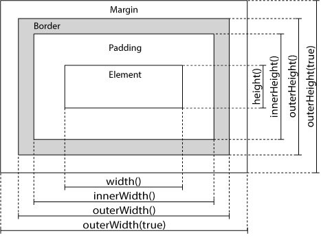
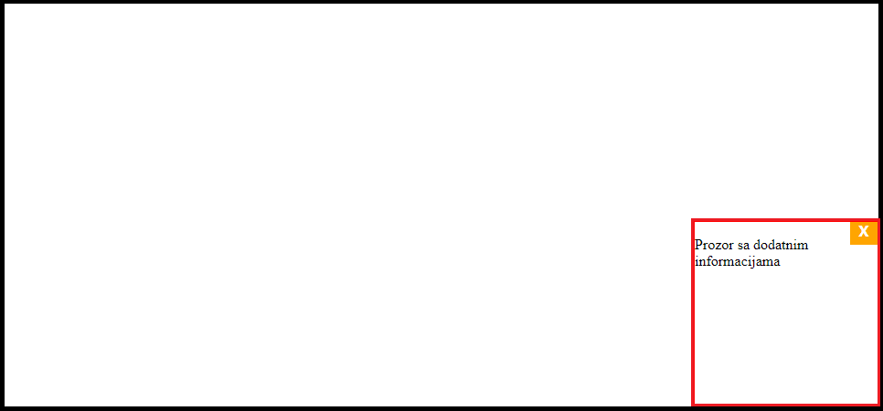
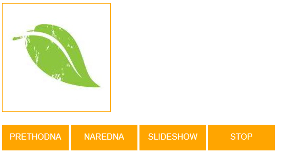

[Vežbe](../../../README.md)

[Knjiga](../../README.md)

-----

# 6. Biblioteka jQuery

jQuery je biblioteka za JavaScript jezik čija je osnovna upotreba olakšavanje razvoja čestih funkcionalnosti u jeziku JavaScript. jQuery objedinjuje često korišćene poslove koji zahtevaju mnogo linija koda u metode koji se pozivaju jednom linijom. Takođe, jQuery pojednostavljuje mnoge komplikovane stvari iz JavaScript-a kao što su AJAX pozivi i DOM manipulacije. jQuery biblioteka sadrži sledeće:

-  Metode za upravljanje DOM stablom
-  Metode za upravljanje CSS stilovima
-  HTML metode zasnovane na događajima
-  Efekte i animacije
-  Metode za kreiranje AJAX zahteva
-  Druge pomoćne metode

Iako postoje mnoge biblioteke za razvoj u jeziku JavaScript, jQuery je jedna od najkorišćenijih, najpopularnijih i najviše se širi. Neke od velikih kompanija koje koriste jQuery su Google, Microsoft, IBM, Netflix, i dr. Jedna od osobina jQuery biblioteke jeste ta da će raditi isto u svim većim pregledačima, pa čak i u Internet Explorer 6.

## 6.1. Asinhrono programiranje 

U *sinhronom* modelu programiranja, stvari se dešavaju sekvencionalno, jedna za drugom. Kada pozovemo funkciju koja izvršava neku akciju, ona se vraća tek kada je akcija završena i tada može da vrati neki rezultat. Ovim se program stopira za ono vreme koliko je bilo potrebno toj akciji da se završi.

*Asinhroni* model programiranja dozvoljava više stvari da se dešavaju u isto vreme. Kada pokrenemo neku akciju, program nastavlja sa radom. Onog trenutka kada akcija završi, program biva informisan o završetku akcije i dobija pristup rezultatu.

Poređenje između sinhronog i asinhronog programiranja se može jednostavno sagledati kroz naredni primer. Neka je potrebno napisati program koji dohvata dva resursa sa interneta, a zatim kombinuje rezultate. U sinhronom modelu, najjednostavniji način jeste da se zahtevi za resursima vrše jedan za drugim (postoje i konkurentni sistemi u sinhronom modelu programiranja o kojima neće biti reči u tekstu). Problem ovog pristupa jeste da se drugi zahtev započinje tek onda kada se prvi završi. Ukupno vreme rada programa je najmanje zbir trajanja dohvatanja odgovora. U asinhronom modelu, moguće je poslati dva zahteva jedan za drugim, a zatim u trenutku kada su obe vrednosti dostupne, vrši se kombinovanje rezultata. Prednost ovog modela je u tome što se preklapa vreme potrebno za dohvatanje dva resursa, čime se značajno ubrzava rad programa.

### 6.1.1. Funkcije povratnog poziva

Jedan pristup asinhronom programiranju jeste da se funkcije koje izvršavaju duge ili spore akcije konstruišu tako da prihvataju dodatni argument koji predstavlja tzv. *funkciju povratnog poziva* (engl. *callback function*). Takve akcije se započnu, a zatim kada se završe, funkcija povratnog poziva se poziva sa rezultatom te akcije. Ako bolje pogledamo, ova semantika u potpunosti oslikava asinhroni model programiranja koji smo opisali u uvodu.

Kao primer ovog modela, možemo razmotriti funkciju `setTimeout`, dostupnu i u veb pregledačima i u Node.js platformi, koja prihvata dva argumenta: funkciju povratnog poziva i broj milisekundi. Ova funkcija postavlja tajmer koji traje prosleđeni broj milisekundi i po isteku tajmera, poziva se prosleđena funkcija povratnog poziva:

```js
console.log('Start!');
setTimeout(function() {
	console.log('Tick');
}, 1000);
```

Ako otvorimo konzolu, prvo što ćemo primetiti jeste da se ispiše:

```js
Start!
```

Nakon jedne sekunde, ispis se menja u 

```js
Start!
Tick
```

Vidimo da se anonimna funkcija povratnog poziva koju smo prosledili funkciji `setTimeout` izvršila asinhrono, u ovom slučaju, tek nakon što je istekao tajmer koju je postavila funkcija `setTimeout`.

Slično, metod `setInterval` omogućava učestalo izvršavanje zadate funkcije povratnog poziva kao prvi argument u pravilnim vremenskim razmacima čija se perioda zadaje drugim argumentom. Za upravljanje ovim pozivima koristi se povratna vrednost metoda. Pre svega, pozivom metoda `clearInterval`, kojem se prosleđuje povratna vrednost metoda `setInterval`, može se prekinuti dalje ponavljanje poziva. Na primer:

```js
// Ispiši Tick! svake sekunde
const si = setInterval(function() {
	console.log('Tick!');
}, 1000);

// Nakon 5 sekundi, prekini dalje ispisivanje
setTimeout(function() {
	clearInterval(si);
}, 5500);
```

Rezultat ispisa:

```js
Tick!
Tick!
Tick!
Tick!
Tick!
```

### 6.1.2. `XMLHttpRequest` objekat

Da bismo poslali asinhroni HTTP zahtev ka nekom resursu (ovakvi zahtevi se još nazivaju i *AJAX* zahtevi, skr. od *Asynchronous JavaScript And XML*), potrebno je kreirati objekat klase `XMLHttpRequest`, otvoriti url ka resursu, i poslati zahtev. Nakon što se transakcija završi, objekat će sadržati korisne informacije poput tela HTTP odgovora i statusnog koda. Ovaj objekat prolazi kroz razna stanja, kao što je "otvorena konekcija", "finalno stanje" i dr. Svako stanje ima svoj kod.

#### 6.1.2.1. Slanje zahteva

Kao što smo rekli, prvo je potrebno kreirati objekat, koji se inicijalizuje u stanje `UNSET` (kod je *0*):

```js
let xhr = new XMLHttpRequest();
```

Zatim je potrebno formirati HTTP zahtev pozivom metoda `open`. Njegovi argumenti su: 
1. HTTP metod koji se koristi, 
2. URL resursa,
3. Bulova vrednost koja označava da li se zahtev vrši sinhrono ili asinhrono (podrazumevana vrednost je `true`, što označava asinhronost). Metod ima i dodatne argumente za korisničko ime i lozinku.

```js
xhr.open('GET', 'http://api.icndb.com/jokes/random');
```

U ovom trenutku se mogu postaviti zaglavlja HTTP zahteva pomoću `setRequestHeader` metode, na primer, `xhr.setRequestHeader(imePolja, vrednost)`. Zatim je potrebno dodati funkcije povratnog poziva koje će vršiti nekakvu obradu pristiglog odgovora ili, ono što se često radi, obradu pri promeni stanja asinhronog zahteva. Odgovor zahteva je sadržan u svojstvima `response`, `responseText` ili `responseXML` u zavisnosti od tipa odgovora. U slučaju greške, svojstvo `statusText` sadrži statusnu poruku koja odgovara HTTP statusnoj poruci. Na primer:

```js
xhr.addEventListener('load', function() {
    /* 
        Proveravamo da li je odgovor servera sa vrednoscu 200 preko 
        polja zahteva status.
    */
	if (xhr.status === 200) {
		console.log(xhr.response);
	} 
	else {
		console.error(xhr.statusText);
	}
});
```

Događaj `'load'` se izvršava kada objekat pređe u finalno stanje `DONE` (kod je *4*). Događaj `error` se izvršava kada dođe do greske prilikom zahteva:

```js
xhr.addEventListener('error', function() {
	console.error('Problem prilikom slanja zahteva');
});
```

Alternativa je moguća postavljanjem osluškivača nad događajem `readystatechange` koji će pozvati funkciju povratnog poziva prilikom svake promene stanja:

```js
xhr.addEventListener('readystatechange', function() {
	switch(xhr.readyState) {
		case XMLHttpRequest.DONE:
			if (xhr.status === 200) {
				console.log(xhr.response);
			}
			else {
				console.error(xhr.statusText);
			}
	}
});
```

Konačno, potrebno je poslati HTTP zahtev, što se vrši metodom `send`. U zavisnosti od tipa zahteva, opcioni argument metode `send` predstavlja telo zahteva.

```js
xhr.send();
```

Iako jednostavan, ovaj primer ilustruje važan koncept, a to je kreiranje komunikacije između klijentskih i serverskih aplikacija korišćenjem `XMLHttpRequest` objekta. Na ovu temu ćemo se osvrnuti još jednom, kada se budemo upoznali sa kreiranjem naših serverskih aplikacija.

## 6.2. Instalacija jQuery biblioteke

Postoji više načina kako koristiti jQuery. Moguće je:

-  preuzeti jQuery biblioteku sa [http://jquery.com/](http://jquery.com/)
-  umetnuti jQuery sa *mreže za dostavljanje sadržaja* (engl. *Content Delivery Network*, skr. CDN), poput Google CDN.


Postoje dve verzije jQuery-ja dostupne za preuzimanje:

-  Production verzija - koristi se za veb sajtove koji su podignuti i rade (zato što je sve minimizovano i kompresovano)
-  Development verzija - koristi se za testiranje i razvoj (ceo kod je nekompresovan i čitljiv)

Obe verzije su dostupne za preuzimanje sa [http://jquery.com/](http://jquery.com/).

Biblioteku jQuery čini jedinstvena JavaScript datoteka, i može se umetnuti pomoću elementa `script`, kao i svaka druga JavaScript datoteka:

```html
<body>
	<script type="text/javascript" src="jquery-3.4.1.min.js"></script>
</body>
```

Ukoliko ne želimo da preuzmemo i hostujemo jQuery, moguće je umetnuti ga sa nekog CDN-a. Da bismo koristili jQuery na ovakav način, potrebno je umetnuti sledeće:

```html
<body>
    <script src="https://ajax.googleapis.com/ajax/libs/jquery/3.4.1/jquery.min.js"></script>
</body>
```

ili

```html
<body>
	<script src="https://ajax.aspnetcdn.com/ajax/jQuery/jquery-3.4.1.min.js"></script>
</body>
```

Prednost korišćenja ovakvog načina jeste u tome što je većina korisnika verovatno već preuzela jQuery sa Google-a ili Microsoft-a prilikom pretraživanja nekog drugog veb sajta. Kao rezultat toga, jQuery će već biti učitan iz keša, što dovodi do bržeg učitavanja. Takođe, večina CDN-a će se postarati da, kada korisnik zatraži fajl sa njega, taj fajl bude preuzet sa servera koji je najbliži njima, što takođe dovodi do bržeg učitavanja.

## 6.3. Osnovna jQuery sintaksa

jQuery sintaksa je osmišljena za označavanje HTML elemenata i njihovo obrađivanje. Osnovna sintaksa jQuery-ja jeste: `$(selektor).akcija()`:


-  Korišćenjem znaka `$` pristupamo jQuery biblioteci
-  `(selektor)` služi da pronađe HTML element(e)
-  `akcija()` služi da se primeni na element(e)


Neki jednostavni primeri upotrebe dati su narednim primerima:

```js
    /* 
        sakriva trenutni element
    */
    $(this).hide();

    /* 
        sakriva sve "p" elemente		
    */
    $('p').hide();		
    
    /* 
        sakriva sve elemente koji imaju atribut "class" postavljen 
        na vrednost "test"
    */
    $('.test').hide();	
    
    /*
        sakriva sve elemente koji imaju atribut "id" postavljen na 
        vrednost "test"
    */
    $('#test').hide();	
```

### 6.3.1. "Dokument je spreman" događaj

S obzirom da veb pregledači prikazuju stranicu tokom parsiranja HTML dokumenta, može se desiti da želimo da pristupimo, na primer, tekstualnoj vrednosti nekog elementa, a da taj element još uvek nije parsiran i dodat u DOM stablo. Zbog toga može doći do neočekivanih grešaka. Ukoliko želimo da se osiguramo da se neki jQuery kod ne izvršava dok dokument ne završi sa učitavanjem (odnosno, dok ne bude "spreman za obradu"), možemo naš jQuery kod smestiti unutar osluškivača događaja `ready` koji se okida nad objektom `document`:

```js
$(document).ready(function(){

	// Kod koji koristi jQuery biblioteku ide ovde...

});
```

Dobra je praksa sačekati da se dokument učita pre nego što se počne sa radom na njemu. Opisani pristup takođe omogućuje da se JavaScript kod piše u zaglavlju dokumenta, bez brige o tome da li će se on ispravno izvršiti. Neki od primera gde može doći do greške ukoliko su metodi pokrenuti pre nego što je dokument učitan su:

-  Pokušavanje da se sakrije element koji još nije kreiran
-  Pokušavanje dobijanja veličine slike koja još nije učitana
-  ...

## 6.4. jQuery selektori

jQuery selektori omogućavaju selektovanje i upravljanje HTML elementima. Selektori traže HTML elemente na osnovu njihovih identifikatora, klasa, atributa, vrednosti atributa i dr. Bazirani su na CSS selektorima, ali postoje još neki. Svi selektori u jQuery-ju počinju sa znakom dolara i zagradama: `$()`.

U nastavku dajemo spisak najkorišćenijih jQuery selektora i njihovih opisa:

-  Element selektor - elemente možemo selektovati na osnovu njihovih imena. Sve `p` elemente možemo selektovati pomoću `$('p')`.
	
-  Selektor identifikatora - ovaj selektor koristi `id` atribut HTML elementa da bi ga pronašao. Element sa atributom `id="test"` možemo dohvatiti pomoću `$('#test')`.
	
-  Selektor klase - ovaj selektor koristi `class` atribut HTML elementa da bi ga pronašao. Element sa atributom `class="test"` možemo dohvatiti pomoću `$('.test')`.
	
-  Ostali selektori
	-  Selektor `$('*')` selektuje sve elemente.
		
	-  Selektor `$(this)` selektuje element na koji se odnosi funkcija koja ga obuhvata.
		
	-  Selektor `$('p.intro')` selektuje sve `p` elemente sa atributom `class="intro"`.
		
	-  Selektor `$('p:first')` selektuje prvi `p` element.
		
	-  Selektor `$('ul li:first')` selektuje prvi `li` element prvog `ul` elementa.
		
	-  Selektor `$('ul li:first-child')` selektuje prvi `li` element svakog `ul` elementa.
		
	-  Selektor `$('[href]')` selektuje sve elemente koje imaju postavljen atribut `href`.
		
	-  Selektor `$('a[target="_blank"]')` selektuje sve elemente `a` sa atributom `target="_blank"`.
		
	-  Selektor `$('a[target!="_blank"]')` selektuje sve elemente `a` koji nemaju atribut `target="_blank"`.
		
	-  Selektor `$(':button')` selektuje sve `button` elemente, kao i `input` elemente sa atributom `type="button"`.
		
	-  Selektor `$('tr:even')` selektuje sve parne `tr` elemente.
		
	-  Selektor `$('tr:odd')` selektuje sve neparne `tr` elemente.
		
	-  Selektor `$('div:gt(n)')` selektuje sve elemente `div` koji su na poziciji većoj od *n*. Numeracija počinje od *0*.
		
	-  Selektor `$('div:lt(n)')` selektuje sve elemente `div` koji su na poziciji manjoj od *n*. Numeracija počinje od *0*.
		
	-  Selektor `$('div:eq(n)')` selektuje sve elemente `div` koji su na poziciji *n*. Numeracija počinje od *0*.
		
	-  Selektor `$(':checked')` selektuje sve elemente koji imaju selektovana polja i koristi se za `input` elemente tipa `checkbox` ili `radio`.

	-  Selektor `$(':selected')` selektuje sve `option` elemente koji su odabrani.


Metod `is(selector)` proverava da li element nad kojim se poziva zadovoljava prosledjeni argument `selector`. Na primer, za proveru da li je checkbox dugme sa identifikatorom "odaberi" označeno, možemo koristiti:

```js
if ($('#odaberi').is(':checked'))
{
	console.log('Polje je odabrano');
}
else
{
	console.log('Polje nije odabrano');
}
```

## 6.5. jQuery metodi zasnovani na događajima

I u jQuery biblioteci su dostupni različiti događaji koje korisnik može da inicira. Neki od čestih DOM događaja su dati narednom tabelom:

| Događaji miša | Događaji tastature | Događaji formulara | Događaji dokumenta/prozora |
|---------|-------|------|--------|
| `click` | `keypress` | `submit` | `load` |
| `dblclick` | `keydown` | `change` | `resize` |
| `mouseenter` | `keyup` | `focus` | `scroll` |
| `mouseleave` | | `blur` | `unload`|

Većina DOM metoda sa kojima smo se upoznali ima svoj jQuery-ekvivalentan metod. Da bismo pridružili metod događaju `click`, dovoljno je proslediti metod odgovarajućoj jQuery metodi kao argument:

```js
$('p').click(function(){
	// Ovde ide akcija...
});
```

često korišćeni jQuery metodi za definisanje odgovarajućih akcija su:


-  `$(document).ready(callback)` - dozvoljava da se izvrši funkcija `callback` nakon što se učita ceo dokument
	
-  `click(callback)` - funkcija `callback` se izvršava kada korisnik klikne na element
	
-  `dblclick(callback)` - funkcija `callback` se izvršava kada korisnik dvostruko-klikne na element
	
-  `mouseenter(callback)` - funkcija `callback` se izvršava kada kursor pokaže na element
	
-  `mouseleave(callback)` - funkcija `callback` se izvršava kada se izgubi fokus kursora sa elementa
	
-  `mousedown(callback)` - funkcija `callback` se izvršava kada je levi klik miša pritisnut dok je kursor na elementu
	
-  `mouseup(callback)` - funkcija `callback` se izvršava kada je levi klik miša podignut nakon pritiska
	
-  `hover(callback1, callback2)` - metod koji koristi dve funkcije i kombinacija je `mouseenter()` i `mouseleave()` metoda. Funkcija `callback1` se izvršava kada kursor uđe na element, a funkcija `callback2` se izvršava kada kursor napusti element. Na primer:
	
```js
$('#p1').hover(function()
{
	alert('You entered p1!');
},
function()
{
	alert('Bye! You now leave p1!');
});
```

-  `focus(callback)` - koristi se nad elementima čiji se sadržaj može menjati, na primer, polja formulara. Funkcija `callback` se izvršava kada element dobije fokus. Na primer:
	
```js
$('input').focus(function()
{
	$(this).css('background-color', '#cccccc');
});
```
	
-  `blur(callback)` - koristi se nad elementima čiji se sadržaj može menjati, na primer, polja formulara. Funkcija `callback` se izvršava kada se sa elementa napusti fokus. Na primer:
	
```js
$('input').blur(function()
{
	$(this).css('background-color', '#aaaaaa');
});
```

-  `change(callback)` - osluškivač nad ovim događajem se može pridružiti elementima `input`, `textarea` i `select` i odnosi se na promenu vrednosti ovih polja. Svaki put kada se promeni vrednost polja, poziva je funkcija `callback`. Na primer:
	
```js
$('input:checkbox').change(function()
{
	console.log($(this).val());
});
```

Postoji jedan specijalan metod kojim je moguće pridružiti jedan ili više događaja selektovanom elementu - metod `on(eventString, callback`. Njegov prvi argument je naziv događaja, a drugi argument je funkcija povratnog poziva koja će se izvršiti kada se taj događaj okine nad selektovanim elementom. Na primer, pridruživanje `click` događaja elementu `p` može se izvršiti na sledeći način:

```js
$('p').on('click', function(){
	$(this).hide();
});
```

Za pridruživanje više događaja, koristimo varijantu metoda `on(callbacksObj)`, koji kao argument prihvata objekat čija su svojstva nazivi događaja, a vrednosti tih svojstava odgovarajuće funkcije povratnog poziva koje će se izvršiti kada se okinu događaji koji su zadati svojstvima. Na primer:

```js
$('p').on({
	mouseenter: function(){
		$(this).css('background-color', 'lightgray');
	}, 
	mouseleave: function(){
		$(this).css('background-color', 'lightblue');
	}, 
	click: function(){
		$(this).css('background-color', 'yellow');
	} 
});
```

Da bismo ukloniti neki osluškivac sa elementa, možemo koristiti metod `off(event)`, kojem prosleđujemo naziv događaja koji osluškujemo, na primer, `'click'`.


## 6.6. jQuery efekti i animacije

Za sakrivanje i prikazivanje elementa, mogu se koristiti metodi

```js
$(selector).hide(speed, callback);

$(selector).show(speed, callback);
```

gde je `speed` brzina sakrivanja/prikazivanja elementa, koja može da uzima neku od predefinisanih vrednosti `'slow'` i `'fast'` ili broj milisekundi. Opcioni parametar `callback` je funkcija povratnog poziva koja se poziva nakon izvršenja metoda.

Ova dva metoda je moguće kombinovati metodom

```js
$(selector).toggle(speed, callback);
```

koji uzima iste parametre kao i prethodni metodi. Ukoliko je element bio vidljiv, nakon izvršenja ovog metoda, element će biti sakriven. Ukoliko je element bio sakriven, nakon izvršenja ovog metoda, element će biti vidljiv.

Za pravljenje prelaza tokom sakrivanja i prikazivanja elementa, mogu se koristiti metodi

```js
$(selector).fadeIn(speed, callback);

$(selector).fadeOut(speed, callback);

$(selector).fadeToggle(speed, callback);

$(selector).fadeTo(speed, opacity, callback);
```

koji imaju iste parametre kao i prethodni metodi, sa izuzetkom poslednjeg koji ima obavezan parametar `opacity` koji uzima vrednost u pokretnom zarezu između *0* i *1*. Njegov smisao je da odredi do kog nivoa se vrši prelaz.

Za pravljenje efekata "slajdera", mogu se koristiti metodi

```js
$(selector).slideDown(speed, callback);

$(selector).slideUp(speed, callback);

$(selector).slideToggle(speed, callback);
```

jQuery metod `animate` koristi se za pravljenje korisnički definisanih animacija. To znači da pomoću ovog metoda možemo konstruisati najrazličitije animacije. Sintaksa poziva ovog metoda glasi:

```js
$(selector).animate({params}, speed, callback);
```

Obavezni parametar `params` definiše CSS svojstva koja se animiraju. Ovaj parametar uzima vrednost objekta čija su svojstva nazivi CSS svojstava koji će biti primenjeni nad elementom, a vrednosti tih svojstava su vrednosti odgovarajućih CSS svojstava - element nad kojim se metod primenjuje će na kraju animacije imati dodeljene vrednosti za data CSS svojstva. Opcioni parametar `speed` specifikuje dužinu trajanja animacije. Opcioni parametar `callback` je funkcija povratnog poziva koja se izvršava nakon završetka animacije. Naredni primer demonstrira upotrebu ovog metoda tako što pomera `div` element udesno, sve dok nije udaljen od leve ivice za 250px:

```js
$('button').click(function(){
	$('div').animate({left: '250px'});
}); 
```

Moguće je menjati više svojstava odjednom:

```js
$('button').click(function(){
	$('div').animate({
		left: '250px',
		opacity: '0.5',
		height: '150px',
		width: '150px'
	});
}); 
```

Bitno je zapamtiti da ukoliko želimo da menjamo CSS svojstva koja su imenovana sa karakterom `-` u CSS jeziku, ovde moramo da ih pišemo u kamiljoj notaciji. Tako da, na primer, pišemo `paddingLeft` umesto `padding-left`.

Vrednosti koje se animiraju su jednostavne numeričke vrednosti. To znači da, na primer, animiranje boja nije podržano u jezgru jQuery biblioteke. Ukoliko želimo da animiramo boje, potrebno je preuzeti jQuery.Color sa [https://github.com/jquery/jquery-color](https://github.com/jquery/jquery-color). Više informacija je dostupno na [https://api.jquery.com/animate/](https://api.jquery.com/animate/).

Moguće je korišćenje relativnih vrednosti korišćenjem `+=` ili `-=` ispred vrednosti pri čemu se dodaje ili oduzima nova vrednost od stare vrednosti. Na primer:

```js
$('button').click(function(){
	$('div').animate({
		left: '250px',
		height: '+=150px',
		width: '+=150px'
	});
}); 
```

### 6.6.1. Korišćenje funkcionalnosti reda

Po pravilu, jQuery dolazi sa funkcionalnošću reda za animiranje. To znači da ukoliko napišemo više `animate()` poziva jedan iza drugog, jQuery napravi "interni" red od ovih poziva. Animacije se potom izvršavaju jedna po jedna. Neki od primera koji ovo ilustruju su:

```js
$('button').click(function(){
	var div = $('div');
	div.animate({height: '300px', opacity: '0.4'}, 'slow');
	div.animate({width: '300px', opacity: '0.8'}, 'slow');
	div.animate({height: '100px', opacity: '0.4'}, 'slow');
	div.animate({width: '100px', opacity: '0.8'}, 'slow');
}); 
```

i

```js
$('button').click(function(){
	var div = $('div');
	div.animate({left: '100px'}, 'slow');
	div.animate({fontSize: '3em'}, 'slow');
}); 
```

u kojem se prvo pomera `div` element udesno, pa tek onda se uvećava veličina teksta.

jQuery metod `stop` se koristi za zaustavljanje animacije pre nego što se završi. Metod `stop` radi za sve jQuery metode koji implementiraju neki efekat, pa i za slajdere, prelaze i korisničko animiranje. Sintaksa poziva ovog metoda je

```js
$(selector).stop(stopAll, goToEnd);
```

Opcioni `stopAll` parametar specifikuje da li će se animacijski red isprazniti ili ne. Po pravilu je `false`, što znači da će se samo aktivna animacija zaustaviti, a da će sve naredne animacije nastaviti sa izvršavanjem, regularno. Opcioni `goToEnd` parametar specifikuje da li će se u momentu zaustavljanja animacija dovršiti do kraja i po pravilu je `false`. Dakle, podrazumevano, metod `stop` samo zaustavlja trenutnu animaciju koja se vrši na zadatom elementu. Primer rada metoda bez parametara:

```js
$('#stop').click(function(){
	$('#panel').stop();
});
```

### 6.6.2. Implementiranje animacija korišćenjem funkcija povratnog poziva

JavaScript naredbe se izvršavaju linija po liniju. Ipak, sa efektima, naredna linija koda se vrši iako efekat možda još nije završen. Ovo može dovesti do grešaka u radu. Da bi se ovo sprečilo, koriste se funkcije povratnog poziva. Tipična sintaksa je:

```js
$('button').click(function(){
	$('p').hide('slow', function(){
		alert('The paragraph is now hidden');
	});
});
```

Naredni primer ne koristi funkciju povratnog poziva u telu funkcije-argumenta za `click`, pa će se prozorčić prikazati pre nego što je efekat sakrivanja završen, što je nekorektno:

```js
$('button').click(function(){
	$('p').hide(1000);
	alert('The paragraph is now hidden');
});
```

## 6.7. Lančanje metoda

Do sada smo sve jQuery naredbe pisali jednu ispod druge. Ipak, postoji tehnika koja se naziva *lančanje* (engl. *chaining*), koja nam omogućava da pokrenemo više jQuery komandi, jednu za drugom, nad istim elementom (ili nad istim elementima). Na ovaj način pregledači ne moraju da traže iste elemente više od jedanput.

Da bismo ulančali akciju, potrebno je samo nadovezati novu akciju na prethodnu akciju. Sledeći primer ilustruje lančanje metoda `css`, `slideUp` i `slideDown`. Element sa identifikatorom "p1" se prvo menja u crvenu boju, pa zatim pomera naviše, pa na kraju naniže:

```js
$('#p1').css('color', 'red').slideUp(2000).slideDown(2000);
```

Pošto nadovezivanjem jedna linija koda može da postane veoma duga, možemo da je formatiramo kako zelimo, na primer:

```js
$('#p1').css('color', 'red')
	.slideUp(2000)
	.slideDown(2000);
```

što daje isti efekat.

## 6.8. Upravljanje DOM stablom

Jedan veoma važan aspekt jQuery biblioteke jeste upravljanje DOM stablom. Metodi koji nam ovo omogućavaju su:


-  `text()` i `text(text)` - dohvata ili postavlja tekstualan sadržaj selektovanog elementa
	
-  `html()` i `html(htmlString)` - dohvata ili postavlja HTML sadržaj selektovanog elementa
	
-  `val()` i `val(value)` - dohvata ili postavlja vrednost elementa formulara
	
-  `attr(atributeName)` i `attr(attributeName, value)` - dohvata ili postavlja vrednost atributa `attributeName`


Primeri korišćenja ovih metoda dati su u nastavku:

```js
// Postavljanje vrednosti

$('#btn1').click(function(){
    // postavlja text
	$('#test1').text('Hello world!'); 
});

$('#btn2').click(function(){
    // postavlja HTML
	$('#test2').html('<b>Hello world!</b>');
});

$('#btn3').click(function(){
    // postavlja vrednost polja formulara
	$('#test3').val('Dolly Duck'); 
});

// Dohvatanje vrednosti

$('#btn1').click(function(){
    // vraća text
	alert('Text: ' + $('#test').text()); 
});

$('#btn2').click(function(){
    // vraća HTML
	alert('HTML: ' + $('#test').html()); 
});

$('#btn1').click(function(){
    // vraća vrednost polja 
	alert('Value: ' + $('#test').val()); forme
});

$('button').click(function(){
    // vraća vrednost atributa href
	alert($('#w3s').attr('href')); 
});
```

Da bismo dodali novi sadržaj, možemo koristiti metode:


-  `append(content)` - dodaje sadržaj na kraj selektovanog elementa
	
-  `prepend(content)` - dodaje sadržaj na početak selektovanog elementa
	
-  `after(content)` - dodaje sadržaj nakon selektovanog elementa
	
-  `before(content)` - dodaje sadržaj ispred selektovanog elementa


Sva četiri metoda mogu uzimati veći broj parametara da bi kreirali nov sadržaj. Na primer:

```js
function appendText() {
    // Nov element pomoću HTML-a 
    var txt1 = '<p>Text.</p>'; 
       
    // Nov element pomoću jQuery biblioteke
    var txt2 = $('<p></p>').text('Text.');   
    
    // Nov element pomoću DOM-a
	var txt3 = document.createElement('p');  
    txt3.innerHTML = 'Text.';
    
    // Nadovezivanje novih elemenata 
	$('p').append(txt1, txt2, txt3);         
}
```

ili

```js
function afterText() {
    // Nov element pomoću HTML-a  
    var txt1 = '<b>I </b>';
    
    // Nov element pomoću jQuery biblioteke
    var txt2 = $('<i></i>').text('love ');  
    
    // Nov element pomoću DOM-a
	var txt3 = document.createElement('b');    
    txt3.innerHTML = 'jQuery!';
    
    // Dodavanje novih elemenata posle elementa 
	$('img').after(txt1, txt2, txt3);          
}
```

Da bismo obrisali stari sadržaj, možemo koristiti:


-  `remove(selector)` - briše selektovani element kao i svu njegovu decu
-  `empty()` - briše svu decu selektovanog elementa


Ukoliko ipak želimo da filtriramo šta želimo da obrišemo, onda možemo proslediti parametar metodu `remove`, koji predstavlja jQuery selektor. Na primer, da bismo obrisali sve `p` elemente klase "test", možemo koristiti:

```js
$('p').remove('.test');
```

Ukoliko želimo da obrišemo još i sve `p` elemente klase "demo", možemo koristiti:

```js
$('p').remove('.test, .demo');
```

Biblioteka jQuery sadrži veliki broj metoda za prolanaženje elemenata u DOM stablu. Uglavnom se počinje od jednog elementa, pa se prolazi kroz ostale dok se ne dođe do onog koji se traži. U ovoj pretrazi, možemo prolaziti naviše (obilazeći pretke), naniže (obilazeći potomke) ili u istom nivou (obilazeći braću). Neki od metoda za prolazak kroz stablo su:


-  `parent(selector)` - vraća direktnog pretka selektovanog elementa. Može se koristiti opcioni parametar `selector` za filtriranje predaka.
	
-  `parents(selector)` - vraća sve pretke do korena (`html` elementa). Može se koristiti opcioni parametar `selector` za filtriranje predaka.
	
-  `parentsUntil(selector, filter)` - vraća sve pretke između selektovanog elementa i elementa koji se zadaje kao argument `selector`. Može se koristiti opcioni parametar `filter` za filtriranje predaka.
	
-  `children(selector)` - vraća svu direktnu decu selektovanog elementa. Može se koristiti opcioni parametar `selector` za filtriranje dece.
	
-  `find(selector)` - vraća sve potomke do listova, filtrirane po argumentu `selector`.
	
-  `siblings(selector)` - vraća sve rođake u stablu selektovanog elementa. Može se koristiti opcioni parametar `selector` za filtriranje rođaka.
	
-  `next(selector)` - vraća sledećeg rođaka selektovanog elementa. Može se koristiti opcioni parametar `selector` za filtriranje rođaka.
	
-  `nextAll(selector)` - vraća sve sledeće rođake selektovanog elementa. Može se koristiti opcioni parametar `selector` za filtriranje rođaka.
	
-  `nextUntil(selector, filter)` - vraća sve sledeće rođake između selektovanog elementa i elementa koji se zadaje kao argument `selector`. Može se koristiti opcioni parametar `filter` za filtriranje rođaka.
	
-  `prev()`, `prevAll()` i `prevUntil()` - imaju iste uloge kao prethodne tri metode, samo što vraćaju prethodne rođake umesto naredne.


S obzirom da ove metode vraćaju, na primer, niz svih očeva elemenata `p` (ukoliko je pozvan metod `$('p').parent()`), potrebno je ući u dalju pretragu u ovom nizu. Za to nam služe metodi:


-  `first()` - vraća prvi element među selektovanim elementima.
	
-  `last()` - vraća poslednji element među selektovanim elementima.
	
-  `eq(index)` - vraća element koji se nalazi na poziciji u nizu čiji je indeks zadat kao argument metoda. Mogu se zadati negativni brojevi da bi se pretraga vršila od kraja niza.
	
-  `filter(selector)` - vraća sve elemente koji imaju specifikaciju koja se zadaje kao argument metode.
	
-  `not()` - vraća sve elemente koji nemaju specifikaciju koja se zadaje kao argument metode.


## 6.9. Upravljanje stilovima

jQuery poseduje nekoliko metoda za upravljanje CSS klasama. Neki od njih su:


-  `addClass(className)` - dodaje jednu ili više klasa selektovanom elementu
	
-  `removeClass(className)` - uklanja jednu ili više klasa selektovanom elementu
	
-  `toggleClass(className, state)` - prebacuje između dodavanja i uklanjanja klase selektovanog elementa
	
-  `css(propertyName, value)` - dohvata ili postavlja CSS vrednosti u okviru atributa `style`


U narednim primerima podrazumevamo korišćenje sledećih CSS pravila:

```css
.important {
	font-weight: bold;
	font-size: xx-large;
}

.blue {
	color: blue;
}
```

Sledeći primeri ilustruju upotrebu prethodno opisanih metoda:

```js
// Dodavanje jeste klase nad vise elemenata
$('button').click(function(){
	$('div').addClass('important');
	$('h1, h2, p').addClass('blue');
});

// Dodavanje vise klasa jednom elementu
$('button').click(function(){
	$('#div1').addClass('important blue');
});

// Uklanjanje klase nad vise elemenata
$('button').click(function(){
	$('h1, h2, p').removeClass('blue');
});

// Dodavanje/uklanjanje klase nad vise elemenata
$('button').click(function(){
	$('h1, h2, p').toggleClass('blue');
});
```

Da bismo dohvatili vrednost specifikovanog CSS svojstva, koristimo sintaksu `css(propertyname)`. Naredni primer dohvata vrednost CSS svojstva `background-color` prvog nađenog elementa:

```js
$('p').css('background-color');
```

Da bismo postavili vrednost specifikovanog CSS svojstva, koristimo sintaksu `css(propertyname, value)`. Naredni primer postavlja vrednost CSS svojstva `background-color` svih nađenih elemenata:

```js
$('p').css('background-color', 'yellow');
```

Da bismo postavili više vrednosti specifikovanih CSS svojstava, koristimo sintaksu: 

```js
css({
	propertyname: value, 
	propertyname: value, 
	...
});
```

Naredni primer postavlja vrednosti za CSS svojstva `background-color` i `font-size` svih nađenih elemenata:

```js
$('p').css({
	'background-color': 'yellow', 
	'font-size':'200%'
});
```

### 6.9.1. Upravljanje modelom kutije

Postoji nekoliko važnijih metoda za rad sa dimenzijama elementa:


-  `width()` i `width(value)` - dohvata ili postavlja širinu sadržaja nad selektorom nad kojim se primenjuje.
	
-  `height()` i `height(value)` - dohvata ili postavlja visinu sadržaja nad selektorom nad kojim se primenjuje.
	
-  `innerWidth()` i `innerWidth(value)` - dohvata ili postavlja zbirnu širinu sadržaja i punjenja nad selektorom nad kojim se primenjuje.
	
-  `innerHeight()` i `innerHeight(value)` - dohvata ili postavlja zbirnu visinu sadržaja i punjenja nad selektorom nad kojim se primenjuje.
	
-  `outerWidth(includeMargin)` i `outerWidth(value)` - dohvata ili postavlja zbirnu širinu sadržaja, punjenja i ivice, kao i pojasa, ukoliko je opcioni argument `includeMargin` postavljen na `true`. 
	
-  `outerHeight(includeMargin)` i `outerHeight(value)` - dohvata ili postavlja zbirnu visinu sadržaja, punjenja i ivice, kao i pojasa, ukoliko je opcioni argument `includeMargin` postavljen na `true`. 


Na narednoj slici je prikazano čime upravljaju svaki od navedenih metoda:

<div style="max-width: 98%;">

</div>


Da bismo prikazali upotrebu nekih od pomenutih elemenata jQuery biblioteke, pogledajmo naredne primere.

> Zadatak 1: Napisati program u programskom jeziku JavaScript koji izračunava broj dana do kraja tekućeg semestra od trenutka kada se veb dokument učitava. Koristiti ugrađenu klasu `Date` za konstruisanje današnjeg i traženog datuma. Korišćenjem jQuery biblioteke upisati rezultat u odgovarajući element na stranici i dinamički mu dodeliti odgovarajuću klasu koja će obojiti tekst u plavo ako ima barem *15* dana do kraja, odnosno u crveno, ako ima manje od *15* dana do kraja semestra. Omogućiti da ukoliko se stranica pokrene nakon traženog datuma, ispiše se tekst "Semestar se zavrsio..." i postaviti odgovarajuća CSS svojstva tako da se tekst prikaže podebljano i u zelenoj boji.

```html
<!DOCTYPE html>
<html>
<head>
    <title> Zadatak 1 </title>
    <meta charset='utf-8'>

    <style type='text/css'>
        .red {
            color: red;
        }

        .blue {
            color: blue;
        }
    </style>

    <script src="https://code.jquery.com/jquery-3.4.1.min.js"></script>
    <script src="index.js"></script>
</head>

<body>
    <div id='info'>
    </div>
</body>
</html>
```

```js
$(document).ready(function () {
    /*
		Date objekat se moze inicijalizovati navodjenjem 
		odgovarajuce godine, meseca i dana.
        Napomena: numeracija meseci pocinje od 0.
    */
    let kraj_semestra = new Date(2020, 0, 9);
    let danas = new Date();
    
    // Ocitavanje aktuelnog datuma
    let dan = danas.getDate();
    let mesec = danas.getMonth() + 1;
    let godina = danas.getFullYear();
    
    console.log(dan, mesec, godina);

    // Broj dana do kraja semestra
    let broj_dana;

	/*
		Metod getTime() vraca broj milisekundi od epohe: 1. januar 
		1970.
	 */
    broj_dana = kraj_semestra.getTime() - danas.getTime();
    if (broj_dana < 0) 
    {
        $('#info')
            .text('Semestar se zavrsio...')
            .css({ 
                'font-weight': 'bold', 
                'color': 'green' 
            });
        return;
    }

	/*
		Math.ceil je funkcija koja vrsi zaokruzivanje vrednosti na 
		prvu vecu vrednost
	*/
    broj_dana = Math.ceil(broj_dana / (1000 * 3600 * 24));

    if (broj_dana < 15) 
    {
        $('#info')
            .text(broj_dana)
            .addClass('red');
    }
    else 
    {
        $('#info')
            .text(broj_dana)
            .addClass('blue');
    }
});
```

<a style="border: 2px solid gray; display: inline-block; padding: 15px; background-color: rgb(114, 211, 250); color: black;"
   href="./Primeri/1/index.html"
   target="_blank">Pogledaj primer uživo (html)</a>
<a style="border: 2px solid gray; display: inline-block; padding: 15px; background-color: rgb(114, 211, 250); color: black;"
   href="./Primeri/1/index.js"
   target="_blank">Pogledaj primer uživo (js)</a>

> Zadatak 2: Korišćenjem HTML i CSS jezika za obeležavanje i stilizovanje, konstruisati i pozicionirati informacioni prozor kao na narednoj slici:


<div style="max-width: 98%;">

</div>

> Inicijalno je potrebno sakriti prozor. Pomoću biblioteke jQuery, od trenutka učitavanja veb dokumenta, nakon 2 sekunde je potrebno prikazati prozor efektom slajdera odozdo u trajanju od 1 sekunde. Takođe, omogućiti da se prozor sakrije efektom slajdera odozgo u trajanju od 1 sekunde klikom na "X".

```html
<!DOCTYPE html>
<html>
<head>
    <title> Zadatak 2 </title>
    <meta charset="utf-8">

    <style type="text/css">
        #help_box {
            border: 2px solid red;
            position: absolute;
            bottom: 0px;
            right: 0px;
            width: 200px;
            height: 200px;
            display: none;
        }

        .close {
            position: absolute;
            top: 0px;
            right: 0px;
            height: 25px;
            width: 30px;
            font-weight: bold;
            background-color: orange;
            color: white;
            font-family: Tahoma, sans-serif;
            text-align: center;
        }

        .close:hover {
            cursor: pointer;
        }
    </style>
    <script src="https://code.jquery.com/jquery-3.4.1.min.js"></script>
    <script src="index.js"></script>
</head>

<body>
    <div id="help_box">
        <div class="close"> X </div>
        <div>
            <p> Prozor sa dodatnim informacijama </p>
        </div>
    </div>
</body>
</html>
```

```js
$(document).ready(function () {
    $('#help_box').delay(2000).slideDown(1000);
    $('.close').on('click', function () {
        $('#help_box').slideUp(1000);
    });
});
```

<a style="border: 2px solid gray; display: inline-block; padding: 15px; background-color: rgb(114, 211, 250); color: black;"
   href="./Primeri/2/index.html"
   target="_blank">Pogledaj primer uživo (html)</a>
<a style="border: 2px solid gray; display: inline-block; padding: 15px; background-color: rgb(114, 211, 250); color: black;"
   href="./Primeri/2/index.js"
   target="_blank">Pogledaj primer uživo (js)</a>

> Zadatak 3: Korisćenjem HTML i CSS jezika za obeležavanje i stilizovanje, konstruisati galeriju slika kao na narednoj slici:
	
<div style="max-width: 98%;">

</div>

Galerija slika se sastoji od 4 slike koje predstavljaju [proleće](./Slike/prolece.jpg), [leto](./Slike/prolece.jpg), [jesen](./Slike/prolece.jpg) i [zimu](./Slike/prolece.jpg), u tom poretku.


Koristeći biblioteku jQuery, omogućiti naredne funkcionalnosti:
-  Klikom na dugme "PRETHODNA", napraviti prelaz između trenutne i prethodne slike u trajanju od *1* sekunde. Ukoliko je trenutna slika prva u nizu, prikazati poslednju sliku.
		
-  Klikom na dugme "NAREDNA", napraviti prelaz između trenutne i naredne slike u trajanju od *1* sekunde. Ukoliko je trenutna slika poslednja u nizu, prikazati prvu sliku.
		
-  Klikom na dugme "SLIDESHOW", omogućiti da se automatski vrše prelazi na naredne slike (odnosno, na prvu sliku kad se dođe do poslednje slike) u pravilnim vremenskim intervalima od *1* sekunde. Takođe, postaviti da se dugme "SLIDESHOW} oboji u zelenu boju dok je slideshow aktivan.
		
-  Klikom na dugme "STOP", omogućiti da se slideshow prekine i da se dugme "SLIDESHOW} vrati u narandžastu boju.

```html
<!DOCTYPE html>
<html>
<head>
    <title> Zadatak 3 </title>
    <meta charset="utf-8">
    <style type="text/css">
        .dugme {
            background-color: orange;
            color: white;
            height: 20px;
            width: 100px;
            display: inline-block;
            text-align: center;
            text-transform: uppercase;
            padding: 15px;
            font-family: sans-serif;
        }

        .dugme:hover {
            cursor: pointer;
        }

        #galerija {
            border: 1px solid orange;
            height: 210px;
            width: 210px;
            position: relative;
        }

        /* 
            Slike u galeriji pozicioniramo tako da se preklapaju, 
            tj. da budu jedna preko druge 
        */
        #galerija div {
            position: absolute;
            top: 10px;
            left: 10px;
        }

        #dugmad {
            position: relative;
            top: 25px;
        }

        .aktivnoDugme {
            background-color: forestgreen;
        }
    </style>
</head>

<body>
    <!-- 
        Slike koje se nalaze u galeriji se navode unutar elementa sa 
        identifikatorom "galerija".
        Slika proleca je na poziciji 0, a slika zime na poziciji 3.
    -->
    <div id="galerija">
        <div> </div>
        <div></div>
        <div></div>
        <div></div>
    </div>

    <div id="dugmad">
        <span id="prethodna" class="dugme"> prethodna </span>
        <span id="naredna" class="dugme"> naredna </span>
        <span id="slideshow" class="dugme"> slideshow </span>
        <span id="stop" class="dugme"> stop </span>
    </div>

    <script src="https://code.jquery.com/jquery-3.4.1.min.js"></script>
    <script src="index.js"></script>
</body>
</html>
```

```js
$(document).ready(function () {
    // Redni broj slicice koja se trenutno vidi.
    let i = 0;

    // Kad se dokument ucita, sakrivamo sve slicice osim prve.
    $('#galerija div:gt(0)').hide();

    // Prikaz naredne slike
    const narednaSlika = function () {
        // Sakrivamo tekucu slicicu
        $('#galerija div:eq(' + i + ')').fadeOut(1000);

        // Odredjujemo indeks sledece slicice
        i = (i == 3) ? 0 : i + 1;

        // Prikazujemo sledecu slicicu
        $('#galerija div:eq(' + i + ')').fadeIn(1000);
    };

    // Prikaz prethodne slike
    const prethodnaSlika = function () {
        // Sakrivamo tekucu slicicu
        $('#galerija div:eq(' + i + ')').fadeOut(1000);

        // Odredjujemo indeks prethodne slicice
        i = (i == 0) ? 3 : i - 1;

        // Prikazujemo prethodnu slicicu
        $('#galerija div:eq(' + i + ')').fadeIn(1000);
    };

    // Dodajemo osluskivace za dugmice naredna i prethodna
    $('#naredna').click(narednaSlika);
    $('#prethodna').click(prethodnaSlika);

    // Promenljiva koja pamti podesavanja za setInterval
    let si;

    // Aktiviranje slideshow-a
    $('#slideshow').click(function () {
        /*
            Brisemo stari slideShow ako je postojao.
            Ovim se sprecava nekorektno ponasanje ako 
            korisnik vise puta klikne na ovo dugme.
        */
        window.clearInterval(si);

        si = window.setInterval(function () 
        {
			/*
				Specijalan slucaj kad se prelazi iz poslednje u prvu 
				slicicu
			 */
            if (i == 3) 
            {
                $('#galerija div:last').fadeOut(1000);
                $('#galerija div:first').fadeIn(1000);
                i = 0;
            } 
            // Ostali slucajevi
            else 
            {
                $('#galerija div:eq(' + i + ')')
                    .fadeOut(1000)
                    .next()
                    .fadeIn(1000);
                ++i;
            }

        }, 1000);

        // Menjamo izgled slideshow dugmeta u aktivno
        $(this).addClass('aktivnoDugme');

		/*
			Onemogucujemo da korisnik klikne na dugmice naredna i 
			prethodna
		*/
        $('#naredna').off('click');
        $('#prethodna').off('click');
    });

    // Prekidanje slideshow-a
    $('#stop').click(function () 
    {
        // Brisemo stanje za slideshow
        window.clearInterval(si);

        // Vracamo dugme za slideshow u normalno stanje
        $('#slideshow').removeClass('aktivnoDugme');

        // Aktiviramo ostale dugmice
        $('#naredna').click(narednaSlika);
        $('#prethodna').click(prethodnaSlika);
    });
});
```

<a style="border: 2px solid gray; display: inline-block; padding: 15px; background-color: rgb(114, 211, 250); color: black;"
   href="./Primeri/3/index.html"
   target="_blank">Pogledaj primer uživo (.html)</a>
<a style="border: 2px solid gray; display: inline-block; padding: 15px; background-color: rgb(114, 211, 250); color: black;"
   href="./Primeri/3/index.js"
   target="_blank">Pogledaj primer uživo (.js)</a>


<!--
<a style="border: 2px solid gray; display: inline-block; padding: 15px; background-color: rgb(114, 211, 250); color: black;"
   href="./Primeri/4/index.html"
   target="_blank">Pogledaj primer uživo (html)</a>
<a style="border: 2px solid gray; display: inline-block; padding: 15px; background-color: rgb(114, 211, 250); color: black;"
   href="./Primeri/4/index.js"
   target="_blank">Pogledaj primer uživo (js)</a>

-->
---

[Knjiga](../../README.md)

[Vežbe](../../../README.md)

<!--
<div style="max-width: 98%;">

</div>
-->

<!-- 
<a style="border: 2px solid gray; display: inline-block; padding: 15px; background-color: rgb(114, 211, 250); color: black;"
   href="./Primeri/X/index.html"
   target="_blank">Pogledaj primer uživo</a>
-->