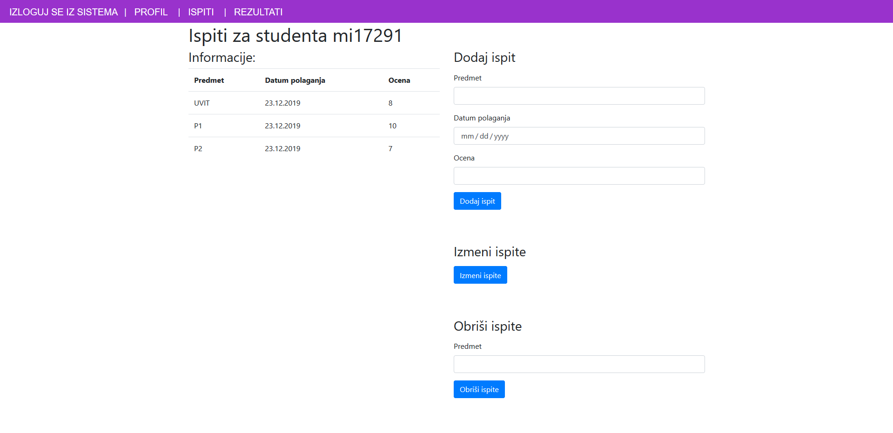
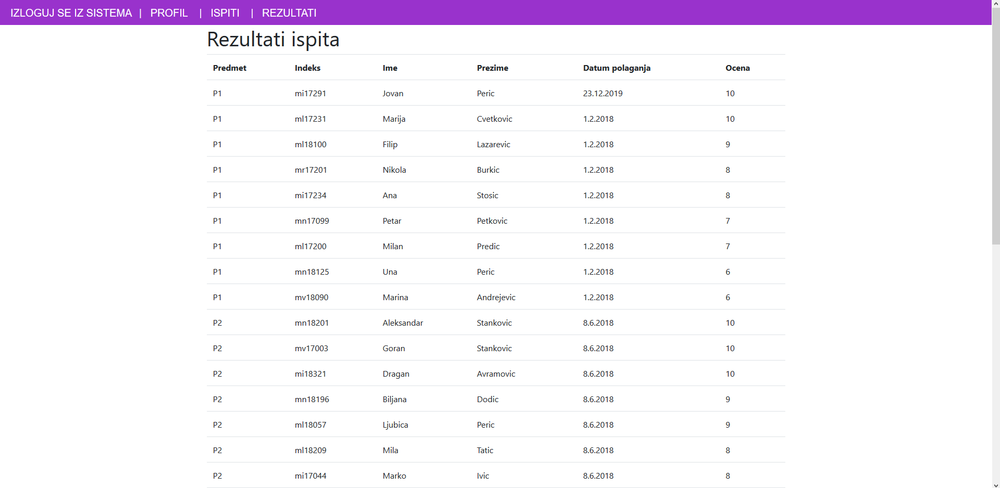

[Vežbe](../../../README.md)

[Knjiga](../../README.md)

-----

# 8. MongoDB baza podataka i Mongoose.js ORM

Cilj ovog poglavlja je upoznavanje studenata sa kreiranjem serverskih aplikacija koji komuniciraju sa *MongoDB* bazom podataka. Nakon ovog poglavlja, student bi trebalo da razume način funkcionisanja MongoDB baze podataka, kao i da samostalno kreira modele podataka, i da upravlja njima kroz četiri osnovne operacije: pravljenje novih podataka, kao i čitanje, menjanje i brisanje postojećih podataka (engl. Create, Read, Update, Delete, skr. *CRUD*).

## 8.1 MongoDB

_Baza podataka_ (engl. _database_) predstavlja sistem koji se sastoji od struktura podataka i algoritama čija je uloga trajno skladištenje podataka. Pod _trajnim skladištenjem_ smatramo činjenicu da, jednom kada se podaci sačuvaju u bazu podataka, oni ostaju zapamćeni u njoj, čak i kada se aplikacija koja je te podatke upisala u bazu podataka završi. To znači da uvek kada želimo da naše podatke imamo zabeležene nezavisno od životnog veka aplikacije, neophodno nam je da te podatke čuvamo u bazama podataka. Takođe ćemo koristiti i termin _sistem za upravljanje bazom podataka_, skr. _SUBP_ (engl. _database management system_, skr. _DBMS_) koji predstavlja softver koji se koristi za upravljanje bazama podataka. Ti softveri se koriste za kreiranje novih i izmenu postojećih baza podataka, čuvanje podataka i dr.

MongoDB pripada grupi tzv. _nerelacionih_ (engl. _NoSQL_) SUBP, odnosno, same baze podataka koje se kreiraju su _nerelacione_. Postoji više vrsta nerelacionih baza podataka, a baze podataka u MongoDB SUBP pripadaju vrsti koja se naziva _baza dokumenata_ (engl. _document database_). To znači da se svi podaci čuvaju u obliku dokumenata. Format u kojem su zapisani ovi dokumenti je sličan formatu JSON objekata. Vrednosti svojstava (nekada kažemo i _polja_ (engl. _field_)) dokumenta mogu biti: niske, brojevi, drugi dokumenti, nizovi, nizovi drugih dokumenata, itd. Naredna slika ilustruje primer dokumenta koje je sačuvan u nekoj bazi podataka u MongoDB SUBP.


Bazu podataka u MongoDB SUBP čine _kolekcije_ (engl. _collection_) dokumenata. Svaki dokument može biti različit, sa proizvoljenim brojem polja, veličine i sadržaja. 

Sledeći pojmovi su bitni za razumevanje MongoDB SUBP:

-  `_id` - Ovo je polje obavezno za svaki dokument u MongoDB bazi. Predstavlja jedinstvenu vrednost po kojoj razlikujemo dokumente u bazi. Pošto je polje obavezno, ukoliko pokušamo da napravimo novi dokument bez njega, biće automatski dodato.
    
-  `Kolekcija` - Predstavlja grupisane dokumente. Kolekcija postoji unutar jedne baze. Kao što smo već napomenuli, kolekcije nemaju definisanu strukturu, svaki dokument može biti različit.
    
-  `Kursor` - Pokazivač na rezultujući skup našeg upita. Klijenti mogu iterirati kroz ovaj skup kako bi dobili rezultate.
    
-  `Baza podataka` - Skladište za kolekcije. Svaka baza ima svoj skup datoteka.
    
-  `Dokument` - Jedan zapis u kolekciji. Sastoji se od naziva polja i vrednosti.
    
-  `Polje` - Par *(ime, vrednost)* jednog dokumenta. Dokument može imati 0 ili više polja. 
    
-  `JSON` - Notacija za predstavljanje strukturiranih podataka u čitljivom formatu.

## 8.2 Instalacija

Kako bi rad sa MongoDB SUBP bio moguć potrebno je preuzeti [instalaciju](https://www.mongodb.com/download-center/community?jmp=docs). Odabrati verziju 4.2.2, odgovarajući operativni sistem i paket. Detaljna uputstva za instalaciju možete pogledati [ovde](https://docs.mongodb.com/manual/administration/install-community/).

## 8.3 MongoDB shell

Korišćenjem MongoDB shell programa možemo se povezati sa bazom i izvršavati različite upite nad kolekcijama koje sadrži. Potrebno je pokrenuti shell skript koji dolazi uz `mongo` server (`<instalacioni_direktorijum>/Server/4.2/bin/mongo`).

U nastavku dajemo odabrane naredbe koje je moguće izvršiti u MongoDB shell programu za upravljanje bazama podataka:

- `show dbs` - Izlistava nazive svih baza na serveru.

- `use <db>` - Pristupa bazi sa nazivom koji se zadaje. Svi upiti se vrše nad odabranom bazom sve dok se ova naredba ne ponovi sa nazivom druge baze.

- `show tables` - Izlistava sve kolekcije iz odabrane baze.

- `db.<collection>.find()` - Izlistava sve dokumente iz zadate kolekcije.

- `db.<collection>.find(<upit>)` - Izlistava sve dokumente iz zadate kolekcije koji ispunjavaju uslove zadate upitom.

- `db.<collection>.find(<upit>, <projekcija>)` - Izlistava sve dokumente iz zadate kolekcije koji ispunjavaju uslove zadate upitom, pri čemu se vrši i projekcija rezultata.

- `db.<collection>.insert(<dokument>)` - Dodaje jedan nov dokument u zadatu kolekciju. 

- `db.<collection>.insert([<dokument1>, <dokument2>, ...])` - Dodaje više novih dokumenata u zadatu kolekciju.

- `db.<collection>.insertOne(<dokument>)` - Dodaje jedan nov dokument u zadatu kolekciju. 

- `db.<collection>.insertMany([<dokument1>, <dokument2>, ...])` - Dodaje više novih dokumenata u zadatu kolekciju.

- `db.<collection>.update(<upit>, <objekat sa izmenama>)` - Menja polja jednog dokumenta koji ispunjava uslove zadatog upita.

- `db.<collection>.updateMany(<upit>, <objekat sa izmenama>)` - Menja polja svih dokumenata koji ispunjavu uslove zadatog upita.

- `db.<collection>.deleteOne(<upit>)` - Briše jedan dokument koji ispunjava uslove zadatog upita.

- `db.<collection>.deleteMany(<upit>)` - Briše sve dokumente koji ispunjavu uslove zadatog upita.

- `db.<collection>.drop()` - Uništava kolekciju i sve dokumente koji se nalaze u njoj.

- `db.dropDatabase()` - Uništava trenutno aktivnu bazu podataka i sve kolekcije, odnosno, dokumenta koji se nalaze u njoj.

MongoDB shell program ne sadrži operaciju za kreiranje nove baze podataka. Umesto toga, baza se automatski kreira kada se u nju trajno zapiše prvi dokument. Tako, na primer, ukoliko MongoDB SUBP nije imao bazu podataka `myNewDB`, nakon izvršavanja naredne dve naredbe, biće kreirana nova baza podataka `myNewDB` koja će sadržati jednu kolekciju `myNewCollection1` koja će sadržati jedan dokument:

```js
> use myNewDB

> db.myNewCollection1.insertOne( { x: 1 } )
```

Takođe, vredno je napomenuti da su opisane naredbe primenljive **samo u MongoDB shell programu**, a ne u drugim radnim okvirima, drajverima i sl. U sekciji u kojoj budemo govorili o Mongoose.js radnom okviru, primetićemo da postoji veliki broj metoda čiji nazivi odgovaraju prethodno opisanim naredbama. Međutim, ne treba ih mešati sa naredbama iznad, već one imaju drugačiju semantiku!

## 8.4 Upiti

Pre nego što se upustimo u ovu oblast potrebno je da pripremimo podatke za obradu. U datoteci [koju možete preuzeti sa ove veze](./Resursi/studenti.json) nalaze se podaci o pojedinačnim studentima. Podaci su zadati u `JSON` formatu i kao takvi se lako mogu uvesti u `MongoDB` bazu programom `mongoimport`[^1]:

[^1]: Program `mongoimport` nalazi se u istom direktorijumu gde i `mongo`.

```shell
mongoimport --db <db_name> --collection <collection_name> --file <path>
```

gde se umesto `<db_name>` navodi ime baze u koju se uvoze podaci, zatim naziv kolekcije u koju se podaci uvoze umesto `<collection_name>` i  putanju do datoteke koja sadrži podatke umesto `<path>`.


> Zadatak 0. U kolekciju `students` iz baze `Fakultet` uvesti podatke o studentima iz datoteke [studenti.json](./Resursi/studenti.json).

```shell
mongoimport --db Fakultet --collection students --file studenti.json
```

U nastavku podrazumevamo da smo otvorili MongoDB shell program (`mongo`) i da smo postavili da radimo sa prethodno uvezenom bazom podataka `Fakultet` na sledeći način:

```js
> use Fakultet
```

### 8.4.1 Upiti čitanja

Da bismo dohvatili podatke iz baze moramo napisati _upit_ (engl. _query_) koji specifikuje ograničenja koja dokumenti moraju da ispunjavaju da bi bili dohvaćeni. Upiti u MongoDB SUBP predstavljaju objekte čija su svojstva tipovi ograničenja, a vrednosti tih svojstava su vrednosti odgovarajućih ograničenja:

```js
{ 
    <ogranicenje1>: <vrednost1>, 
    <ogranicenje2>: <vrednost2>, 
    ...
}
```

Specijalno, ako bismo želeli da dohvatimo podatke o svim studentima u kolekciji, koristili bismo prazan upit, odnosno

```js
{}
```

> Zadatak 1. Iz kolekcije `students` izdvojiti sve studente koji se zovu `Jovana`.

```js
> db.students.find({name: "Jovana"})
```

Ukoliko je navedeno više od jednog svojstva, traže se svi dokumenti koji za svako od navedenih naziva polja imaju navedenu vrednost. Ako se bar jedno polje ne poklapa po vrednosti sa zadatom, on neće biti prikazan kao rezultat.

> Zadatak 2. Iz kolekcije `students` izdvojiti sve studente koji se zovu `Jovana` i čiji je prosek jednak `8.5`.


```js
> db.students.find({
    name: "Jovana", 
    avg_grade: "8.5"
})
```

Na ovaj način dobijamo poređenje vrednosti po jednakosti. Nekada će nam biti potrebno da pronađemo dokumente sa vrednostima koje su manje ili veće od zadate, koje su u nekom intervalu, itd. Definisana su posebna svojstva koja možemo pisati u upitu koja predstavljaju ova ograničenja:

-  `$gt` - pronalazi vrednosti veće od zadate
-  `$gte` - pronalazi vrednosti veće ili jednake zadatoj
-  `$lt` - pronalazi vrednosti majne od zadate
-  `$lte` - pronalazi vrednosti manje ili jednake zadatoj
-  `$ne` - pronalazi vrednosti koje nisu jednake zadatoj
-  `$eq` - pronalazi vrednosti jednake zadatoj
-  `$in` - pronalazi vrednosti jednake nekoj iz zadatog niza vrednosti
-  `$nin` - pronalazi vrednosti nisu jednake nijednoj iz zadatog niza vrednosti.

Sintaksa za ove operatore je sledeća:
```js
{ 
    <polje>: {
        $<operator>: <vrednost>
    } 
}
```

Dakle, za polje čije je ime zadato umesto vrednosti navodimo objekat koji sadrži operator kao svojstvo, a vrednost koja se zadaje predstavlja broj ili niz brojeva sa kojima se poredi vrednost zadatog polja.


> Zadatak 3. Iz kolekcije `students` izdvojiti sve studente sa prosekom većim od `8.5`.

```js
> db.students.find({
    avg_grade: {
        $gt : "8.5"
    }
})
```

> Zadatak 4. Iz kolekcije `students` izdvojiti studente sa prosekom između 8.0 i 9.0.

```js
> db.students.find({
    avg_grade: {
        $gte : "8.0",
        $lte : "9.0"
    }
})
```

> Zadatak 5. Iz kolekcije `students` izdvojiti studente smerova `Informatika` i `Racunarstvo i informatika`.

```js
> db.students.find({
    major: {
        $in : ['Informatika', 'Racunarstvo i informatika']
    }
})
```

Pored toga, možemo koristiti i svojstva koja imaju ulogu logičkih operatora:

-  `$and` - pronalazi sve dokumente koji su ispunili uslove oba upita
-  `$or` - pronalazi sve dokumente koji su ispunili uslove bar jedan od upita
-  `$not` - pronalazi sve dokumente koji nisu ispunili uslove upita
-  `$nor` - pronalazi sve dokumente koji nisu ispunili uslove nijednog upita

Vrednosti ovih svojstava su nizovi objekata koji predstavljaju logičke jedinice i povezuju se odgovarajućim logičkim operatorom. U slučaju operatora konjunkcije, ukoliko se u nizu nalaze jednostavni objekti, koji su ranije opisani, možemo izostaviti operator i samo razdvajati zarezom sve objekte. Međutim, ukoliko imamo uslove koji su nešto kompleksniji, npr. uslovi koji sadrži i neke druge logičke operatore, onda moramo koristiti `$and` eksplicitno. 

Korišćenje logičkih operatora može se predstaviti sledećim objektom:

```js
{
    $<operator>: [ 
        { <polje1>: <vrednost1> }, 
        { <polje2>: <vrednost2> },
        ... 
    ]
}
```

> Zadatak 6. Iz kolekcije `students` izdvojiti sve studente čiji je prosek veći od `8.0` sa smera `Informatika`.

```js
> db.students.find({
    $and: [ 
        { avg_grade: { $gt: 8.0 } }, 
        { major: `Informatika` } 
    ]
})
```

Prethodni upit predstavlja konjunkciju, i on se može jednostavnije zapisati navođenjem zapete između uslova poređenja, tj.:

```js
> db.students.find({
    avg_grade: { $gt: 8.0 },
    major: `Informatika`
})
```

> Zadatak 7. Iz kolekcije `students` izdvojiti informacije o studentima čiji je prosek jednak `9.0` ili `10.0` i koji su upisali smer `Informatika` ili `Statistika`.

```js
> db.students.find({
    $and: [
        { 
            $or: [ { avg_grade: 9.0 }, { avg_grade: 10.0 } ] 
        },
        {
            $or: [ { major: 'Informatika' }, { major: 'Statistika' } ]
        }
    ]
})
```

U prethodnim upitima vrednosti polja su poređenje niskama onakve kakve su zadate. Nekada je potrebno proveriti da li vrednost polja počinje ili završava nekom niskom, ili da li sadrži neku nisku. 

- Ukoliko želimo da vrednost nekog polja počinje nekom niskom, onda tu nisku navodimo između `/^` i `/`.

- Ukoliko želimo da vrednost nekog polja završava nekom niskom, onda tu nisku navodimo između `/` i `$/`.

- Ukoliko želimo da vrednost nekog polja sadrži neku nisku, onda tu nisku navodimo između `/` i `/`.

> Zadatak 8. Iz kolekcije `students` izdvojiti informacije o studentima čije prezime počinje karakterom `P`.

```js
> db.students.find({ 
    surname: /^P/ 
})
```

### 8.4.2 Projekcija u upitima za čitanje vrednosti

Ukoliko ne želimo da u rezultatu dobijemo sva polja za dokumente, možemo iskoristiti _projekciju_ (engl. _projection_) rezultata. Projekcija predstavlja objekat čija je sintaksa oblika:

```js
{
    <polje1>: <vrednost1>,
    <polje2>: <vrednost2>,
    ...
}
```

Polja u projekciji predstavljaju polja koja se nalaze u dokumentu, a vrednosti u projekciji mogu biti:

- `0` ili `false`: polje neće biti obuhvaćeno u rezultatu
- `1` ili `true`: polje će biti obuhvaćeno u rezultatu

Podrazumevano, ukoliko ne navedemo projekciju, sva polja iz dokumenta će biti dohvaćena. Ukoliko ipak navedemo projekciju, tada će biti dohvaćena samo ona polja koja su eksplicitno navedena da budu uključena (vrednost `1` ili `true` u projekciji), dok će ostala polja biti isključena iz rezultata. Specijalno, polje `_id` će se uvek naći u rezultatu, osim ako eksplicitno ne navedemo `_id: 0` (ili `id_: false`) u objektu projekcije.

> Zadatak 9: Iz kolekcije `students` izdvojiti informacije o imenu, prezimenu i prosečnoj oceni onih studenata čije prezime počinje karakterom `P`.

```js
> db.students.find(
    // Upit
    { 
        surname: /^P/ 
    }
    // Projekcija
    {
        _id: 0,
        name: 1,
        surname: true,
        avg_ocena: 1
    }
)
```

### 8.4.3 Upiti za ažuriranje vrednosti polja

Ukoliko bismo želeli da izmenimo neku vrednost upisanu u bazu možemo koristiti neki od sledećih operatora:

- `$currentDate` - Postavlja vrednost polja na trenutni datum. Vrednost ovog svojstva je objekat koji sadrži jedno ili više polja čije se vrednosti menjaju. Za svako polje se kao vrednost može navesti:
    - bulova vrednost `true` čime se naznačava da se vrednost zadaje u `Date` formatu,

    - objekat, koji određuje tip (svojstvo `$type`) polja i može biti `timestamp` ili `date`, u notaciji

        ```js
        { $type : 'timestamp' }
        ```

        ili 

        ```js
        { $type : 'date' }
        ```

- `$inc` - Uvećava trenutnu vrednost jednog ili više polja za zadate vrednosti.

- `$mul` - Množi trenutnu vrednost jednog ili više polja za zadate vrednosti.

- `$set` - Postavlja vrednost jednog ili više polja na zadate vrednosti.

Sintaksa ovih svojstava je sledeća:
    
```js
{ 
    $<svojstvo>: { 
        <polje1>: <vrednost1>, 
        ... 
    } 
}
```

gde se redom navode imena polja čije se vrednosti menjaju na prethodno opisan način i nove vrednosti za ta polja.

Za više informacija o operatorima ažuriranja možete pogledati [ovde](https://docs.mongodb.com/manual/reference/operator/update-field/).

> Zadatak 10. U kolekciji `students` izmeniti napomenu u `Izvanredni studenti informatike` svim studentima smera `Informatika` ili `Racunarstvo i informatika` čiji je prosek veći od `9.5`, a zatim izlistati sav sadržaj kolekcije.

```js
> db.students.updateMany(
    // Prvo navodimo upit koja dokumenta azuriramo
    { 
        $and: [ 
            { $or: [{major: 'Informatika'}, { major: 'Racunarstvo i informatika'}] }, 
            { avg_grade: {$gt: 9.5} }
        ]
    }, 
    // A zatim navodimo upit na koji nacin ta dokumenta azuriramo
    {
        $set: { 
            note: "Izvanredni studenti informatike"
        }
    }
)

> db.students.find()
```


## 8.5. Razvojno okruženje Mongoose.js

Kako bi naša aplikacija bila kompletna, potrebno je da je povežemo sa bazom podataka i da, umesto niza, koristimo podatke iz baze gde će promene koje načinimo nad podacima biti trajno zapamćene.

Iako je moguće komunicirati iz Node.js aplikacije ka MongoDB bazi podataka pomoću zvaničnog MongoDB drajvera koji se razvija od strane razvijača MongoDB baze podataka[^2], mi ćemo u našim aplikacijama koristiti razvojno okruženje Mongoose.js[^3]. Razlog za ovu odluku jeste što nam Mongoose.js omogućava da pišemo kod koji se poprilično dobro uklapa u ono što već znamo. Drugim rečima, moći ćemo da upotrebimo kod koji smo prethodno napisali bez i jedne konceptualne promene. Pređimo na implementaciju.

[^2]: Više informacije se može pronaći na zvaničnoj stranici projekta [ovde](https://mongodb.github.io/node-mongodb-native/). 

[^3]: Zvanična veb prezentacija projekta se nalazi [ovde](https://mongoosejs.com/), dok je dokumentaciju moguće pronaći [ovde](https://mongoosejs.com/docs/api.html)


U novoj verziji naše aplikacije želimo da implementiramo da se podaci čitaju iz baze umesto iz niza. Prvo ćemo instalirati paket `mongoose`

```shell
npm install mongoose
```

Nakon toga, u datoteci `app.js`, potrebno je da ga učitamo kao i sve prethodne:

```js
const mongoose = require('mongoose');
```

Zatim, takođe u `app.js`, otvaramo konekciju sa bazom `Fakultet` metodom `connect()`:

```js
mongoose.connect("mongodb://127.0.0.1:27017/Fakultet", {
    useNewUrlParser: true,
    useUnifiedTopology: true
});
```

Prvi argument predstavlja putanju do baze na `mongodb` serveru. U našem slučaju, to je lokalni server te je adresa `127.0.0.1`, a port koji koristimo je `27017`. Drugi argument predstavlja objekat koji određuje dodatna podešavanja. Navedena svojstva dodajemo kako bismo izbegli upozorenja o zastarelosti nekih pomoćnih metoda koji su se ranije koristili.

Nastavljamo sa izmenama u modelu `student.js`. Rekli smo da umesto niza želimo da koristimo podatke iz baze. Da bi to bilo moguće, potrebno je da definišemo shemu dokumenata koji su upisani u kolekciji `students`, a zatim da napravimo odgovarajući model pomoću kog ćemo vršiti komunikaciju sa bazom. U te svrhe koristimo `Schema` metod iz paketa `mongoose` koji je potrebno uključiti i u ovu datoteku.

```js
const studentSchema = mongoose.Schema({
    _id: mongoose.Schema.Types.ObjectId,
    username: {
        type: String,
        required: true  
    },
    password: {
        type: String,
        required: true  
    },
    name: String,
    surname: String,
    major: String,
    avg_grade: Number,
    note: {
        type: String,
        default: ""
    }
});
```
Argument ovog metoda je objekat čija svojstva odgovaraju nazivima polja u dokumentima kolekcije `students`, a vrednosti su:
- tip podataka koji se čuva u tom polju
    - `String`
    - `Number`
    - `Date`
    - `Boolean`
- objekat koji definiše tip i još neka podešavanja:
    - `type` - Definiše tip polja.
    - `required` - Definiše da li je polje obavezno.
    - `default` - Definiše podrazumevanu vrednost za ovo polje. Ova vrednost se koristi u slučaju da se prilikom upisa u bazu ne navede vrednost za ovo polje.

Polje `_id` predstavlja jedinstveni idetifikator dokumenta i obavezan je za sve. Tip ovog polja je `mongoose.Schema.Types.ObjectId`. 

Ovim smo definisali shemu, a model pravimo korišćenjem metoda `model`:

```js
const studentModel = mongoose.model('Student', studentSchema);
```

Prvi argument predstavlja naziv modela, a drugi shema koju smo upravo napravili. Naziv modela mora da odgovara nazivu kolekcije u bazi na koju smo se povezali. Naziv kolekcije je naziv modela napisan malim slovima u množini (ima slovo `s` na kraju). Operacije sa bazom vršićemo upravo nad ovim modelom. Potrebno je još da izvezemo model kako bi ovaj model bio dostupan i drugim modulima:

```js
module.exports.model = studentModel;
```

Sada smo spremni za čitanje podataka iz baze. Menjamo implementaciju funkcije `getStudent` tako da, umesto iz niza, čita podatke iz baze i proverava njihovu korektnost. Za čitanje iz baze koristimo metod `find()`, koja funkcioniše kao funkcija `find()` koju smo koristili u `MongoDB Shell`-u.Dakle, prvi argument je upit, a drugi, opcioni, argument je projekcija. Ovaj metod radi asinhrono, tako da i naša funkcija `getStudent` mora biti asinhrona. To postižemo dodavanjem ključne reči `async` u potpis funkcije. Dodatno, ispred poziva funkcije `find()` dodajemo ključnu reč `await` kako bi se naredne operacije izvršile tek nakon što pristignu podaci. Na kraju je još potrebno da ulančamo metod `exec` koji pokreće asinhronu funkciju.

Funkcija `find` vraća niz dokumenata (objekata) koji su ispunili uslove upita. Ukoliko ne postoje takvi dokumenti, biće vraćen prazan niz. Kompletna implementacija funkcije `getStudent` data je u nastavku:

```js
module.exports.getStudent = async function (studentUsername, studentPassword) {
    let students = await studentModel.find({username: studentUsername}).exec();
    if (students.length > 0) {
        return students[0];
    }
    else {
        return null;
    }
};
```

Slično metodu `find`, postoji metod `findById`, koji umesto upita prima vrednost sa kojom ćebiti upoređeno polje `_id`. S obzirom da je to polje jedinstveno za svaki dokument, metod vraća objekat, a ne niz objekata kao prethodna.

Ostaje nam još da minimalno modifikujemo datoteku `controllers/student.js` kako bi sve funkcionisalo. Naime, funkcija koju smo upravo napisali izvršava se asinhrono, slično kao i `find` koje smo koristili. Zbog toga, prilikom poziva ove funkcije, pre nego šro vratimo odgovor sa servera, treba da sačekamo da se podaci uspešno pročitaju. Ovo činimo na isti način kao i malo pre, dodavanjem ključne reči `await` ispred poziva `getStudent`. Zbog toga i funkcija `displayStudent` iz `controll/student.js` postaje asinhrona: 

```js
module.exports.displayStudent = async function (req, res, next) {
    const studentObject = await models.getStudent(req.body.username, req.body.password);
    
    return res.render('student.ejs', {
        student: studentObject
    });
};
```

Pređimo na ažuriranje podataka. Prvo izmenimo funkciju `changeStudentInfo`. Za ažuriranje vrednosti u bazi koristi se jedan od metoda `updateOne` ili `updateMany`. Oba metoda kao prvi argument primaju upit kojim se određuju dokumenti koji se menjaju, a kao drugi argument objekat sa definisanim izmenama. Taj objekat kao svojstva treba da sadrži neki od operatora za upite ažuriranja (`$inc`, `$mul`, `$set` ili `$currentDate`) a vrednosti su objekti čija su svojstva nazivi polja dokumenata čije vrednosti će biti izmenjene, a vrednosti svojstva su nove vrednosti koje će za određena polja biti upisana. Razlika između ova dva metoda je u tome što `updateOne` ažurira samo jedan dokument, a `updateMany` sve koji su obuhvaćeni datim upitom. Isto kao i metod `find`, i ovi metodi rade asinhrono.

```js
module.exports.changeStudentInfo = async function (searchStudent) {
    let newData = {
        'password': searchStudent.password,
        'name': searchStudent.name,
        'surname': searchStudent.surname,
        'major': searchStudent.major
    };

    await studentModel.updateOne(
        {username: searchStudent}, 
        {$set: newData}).exec();
};
```

U `controllers/student.js` treba izmeniti funkciju `updateStudent` tako da bude asinhrona i čeka da se podaci ažuriraju pre nego što pozove narednu funkciju srednjeg sloja.

```js
module.exports.updateStudent = async function (req, res, next) {
    await models.changeStudentInfo(req.body);
    
    return next();
};
```

Brisanje dokumenata iz baze je prilično jednostavno u okruženju `mongoose`. Na raspolaganju su metodi `deleteOne` i `deleteMany`. Metodi primaju jedan parametar, a to je upit koji određuje šta treba obrisati. Razlika između ovih metoda je što prvi briše jedan dokument, a druga sva dokumenta koja ispunjavaju uslove upita. I ovi metodi su asinhroni te će i funkcija `deleteStudent` morati da radi asinhrono.

```js
module.exports.deleteStudent = async function (studentUsername) {
    await studentModel.deleteOne({username: studentUsername});
};
```

Datoteku `controllers/student.js` menjamo na isti način kao malo pre. Funkcija `deleteStudent` mora biti asinhrona, i pre nego što učita početnu stranicu potrebno je da sačeka da se operacija brisanja završi.

```js
module.exports.deleteStudent = async function (req, res, next) {
    await models.deleteStudent(req.body.username);
    
    return res.redirect('/');
};
```

#### Obrada grešaka

Iako smo kompletirali implementaciju funkcionalnosti ovog primera, ono što je neophodno da uradimo jeste da definišemo šta je to što naša aplikacija treba da uradi u slučaju dolaska do greške. Grešaka može biti raznih, na primer: SUBP može da prijavi grešku pri izvršavanju neke operacije nad njime, greška može da postoji u implementaciji koda, i dr. Problem sa asinhronim modelom programiranja jeste što i obrada grešaka mora da se vrši asinhrono.

Međutim, s obzirom da mi koristimo rad sa `async` funkcijama koje izvršavaju operacije tek kada se podaci izračunaju (zbog toga što koristimo `await` ispred poziva tih asinhronih akcija), obrada grešaka se u JavaScript-u ipak može izvršiti na jednostavan način, korišćenjem `try-catch` blokova. Pogledajmo primer obrade greške u funkciji `displayStudent` paketa `controllers/student.js`:

```js
module.exports.displayStudent = async function (req, res, next) {
    try {
        // Početak implementacije
        const studentObject = await models.getStudent(req.body.username, req.body.password);

        return res.render('student.ejs', {
            student: studentObject
        });
        // Kraj implementacije
    } catch (err) {
        next(err);
    }
};
```

Sav kod koji je ranije predstavljao implementaciju ove funkcije je smešten u `try` blok. Time se signalizira Node.js okruženju da "pokuša" da izvrši kod iz tog bloka. Ukoliko sve operacije prođu bez grešaka, funkcija se završava. U suprotnom, ukoliko bilo koja od datih operacija izazove grešku, sistem će _podići_ (eng. _raise_) grešku i ta greška će biti _uhvaćena_ (engl. _catch_) u `catch` bloku koji se navodi nakon `try` bloka. Ono što ćemo uvek raditi kada uhvatimo grešku jeste da prosledimo tu grešku funkciji srednjeg sloja koja radi na nivou obrade grešaka. U nastavku dajemo prikaz obrade grešaka za preostale kontrolere:

```js
module.exports.updateStudent = async function (req, res, next) {
    try {
        await models.changeStudentInfo(req.body);
        
        return next();
    } catch (err) {
        next(err);
    }
};

module.exports.deleteStudent = async function (req, res, next) {
    try {
        await models.deleteStudent(req.body.username);
        
        return res.redirect('/');
    } catch (err) {
        next(err);
    }
};
```

Funkcija srednjeg sloja koja radi na nivou obrade grešaka je definisana u `app.js` kao poslednja funkcija srednjeg sloja. Ona takođe, kao što smo o tome govorili u podsekciji [7.3.1](../NodeJS/README.md#7-3-1-rutiranjeifunkcijesrednjegsloja), mora da prihvati dodatni argument koji predstavlja grešku koja joj se prosleđuje. Naša funkcija srednjeg sloja koja radi na nivou obrade grešaka će raditi dve stvari: 

- Na serveru će u konzoli ispisati razvijeni stek poziva funkcija, kako bismo mogli da saznamo gde se dogodila greška.
- Na klijentu će prikazati HTML stranicu generisanu šablonom `error.ejs` sa informacijama o grešci.

Kod ove funkcije sledi u nastavku:

```js
app.use(function (error, req, res, next) {
    console.error(error.stack);

    const statusCode = error.status || 500;
    res.status(statusCode).render('error.ejs', {
        errorMessage: error.message,
        errorCode: statusCode
    });
});
```

Celokupno rešenje je dato na [ovoj adresi](https://github.com/MatfUVIT/UVIT/tree/master/vezbe/knjiga/Poglavlja/MongoDB/Primeri/1){:target="_blank"}.

### 8.5.1. Dva povezana modela

Do sad smo radili samo sa jednom kolekcijom, `students`. Ukoliko bismo želeli da proširimo aplikaciju tako da u priču uvedemo i informacije o polaganjima ispita, tu se stvari malo komplikuju. Ta svako polaganje ispita potrebne su nam informacije o studentu koji je polagao ispit, o predmetu koji je polagao, datumu polaganja i dobijenoj oceni. Međutim, podatke o studentima već imamo u kolekciji `students` i ne bi bilo dobro da ih ponavljamo. Razlog je jednostavan - smanjujemo redudantnost. Ako želimo da izmenimo podatak o nekom studentu, to činimo samo na jednom mestu, u kolekciji `students` umesto da menjamo svuda gde se taj student pojavljuje. 

Potrebno je da odredimo jedinstveno polje za svaki dokument u kolekciji `students` i da samo to koristimo kao referencu na odgovarajućeg studenta u kolekciji `Exam`. Na našu sreću, to polje već postoji, ne samo za dokumente kolekcije `students` već za sve dokumente. U pitanju je polje `_id`. Dovoljno je da u kolekciji `Exam` pamtimo identifikator studenta kako bismo dobili sve potrebne informacije o studentu koji je polagao određeni ispit.

U aplikaciji želimo da razdvojimo tri dela: stranicu sa informacijama o studentu, stranicu sa informacijama o ispita i stranicu sa rezultatima:


<div style="max-width: 98%;">

</div>

<div style="max-width: 98%;">

</div>

<div style="max-width: 98%;">

</div>


Stranica sa informacijama o studentima je već implementirana, pređimo na stranu sa informacijama o ispitima.

Za novu kolekciju pravimo novi model `exam.js` u kom definišemo shemu i funkcije za manipulaciju podacima iz kolekcije `Exam`. Shema sadrži polje student koje pamti jedinstveni identifikator studenta iz kolekcije `students`. Za to polje treba definisati tip i sa kojim se modelom povezuje. Naziv modela treba da se poklopi sa nazivom koji smo zadali kao prvi argument metodu `mongoose.model()`. Nakon što je definisana shema, pravimo i izvozimo model za kolekciju `Exam`.

```js
const examSchema = mongoose.Schema({
    _id: mongoose.Schema.Types.ObjectId,
    student: {
        type: mongoose.Schema.Types.ObjectId,
        rel: "Student",
        required: true
    },
    subject: String,
    date: Date,
    grade: Number
});

const examModel = mongoose.model('Exam', examSchema);

module.exports.model = examModel;
```

Pređimo na funkciju koja dohvata podatke o svim ispitima koje je polagao student čije je korisničko ime zadato parametrom funkcije. Pošto nam je zadato samo korisničko ime, a potreban nam je identifikato studenta, potrebno je da prvo izvršimo čitanje iz kolekcije `students`, a rezultat ćemo iskoristiti da dobijemo sve ispite. U te svrhe, pišemo asinhronu funkciju `getStudentId` u `student.js` koja će pročitati i vratiti odgovarajući podatak.

```js
module.exports.getStudentId = async function getStudentId(studentUsername) 
{
    let students = await studentModel.find({username: studentUsername}).exec();
    return students[0]['_id'];
};
```

Da bismo koristili ovu funkciju, moramo da uvezemo model `student` u `exam.js`:

```js
const student = require('./student');
```

Sada možemo da napišemo funkciju koja dohvata informacije o ispitima. Metodu `find` dodaćemo drugi argument, `projekciju`, kojim definišemo polja koja želimo da budu izdvojena, a to su: `subject`, `date` i `grade`. 

```js
module.exports.getExams = async function(studentUsername) 
{
    let studentId = await student.getStudentId(studentUsername);
    let exams = await examModel.find({student: studentId}, {subject:1, date:1, grade:1, _id:0}).exec();

    if (exams.length > 0) 
    {
        return exams;
    }
    else 
    {
        return null;
    }
};
```

Sada bi trebalo da napravimo kontroler koji će obraditi zahtev. U direktorijum `controllers` dodajemo `exam.js`. Uključujemo model koji smo upravo napravili, a zatim definišemo funkciju `displayExams`. Prvi korak je dohvatanje podataka pomoću modela, a drugi određivanje pogleda i podataka koji će mu biti dostupni. Osim podataka o ispitima, prosledićemo korisničko ime i lozinku, kako bi korisnik mogao da se vrati na stranu sa informacijama bez potrebe za novim prijavljivanjem na sistem.

```js
const exam = require('../models/exam');

module.exports.displayExams = async function(req, res, next) {
    const examsObject = await exam.getExams(req.body.username);

    return res.render('exam.ejs', {
        student: {
            username: req.body.username,
            password: req.body.password
        },
        exams: examsObject
    });
};
```

Nastavimo sa implementacijom, na redu je dodavanje novog ispita. Ovaj korak se malo razlikuje u odnosu na druge operacije. Naime, potrebno je da napravimo novi objekat našeg modela pozivom kostruktora. Argument koji prosleđujemo je objekat čija svojstva su nazivi polja dokumenta, a vrednosti su vrednosti za odgovarajuća polja. Vrednost za polje `_id` dobijamo pozivanjem konstruktora `ObjectId` iz `mongoose.Types`. 

Dobijeni objekat je novi dokument koji treba sačuvati u bazu, a to činimo pozivom metoda `save` nad objektom. Metod `save` je takođe asinhron.

```js
module.exports.addNewExam = async function(examData) 
{
    let studentId = student.getStudentId(studentUsername);
    let newExam = new examModel({
        _id: new mongoose.Types.ObjectId(),
        student: studentId,
        subject: examData.subject,
        date: examData.date,
        grade: examData.grade
    });

    await newExam.save();
};
```

U datoteku `controllers/exam.js` dodajemo funkciju koja obrađuje zahtev za dodavanje ispita `addExam`. Funkcija prvo poziva funkciju `addNewExam` koja vrši promene u bazi, a zatim poziva narednu funkciju srednjeg sloja koja će prikazati nove podatke.

```js
module.exports.addExam = async function(req, res, next) {
    await exam.addNewExam(req.body);

    return next();
};
```

Sada ćemo implementirati da se klikom na dugme `Izmeni ispite` izmeni datum polaganja ispita na današnji datum za ulogovanog studenta. Podsetimo se operatora `$currentDate` koji se koristi u upitima ažuriranja. Prvo dodajemo funckiju `changeDates` u datoteku `models/exam.js` koja prima korisničko ime ulogovanog korisnika. Slično kao u prethodnoj funkciji, koristićemo `getStudentId` kako bismo dobili odgovarajuću vrednost iz kolekcije `students`. Zatim, pozivamo metod `updateMany` nad modelom za kolekciju `Exam`. Želimo da ažuriramo datume za sve ispite studenta koji je određen identifikatorom koji je vratila funkcija `getStudentId`. Stoga je prvi argument upit koji zahteva da vrednost polja `student` bude jednaka tom identifikatoru. Drugi argument koristi operator `$currentDate`, a kao vrednost zadajemo objekat koji određuje kojim poljima se postavlja današnji datum kao nova vrednost.

```js
module.exports.changeDates = async function(studentUsername) 
{
    let studentId = await student.getStudentId(studentUsername);
    await examModel.updateMany(
        {student: studentId},
        {$currentDate: {date: true}});
};
```

U datoteku `controllers/exam.js` dodajemo asinhronu funkciju `updateExams` koja pozica `changeDates`, a zatim i narednu funkciju srednjeg sloja.

```js
module.exports.updateExams = async function(req, res, next) {
    await exam.changeDates(req.body.username);

    return next();
};
```

Na redu je dugme za brisanje ispita. Potrebno je da ulogovan korisnik unese naziv predmeta i klikom na dugme biće obrisana sve informacije o njegovim polaganjima ispita iz tog predmeta. U `models/exam.js` dodajemo asinronu funkcju `deleteExams` koja prvo dohvata identifikator studenta sa zadatim korisničkim imenom, a onda briše sve informacije korišćenjem metoda `deleteMany`.

```js
module.exports.deleteExams = async function(data) 
{
    let studentId = await student.getStudentId(data.username);
    await examModel.deleteMany({student: studentId, subject: data.subject});
};
```

U `controllers/exam.js` dodajemo asinhrenou funkciju koja poziva `deleteExams` iz modela, a zatiim i narednu funkciju srednjeg sloja. 

```js
module.exports.deleteExams = async function(req, res, next) {
    await exam.deleteExams(req.body);

    return next();
};
```

Time smo kompletirali obradu podataka za ispite jednog studenta. Potrebno je još da odredimo napravimo objekat za rutiranje koji će preusmeriti zahteve na odgovarajući način. 

```js
// Node.js packages

// Third-party packages
const express = require('express');

// Custom modules
const controllers = require('../controllers/exam');

// Global data
const router = express.Router();

// Module implementation
router.post('/', 
    controllers.displayExams);

router.post('/create', 
    controllers.addExam, 
    controllers.displayExams);
    
router.post('/update', 
    controllers.updateExams, 
    controllers.displayExams);

router.post('/delete', 
    controllers.deleteExams, 
    controllers.displayExams);

// Module exports
module.exports = router;
```

Dodatno, u `app.js` treba dodati funckiju srednjeg sloja koja će sve zahteve poslate na `http://localhost:3000/exam` uputiti na objekat za rutiranje koji smo upravo napisali.

```js
const examRoutes = require('./routes/exam');
app.use('/exam', examRoutes);
```

Za kraj nam ostaje da se pozabavimo delom sa rezultatima. Potrebno je, kada se klikne na `Rezultati` u navigaciji, da se otvori stranica sa rezultatima svih ispita. Želimo da se prikažu informacije o predmet, indeksu, imenu i prezimenu studenta, datumu polaganja i dobijenoj oceni. Uz to, želimo da spisak bude uređen prema predmetima rastuće, a prema ocenama opadajuće.

Sve informacije o samim ispitima postoje u kolekciji `Exam`. Međutim, u njoj imamo samo podatke o identifikatoru studenta, ali ne i njegovo ime, prezime ili indeks. S obzirom da smo definisali model za kolekciju ispita tako da sadrži referencu na studenta, lako možemo dopuniti podatke o ispitu odgovarajućim podacima iz kolekcije studenata. U te svrhe koristi se metod `populate` koji se ulančava sa pozivom metoda `find`. Argument ovog metoda je niska koja govori koje polje treba da se dopuni podacima - u ovom slučaju to je `student`. Ovim se vrednost polja `student` iz `ObjectId` menja u objekat koji sadrži sve informacije o tom studentu. Dodatno, možemo da odredimo da se izdvoje samo neke informacije ukoliko nam nisu sve potrebne, kao što je ovde slučaj. Nama su potrebni korisničko ime, ime i prezime te možemo dodati još jedan argument u kome navodimo nazive polja koje želimo da zadržimo. Nazivi polja se navode kao jedna niska razdvojeni blanko karakterom.

Što se uređivanja podataka tiče, koristimo metod `sort` koji se takođe ulančava na poziv metoda `find`. Ovaj metod prima jedan objekat koji definiše po kojim poljima se podaci uređuju. Svojstva ovog objekta odgovaraju nazivima polja u kolekciji, a vrednosti mogu biti `1` (rastuće uređenje) i `-1` (opadajuće uređenje).

Pošto se čitanje vrši iz kolekcije `Exam` uz dopunu podacima o studentima, dodajemo novu funkciju u `models/exam.js`.


```js
module.exports.getResults = async function() {
    let results = await examModel.find({}).populate('student', 'username name surname').sort({subject: 1, grade: -1}).exec();

    if (results.length > 0) {
        return results;
    }
    else {
        return null;
    }
};
```

Napravićemo novi kotroler i rutirajući objekat koji će se baviti zahtevima poslatim na `http://localhost:3000/results`. Datoteka `controller/results.js` koristi model `exam` i sadrži jednu funkciju - `displayResults`. Njen zadatak je da pozove funkciju `getResults` i da prosledi te podatke zajedno sa stranicom `results.ejs`. Uz podatke o rezultatima, šaljemo i korisničko ime i lozinku ulogovanog korisnika kako bi korisnik mogao da nastavi sa radom i nakon pregleda rezultata.

```js
const exam = require('../models/exam');


module.exports.displayResults = async function(req, res, next) {
    let resultsObject = await exam.getResults();

    return res.render('results.ejs', 
    {
        student: {username: req.body.username, password: req.body.password},
        results: resultsObject
    });
};
```

Objekat za rutiranje je prilično jednostavan. Obrađuje jedan `POST` zahtev i prosleđuje ga odgovarajućem kontroleru.

```js
// Node.js packages

// Third-party packages
const express = require('express');

// Custom modules
const controllers = require('../controllers/results');

// Global data
const router = express.Router();

// Module implementation

// Implements POST request on /
router.post('/', 
    controllers.displayResults);

// Module exports
module.exports = router;
```

Ne smemo zaboraviti da u `app.js` dodamo funkciju srednjeg sloja koja će sve zahteve poslate na `http://localhost:3000/results` uputiti na objekat za rutiranje koji smo upravo napisali.

```js
const resultsRoutes = require('./routes/results');
app.use('/results', resultsRoutes);
```

Celokupno rešenje je dato na [ovoj adresi](https://github.com/MatfUVIT/UVIT/tree/master/vezbe/knjiga/Poglavlja/MongoDB/Primeri/2){:target="_blank"}.


-----

[Knjiga](../../README.md)

[Vežbe](../../../README.md)

<!--
<div style="max-width: 98%;">

</div>
-->
