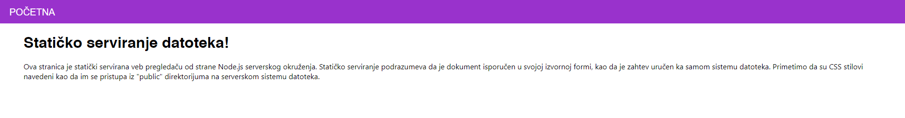
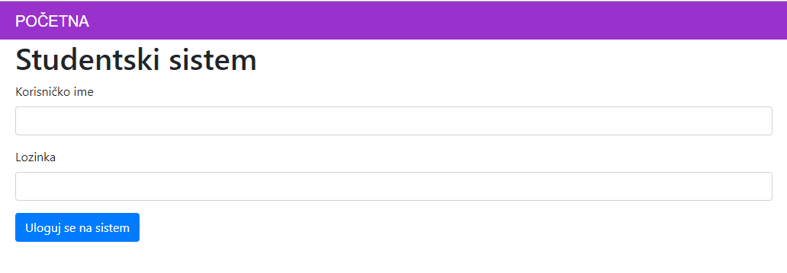
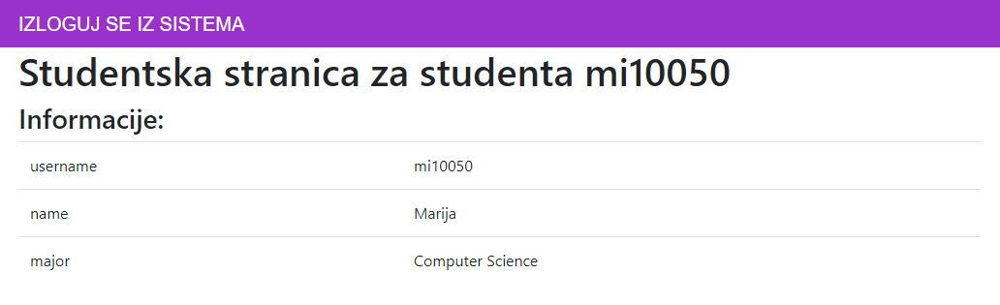
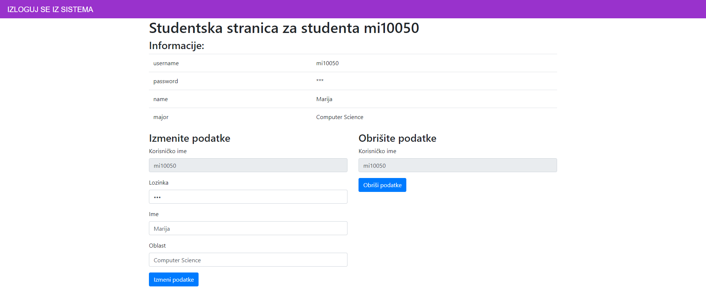
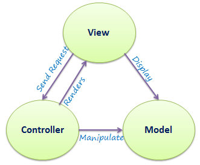
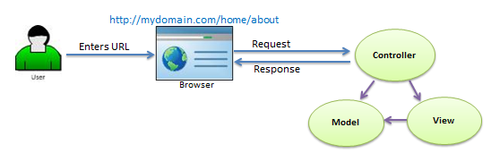

[Vežbe](../../../README.md)

[Knjiga](../../README.md)

-----

<style>
.domaci-zadatak {
    border: 5px solid gold;
    padding: 10px;
}

.domaci-zadatak .naslov {
    font-weight: bold;
    text-align: center;
    display: block;
}

.domaci-zadatak .tekst {
    border-top: 2px dashed black;
    border-bottom: 2px dashed black;
    padding-top: 10px;
    padding-bottom: 10px;
}
</style>

# 7. Node.js i Express.js

Cilj ovog poglavlja jeste upoznavanje studenta sa razvojem aplikacija koje se izvršavaju na serveru korišćenjem radnog okvira _Node.js_. Na početku ćemo govoriti o arhitekturi serverskih aplikacija kroz _pakete_ (engl. _package_) i _module_ (engl. _module_) kao i o upravljaču paketa. Zatim, kroz razvoj aplikacije za prikazivanje informacija o studentima i njihovim izmenama demonstriraćemo paket `express` koji nam služi za jednostavno upravljanje HTTP zahtevima koje klijentske aplikacije šalju našoj serverskoj aplikaciji i implementacijom funkcija koje obrađuju te zahteve. Kroz obradu zahteva ćemo se upoznati za različitim drugim paketima kao što su `ejs` za dinamičko generisanje HTML stranica i `body-parser` za automatsko prevođenje podataka koji su pridruženi HTTP zahtevima u JavaScript strukture (objekti, nizovi, niske, ...). Pored toga što će čitalac imati priliku da nauči da implementira serverske aplikacije, naučiće i da organizuje svoj izvorni kod u duhu arhitekturalnog stila koji se naziva model-pogled-kontroler (engl. _model-view-controller_, skr. _MVC_).

## 7.1 Moduli

_Modul_ (engl. _module_) predstavlja deo programa koji specifikuje na koje se druge delove programa on oslanja i koje mogućnosti on daje ostalim delovima programa. Te funkcionalnosti koje su izložene "svetu" zajedno se nazivaju _interfejs_ (engl. _interface_) modula. Sve ostalo se smatra privatnim za taj modul, i o tome "svet" ne mora da vodi računa. Korišćenjem modula se smanjuje celokupna povezanost delova programa, odnosno, tendencija da "sve zna za sve", što se smatra lošom praksom za programiranje.

Odnosi između modula se nazivaju _zavisnosti_ (engl. _dependency_). Kada modul zahteva deo iz nekog drugog modula, kažemo da taj modul _zavisi_ (engl. _depend_) od drugog modula. Da bismo razdvojili module, potrebno je da svaki modul ima svoj, privatan opseg.

### 7.1.1 Paketi

_Paketi_ (engl. _package_) predstavljaju delove koda koji se mogu distribuirati (kopirati i instalirati). Paket može da sadrži jedan ili više modula i ima informacije o tome od kojih drugih paketa zavisi. Paket obično sadrži i dokumentaciju. Kada se problem pronađe u paketu ili se doda nova mogućnost, paket se ažurira. Tada, programi koji zavise od paketa (koji takođe mogu biti drugi paketi) mogu da se jednostavno ažuriraju na novu verziju.

### 7.1.2 Node upravljač paketima

Rad na ovakav način zahteva infrastrukturu - mesto za skladištenje i pronalaženje paketa, kao i jednostavan način za njihovo instaliranje i ažuriranje. U svetu JavaScript jezika, ovakva infrastruktura je obezbeđena od strane NPM \([https://npmjs.org](https://npmjs.org "npm")\). NPM predstavlja dve stvari:

1. Veb servis odakle je moguće preuzeti postojeće pakete i postaviti nove.

2. Program komandne linije (koji se automatski instalira prilikom instaliranja _Node.js_ okruženja za JavaScript) koji pomaže instaliranje i upravljanje paketima. 

U tekstu ćemo videti kako možemo instalirati različite pakete za naše programe koje budemo pisali.

### 7.1.3 CommonJS

Ovaj način predstavlja verovatno najrasprostranjeniji način za kreiranje JavaScript modula. Sistem Node.js koristi upravo ovaj način, a takođe i većina paketa na NPM sistemu, te ćemo mu se zbog toga i posvetiti. 

Glavni koncept u CommonJS modulima jeste funkcija `require`. Kada pozovemo ovu funkciju sa imenom modula od kojeg zavisi naš modul, funkcija se postara da je modul učitan i vraća nam njegov interfejs. Pošto učitavanje postavlja omotač nad kodom modula u funkciji, moduli automatski dobijaju svoj lokalni opseg. Sve što oni treba da urade jeste da `require` pozivima dohvataju pakete od kojih zavise, a svoj interfejs stave kao deo objekta koji se zove `module.exports`. Zanimljiva stavka CommonJS modula je da, iako sistem modula kreira prazan objekat-interfejs za nas (koji je vezan za promenljivu `module.exports`), mi ga možemo zameniti bilo kojom vrednošću tako što pregazimo vrednost `module.exports` i time definišemo šta je to što naš modul isporučuje korisnicima. Tako možemo imati mnoge "skrivene" funkcije koje predstavljaju implementaciju, a koje korisnici neće videti (jer to za njih i nije značajno) tako što ih jednostavno ne izvezemo kroz promenljivu `module.exports`. Ovo je urađeno u velikom broju postojećih modula da bi se exportovala jedna vrednost umesto objekta-interfejsa.

Kada putanja za učitavanje paketa nije relativna, Node.js će pogledati instalirane pakete i potražiće u njima paket sa prosleđenim imenom. Instaliranje paketa u korenom direktorijumu projekta se može izvrsiti komandom

```shell
npm install imePaketa
```

Kroz primere koji slede videćemo razne upotrebe CommonJS načina za kreiranje i uvoženje modula.

Da bismo kreirali novi Node.js projekat, koji će u našem slučaju predstavljati novu serversku aplikaciju, potrebno je da pokrenemo komandu

```shell
npm init
```

Komanda je interaktivnog tipa i od nas će tražiti podatke tipa "Kako se zove datoteka od koje se pokreće aplikacija?", "Koji je naziv projekta?", "Koja je licenca projekta?" i mnoge druge. Mi ćemo sve naše serverske aplikacije kreirati od `server.js` datoteke. Ova komanda će kreirati `package.json` datoteku koja sadrži unete vrednosti. Naravno, moguće je jednostavno izmeniti ovu datoteku ukoliko odlučimo da ažuriramo neku vrednost. Ono što je glavna prednost inicijalizacije novog projekta jeste što sada možemo da instaliramo pakete od kojih naša aplikacija zavisi, i te zavisnosti će biti zapamćene u `package.json` datoteci. To znači da možemo proslediti naš izvorni kod projekta zajedno sa tom datotekom drugoj osobi, koja može podesiti projekat jednostavnom komandom

```shell
npm install
```

kojom će se pogledati od kojih sve paketa zavisi naš projekat i oni će se instalirati. Svi paketi koji se instaliraju se čuvaju pod korenim direktorijumom projekta u direktorijumu `node_modules`. Ovaj direktorijum nije potrebno niti poželjno proslediti uz izvorni kod (ili postaviti na sistem za kontrolu verzija, ukoliko se takav sistem
koristi).

## 7.2 Kreiranje HTTP serverskih aplikacija

Osnovni paket koji ćemo koristiti za kreiranje serverskih aplikacija je paket `http`. On nam nudi mnogobrojne metode za rad, a mi ćemo koristiti metod `createServer` kojim se kreira nova instanca veb servera. Dakle, da bismo učitali paket `http` i kreirali instancu veb servera, možemo uraditi:

```js
// For creating a server
const http = require("http");
const server = http.createServer();
```

Da bismo pokrenuli serversku aplikaciju, potrebno je da definišemo broj porta na kojem će biti pokrenuta. U našim aplikacijama, koristićemo broj porta 3000. Zatim je potrebno nad objektom servera pozvati metod `listen` kojem prosleđujemo broj porta:

```js
// Creating the server and running it on port 3000
const port = 3000
server.listen(port);
```

Da bismo se uverili da je serverska aplikacija pokrenuta, možemo osluškivati događaj `'listening'` metodom `once`:

```js
// Prints a message in the terminal
// once the server is active
server.once('listening', function () {
    console.info(`Started the server on http://localhost:${port}`);
});
```

Sada možemo otvoriti terminal i pokrenuti narednu komandu:

```shell
node server.js
```

Očekujemo da u terminalu vidimo narednu poruku:

```
Started the server on http://localhost:3000
```

Međutim, iako je ovo prvi korak ka kreiranju serverske aplikacije, problem je u tome što još uvek nismo rekli serveru šta treba da radi u slučaju da klijentska aplikacija pošalje HTTP zahtev serveru. Ovde na scenu stupa radni okvir Express.js.

## 7.3 Obrađivanje HTTP zahteva radnim okvirom Express.js

Za početak, da bismo uopšte mogli da koristimo radni okvir Express.js, potrebno je da instaliramo paket `express` u istom direktorijumu gde smo kreirali Node.js projekat:

```shell
npm install express
```

Sada ćemo primetiti da se datoteka `package.json` ažurirala tako da sadrži informacije o novom paketu u svojstvu `'dependencies'` (verzija paketa se može razlikovati od prikaza ispod):

```
{
  "name": "serviranje-datoteka",
  "version": "1.0.0",
  "description": "",
  "main": "server.js",
  "scripts": {
    "test": "echo \"Error: no test specified\" && exit 1"
  },
  "author": "",
  "license": "ISC",
  "dependencies": {
    "express": "^4.17.0"
  }
}
```

Sada prelazimo na implementiranje prve verzije naše aplikacije. U tu svrhu, prikažimo kako ona treba da izgleda narednom slikom.



Ovo je prikaz aplikacije u slučaju kada korisnik otvori adresu `http://localhost:3000` u veb pregledaču. Drugim rečima, ovo je prikaz aplikacije kada veb pregledač pošalje HTTP zahtev metodom `GET` ka adresi `http://localhost:3000`. Ovo je izuzetno važna informacija koju treba imati na umu i koja će nam kasnije značiti.

U slučaju da korisnik otvori bilo koju drugu adresu, na primer, `http://localhost:3000/bilo-sta-drugo`, potrebno je da mu se prikaže stranica kao na narednoj slici.


Pređimo sada na implementaciju.

Za početak, s obzirom da želimo da ostvarimo što je moguće bolju modularnost koda, za dalju implementaciju je potrebno da kreiramo datoteku `app.js` u direktorijumu projekta u kojoj ćemo definisati jednu Express.js aplikaciju na sledeći način:

```js
// For creating expressjs applications
const express = require('express');

const app = express();
```

### 7.3.1 Rutiranje i funkcije srednjeg sloja

_Rutiranje_ (engl. _routing_) predstavlja način na koji serverska aplikacija opslužuje klijentski zahtev. Da bismo implementirali operaciju koju server treba da preduzme da bi obradio klijentski zahtev, nad express aplikacijom pozivamo odgovarajuće funkcije. 

Klijentski HTTP zahtev na serveru prolazi kroz niz _funkcija srednjeg sloja_ (engl. _midleware_), pri čemu svaka od njih implementira neku akciju koja se izvršava na serveru. To mogu biti:

- Dohvatanje statičkih dokumenata
- Generisanje dinamičkih dokumenata
- Baratanje podacima iz baza podataka
- Upravljanje sesijom
- Upravljanje kolačićima
- ...

Funkcija srednjeg sloja ima informacije o [objektu klijentskog zahteva](https://expressjs.com/en/4x/api.html#req){:target="_blank"} (`req`), [objektu serverskog odgovora](https://expressjs.com/en/4x/api.html#res){:target="_blank"} (`res`) i narednoj funkciji srednjeg sloja koja može biti pozvana po završetku tekuće funkcije srednjeg sloja, tj. naredne funkcije srednjeg sloja u ciklusu zahteva-odgovora (`next`). U opštem slučaju, operacije koje funkcije srednjeg sloja mogu implementirati mogu potpadati pod naredne kategorije:

- Izvršavanje proizvoljnog koda
- Izmena objekta klijentskog zahteva ili objekta serverskog odgovora
- Završavanje ciklusa zahteva-odgovora
- Poziv naredne funkcije srednjeg sloja iz steka funkcija

Postoje različiti nivoi na kojima možemo definisati funkcije srednjeg sloja:

- Nivo aplikacije: funkcije srednjeg sloja se definišu u okviru express aplikacije. Na primer, ako treba da obradimo zahtev `GET`, onda ćemo koristiti metod `app.get()`. Slično, za obradu zahteva `POST`, koristimo metod `app.post()`. Ukoliko neka operacija treba da se obradi nad svim zahtevima, onda koristimo metod `app.use()`. Na primer:

```js
const app = express();
app.use(function (req, res, next) {
  // Obrada zahteva ide ovde
};
```

Ovi metodi mogu uzimati i dva argumenta, pri čemu je prvi argument putanja zadata niskom. Korišćenjem ove varijante će se funkcija srednjeg sloja izvršiti onda kada se relativna URL putanja poklopi sa datom putanjom. Na primer, naredna funkcija srednjeg sloja će biti izvršena samo ako je zahtev upućen ka URL adresi `http://localhost:3000/studenti`:

```js
const app = express();
app.use('/studenti', function (req, res, next) {
  // Obrada zahteva ide ovde
};
```

- Nivo objekta za rutiranje: kreira se objekat za rutiranje i funkcije srednjeg sloja se vezuju za njega. Na primer:

```js
const router = express.Router();
router.use(function (req, res, next) {
  // Obrada zahteva ide ovde
};
```

- Nivo obrade grešaka: funkcije srednjeg sloja će biti pozvane ukoliko dođe do grešaka pri izvršavanju serverskih aplikacije. Greške mogu podrazumevati sintaksne greške u kodu, neobrađene izuzetke, i dr. Specijalno za ovaj nivo obrade grešaka važi da funkcije srednjeg sloja prihvataju 4 argumenta, pri čemu je prvi argument objekat greške (`err`), a preostala tri su opisani objekti `req`, `res` i `next`.

```js
app.use(function (err, req, res, next) {
  // Obrada gresaka ide ovde
});
```

- Nivo ugrađenih funkcija srednjeg sloja: Korišćenje funkcija srednjeg sloja koje su dostupne uz paket express. Primer takve funkcije srednjeg sloja je `express.static` koja se koristi za isporučivanje statičkih dokumenata.

- Nivo _softvera od strane trećih lica_ (engl. _third-party software_): Ove funkcije srednjeg sloja su implementirane od strane raznih drugih proizvođača. Pakete koji ih implementiraju je potrebno prvo instalirati, pa zatim učitati i koristiti. Primer je paket `body-parser` koji implementira funkcije srednjeg sloja `urlencoded` i `json`:

```js
const {urlencoded, json} = require('body-parser');

app.use(urlencoded({extended: false}));
app.use(json());
```

Nastavimo dalje sa implementacijom naše aplikacije. U našem direktorijumu projekta je potrebno da napravimo direktorijum `views/` koji će sadržati `index.html` i `404.html` datoteke koje klijentska aplikacija (veb pregledač) treba da prikaže. Takođe, potrebno je da kreiramo `main.css` i `404.css` datoteke koje će stilizovati prikaz kao na slikama. Njih ćemo smestiti u direktorijum `public/css/`.

Započnimo prvo implementaciju početne stranice. U tu svrhu, kreirajmo direktorijum `routes/` koji će sadržati implementacije objekata za rutiranje. Ovo radimo zbog toga što želimo da implementacije zahteva nad nekim stranicama budu vidljivi samo tim stranicama. U tom direktorijumu napravimo datoteku `index.js` sa narednom definicijom:

```js
const path = require('path');
const express = require('express');

const router = express.Router();

router.get('/', function (req, res, next) {
    res.sendFile(path.join(__dirname, '..', 'views', 'index.html'));
});

module.exports = router;
```

Kao što vidimo, implementiraćemo `GET` zahtev nad putanjom `/`. S obzirom da se ove putanje razmatraju u odnosu na objekat za rutiranje, a ne u odnosu na koreni URL serverske aplikacije, potrebno je prilikom korišćenja objekta za rutiranje u express aplikaciji navesti putanju nad kojom će se putanje u objektu za rutiranje razrešiti. Na primer, ako imamo putanju

```
http://localhost:3000/studenti/info
```

onda ćemo u express aplikaciji koristiti objekat za rutiranje na sledeći način:

```js
const studentRoutes = require('./routes/student');
app.use('/studenti', studentRoutes);
```

dok smo objekat za rutiranje napravili u datoteci `routes/student.js` na sledeći način:

```js
const express = require('express');

const router = express.Router();
router.get('/info', function (req, res, next) {
  // Obrada zahteva ide ovde
});

module.exports = router;
```

Metod `res.sendFile()` će zatvoriti ciklus zahteva-odgovora i poslati statički dokument koji se nalazi na lokaciji koja se prosleđuje kao argument metoda. U tu svrhu koristimo metod `path.join()` da bismo konstruisali putanju do odgovarajuće datoteke.

Implementirani objekat za rutiranje ćemo u `app.js` datoteci koristiti na sledeći način:

```js
// ...
const indexRoutes = require('./routes/index');
// ...
app.use('/', indexRoutes);
// ...
```

Ukoliko korisnik ode na bilo koju drugu adresu, potrebno mu je prikazati datoteku `404.html` i prijaviti status odgovora `404`. U datoteci `app.js` dodajemo funkciju srednjeg sloja koja to implementira:

```js
app.use(function (req, res, next) {
    res.status(404).sendFile(path.join(__dirname, 'views', '404.html'));
});
```

### 7.3.2 Isporučivanje statičkih resursa

Međutim, ako bismo sad pokrenuli serversku aplikaciju i prikazali bilo početnu stranicu bilo stranicu za grešku, videli bismo da nam nedostaju stilovi. 

Prisetimo se da svaki put kada veb pregledač naiđe na neki resurs u HTML kodu koji zahteva dohvatanje dokumenta, na primer, adresu slike u atributu `src` elementa `img` ili adresa spoljnih kaskadnih listova u atributu `href` elementa `link`, veb pregledač šalje novi HTTP `GET` zahtev ka tim resursima. Međutim, nigde nismo naveli u kodu serverske aplikacije šta se dešava ukoliko veb pregledač pošalje zahtev za ove resurse.

Da bismo rešili ovaj problem, potrebno je da kažemo serverskoj aplikaciji da se ti dokumenti isporučuju _statički_ (engl. _static_), odnosno, da se ti dokumenti isporučuju sa fajl sistema. Ovo se može izvesti pozivanjem ugrađene funkcije srednjeg sloja `express.static()`:

```js
app.use(express.static(path.join(__dirname, 'public')));
```

Argument ovog metoda je putanja do direktorijuma u kojem se nalaze datoteke koje se isporučuju statički. Kada veb pregledač zatraži neki od tih resursa, express aplikacija pokuša da ga pronađe u fajl sistemu. Ukoliko uspe, ciklus zahteva-odgovora se završava i datoteka se isporučuje. U suprotnom, express aplikacija će proslediti zahtev narednoj funkciji srednjeg sloja.

Naravno, metod `express.static()` je poželjno upotrebiti pre implementiranja funkcija srednjeg sloja koje opslužuju druge zahteve.

Celokupno rešenje je dato na [ovoj adresi](https://github.com/MatfUVIT/UVIT/tree/master/vezbe/knjiga/Poglavlja/NodeJS/Primeri/1){:target="_blank"}.

Pre nego što pređemo na konstruisanje nešto složenijih serverskih aplikacija, dopunimo našu aplikaciju tako da na početnoj stranici `http://localhost:3000/` bude prikaz kao na narednoj slici:



Nakon što se student uloguje svojim korisničkim imenom i lozinkom, biće prosleđen na adresu `http://localhost:3000/student?username=mi10050&password=lozinka`. Stranica treba da izgleda kao na narednoj slici:


Primetimo da ovo znači da formular koristi `GET` zahtev za slanje podataka (što je navedeno u atributu `method` formulara) na adresu `http://localhost:3000/student` (što je navedeno u atributu `action` formulara). Podaci koji se šalju su očigledno vidljivi u URL-u, što nije dobra praksa ukoliko su podaci osetljivog tipa, ali za sada se fokusiramo da naučimo razne elemente kreiranja serverskih aplikacija.

Očigledno, da bismo ovo ponašanje implementirali, potrebno je da promenimo datoteku `views/index.html` i da dodamo novu datoteku `views/student.html`, koja će biti poslata klijentu kada pošalje `GET` zahtev na adresu `http://localhost:3000/student`. Napomenimo da smo implementirali i validaciju ovog formulara u datoteci `public/js/index.js` koju smo uključili u datoteku `views/index.html`.

Naravno, potrebno je i da implementiramo obradu ovog zahteva na serveru. Međutim, ovo je jednostavno uraditi s obzirom da je implementacija, za sada, identična implementaciji zahteva za početnu stranicu, tako da ćemo samo prikazati kod u datoteci `routes/student.js`:

```js
const path = require('path');
const express = require('express');

const router = express.Router();

router.get('/', function (req, res, next) {
    res.sendFile(path.join(__dirname, '..', 'views', 'student.html'));
});

module.exports = router;
```

Ne zaboravimo da dopunimo datoteku `app.js` da registruje implementiranu funkciju srednjeg sloja za dati objekat za rutiranje:

```js
// ...
const studentRoutes = require('./routes/student');
// ...
app.use('/student', studentRoutes);
// ...
```

Celokupno rešenje je dato na [ovoj adresi](https://github.com/MatfUVIT/UVIT/tree/master/vezbe/knjiga/Poglavlja/NodeJS/Primeri/2){:target="_blank"}.

### 7.3.3 Isporučivanje dinamičkih resursa

Uspeli smo da povežemo dve stranice naše aplikacije - početnu stranicu i stranicu sa informacijama o prijavljenom studentu. Takođe smo uspeli da pošaljemo podatke sa jedne stranice na drugu i to je dobar napredak. Međutim, podaci koji se šalju sa početne stranice nisu nigde vidljivi na stranici sa informacijama, osim u adresnoj liniji veb pregledača. Mi bismo želeli da unapredimo našu aplikaciju tako da podaci budu prikazani na stranici, na primer, u vidu tabele kao na narednoj slici:



Sa druge strane, ukoliko korisničko ime ne postoji, potrebno je prikazati poruku kao na narednoj slici:


Poslati podaci se nalaze kao deo URL putanje i mi ih možemo dohvatiti kroz objekat klijentskog zahteva `req`, koji se prosleđuje kao prvi parametar funkcije srednjeg sloja, koja implementira obradu zahteva. Naime, ovaj objekat sadrži svojstvo `query` koje predstavlja objekat čiji su ključevi nazivi podataka prosleđenih `GET` zahtevom, a vrednosti tih ključeva su odgovarajuće vrednosti tih podataka. Tako bismo informaciju o korisničkom imenu mogli dohvatiti jednostavnim čitanjem vrednosti `req.query.username`.

Međutim, ovde nailazimo na (privremenu) prepreku. Iako u funkciji srednjeg sloja možemo dohvatiti ove podatke, mi ih ne možemo prikazati na stranici. To se objašnjava time da mi klijentu šaljemo `student.html` datoteku kao takvu, odnosno, u kojoj je sadržaj već oformljen statički. Svaki put kad zahtevamo taj dokument, naša serverska aplikacija ga isporučuje kao datoteku pozivom metoda `res.sendFile()`.

Zbog toga, da bismo rešili ovaj problem, potrebno je da naša aplikacija dinamički generiše HTML dokument koji će poslati veb pregledaču za prikazivanje. Jedan način jeste da ručno generišemo nisku koja će sadržati ovaj HTML kod. Međutim, mnogo pristupačniji način jeste da koristimo _mašine za rad nad šablonima_ (engl. _template engine_). Postoji mnogo vrsta, a mi ćemo koristiti _EJS_.

[Embedded JavaScript templating](https://ejs.co/){:target="_blank"} (skr. _EJS_) predstavlja mašinu za rad nad šablonima koja je dovoljno jednostavna za razumevanje, a dovoljno moćna da generiše najrazličitije HTML dokumente. Mi ćemo samo koristiti elementarne elemente ove biblioteke, a čitaocima se savetuje da se samostalno upuste u dokumentaciju. Prvo je potrebno da instaliramo odgovarajući paket u našem projektu:

```shell
npm install ejs
```

Nakon instaliranja paketa, potrebno je da obavestimo _Express_ radni okvir o tome da želimo da koristimo upravo ovu mašinu za rad nad šablonima, kao i da navedemo direktorijum u kojem će se nalaziti šabloni koji će biti korišćeni za generisanje HTML dokumenata. Nakon kreiranja _Express_ aplikacije u `app.js` datoteci, potrebno je navesti naredne dve linije:

```js
// ...
const app = express();

app.set('view engine', 'ejs');
app.set('views', 'views/');
// ...
```

EJS koristi identičnu sintaksu kao i svaki drugi HTML dokument. Drugim rečima, moguće je koristiti EJS za generisanje dinamičkog HTML dokumenta tako što u šablonu navedemo samo HTML kod i on će generisati upravo taj HTML kod. Na primer, naredni HTML kod ilustruje početnu stranicu bez korišćenja šablona koji smo koristili u datoteci `views/index.html`:

```html
<!DOCTYPE html>
<html lang="en">

<head>
    <meta charset="UTF-8">
    <meta name="viewport" content="width=device-width, initial-scale=1.0">
    <meta http-equiv="X-UA-Compatible" content="ie=edge">
    <title>Studentski sistem</title>

    <link rel="stylesheet" type="text/css" href="/css/main.css" />
</head>

<body>
    <header>
        <nav>
            <a href="/">Početna</a>
        </nav>
    </header>
    <main>
        <h1>Studentski sistem</h1>

        <form id="getForm" action="/student" method="GET">
            <div class="form-group">
                <label for="username">Korisničko ime</label>
                <input type="text" id="username" name="username" class="field">
            </div>

            <div class="form-group">
                <label for="password" class="form-label">Lozinka</label>
                <input type="password" id="password" name="password" class="field">
            </div>

            <input type="submit" value="Uloguj se na sistem" class="btn">
        </form>
    </main>

    <script src="/js/index.js"></script>
</body>

</html>
```

dok je kod koji koristi šablon dat u datoteci `views/index.ejs`:

```js
<!DOCTYPE html>
<html lang="en">

<head>
    <meta charset="UTF-8">
    <meta name="viewport" content="width=device-width, initial-scale=1.0">
    <meta http-equiv="X-UA-Compatible" content="ie=edge">
    <title>Studentski sistem</title>

    <link rel="stylesheet" type="text/css" href="/css/main.css" />
</head>

<body>
    <header>
        <nav>
            <a href="/">Početna</a>
        </nav>
    </header>
    <main>
        <h1>Studentski sistem</h1>

        <form id="getForm" action="/student" method="GET">
            <div class="form-group">
                <label for="username">Korisničko ime</label>
                <input type="text" id="username" name="username" class="field">
            </div>

            <div class="form-group">
                <label for="password" class="form-label">Lozinka</label>
                <input type="password" id="password" name="password" class="field">
            </div>

            <input type="submit" value="Uloguj se na sistem" class="btn">
        </form>
    </main>

    <script src="/js/index.js"></script>
</body>

</html>
```

Da bismo iskoristili ovaj šablon, potrebno je da promenimo definiciju funkcije srednjeg sloja da ne koristi datoteku `views/index.html`, već da iskoristi šablon `views/index.ejs` za generisanje dinamičke HTML datoteke koja će biti prosleđena klijentu. Ovo se radi pozivom metoda `res.render()` kojem prosleđujemo datoteku šablona. U datoteci `routes/index.js` koristimo taj metod na naredni način:

```js
router.get('/', function (req, res, next) {
    res.render('index.ejs');
});
```

S obzirom da smo prethodno postavili putanju direktorijuma u kome se nalaze šabloni, onda nije potrebno navoditi apsolutnu putanju do šablona, već relativnu u odnosu na taj direktorijum.

Međutim, puna moć EJS mašine za rad nad šablonima dolazi upravo iz nove sintakse koja se ugnežđava u HTML kod da bi se na tom mestu u kodu dinamički generisali fragmenti HTML koda na osnovu nekih izračunavanja, podataka i dr. Na primer, neka je šablonu na raspolaganju objekat `student` koji sadrži svojstvo `username` koje predstavlja korisničko ime prijavljenog studenta. Ako bismo želeli da proverimo da li je ovo svojstvo postavljeno i da ga iskoristimo za postavljanje metanaslova dokumenta, to možemo uraditi na sledeći način:

```js
<% if (student !== null) { %>
    <title>Dobrodošli <%= student.username %>!</title>
<% } else { %>
    <title>Nepoznat student!</title>
<% } %>
```

Ovde vidimo dva šablonska elementa:

1. Sve što se navede između `<%=` i `%>` biće izračunato kao izraz i konvertovano u nisku koja će se prikazati na tom mestu u kodu. Prilikom obrađivanja narednog dela koda od strane EJS mašine za rad nad šablonima

```js
<title>Dobrodošli <%= student.username %>!</title>
```

biće pristupljeno vrednosti `student.username`, ta vrednost će se konvertovati u nisku (ukoliko to već nije) i biće ugnežđena na tom mestu u kodu. Na primer, ako je vrednost izraza `student.username` jednaka niski `'mi10050'`, onda će generisani HTML kod izgledati:

```html
<title>Dobrodošli mi10050!</title>
```

{:start="2"}
2. Između _skriptovskih elemenata_ (engl. _scriplet tag_) `<%` i `%>` možemo navoditi (gotovo potpuno) proizvoljnu JavaScript akciju, kao što su kontrole toka, petlje i sl. Na primer, deo šablona:

```js
<% for (let i = 0; i < 5; ++i) { %>
    <p>Paragraf teksta</p>
<% } %>
```

generisaće naredni HTML kod:

```html
<p>Paragraf teksta</p>
<p>Paragraf teksta</p>
<p>Paragraf teksta</p>
<p>Paragraf teksta</p>
<p>Paragraf teksta</p>
```

Primetimo da smo morali da zatvorimo vitičastu zagradu u trećoj liniji prethodnog dela šablona, takođe korišćenjem skriptovskih elemenata.

Napomenimo i veoma važnu činjenicu da šabloni "žive" samo u okruženju serverske Node.js aplikacije. Nakon što se on šablona generiše HTML kod, tako generisan HTML kod se prosleđuje klijentskoj aplikaciji i ona nema informaciju o izvornom kodu na osnovu kojeg je generisan taj HTML kod.

Dajmo ceo kod šablona koji ćemo koristiti za prikaz informacija o prijavljenom studentu na stranici `http://localhost:3000/student`:

```js
<!DOCTYPE html>
<html lang="en">

<head>
    <meta charset="UTF-8">
    <meta name="viewport" content="width=device-width, initial-scale=1.0">
    <meta http-equiv="X-UA-Compatible" content="ie=edge">
    <% if (student !== null) { %>
        <title>Dobrodošli <%= student.username %>!</title>
    <% } else { %>
        <title>Nepoznat student!</title>
    <% } %>
    <link rel="stylesheet" type="text/css" href="css/main.css" />
</head>

<body>
    <header>
        <nav>
            <a href="/">Izloguj se iz sistema</a>
        </nav>
    </header>
    <main>
        <% if (student !== null) { %>
            <h1>Studentska stranica za studenta <%= student.username %></h1>

            <h3>Informacije:</h3>
            <table>
            <% for (const key in student) { %>
                <tr>
                    <td><%= key %></td>
                    <td><%= student[key] %></td>
                </tr>
            <% } %>
            </table>
        <% } else { %>
            <h1>Ne postoje informacije za unetog studenta!</h1>
        <% } %>
    </main>
</body>

</html>
```

Ono što nam je preostalo da razjasnimo jeste odakle EJS mašina dobija vrednosti koje koristi u šablonima. Konrektno, odakle dolaze informacije o objektu `student` u prethodnom šablonu? Pogledajmo izmenjenu definiciju datoteke `routes/student.js`:

```js
const express = require('express');

const router = express.Router();

const students = [
    { username: 'mi10050', name: 'Marija', major: 'Computer Science' },
    { username: 'mr85050', name: 'Jovana', major: 'Probability and Statistics' },
    { username: 'mi84050', name: 'Milica', major: 'Professor of Mathematics and Computer Science' },
];

router.get('/', function (req, res, next) {
    let studentObject = null;
    for (let student of students) {
        if (student.username === req.query.username) {
            studentObject = student;
        }
    }

    res.render('student.ejs', {
        student: studentObject
    });
});

module.exports = router;
```

Prvo što primećujemo jeste da smo obogatili našu informaciju sa informacijama o nekim studentima kroz niz `students`. Ovaj niz, s obzirom da je definisan na nivou celog paketa koji implementira datoteka `routes/index.js`, postoji tokom životnog veka cele Node.js aplikacije. Ovaj niz možemo koristiti za dohvatanje postojećih ili upisivanje novih informacija, i svaki put kada obrađujemo klijentski zahtev, biće nam na raspolaganju. Naravno, ukoliko se Node.js aplikacija ugasi, sve izmene nad njim će biti izgubljene. Ovaj problem ćemo rešiti skladištenjem podataka u bazi podataka, ali o tome će biti više reči u narednom poglavlju, tako da za sada moramo biti zadovoljni ovim pristupom.

Funkcija srednjeg sloja koja implementira `GET` zahtev nad adresom `http://localhost:3000/student` prvo prolazi kroz niz `students` i pokušava da pronađe studenta čije je korisničko ime prosleđeno kroz taj `GET` zahtev. Ukoliko ne uspe da pronađe, biće korišćena podrazumevana vrednost `null`, što i jeste u skladu sa našim šablonom koji se koristi za generisanje odgovora na ovaj klijentski zahtev.

Na kraju definicije te funkcije primećujemo nešto izmenjeni poziv metoda `res.render()`:

```js
res.render('student.ejs', {
    student: studentObject
});
```

Kao što vidimo, ovom metodu možemo kao drugi argument proslediti objekat i upravo će informacije iz ovog objekta biti prosleđene EJS mašini. EJS mašina će, prilikom generisanja HTML dokumenata, koristiti ove prosleđene informacije. 

Celokupno rešenje je dato na [ovoj adresi](https://github.com/MatfUVIT/UVIT/tree/master/vezbe/knjiga/Poglavlja/NodeJS/Primeri/3){:target="_blank"}.

<div class="domaci-zadatak">
    <span class="naslov">Domaći zadatak 1</span> 
    <div class="tekst">
        Napisati Node.js i Express.js serversku aplikaciju koja se podiže na portu 3000. Aplikacija sadrži četiri stranice kojima korisnik može da pristupi. Korisnik započinje svoj rad tako što otvara prvu stranicu.
        <ol>
            <li>
                Stranica `http://localhost:3000/prodavnica` sadrži prikaz artikala koje su dostupne u prodavnici. Artikli se čuvaju na serveru kao niz objekata. Svaki artikal predstavlja element tog niza (dakle, objekat) koji ima naredne informacije: 
                <ul>
                    <li>identifikator (niska)</li>
                    <li>naziv (niska)</li>
                    <li>cena (broj)</li>
                    <li>broj artikala (broj)</li>
                </ul>
                Na klijentu se svaki artikal prikazuje kao grupišući element koji sadrži tabelu sa informacijama o tom artiklu (jedna kolona za naziv informacije, druga kolona za njihove vrednosti) i dugme, koje se nalazi ispod tabele, na kojem stoji tekst "Naruči proizvod". Artikli se ređaju jedan pored drugog sve dok ima mesta u redu (hint: postaviti svojstvo `display` na `inline-block`). 
                <p>Kada korisnik klikne na neko od dugmadi, aplikacija se prebacuje na 2. stranicu. Prilikom prebacivanja na tu stranicu, proslediti identifikator artikla korišćenjem `GET` zahteva.</p>
            </li>
            <li>
                Stranici `http://localhost:3000/artikal/porudzbina` se pristupa jedino preko 1. stranice na način koji je opisan iznad. U slučaju da korisnik nije prosledio identifikator proizvoda (na primer, ako je ručno ukucao URL ove stranice u adresnu liniju veb pregledača), na stranici prikazati poruku o grešci i postaviti vezu ka 1. stranici. U suprotnom, stranica treba da sadrži formular koji korisnik popunjava za naručivanje artikla koji je odabrao na 1. stranici. Formular sadrži:
                <ul>
                    <li>Polje u kojem je upisan identifikator proizvoda. Ovo polje se automatski popunjava na osnovu podatka koji se prosleđuje ovoj stranici. Korisniku je onemogućeno da menja ovo polje. Obezbediti u validaciji formulara da ovo polje bude popunjeno.</li>
                    <li>Polje u kojem korisnik bira broj artikala koje želi da naruči. Obezbediti u validaciji formulara da ovo polje bude popunjeno i da je njegova vrednost strogo pozitivan celi broj.</li>
                    <li>Polje u kojem korisnik unosi ime i prezime. Obezbediti u validaciji formulara da ovo polje bude popunjeno i da se moze sastojati samo od malih slova, velikih slova i karaktera `-`. Takođe, ime i prezime moraju biti odvojeni tačno jednim karakterom razmaka (pretpostaviti da, ukoliko korisnik ima više imena ili više prezimena, ona su razdvojena karakterom `-`, na primer `Ana-Marija` ili `Ilić-Petrović`). </li>
                    <li>Polje u kojem korisnik bira datum isporuke. Obezbediti u validaciji formulara da ovo polje bude popunjeno i da uneti datum mora biti 2 dana nakon tekućeg datuma (tekući datum je datum kada korisnik popunjava taj formular) ili kasnije.</li>
                </ul>
                <p>Ukoliko u bilo kom trenutku prilikom validacije formulara dođe do greške, prikazati korisniku poruku u informacionom prozoru (`window.alert`) poruku o grešci i fokusirati polje koje je pogrešno. Takođe, sprečiti da bilo kakav zahtev bude poslat serveru u slučaju greške. Ukoliko su svi podaci uspešno validirani, podaci iz formulara se prosleđuju na 3. stranicu metodom `POST`.</p>
            </li>
            <li>
                Stranici `http://localhost:3000/artikal/narucivanje` se pristupa jedino preko 2. stranice na način koji je opisan iznad. U slučaju da korisnik nije prosledio identifikator proizvoda (na primer, ako je ručno ukucao URL ove stranice u adresnu liniju veb pregledača), na stranici prikazati poruku o grešci i postaviti vezu ka 1. stranici. U suprotnom, serverska aplikacija prikuplja prosleđene informacije i redom:
                <ul>
                    <li>Proverava da li u nizu artikala, za artikal čiji je identifikator prosleđen postoji dovoljno količine (broja artikala) da bi naručivanje bilo uspešno. Ukoliko ne postoji, prikazuje se stranica sa informacijama o grešci. Na toj stranici takođe postoji veza ka početnoj stranici.</li>
                    <li>Ukoliko ima dovoljno artikala, ažurira informaciju o datom artiklu tako što se količina umanjuje za onoliko koliko je korisnik naručio u formularu.</li>
                    <li>
                        Nakon toga, u niz koji se čuva na serveru i koji sadrži informacije o svim porudžbinama, dodaje novu porudžbinu na osnovu podataka koje je korisnik uneo na prethodnoj stranici. Svaka porudžbina predstavlja objekat koji ima naredne informacije: 
                        <ul>
                            <li>identifikator artikla (niska)</li>
                            <li>ime i prezime korisnika (niska)</li>
                            <li>broj artikala (broj)</li>
                            <li>datum naručivanja (datum); ovu vrednost server generiše u trenutku kreiranja nove porudžbine</li>
                            <li>datum isporuke (datum)</li>
                        </ul>
                    </li>
                    <li>Prikazuje stranicu sa informacijama o uspešnosti naručivanja. Nakon 10 sekundi, na klijentskoj strani se vrši redirekcija na početnu stranicu (ovo je moguće izvesti na klijentu tako što se pregazi svojstvo `document.location` na URL adresu, zadatu niskom, na koju se vrši redirekcija, na primer: `document.location = 'http://matfuvit.github.io/UVIT';`).</li>
                </ul>
            </li>
        </ol>
        Sve što nije eksplicitno navedeno u tekstu zadatka je otvoreno za interpretaciju (na primer, da li se poruka prikazuje kao naslov ili paragraf, da li je poravnanje teksta levo, desno ili centrirano, itd.).
    </div>
</div>

## 7.4 Arhitektura "Model-Pogled-Kontroler"

U narednoj verziji naše aplikacije želimo da implementiramo mogućnost da studenti, nakon uspešnog prijavljivanja na sistem, mogu da vrše izmenu podataka. Takođe, želimo da omogućimo da podaci budu obrisani. Stranica nakon prijavljivanja na sistem treba da izgleda kao na narednoj slici. 



Dodatno, potrebno je izmeniti HTTP metode koji se koriste u formularima na `POST` metod, s obzirom da vršimo slanje lozinki, koje ne bi trebalo biti vidljive u adresnoj liniji veb pregledača. Ovo je jednostavnije uraditi, tako da ćemo se prvo fokusirati na to.

Da bismo koristili `POST` metode umesto `GET` metoda, prvo je neophodno izmeniti EJS šablone tako da svi formulari imaju atribut `method="POST"`. Takođe, odgovarajuće funkcije srednjeg sloja će biti registrovane pomoću `router.post()` metoda, umesto `router.get()`. Međutim, ovo nije dovoljno da bi naša aplikacija radila.

Prisetimo se da, kad smo podatke slali pomoću `GET` metoda, oni su se slali kroz URL zahteva i bili automatski parsirani od strane _Express_ radnog okvira. Tim podacima smo pristupali kroz `req.query` objekat u funkcijama srednjeg sloja. Međutim, kada se podaci šalju pomoću `POST` metoda, ti podaci se šalju kroz telo zahteva. _Express_ aplikacije ne podržavaju automatsko parsiranje tela HTTP zahteva.

Na sreću, dostupan nam je paket `body-parser` koji radi upravo to. Da bismo ga koristili potrebno je za početak da ga instaliramo kao deo naše Node.js aplikacije:

```shell
npm install body-parser
```

Nakon toga, u datoteci `app.js`, potrebno je prvo da ga učitamo kao i svaki drugi JavaScript modul:

```js
// ...
const bodyParser = require('body-parser');
// ...
```

a zatim je potrebno iskoristiti odgovarajuću funkciju srednjeg sloja koja je definisana u tom paketu i to pre svih ostalih obrada zahteva:

```js
// ...
app.use(bodyParser.urlencoded({extended: false}));
// ...
```

Nakon dodavanja ove funkcije srednjeg sloja, u objektu klijentskog zahteva `req` biće nam dostupno svojstvo `body` koje će sadržati parsirane informacije iz tela HTTP zahteva. Tako ćemo, na primer, podatku čije je ime `username` moći da pristupimo izračunavanjem izraza `req.body.username`.

Ovaj paket definiše razne funkcije srednjeg sloja koji parsiraju razne formate u kojima su zapisala tela HTTP zahteva. Kada se podaci šalju putem formulara, podrazumevani format je `x-www-form-urlencoded`, koji će biti parsiran funkcijom srednjeg sloja `urlencoded`. Više o toj funkciji srednjeg sloja, kao i o ostalim, može se pronaći na [ovoj adresi](https://github.com/expressjs/body-parser#api){:target="_blank"}.

Pređimo sada na važnu diskusiju o razvoju veb aplikacija.

U teoriji razvoja softvera, jedan koncept koji ima veoma važne praktične posledice na sam proces razvoja softvera predstavlja _arhitektura_ (engl. _architecture_) aplikacije koju razvijamo. Arhitektura koda se odnosi na organizaciju koda u logičke celine, odnosno, module[^1]. U netrivijalnim aplikacijama, arhitektura aplikacije je podjednako važna kao i kvalitet koda koji pišemo. Ako nemamo dobru organizaciju koda, imaćemo veliki broj problema kako aplikacija raste. Zbog toga se savesni razvijači softvera opredeljuju za neku od dobro poznatih arhitektura koda već na samom početku razvoja.

[^1]: Ne mešati _module_ kao delove aplikacija i JavaScript _module_.

U razvoju veb aplikacija jedna arhitektura se pokazala kao veoma moćna[^2] zbog svojih kvalitetnih osobina. U pitanju je arhitektura koja je poznata pod nazivom _Model-Pogled-Kontroler_, skr. _MPK_ (engl. _Model-View-Controller_, skr. _MVC_). Sav kod se deli u tri sloja koji učestvuju u nazivu ove arhitekture:

- _Model_ predstavlja deo aplikacije koji upravlja podacima ili izvodi operacije koje su povezane sa nekakvim podacima koje naša aplikacija koristi. Na primer, kod koji se povezuje na bazu podataka da dohvati podatke iz nje predstavlja deo modela.

- _Pogled_ predstavlja deo aplikacije koja implementira sve ono što korisnik vidi. Na primer, kod koji generiše HTML dokument koji će biti poslat korisniku predstavlja deo pogleda.

- _Kontroler_ predstavlja deo aplikacije koja povezuje model i pogled. Ovaj deo implementira poslovnu logiku koja, na osnovu aktivnosti koje korisnik izvrši u pogledu, diktira operacije koje će biti izvršene u modelu. Slično, kontroler pristupa modelu da bi dohvatio podatke koje će biti prikazane u pogledu.

[^2]: Iako je zapravo nastala kao arhitektura za desktop aplikacije sa grafičkim korisničkim okruženjem.

Naredna slika ilustruje interakciju između svake od ovih komponenti:



Naredna slika ilustruje tok korisničkog zahteva u MPK arhitekturi:



Neke od osobina MPK arhitekture su:

- Jednostavnost razumevanja i implementacije
- Jasna podela odgovornosti pri modularnosti koda
- Povećana skalabilnost (mogućnost brzog razvoja u slučaju dodavanja novih komponenti u aplikaciji)
- Svaki deo tima zna tačno na kom delu koda radi
- Jednostavnije testiranje koda u odnosu na tradicionalne pristupe
- Jednostavnije menjanje koda u slučaju prelaska na druge tehnologije (na primer, prelazak sa MongoDB baze podataka na IBM DB2 bazu podataka)
- ...

#### Implementacija pogleda

Ako bismo pogledali kakvo je trenutno stanje naše aplikacije, videli bismo da smo kod koji generiše prikaz koji korisnik vidi i sa kojim interaguje, jasno odvojili u EJS šablone koje smo smestili u direktorijum `views/`. Razvijači softvera čiji bi zadatak bio da rade na prikazu informacija bi bilo jasno nad kojim delom naše aplikacije bi oni operisali.

#### Implementacija kontrolera

Što se tiče kontrolera i modela, situacija kreće da se magli. Za sada imamo direktorijum `routes/` u kojem se za svaku logičku URL stranicu kojoj korisnik pristupa (na primer, `http://localhost:3000/` i `http://localhost:3000/student`) nalazi po jedna datoteka koja izvršava naredne operacije:

- Rutiranje zahteva ka ispravnoj funkciji srednjeg sloja
- Implementira logiku koju je potrebno izvršiti za obradu zahteva
- Definiše operacije koje je potrebno vršiti nad podacima
- Upravlja podacima
- Koristi rezultate operacija nad podacima da bi definisala odgovore sa servera

Sve ove operacije se izvršavaju zajedno i ispretpletano. Umesto toga, bolje bi bilo razdvojiti kod koji upravlja poslovnom logikom i operacije nad podacima u zasebne delove. Drugim rečima, potrebno je da razdvojimo kod na kontrolere i modele.

U tu svrhu, direktorijum `routes/` će sadržati JavaScript module čiji će zadatak biti da definišu objekte za rutiranje koji će pozivati odgovarajuće kontrolere. Ovo je jednostavniji deo implementacije, tako da prikažimo samo kod.

Datoteka `routes/index.js`:

```js
const express = require('express');
const controllers = require('../controllers/index');

const router = express.Router();

router.get('/', 
    controllers.login);

module.exports = router;
```

Datoteka `routes/student.js`:

```js
const express = require('express');
const controllers = require('../controllers/student');

const router = express.Router();

router.post('/', 
    controllers.displayStudent);
    
router.post('/update', 
    controllers.updateStudent, 
    controllers.displayStudent);

router.post('/delete', 
    controllers.deleteStudent);

module.exports = router;
```

Prilikom čitanja ovog koda, svakome ko radi na razvoju serverske aplikacije je jasno šta će biti izvršeno prilikom obrade svakog od HTTP zahteva koji se upućuje serveru. Neko ko želi da isprati obradu, na primer, `POST` zahteva nad URL-om `http://localhost:3000/student/update`, jedino što treba da uradi jeste da pogleda definicije funkcija srednjeg sloja `updateStudent` i `displayStudent` iz JavaScript modula `controllers/student.js`. Time se i sama pažnja razvijača softvera fokusira na samo ono što je tom razvijaču neophodno, bez potrebe za tumačenjem koda i "pogađanjem" JavaScript modula u kojem se nalazi kod koji izvršava operacije od značaja.

Napomenimo da, kao cilj ove verzije aplikacije, pored implementacije novih zahteva i ažuriranja starih, biće uvođenje kontrolera u arhitekturu koda. Nakon što završimo sa implementacijom zahteva u ovoj verziji aplikacije, tek tada ćemo dalje razdvojiti kod uvođenjem modela. Sada možemo da nastavimo dalje.

Implementacija kontrolera za početnu stranicu je i dalje jednostavna. Sve što kontroler treba da uradi jeste da definiše funkciju srednjeg sloja koja prikazuje početnu stranicu:

Datoteka `controllers/index.js`:

```js
module.exports.login = function (req, res, next) {
    res.render('index.ejs');
};
```

Kontroler za stranicu sa informacijama o prijavljenom studentu je nešto složeniji, tako da ćemo prvo prikazati njegovu definiciju, pa ćemo diskutovati o njegovim elementima, redom:

```js
let students = [
    { username: 'mi10050', password: 'veb', name: 'Marija', major: 'Computer Science' },
    { username: 'mr85050', password: 'vis', name: 'Jovana', major: 'Probability and Statistics' },
    { username: 'mi84050', password: 'profesor', name: 'Milica', major: 'Professor of Mathematics and Computer Science' },
];

module.exports.displayStudent = function (req, res, next) {
    // Searching for a student in the array
    for (let studentElement of students) {
        // If we find the student with the given username,
        // check if the passwords match.
        // If they do, render the student.ejs page,
        // with the student data
        if (studentElement.username === req.body.username && studentElement.password === req.body.password) {
            return res.render('student.ejs', {
                student: studentElement
            });
        }
    }

    // If we get here, that means that we could not find the student,
    // so render the student page with NULL data
    return res.render('student.ejs', {
        student: null
    });
};

module.exports.updateStudent = function (req, res, next) {
    // Find the student by the username,
    // and update its data
    for (let studentElement of students) {
        if (studentElement.username === req.body.username) {
            studentElement.name = req.body.name;
            studentElement.major = req.body.major;
            studentElement.password = req.body.password;
        }
    }

    // Call the next middleware
    next();
};

module.exports.deleteStudent = function (req, res, next) {
    // Find the index i of the student we want to delete
    let i = -1;
    for (i = 0; i < students.length; ++i) {
        if (students[i].username === req.body.username) {
            // We found the index i
            break;
        }
    }

    // Removing the i-th student in the array
    const beforeI = students.splice(0, i);
    const afterI = students.splice(i+1, students.length - (i+1));
    students = beforeI.concat(afterI);

    // Redirect to the index page
    return res.redirect('/');
};
```

Prvo što vidimo jeste da smo podatke izmestili iz modula koji se tiču rutiranja zahteva u modul koji implementira kontrolere. Uz prethodnu napomenu, za sada ćemo se zadovoljiti time, ali, naravno, taj deo aplikacije predstavlja model, te bi trebalo i on da bude izdvojen, ali o tom potom.

Sama definicija kontrolera se sastoji od tri funkcije srednjeg sloja:

- Funkcija `displayStudent` pronalazi studenta iz niza i proverava da li se lozinke poklapaju. Primetimo da se ovoga puta informacije iz HTTP klijentskog zahteva dohvataju iz `req.body` umesto iz `req.query` kao što je to bio slučaj ranije. Razlog za ovu izmenu je taj što smo rekli da se prijavljivanje sada vrši pomoću `POST` HTTP zahteva umesto `GET`, tako da se podaci sada šalju kroz telo zahteva umesto kroz URL zahteva. Ukoliko je student pronađen, biće prikazana stranica generisana EJS šablonom `views/student.ejs` pri čemu će podatak `student` u tom šablonu predstavljati odgovarajućeg studenta. U suprotnom, biće prikazana ista stranica bez informacija o studentu.

- Funkcija `updateStudent` pronalazi studenta čije je korisničko ime prosleđeno kroz telo zahteva i ažurira informacije za tog studenta ostalim podacima iz tela zahteva. Nakon toga, funkcija poziva narednu funkciju srednjeg sloja. Kao što vidimo, ova funkcija ne vrši nikakvo slanje odgovora klijentu, što znači da se očekuje da će prilikom registrovanja ove funkcije, biti registrovana još jedna funkcija srednjeg sloja koja će biti pozvana nakon nje. Ako se vratimo na definiciju JavaScript modula `routes/student.js`, primetićemo da smo ovo upravo i uradili - nakon ažuriranja informacija o studentu, server ponovo prikazuje informacije koristeći funkciju srednjeg sloja `displayStudent`:

```js
// ...
router.post('/update', 
    controllers.updateStudent, 
    controllers.displayStudent);
// ...
```

- Funkcija `deleteStudent` pronalazi indeks studenta koji će biti obrisan, briše objekat studenta koji se nalazi na pronađenom indeksu i vrši _preusmeravanje zahteva_ (engl. _redirection_) na početnu stranicu (čime se postiže efekat kao da se prethodno prijavljeni student odjavio sa sistema).

Celokupno rešenje je dato na [ovoj adresi](https://github.com/MatfUVIT/UVIT/tree/master/vezbe/knjiga/Poglavlja/NodeJS/Primeri/4){:target="_blank"}.

#### Implementacija modela

U prethodnoj verziji aplikacije, uspešno smo razdvojili kod za rutiranje zahteva i kod koji implementira logiku naše aplikacije i radi nad podacima. Taj kod smo smestili u kontrolere i tada smo napomenuli da ovo nije dovoljno dobro moduliran kod da bi se mogao svrstati u MPK arhitekturu. Potrebno je dodatno "razbiti" kod koji se trenutno nalazi u kontrolerima.

U tu svrhu, definišimo operacije koje je potrebno da kontroleri izvršavaju:

- Pristupaju podacima iz HTTP klijentskih zahteva
- Pozivaju operacije koje se vrše na nivou modela
- Pripremaju ili šalju HTTP serverske odgovore 

Kontroler koji upravlja početnom stranicom radi upravo to, tako da on ostaje nepromenjen. Kontroleri koji upravljaju stranicama za studente treba izmeniti. Nova implementacija ovih kontrolera je data u nastavku:

Datoteka `controllers/student.js`:

```js
const models = require('../models/student');

module.exports.displayStudent = function (req, res, next) {
    const studentObject = models.getStudent(req.body.username, req.body.password);

    return res.render('student.ejs', {
        student: studentObject
    });
};

module.exports.updateStudent = function (req, res, next) {
    models.changeStudentInfo(req.body);
    
    return next();
};

module.exports.deleteStudent = function (req, res, next) {
    models.deleteStudent(req.body.username);
    
    return res.redirect('/');
};
```

Kao što vidimo, nigde u kontrolerima ne postoji kod koji direktno upravlja podacima. Ovim smo obezbedili da kontroleri rade samo onaj posao koji je njihov, a da se sve operacije nad podacima prepuštaju modelu.

S obzirom da početna stranica ne upravlja nikakvim podacima, model je potrebno definisati samo za stranice o studentima. Taj model će sadržati informacije o podacima koji se koriste, kao i operacije koje su definisane nad tim podacima:

Datoteka `models/student.js`:

```js
let students = [
    { username: 'mi10050', password: 'veb', name: 'Marija', major: 'Computer Science' },
    { username: 'mr85050', password: 'vis', name: 'Jovana', major: 'Probability and Statistics' },
    { username: 'mi84050', password: 'profesor', name: 'Milica', major: 'Professor of Mathematics and Computer Science' },
];

module.exports.getStudent = function (studentUsername, studentPassword) {
    for (let student of students) {
        if (student.username === studentUsername && student.password === studentPassword) {
            return student;
        }
    }

    return null;
};

module.exports.changeStudentInfo = function (searchStudent) {
    for (let student of students) {
        if (student.username === searchStudent.username) {
            student.name = searchStudent.name;
            student.major = searchStudent.major;
            student.password = searchStudent.password;
        }
    }
};

module.exports.deleteStudent = function (studentUsername) {
    let i = -1;
    for (i = 0; i < students.length; ++i) {
        if (students[i].username === studentUsername) {
            break;
        }
    }

    const beforeI = students.splice(0, i);
    const afterI = students.splice(i+1, students.length - (i+1));
    students = beforeI.concat(afterI);
}
```

Kao što kontroler više ne radi posao modela, tako ni model ne treba da radi posao kontrolera. Sav kod koji se nalazi u modelu je vezan isključivo za rad nad nizom studenata. 

Time smo kompletirali veb aplikaciju napisanu u duhu MPK arhitekture. U narednom poglavlju ćemo ovu aplikaciju dalje proširiti tako da se podaci smeštaju u bazu podataka umesto da se koristi običan niz.

<div class="domaci-zadatak">
    <span class="naslov">Domaći zadatak 2</span> 
    <div class="tekst">
        Implementirati domaći zadatak 1 u duhu MVC arhitekture.
    </div>
</div>

-----

[Knjiga](../../README.md)

[Vežbe](../../../README.md)

<!--
<div style="max-width: 98%;">

</div>
-->
