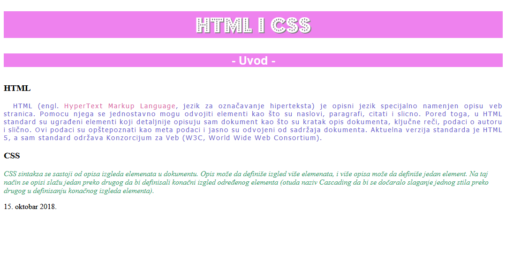

[Radni priručnik](../../README.md)

# 1. Sedmica 1

## 1.1 Teme

- Poglavlje 1. Struktuiranje Veb dokumenata kroz HTML

   - Sekcija 1. Osnovni elementi HTML dokumenata

   - Sekcija 2. Kreiranje HTML dokumenata

   - Sekcija 3. Blokovski i linijski elementi

   - Sekcija 4. Elementi za grupisanje sadržaja

   - Sekcija 5. Elementi za prikaz teksta

- Poglavlje 2. Stilizovanje Veb dokumenata kroz CSS

   - Sekcija 1. Osnovni elementi jezika CSS

   - Sekcija 2. Načini za zadavanje pravila za stilizovanje

   - Sekcija 3. Rad sa bojama

   - Sekcija 4. Stilizovanje teksta

   - Sekcija 5. Model kutije

## 1.2 Domaći zadaci

1. Napisati HTML datoteku koja odgovara stranici na narednoj slici. Pomoću validatora osigurati se da je kod napisan u skladu sa HTML5 standardom.

<table><tr><td>

</td></tr></table>

2. Napisati HTML datoteku i CSS datoteku koji opisuju strukturu i stil stranice date na narednoj slici. Familiju fontova koja se koristi u zadatku moguće je pronaći na [ovoj lokaciji](./Resursi/zadatak2_font.ttf). Pomoću validatora osigurati se da je kod napisan u skladu sa HTML5 i CSS3 standardom.

<table><tr><td>

</td></tr></table>

3. Napisati HTML datoteku i CSS datoteku koji opisuju strukturu i stil stranice date na narednoj slici. Familiju fontova koja se koristi u zadatku moguće je pronaći na [ovoj lokaciji](./Resursi/zadatak3_font.ttf). Pomoću validatora osigurati se da je kod napisan u skladu sa HTML5 i CSS3 standardom.

<table><tr><td>

</td></tr></table>

<!--
<table><tr><td>

</td></tr></table>
-->
