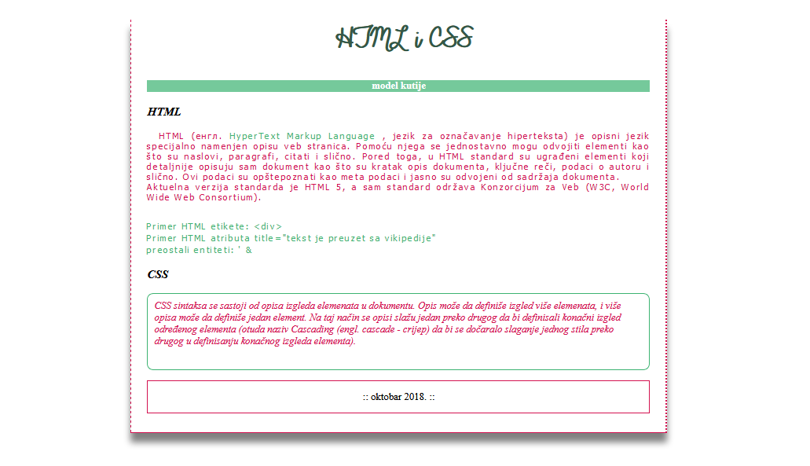

[Vežbe](../../../README.md)

[Radni priručnik](../../README.md)

-----

# 2. Sedmica 2

## 2.1 Teme

- Poglavlje 2. Stilizovanje Veb dokumenata kroz CSS

   - Sekcija 5. Model kutije

   - Sekcija 6. Koordinatni sistemi veb pregledača

   - Sekcija 7. Pozicioniranje elemenata

## 2.2 Domaći zadaci

1. Napisati HTML i CSS kod koji odgovara stranici na narednoj slici. Familiju fontova koja se koristi u zadatku moguće je pronaći na [ovoj lokaciji](./Resursi/zadatak1_font.ttf). Pomoću validatora osigurati se da je kod napisan u skladu sa HTML5 i CSS3 standardom.

2. Napisati HTML i CSS kod koji odgovara stranici na narednoj slici. Pomoću validatora osigurati se da je kod napisan u skladu sa HTML5 i CSS3 standardom. Nije dozvoljeno korišćenje svojstva `display`. Nije dozvoljeno menjanje podrazumevanih vrednosti modela kutije za elemente, osim za omotač koji ima crnu ivicu. Omotač horizontalno poravnati u odnosu na telo veb pregledača. Zadatak uraditi korišćenjem:
   1. Relativnog pozicioniranja
   2. Apsolutnog pozicioniranja
   3. Fiksnog pozicioniranja

-----

[Radni priručnik](../../README.md)

[Vežbe](../../../README.md)

<!--
<table><tr><td>

</td></tr></table>
-->
