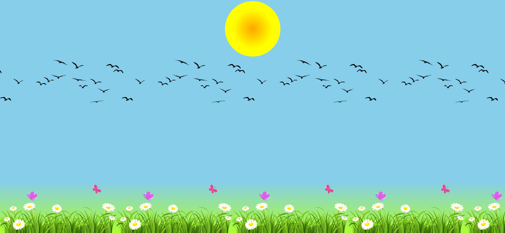
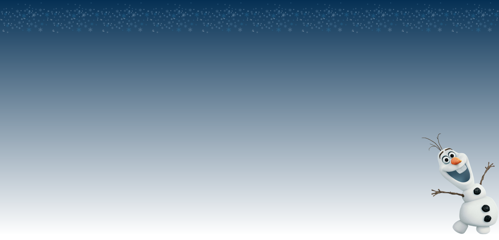
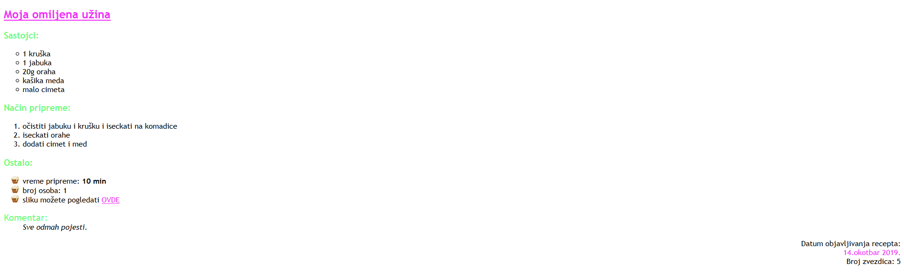

[Vežbe](../../../README.md)

[Radni priručnik](../../README.md)

-----

# 3. Sedmica 3

## 3.1 Teme

- Poglavlje 1. Struktuiranje Veb dokumenata kroz HTML

   - Sekcija 6. Slike

   - Sekcija 7. Liste

- Poglavlje 2. Stilizovanje Veb dokumenata kroz CSS

   - Sekcija 8. Slike

   - Sekcija 9. Pozadina elemenata

   - Sekcija 10. Liste

## 3.2 Domaći zadaci

1. Napisati HTML i CSS kod koji odgovara stranici na narednoj slici. Pomoću validatora osigurati se da je kod napisan u skladu sa HTML5 i CSS3 standardom. Slike koje se koriste u zadatku moguće je pronaći na narednim lokacijama: [slika 1](./Resursi/galerija1.jpg), [slika 2](./Resursi/galerija2.jpg), [slika 3](./Resursi/galerija3.jpg) i [slika 4](./Resursi/galerija4.jpg). Širinu slika postaviti na `300px`, a visinu na `200px`. Sve slike anotirati. Za sve anotacije omogućiti veb pregledaču da odabere beskukičavu familiju fontova. Zadatak uraditi korišćenjem:
   1. Relativnog pozicioniranja
   2. Apsolutnog pozicioniranja
   3. Fiksnog pozicioniranja

2. Napisati HTML i CSS kod koji odgovara stranici na narednoj slici. Pomoću validatora osigurati se da je kod napisan u skladu sa HTML5 i CSS3 standardom. Sliku koja se koristi u zadatku moguće je pronaći na [ovoj lokaciji](./Resursi/jesen.jpg). Širinu slike postaviti na `500px`, a visinu na `375px` i anotirati je. Za anotaciju slike omogućiti veb pregledaču da odabere kukičavu familiju fontova. Obuhvatajućem elementu anotirane slike postaviti crvenu ivicu širine `1px` i stila pune linije. Obuhvatajući element horizontalno poravnati u odnosu na telo veb pregledača.

3. Napisati HTML i CSS kod koji odgovara stranici na narednoj slici. Pomoću validatora osigurati se da je kod napisan u skladu sa HTML5 i CSS3 standardom. Za pozadinu stranice korišcena je boja skyblue. Stranica se sastoji iz tri dela - naslovnog, glavnog i podnožja. Za naslovni deo korišcen je gradijent od boje orange do boje yellow. Za pozadinu glavnog dela korišcena je [ova slika](./Resursi/ptice.png). Za pozadinu podnožja korišcen je gradijent od boje greenyellow do boje skyblue, kao i [ova slika](./Resursi/trava.png).

4. Napisati HTML i CSS kod koji odgovara stranici na narednoj slici. Pomoću validatora osigurati se da je kod napisan u skladu sa HTML5 i CSS3 standardom. Za pozadinu su korišćene boje rgb(5, 48, 84) i white zajedno sa slikama [pahulja](./Resursi/pahulje.png) i [sneška](./Resursi/snesko.png).

5. Napisati HTML i CSS kod koji odgovara stranici na narednoj slici. Pomoću validatora osigurati se da je kod napisan u skladu sa HTML5 i CSS3 standardom. Boje slova su #f12ff8, #69fd7c i #000000. U trećoj listi korišćena je slika [tortice](./Resursi/tortica.png). Link iz poslednje stavke vodi na <a href="https://www.bbcgoodfood.com/recipes/1840634/apple-and-pear-crumble">ovu</a> stranicu.

-----

[Radni priručnik](../../README.md)

[Vežbe](../../../README.md)

<!--
<table><tr><td>

</td></tr></table>
-->
