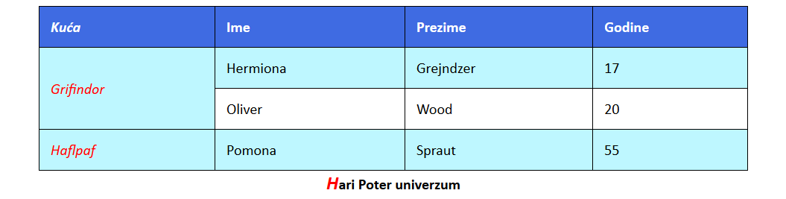

[Vežbe](../../../README.md)

[Radni priručnik](../../README.md)

-----

# 4. Sedmica 4

## 4.1 Teme

- Poglavlje 1. Struktuiranje Veb dokumenata kroz HTML

   - Sekcija 8. Tabele

   - Sekcija 9. Veze

- Poglavlje 2. Stilizovanje Veb dokumenata kroz CSS

   - Sekcija 11. Stilizovanje tabela

   - Sekcija 12. Stilizovanje stanja i posebnih delova elemenata

- Poglavlje 3. Biblioteka Bootstrap

   - Sekcija 1. Prilagodljiv dizajn veb prezentacija

## 4.2 Domaći zadaci

1. Napisati HTML i CSS kod koji odgovara stranici na narednoj slici. Pomoću validatora osigurati se da je kod napisan u skladu sa HTML5 i CSS3 standardom. Veličina fonta na nivou cele stranice je 20px, a korišćen je font Calibri (ukoliko nije dostupan, prepustiti pregledaču da odabere neki od fontova iz familije bez kukica). Tabela zauzima polovinu širine stranice i centrirana je. Za boje redova tabele korišćene su  rgb(63, 107, 226) i  rgb(92, 236, 255) sa prozirnošću 40%. Prvo slovo naslova tabele je crvene boje i iskošeno, a veličina je za 30% veća od ostatka teksta. Reči u prvoj koloni su linkovi do stranica: [Kuće](https://harrypotter.fandom.com/wiki/Hogwarts_Houses), [Grifindor](https://harrypotter.fandom.com/wiki/Gryffindor), [Haflpaf](https://harrypotter.fandom.com/wiki/Hufflepuff). Neposećeni linkovi su crvene boje i nisu podvučeni. Posećeni linkovi u zaglavlju tabele su bele boje, a ostali su crvene boje. Pozicioniranjem kursora iznad teksta linka izgled kursora se menja u pomoćni kursor (`help`), a tekst je podvučen. Klikom na link veličina teksta se smanjuje za 10%.

   

2. Napraviti stranicu na kojoj je ispisan tekst "Zdravo svima", a element koji ga sadrži uređen je na različite načine, u zavisnosti od veličine ekrana i to:
	-  za uređaje do 400px postaviti crvenu boju slova
	-  za uređaje do 700px postaviti narandžastu boju slova
	-  za uređaje do 1000px promeniti pozadinu elementa na sivu
	-  za veće uređaje postaviti veličinu fonta na 30px

-----

[Radni priručnik](../../README.md)

[Vežbe](../../../README.md)

<!--
<table><tr><td>

</td></tr></table>
-->
