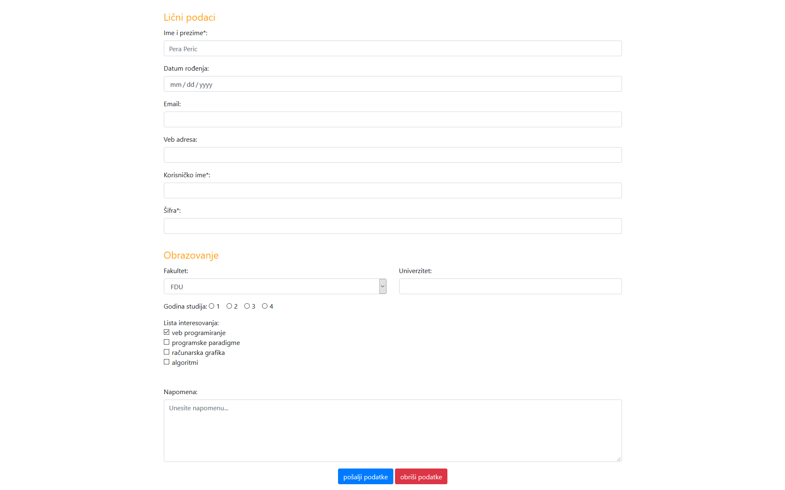

[Vežbe](../../../README.md)

[Radni priručnik](../../README.md)

-----

# 4. Sedmica 5

## 5.1 Teme

- Poglavlje 1. Struktuiranje Veb dokumenata kroz HTML

   - Sekcija 10. Formulari 

- Poglavlje 3. Biblioteka Bootstrap

   - Sekcija 2. Instaliranje biblioteke Bootstrap

   - Sekcija 3. Osnovne komponente za pozicioniranje elemenata

   - Sekcija 4. Stilizovanje sadržaja veb prezentacije

   - Sekcija 5. Stilizovanje formulara

## 5.2 Domaći zadaci

1. Napisati HTML i CSS kod koji odgovara stranici na narednoj slici. Pomoću validatora osigurati se da je kod napisan u skladu sa HTML5 i CSS3 standardom. 
Sadržaj padajuće liste treba da odgovara sadržaju sa [slike](./Slike/fakultet.png), a polje univerzitet može imati vrednosti sa [ove slike](./Slike/univerzitet.png). Stilizovanje formulara uraditi pomoću Bootstrap biblioteke.
   

-----

[Radni priručnik](../../README.md)

[Vežbe](../../../README.md)

<!--
<table><tr><td>

</td></tr></table>
-->
